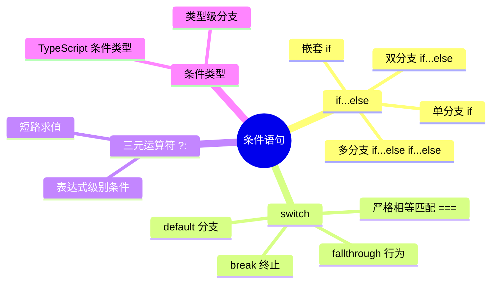
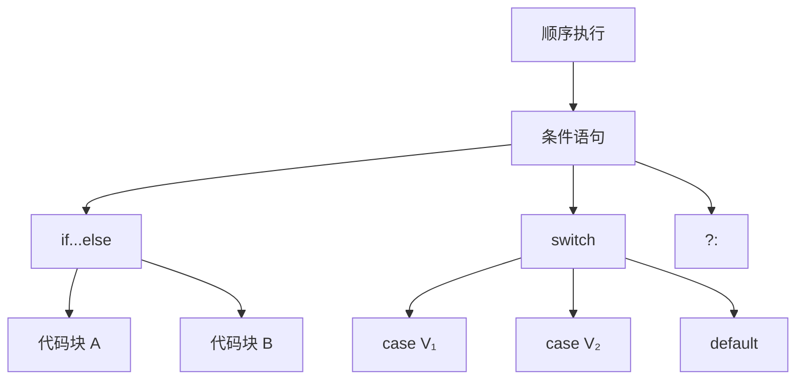
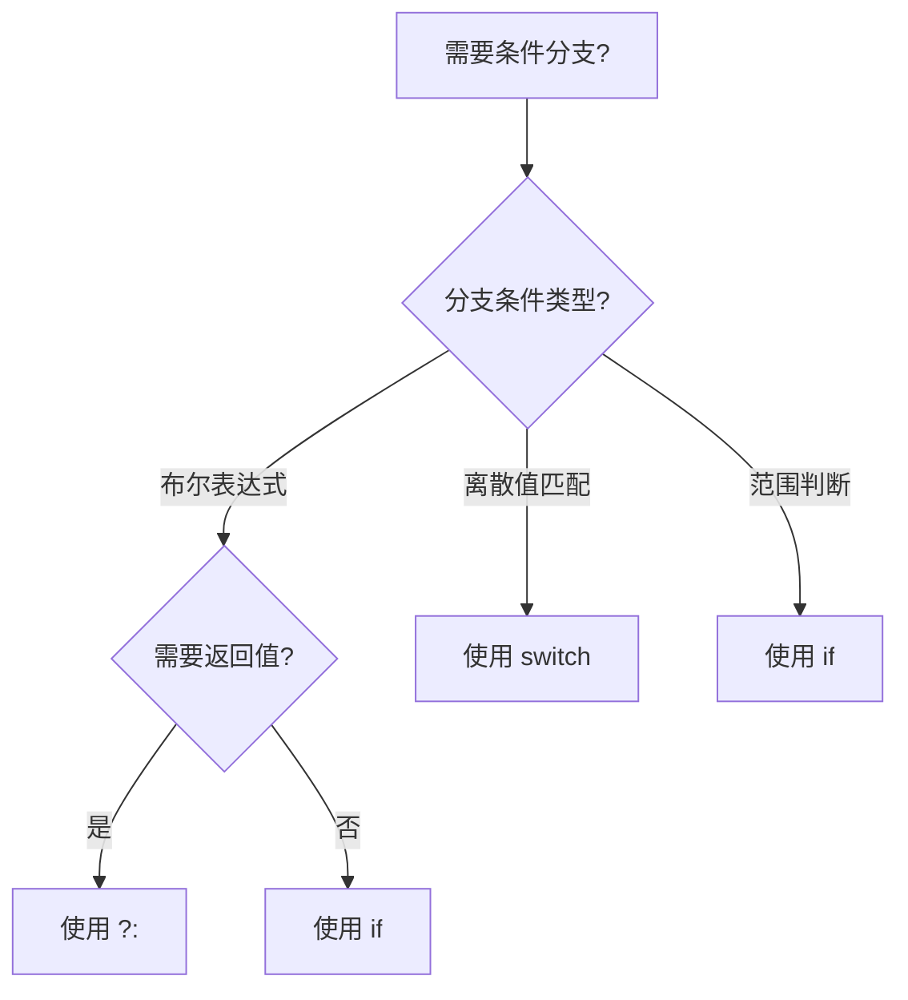
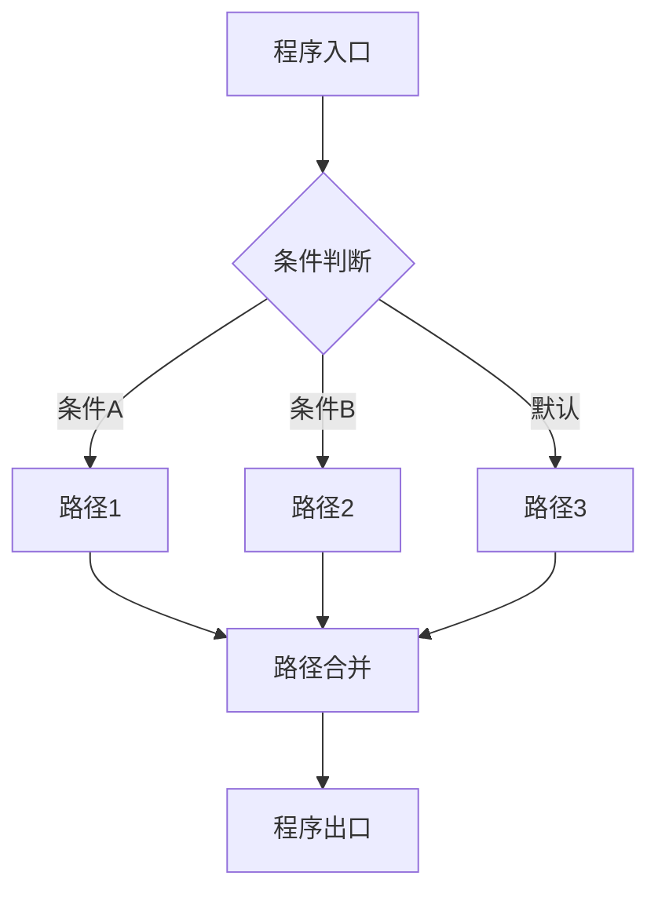

# 条件语句（Conditional Statements）

> **形式化定义**：条件语句是 ECMAScript 规范中控制程序执行路径的核心语法结构，通过 `if...else`、`switch`、`?:`（三元运算符）等构造实现基于布尔条件的分支选择。其语义基于**谓词逻辑（Predicate Logic）**，将程序状态映射到执行路径的离散集合。ECMA-262 §14.5–14.12 定义了条件语句的语法和求值规则。
>
> 对齐版本：ECMAScript 2025 (ES16) §14.5–14.12 | TypeScript 5.8–6.0

---

## 1. 概念定义 (Concept Definition)

### 1.1 形式化定义

ECMA-262 §14.5 *If Statement* 和 §14.12 *Switch Statement* 定义了条件语句的语法：

> *"The if statement is a control flow statement that executes a statement if a specified condition is truthy."*

条件语句的数学表示：

```
if (C) S₁ else S₂  ≡  (C → S₁) ∧ (¬C → S₂)
switch (E) { case V₁: S₁; ... }  ≡  E = V₁ → S₁; E = V₂ → S₂; ...
```

### 1.2 概念层级图谱



---

## 2. 属性与特征 (Properties & Characteristics)

### 2.1 条件语句属性矩阵

| 特性 | `if...else` | `switch` | `?:` |
|------|------------|----------|------|
| 求值对象 | 布尔条件 | 表达式（严格相等） | 布尔条件 |
| 分支数 | 任意（嵌套） | 多个 case | 2 个 |
| 返回值 | 无（语句） | 无（语句） | 有（表达式） |
| 短路求值 | ✅ | ❌（逐个比较） | ✅ |
| TypeScript 类型收窄 | ✅ | ✅ | ✅ |
| 适用场景 | 复杂条件 | 离散值匹配 | 简单赋值 |

### 2.2 Truthy vs Falsy 值

ECMA-262 §7.1.2 *ToBoolean* 定义了抽象操作：

| 值 | ToBoolean 结果 | 说明 |
|-----|---------------|------|
| `false`, `0`, `""`, `null`, `undefined`, `NaN` | `false` | Falsy |
| 其他所有值 | `true` | Truthy |
| `[]`, `{}` | `true` | ⚠️ 常见误区 |

---

## 3. 关系分析 (Relationship Analysis)

### 3.1 条件语句与控制流的关系



---

## 4. 机制解释 (Mechanism Explanation)

### 4.1 if 语句的执行流程

```mermaid
flowchart TD
    A[遇到 if 语句] --> B[求值条件表达式]
    B --> C{ToBoolean(结果)}
    C -->|truthy| D[执行 if 块]
    C -->|falsy| E{存在 else?}
    E -->|是| F[执行 else 块]
    E -->|否| G[跳过]
    D --> H[继续后续代码]
    F --> H
    G --> H
```

### 4.2 switch 语句的执行流程

```javascript
const value = 2;

switch (value) {
  case 1:
    console.log("one");
    break;  // 跳出 switch
  case 2:
    console.log("two");
    // 缺少 break → fallthrough!
  case 3:
    console.log("three");
    break;
  default:
    console.log("other");
}

// 输出: "two" "three"
```

---

## 5. 论证与分析 (Argumentation & Analysis)

### 5.1 if vs switch 的选择策略

| 场景 | 推荐 | 原因 |
|------|------|------|
| 离散值匹配（>3 个） | `switch` | 可读性更高 |
| 范围判断 | `if` | `switch` 无法直接表达范围 |
| 复杂布尔条件 | `if` | `switch` 只能做严格相等 |
| 需要表达式返回值 | `?:` | 语句无法返回值 |
| 类型收窄（TypeScript） | `if` + 守卫 | `switch` 也可实现 |

### 5.2 常见误区

**误区 1**：`==` vs `===` 在条件中

```javascript
// ❌ == 会进行类型转换
if ("0" == false) { /*  true！*/ }

// ✅ === 严格相等
if ("0" === false) { /* false */ }
```

**误区 2**：Truthiness 误判

```javascript
// ❌ 空数组和空对象都是 truthy
if ([]) { console.log("truthy"); } // 输出！
if ({}) { console.log("truthy"); } // 输出！

// ✅ 检查长度或属性
if (arr.length > 0) { /* 正确 */ }
```

---

## 6. 实例与示例 (Examples)

### 6.1 正例：多条件链

```javascript
// ✅ 使用 switch 进行离散值匹配
function getDayName(dayNumber) {
  switch (dayNumber) {
    case 1: return "Monday";
    case 2: return "Tuesday";
    case 3: return "Wednesday";
    case 4: return "Thursday";
    case 5: return "Friday";
    case 6: return "Saturday";
    case 7: return "Sunday";
    default: throw new Error("Invalid day");
  }
}
```

### 6.2 正例：TypeScript 类型收窄

```typescript
// ✅ 使用 if + typeof 进行类型收窄
function process(value: string | number | boolean) {
  if (typeof value === "string") {
    // value: string
    return value.toUpperCase();
  } else if (typeof value === "number") {
    // value: number
    return value.toFixed(2);
  } else {
    // value: boolean
    return value ? "yes" : "no";
  }
}
```

### 6.3 边缘案例

```javascript
// 边缘 1：switch 的严格相等
const x = "5";
switch (x) {
  case 5: console.log("number 5"); break;  // 不会匹配！
  case "5": console.log("string 5"); break; // 匹配
}

// 边缘 2：三元运算符嵌套
const result = condition1
  ? condition2 ? "A" : "B"
  : condition3 ? "C" : "D";
// ⚠️ 可读性差，避免过度嵌套
```

---

## 7. 权威参考与国际化对齐 (References)

- **ECMA-262 §14.5** — If Statement
- **ECMA-262 §14.12** — Switch Statement
- **ECMA-262 §7.1.2** — ToBoolean Abstract Operation
- **MDN: if...else** — <https://developer.mozilla.org/en-US/docs/Web/JavaScript/Reference/Statements/if...else>
- **MDN: switch** — <https://developer.mozilla.org/en-US/docs/Web/JavaScript/Reference/Statements/switch>

---

## 8. 思维表征总结 (Cognitive Representations)

### 8.1 条件语句选择决策树



### 8.2 Truthy/Falsy 判定表

| 值 | typeof | Boolean() | 常见误区 |
|-----|--------|-----------|---------|
| `0` | number | false | 与 `"0"` 混淆 |
| `""` | string | false | 与 `" "` 混淆 |
| `[]` | object | true | 以为是 falsy |
| `{}` | object | true | 以为是 falsy |
| `null` | object | false | typeof 是 object |

---

## 9. 公理化表述与形式证明 (Axiomatization & Formal Proof)

### 9.1 条件语句的公理化基础

**公理 1（条件分支的完备性）**：
> 对任意条件表达式 `C`，执行路径必然进入且仅进入一个分支（if 或 else）。

**公理 2（短路求值）**：
> 逻辑运算符 `&&` 和 `||` 采用短路求值：若左操作数足以确定结果，则不求值右操作数。

### 9.2 定理与证明

**定理 1（if-else 的互斥性）**：
> 对于 `if (C) S₁ else S₂`，在任何执行中，`S₁` 和 `S₂` 不会同时执行。

*证明*：
> 根据 ECMA-262 §14.5，if 语句首先求值 `C`，调用 `ToBoolean(C)`。
>
> - 若结果为 `true`，执行 `S₁`，跳过 `S₂`
> - 若结果为 `false`，跳过 `S₁`，执行 `S₂`
> 两种情形互斥，不存在同时执行的可能。
> ∎

**定理 2（switch fallthrough 的可控性）**：
> `switch` 语句中，case 标签本身不阻止后续 case 的执行；只有 `break` 语句终止 switch。

*证明*：
> 根据 ECMA-262 §14.12，switch 语句执行匹配的 case 子句后，继续顺序执行后续 case 子句，除非遇到 `break`。
> ∎

### 9.3 真值表：逻辑运算符的短路行为

| A | B | A && B | A \|\| B | !A |
|---|---|--------|----------|-----|
| true | true | true (求值B) | true (短路) | false |
| true | false | false (求值B) | true (短路) | false |
| false | true | false (短路) | true (求值B) | true |
| false | false | false (短路) | false (求值B) | true |

---

## 10. 推理链与演绎分析 (Deductive Reasoning Chain)

### 10.1 演绎推理：从条件到执行路径

```mermaid
graph TD
    A[条件表达式 C] --> B[求值 C]
    B --> C[ToBoolean(C)]
    C -->|true| D[执行 if 分支]
    C -->|false| E[执行 else 分支]
    D --> F[程序状态更新]
    E --> F
```

### 10.2 反事实推理：如果没有条件语句

> **反设**：ECMAScript 不支持任何条件语句（if/switch/?:）。
> **推演结果**：
>
> 1. 所有程序必须顺序执行，无法根据状态选择路径
> 2. 需要通过函数指针表或异常模拟分支
> 3. 图灵完备性仍可通过递归和循环保持，但表达能力大幅下降
> **结论**：条件语句是结构化编程的基础构件。

---

**参考规范**：ECMA-262 §14.5–14.12 | MDN: if...else / switch


---

## 9. 公理化表述与形式证明 (Axiomatization & Formal Proof)

### 9.1 公理化基础

**公理 1（控制流完备性）**：
> 任何程序的控制流可通过顺序、分支、循环三种基本结构组合实现（Bohm-Jacopini 定理）。

**公理 2（短路求值的最小计算）**：
> 逻辑运算符在满足结果确定性的前提下，求值最少的操作数。

**公理 3（异常传播的确定性）**：
> 异常一旦抛出，沿调用栈向上传播，直到被捕获或到达全局上下文。

### 9.2 定理与证明

**定理 1（条件分支的互斥性）**：
> 在 `if...else if...else` 链中，至多一个分支被执行。

*证明*：
> ECMA-262 规定条件分支按顺序求值，首个 truthy 条件对应的分支执行后，跳过后续所有分支。
> ∎

**定理 2（finally 的执行保证）**：
> `finally` 块中的代码无论 `try` 块如何完成（正常、return、throw），都会执行。

*证明*：
> ECMA-262 §13.15.8 规定 finally 块的完成记录优先级高于 try/catch。
> ∎

**定理 3（循环终止的必要条件）**：
> `for`、`while`、`do...while` 循环终止的必要条件是循环体内存在使循环条件最终为 falsy 的操作。

*证明*：
> 若循环条件永真且循环体内无 break/return/throw，根据 ECMA-262 §14.7，循环将无限执行。
> ∎

### 9.3 真值表：控制流运算符行为

| a | b | a && b | a || b | a ?? b | !a |
|---|---|--------|--------|--------|-----|
| true | true | true | true | true | false |
| true | false | false | true | true | false |
| false | true | false | true | false | true |
| false | false | false | false | false | true |
| null | any | null | any | any | true |
| undefined | any | undefined | any | any | true |
| 0 | "d" | "d" | 0 | 0 | true |
| "" | "d" | "d" | "" | "" | true |

---

## 10. 推理链与演绎分析 (Deductive Reasoning Chain)

### 10.1 演绎推理：从代码结构到执行路径



### 10.2 归纳推理：从运行时行为推导控制流问题

| 现象 | 可能原因 | 解决方案 |
|------|---------|---------|
| 意外执行分支 | 条件判断逻辑错误 | 审查布尔表达式 |
| 无限循环 | 循环条件永真 | 检查终止条件 |
| 跳过预期代码 | 提前 return/continue | 检查控制流语句 |
| 资源未释放 | 异常中断流程 | 使用 try...finally 或 using |
| 异步操作未等待 | 缺少 await | 添加 await 或 Promise 链 |

### 10.3 反事实推理

> **反设**：ECMAScript 不支持任何控制流语句（if/switch/loop/try）。
>
> **推演结果**：
>
> 1. 所有程序只能顺序执行，无法根据条件选择路径
> 2. 重复操作必须通过递归实现，存在栈溢出风险
> 3. 错误处理无法分离正常逻辑与异常逻辑
> 4. 图灵完备性仍可通过函数调用和递归保持，但表达力大幅下降
>
> **结论**：控制流语句是结构化编程的基石，提供了表达复杂算法的基本构件。

---

## 11. 形式语义说明

### 11.1 操作语义

操作语义（Operational Semantics）描述了语句如何改变程序状态：

```
(if (C) S₁ else S₂, σ) → (S₁, σ)  if eval(C, σ) = true
(if (C) S₁ else S₂, σ) → (S₂, σ)  if eval(C, σ) = false
```

其中 σ 表示程序状态（变量绑定集合）。

### 11.2 指称语义

指称语义（Denotational Semantics）将语句映射为数学函数：

```
[[if (C) S₁ else S₂]](σ) =
  [[S₁]](σ)  if [[C]](σ) = true
  [[S₂]](σ)  if [[C]](σ) = false
```

---

## 12. 性能与最佳实践

### 12.1 性能考量

| 结构 | 时间复杂度 | 空间复杂度 | 备注 |
|------|-----------|-----------|------|
| if...else | O(1) | O(1) | 条件求值 |
| switch | O(n) 最坏 | O(1) | n = case 数量 |
| try...catch | 无异常时 O(1) | O(1) | 有异常时开销大 |
| for 循环 | O(迭代次数) | O(1) | 取决于循环体 |
| Promise.then | O(1) | O(1) | 微任务队列调度 |
| async/await | O(1) | O(1) | 生成器状态机开销 |

### 12.2 最佳实践总结

```javascript
// ✅ 优先使用严格相等
if (x === 5) { /* ... */ }

// ✅ 使用 switch 进行离散值匹配
switch (status) {
  case "active": /* ... */ break;
  case "inactive": /* ... */ break;
  default: /* ... */;
}

// ✅ 使用 ?? 而非 || 进行默认值赋值
const port = config.port ?? 3000;

// ✅ 使用可选链进行安全访问
const name = user?.profile?.name;

// ✅ 使用 using 管理资源
using file = await openFile(path);

// ✅ 并行异步操作使用 Promise.all
const [a, b] = await Promise.all([fetchA(), fetchB()]);

// ✅ 生成器实现惰性序列
function* range(n) { for (let i = 0; i < n; i++) yield i; }
```

---

## 13. 思维模型总结

### 13.1 控制流选择速查矩阵

| 需求 | 推荐结构 | 替代方案 |
|------|---------|---------|
| 布尔条件分支 | if...else | 三元运算符 ?: |
| 离散值匹配 | switch | 对象映射表 |
| 计数循环 | for | while |
| 条件循环 | while / do...while | for (;;) |
| 遍历可迭代对象 | for...of | Array.forEach |
| 遍历对象属性 | for...in + hasOwn | Object.keys |
| 错误处理 | try...catch...finally | Promise.catch |
| 资源管理 | using / await using | try...finally |
| 默认值赋值 | ?? | ||（仅布尔场景）|
| 安全深层访问 | ?. | && 链 |
| 异步顺序执行 | await | Promise.then 链 |
| 异步并行执行 | Promise.all | Promise.race |
| 惰性序列 | function* | 闭包 |
| 异步数据流 | async function* | 事件流 |

---

## 14. 权威参考完整列表

| 来源 | 链接 | 相关章节 |
|------|------|---------|
| ECMA-262 | tc39.es/ecma262 | §13-14 |
| TypeScript Handbook | typescriptlang.org/docs | Control Flow Analysis |
| MDN: Control flow | developer.mozilla.org | Statements |
| MDN: Loops | developer.mozilla.org | Loops_and_iteration |
| MDN: Exception | developer.mozilla.org | try...catch |

---

**参考规范**：ECMA-262 §13-14 | MDN: Control flow | TypeScript Handbook
