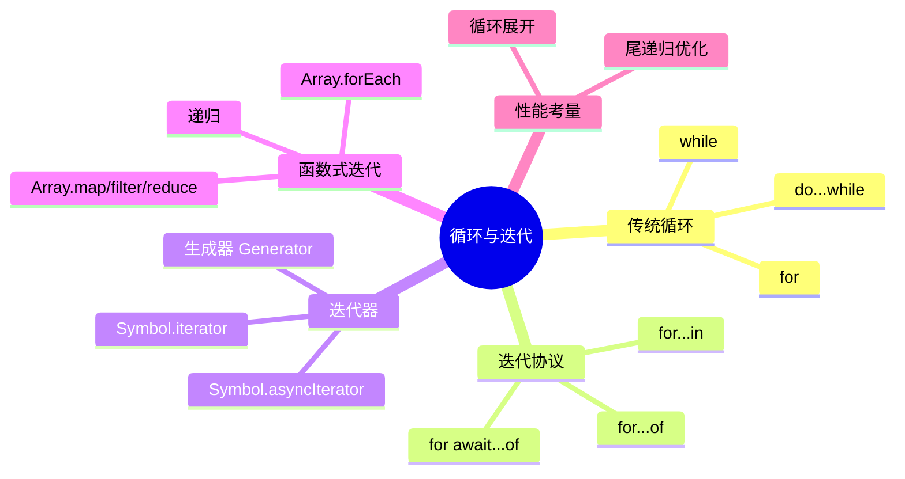
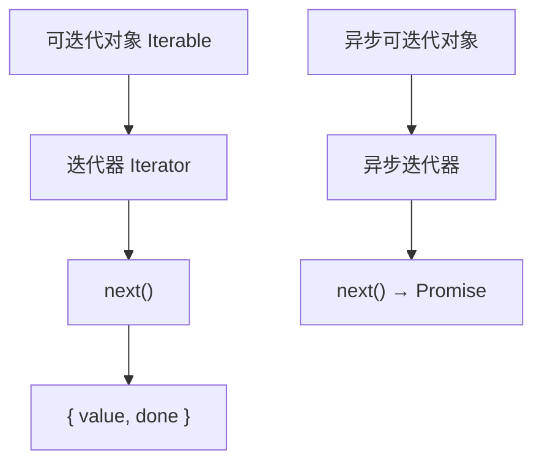
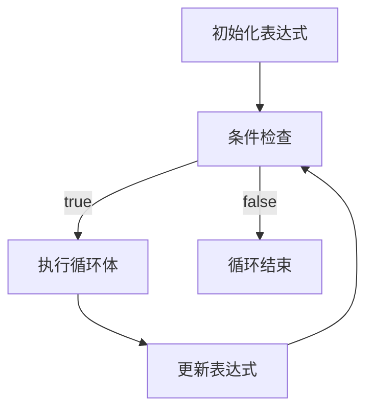
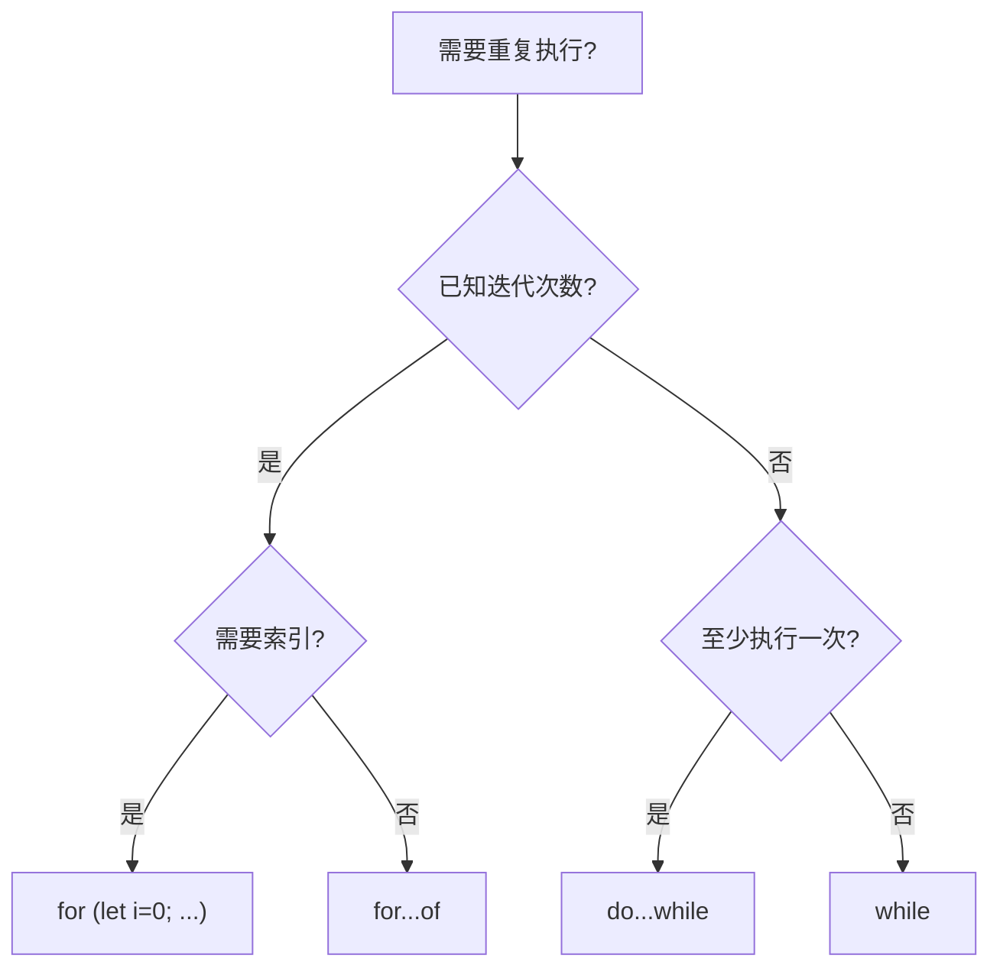
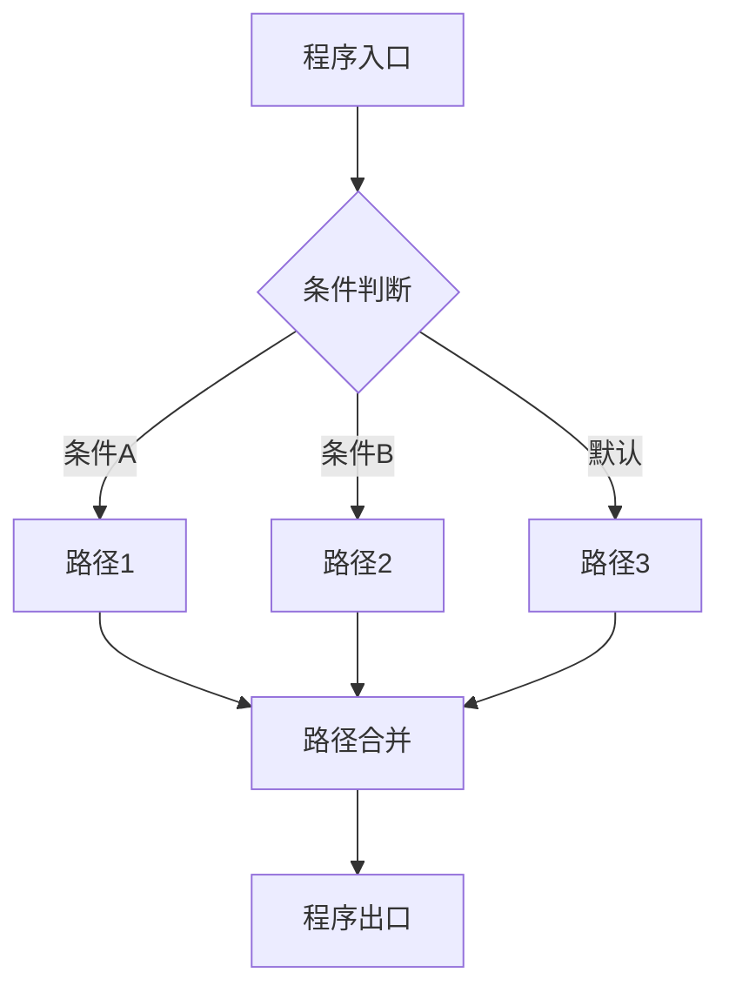

# 循环与迭代（Loops & Iterations）

> **形式化定义**：循环是 ECMAScript 规范中实现重复执行的控制流结构，包括 `for`、`while`、`do...while` 语句和迭代协议（Iteration Protocols）。`for...of` 和 `for...in` 依赖 ECMA-262 §7.4.2 *GetIterator* 抽象操作，通过 `Symbol.iterator` 或 `Symbol.asyncIterator` 获取迭代器对象，实现可迭代对象的顺序访问。循环语义涉及**不动点理论（Fixed Point Theory）**和**终止性证明（Termination Proof）**。
>
> 对齐版本：ECMAScript 2025 (ES16) §14.7–14.8 | TypeScript 5.8–6.0

---

## 1. 概念定义 (Concept Definition)

### 1.1 形式化定义

ECMA-262 §14.7 *Iteration Statements* 定义了循环语句的语法：

> *"An Iteration Statement defines a loop boundary."*

循环的数学表示（以 while 为例）：

```
while (C) S  ≡  μX. (C → S; X) ∧ (¬C → skip)
```

其中 `μX` 表示最小不动点，描述循环的终止语义。

### 1.2 概念层级图谱



---

## 2. 属性与特征 (Properties & Characteristics)

### 2.1 循环类型矩阵

| 特性 | `for` | `while` | `do...while` | `for...of` | `for...in` |
|------|-------|---------|-------------|-----------|-----------|
| 条件检查位置 | 每次迭代前 | 每次迭代前 | 每次迭代后 | 迭代器控制 | 属性枚举 |
| 最少执行次数 | 0 | 0 | 1 | 0 | 0 |
| 循环变量 | 可声明 | 外部 | 外部 | 迭代值 | 属性键 |
| 适用对象 | 计数 | 条件 | 至少一次 | 可迭代对象 | 对象属性 |
| break/continue | ✅ | ✅ | ✅ | ✅ | ✅ |
| 异步支持 | ❌ | ❌ | ❌ | ❌ | ❌ |

### 2.2 迭代协议层次



---

## 3. 关系分析 (Relationship Analysis)

### 3.1 循环与作用域的关系

```javascript
// var vs let 在循环中的差异
for (var i = 0; i < 3; i++) {
  setTimeout(() => console.log(i), 0); // 3, 3, 3
}

for (let i = 0; i < 3; i++) {
  setTimeout(() => console.log(i), 0); // 0, 1, 2
}
```

| 声明 | 作用域 | 闭包行为 |
|------|--------|---------|
| `var i` | 函数级 | 共享同一个 i |
| `let i` | 块级 | 每次迭代新绑定 |

---

## 4. 机制解释 (Mechanism Explanation)

### 4.1 for 循环的执行流程



### 4.2 迭代器协议

```javascript
// 自定义可迭代对象
const range = {
  from: 1,
  to: 5,
  [Symbol.iterator]() {
    let current = this.from;
    return {
      next: () => ({
        value: current++,
        done: current > this.to + 1
      })
    };
  }
};

for (const num of range) {
  console.log(num); // 1, 2, 3, 4, 5
}
```

---

## 5. 论证与分析 (Argumentation & Analysis)

### 5.1 循环 vs 函数式迭代

| 场景 | 推荐 | 原因 |
|------|------|------|
| 简单遍历数组 | `for...of` / `forEach` | 简洁可读 |
| 需要提前终止 | `for` / `while` + break | 函数式无法 break |
| 需要索引 | `for` / `forEach((v, i))` | 直接访问 |
| 复杂逻辑 + 链式 | `map/filter/reduce` | 声明式、可组合 |
| 大数据集 | `for` | 函数式创建中间数组 |

### 5.2 常见误区

**误区 1**：`for...in` 遍历数组

```javascript
// ❌ for...in 遍历包括继承属性
const arr = ['a', 'b'];
Array.prototype.custom = 'x';

for (const key in arr) {
  console.log(key); // "0", "1", "custom"
}

// ✅ for...of 遍历值
for (const val of arr) {
  console.log(val); // "a", "b"
}
```

**误区 2**：循环中的异步问题

```javascript
// ❌ forEach + async 不等待
async function bad() {
  [1, 2, 3].forEach(async (n) => {
    await delay(100);
    console.log(n);
  });
  console.log("done"); // 先输出！
}

// ✅ for...of + await 顺序执行
async function good() {
  for (const n of [1, 2, 3]) {
    await delay(100);
    console.log(n);
  }
  console.log("done"); // 后输出
}
```

---

## 6. 实例与示例 (Examples)

### 6.1 正例：正确的循环选择

```javascript
// ✅ 计数循环
for (let i = 0; i < items.length; i++) {
  console.log(items[i]);
}

// ✅ 遍历可迭代对象
for (const item of items) {
  console.log(item);
}

// ✅ 遍历对象属性
for (const key of Object.keys(obj)) {
  console.log(key, obj[key]);
}

// ✅ 条件循环
while (queue.length > 0) {
  process(queue.shift());
}
```

### 6.2 正例：生成器实现无限序列

```javascript
function* fibonacci() {
  let a = 0, b = 1;
  while (true) {
    yield a;
    [a, b] = [b, a + b];
  }
}

const fib = fibonacci();
console.log(fib.next().value); // 0
console.log(fib.next().value); // 1
console.log(fib.next().value); // 1
```

---

## 7. 权威参考与国际化对齐 (References)

- **ECMA-262 §14.7** — Iteration Statements
- **ECMA-262 §7.4.2** — GetIterator
- **ECMA-262 §27.1** — Iteration
- **MDN: Loops and iteration** — <https://developer.mozilla.org/en-US/docs/Web/JavaScript/Guide/Loops_and_iteration>
- **MDN: Iteration protocols** — <https://developer.mozilla.org/en-US/docs/Web/JavaScript/Reference/Iteration_protocols>

---

## 8. 思维表征总结 (Cognitive Representations)

### 8.1 循环选择决策树



### 8.2 迭代方式速查表

| 目标 | 推荐语法 | 说明 |
|------|---------|------|
| 数组值 | `for...of` | 简洁、支持 break/continue |
| 数组索引+值 | `for` / `entries()` | 需要索引时 |
| 对象属性 | `Object.keys/values/entries` | 不遍历原型链 |
| 字符串字符 | `for...of` | 正确处理 Unicode |
| Map/Set | `for...of` | 直接迭代 |
| 异步序列 | `for await...of` | 顺序等待 |

---

## 9. 公理化表述与形式证明 (Axiomatization & Formal Proof)

### 9.1 循环的公理化基础

**公理 1（循环不变式）**：
> 若断言 `I` 在循环进入前为真，且在每次迭代后保持为真，则 `I` 在循环终止后仍为真。

**公理 2（循环终止性）**：
> 循环必须存在一个随每次迭代严格递减的变体函数（Variant Function），且该函数有下界。

### 9.2 定理与证明

**定理 1（for 循环的语义等价性）**：
> `for (init; cond; update) body` 语义等价于：
>
> ```
> init;
> while (cond) {
>   body;
>   update;
> }
> ```

*证明*：
> 根据 ECMA-262 §14.7.4，for 语句首先执行 `init`，然后重复执行：检查 `cond`，若为真则执行 `body`，然后执行 `update`。
> 这与 while 循环的语义完全一致。
> ∎

**定理 2（let 循环变量的绑定独立性）**：
> `for (let i = 0; i < n; i++)` 中，每次迭代创建新的 `i` 绑定。

*证明*：
> 根据 ECMA-262 §14.7.4.2，for 语句的 `let` 声明在每次迭代时创建新的词法环境，包含 `i` 的新绑定。
> ∎

### 9.3 真值表：循环控制语句的效果

| 语句 | 当前迭代 | 后续迭代 | 适用场景 |
|------|---------|---------|---------|
| `break` | 终止 | 终止 | 完全退出循环 |
| `continue` | 跳过剩余 | 继续 | 跳过当前迭代 |
| `return` | 终止 | 终止 | 退出函数 |
| `throw` | 终止 | 终止 | 异常传播 |

---

## 10. 推理链与演绎分析 (Deductive Reasoning Chain)

### 10.1 演绎推理：从循环结构到执行次数

```mermaid
graph TD
    A[for (let i=0; i<n; i++)] --> B[初始化: i=0]
    B --> C[条件: i < n]
    C -->|true| D[执行体]
    D --> E[i++]
    E --> C
    C -->|false 当 i=n| F[循环结束]
    F --> G[总执行次数 = n]
```

### 10.2 反事实推理：如果没有循环

> **反设**：ECMAScript 不支持任何循环语句。
> **推演结果**：
>
> 1. 所有重复操作必须通过递归实现
> 2. 存在栈溢出风险（无尾递归优化保证）
> 3. 代码可读性和性能大幅下降
> **结论**：循环是结构化编程的基石，提供了高效、可读的重复执行机制。

---

**参考规范**：ECMA-262 §14.7–14.8 | MDN: Loops and iteration


---

## 9. 公理化表述与形式证明 (Axiomatization & Formal Proof)

### 9.1 公理化基础

**公理 1（控制流完备性）**：
> 任何程序的控制流可通过顺序、分支、循环三种基本结构组合实现（Bohm-Jacopini 定理）。

**公理 2（短路求值的最小计算）**：
> 逻辑运算符在满足结果确定性的前提下，求值最少的操作数。

**公理 3（异常传播的确定性）**：
> 异常一旦抛出，沿调用栈向上传播，直到被捕获或到达全局上下文。

### 9.2 定理与证明

**定理 1（条件分支的互斥性）**：
> 在 `if...else if...else` 链中，至多一个分支被执行。

*证明*：
> ECMA-262 规定条件分支按顺序求值，首个 truthy 条件对应的分支执行后，跳过后续所有分支。
> ∎

**定理 2（finally 的执行保证）**：
> `finally` 块中的代码无论 `try` 块如何完成（正常、return、throw），都会执行。

*证明*：
> ECMA-262 §13.15.8 规定 finally 块的完成记录优先级高于 try/catch。
> ∎

**定理 3（循环终止的必要条件）**：
> `for`、`while`、`do...while` 循环终止的必要条件是循环体内存在使循环条件最终为 falsy 的操作。

*证明*：
> 若循环条件永真且循环体内无 break/return/throw，根据 ECMA-262 §14.7，循环将无限执行。
> ∎

### 9.3 真值表：控制流运算符行为

| a | b | a && b | a || b | a ?? b | !a |
|---|---|--------|--------|--------|-----|
| true | true | true | true | true | false |
| true | false | false | true | true | false |
| false | true | false | true | false | true |
| false | false | false | false | false | true |
| null | any | null | any | any | true |
| undefined | any | undefined | any | any | true |
| 0 | "d" | "d" | 0 | 0 | true |
| "" | "d" | "d" | "" | "" | true |

---

## 10. 推理链与演绎分析 (Deductive Reasoning Chain)

### 10.1 演绎推理：从代码结构到执行路径



### 10.2 归纳推理：从运行时行为推导控制流问题

| 现象 | 可能原因 | 解决方案 |
|------|---------|---------|
| 意外执行分支 | 条件判断逻辑错误 | 审查布尔表达式 |
| 无限循环 | 循环条件永真 | 检查终止条件 |
| 跳过预期代码 | 提前 return/continue | 检查控制流语句 |
| 资源未释放 | 异常中断流程 | 使用 try...finally 或 using |
| 异步操作未等待 | 缺少 await | 添加 await 或 Promise 链 |

### 10.3 反事实推理

> **反设**：ECMAScript 不支持任何控制流语句（if/switch/loop/try）。
>
> **推演结果**：
>
> 1. 所有程序只能顺序执行，无法根据条件选择路径
> 2. 重复操作必须通过递归实现，存在栈溢出风险
> 3. 错误处理无法分离正常逻辑与异常逻辑
> 4. 图灵完备性仍可通过函数调用和递归保持，但表达力大幅下降
>
> **结论**：控制流语句是结构化编程的基石，提供了表达复杂算法的基本构件。

---

## 11. 形式语义说明

### 11.1 操作语义

操作语义（Operational Semantics）描述了语句如何改变程序状态：

```
(if (C) S₁ else S₂, σ) → (S₁, σ)  if eval(C, σ) = true
(if (C) S₁ else S₂, σ) → (S₂, σ)  if eval(C, σ) = false
```

其中 σ 表示程序状态（变量绑定集合）。

### 11.2 指称语义

指称语义（Denotational Semantics）将语句映射为数学函数：

```
[[if (C) S₁ else S₂]](σ) =
  [[S₁]](σ)  if [[C]](σ) = true
  [[S₂]](σ)  if [[C]](σ) = false
```

---

## 12. 性能与最佳实践

### 12.1 性能考量

| 结构 | 时间复杂度 | 空间复杂度 | 备注 |
|------|-----------|-----------|------|
| if...else | O(1) | O(1) | 条件求值 |
| switch | O(n) 最坏 | O(1) | n = case 数量 |
| try...catch | 无异常时 O(1) | O(1) | 有异常时开销大 |
| for 循环 | O(迭代次数) | O(1) | 取决于循环体 |
| Promise.then | O(1) | O(1) | 微任务队列调度 |
| async/await | O(1) | O(1) | 生成器状态机开销 |

### 12.2 最佳实践总结

```javascript
// ✅ 优先使用严格相等
if (x === 5) { /* ... */ }

// ✅ 使用 switch 进行离散值匹配
switch (status) {
  case "active": /* ... */ break;
  case "inactive": /* ... */ break;
  default: /* ... */;
}

// ✅ 使用 ?? 而非 || 进行默认值赋值
const port = config.port ?? 3000;

// ✅ 使用可选链进行安全访问
const name = user?.profile?.name;

// ✅ 使用 using 管理资源
using file = await openFile(path);

// ✅ 并行异步操作使用 Promise.all
const [a, b] = await Promise.all([fetchA(), fetchB()]);

// ✅ 生成器实现惰性序列
function* range(n) { for (let i = 0; i < n; i++) yield i; }
```

---

## 13. 思维模型总结

### 13.1 控制流选择速查矩阵

| 需求 | 推荐结构 | 替代方案 |
|------|---------|---------|
| 布尔条件分支 | if...else | 三元运算符 ?: |
| 离散值匹配 | switch | 对象映射表 |
| 计数循环 | for | while |
| 条件循环 | while / do...while | for (;;) |
| 遍历可迭代对象 | for...of | Array.forEach |
| 遍历对象属性 | for...in + hasOwn | Object.keys |
| 错误处理 | try...catch...finally | Promise.catch |
| 资源管理 | using / await using | try...finally |
| 默认值赋值 | ?? | ||（仅布尔场景）|
| 安全深层访问 | ?. | && 链 |
| 异步顺序执行 | await | Promise.then 链 |
| 异步并行执行 | Promise.all | Promise.race |
| 惰性序列 | function* | 闭包 |
| 异步数据流 | async function* | 事件流 |

---

## 14. 权威参考完整列表

| 来源 | 链接 | 相关章节 |
|------|------|---------|
| ECMA-262 | tc39.es/ecma262 | §13-14 |
| TypeScript Handbook | typescriptlang.org/docs | Control Flow Analysis |
| MDN: Control flow | developer.mozilla.org | Statements |
| MDN: Loops | developer.mozilla.org | Loops_and_iteration |
| MDN: Exception | developer.mozilla.org | try...catch |

---

**参考规范**：ECMA-262 §13-14 | MDN: Control flow | TypeScript Handbook
