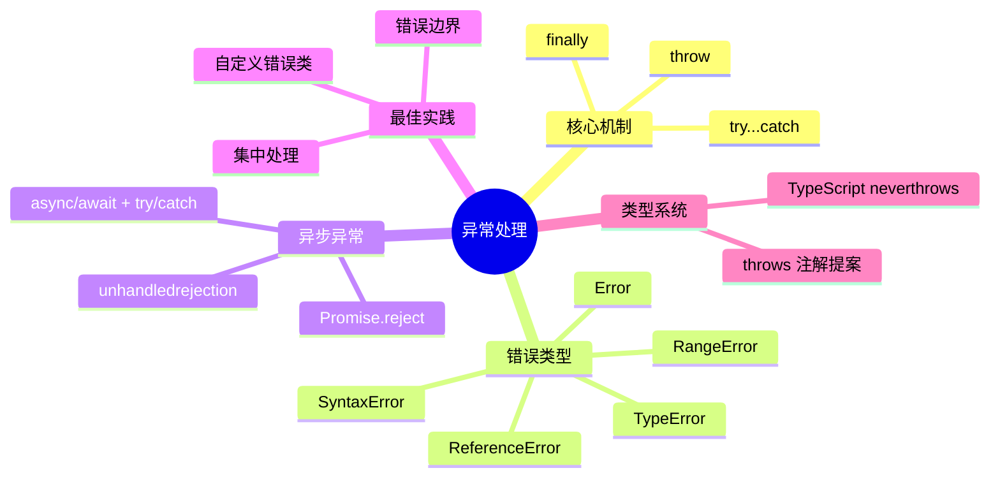
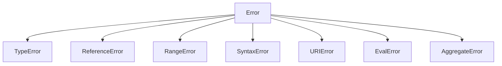
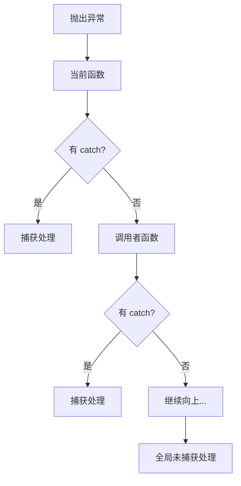
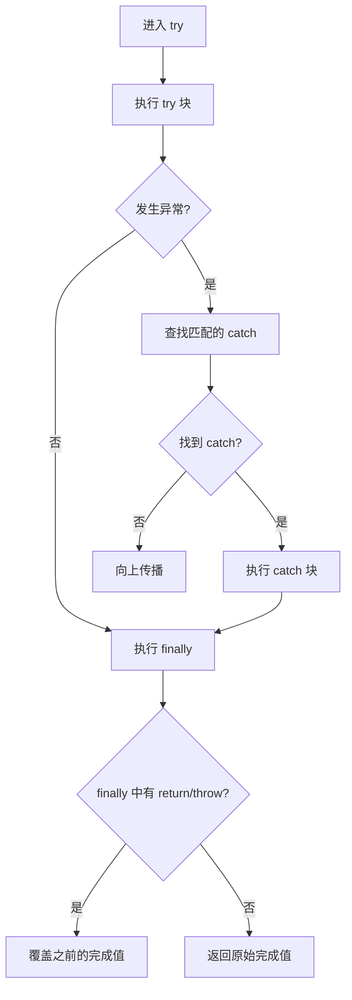
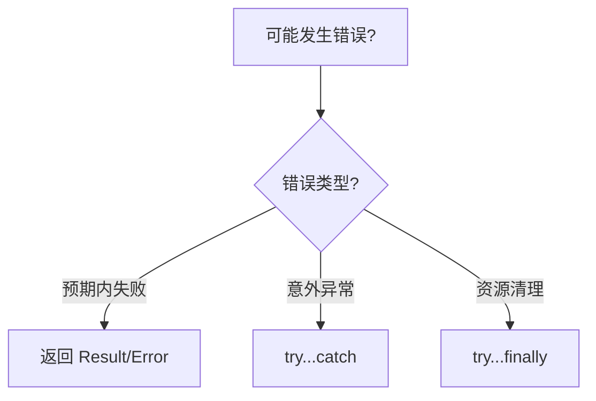
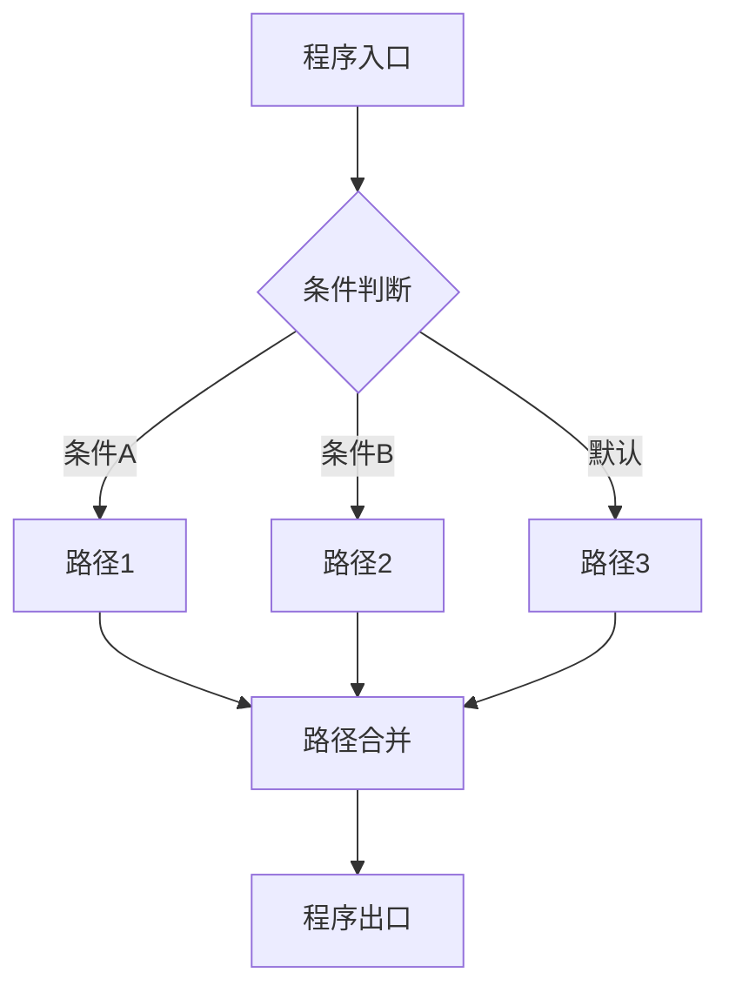

# 异常处理（Exception Handling）

> **形式化定义**：异常处理是 ECMAScript 规范中处理运行时错误的控制流机制，基于 **throw/catch/finally** 三元组和 **Completion Records** 抽象类型。当异常被抛出时，引擎沿调用栈向上展开（Stack Unwinding），直到找到匹配的 `catch` 块。ECMA-262 §13.15 定义了 `try...catch...finally` 的语法，§6.2.4 定义了 Completion Record 的语义。TypeScript 提供类型化的异常声明（`throws` 注解提案）。
>
> 对齐版本：ECMAScript 2025 (ES16) §13.15 | TypeScript 5.8–6.0

---

## 1. 概念定义 (Concept Definition)

### 1.1 形式化定义

ECMA-262 §6.2.4 *Completion Record* 定义了异常的形式语义：

> *"A Completion Record is a Record value used to explain the runtime propagation of values and control flow."*

Completion Record 的字段：

| 字段 | 值 | 说明 |
|------|-----|------|
| `[[Type]]` | normal / break / continue / return / throw | 完成类型 |
| `[[Value]]` | any | 关联值 |
| `[[Target]]` | string / empty | 跳转目标标签 |

### 1.2 概念层级图谱



---

## 2. 属性与特征 (Properties & Characteristics)

### 2.1 异常处理属性矩阵

| 特性 | `throw` | `try...catch` | `finally` |
|------|---------|--------------|-----------|
| 用途 | 抛出异常 | 捕获异常 | 清理资源 |
| 执行条件 | 任意 | 发生异常时 | 总是执行 |
| 返回值影响 | 中断 | 恢复 | 可覆盖 |
| 异步兼容 | ✅ | ✅ | ✅ |
| 性能开销 | 高（栈展开） | 中等 | 低 |

### 2.2 标准错误类型层次



---

## 3. 关系分析 (Relationship Analysis)

### 3.1 异常传播路径



---

## 4. 机制解释 (Mechanism Explanation)

### 4.1 try...catch...finally 的执行流程



### 4.2 finally 的覆盖行为

```javascript
function test() {
  try {
    return 1;  // 先记录 return 1
  } finally {
    return 2;  // 覆盖为 return 2
  }
}

console.log(test()); // 2（不是 1！）
```

---

## 5. 论证与分析 (Argumentation & Analysis)

### 5.1 异常 vs 返回值的错误处理

| 维度 | 异常 | 返回值 |
|------|------|--------|
| 调用者处理强制 | 可选（可传播） | 必须检查 |
| 类型安全 | 弱（TS 无内置 throws 类型） | 强（联合类型） |
| 性能 | 慢（栈展开） | 快 |
| 跨层级传播 | 天然支持 | 需逐层传递 |
| 适用场景 | 罕见错误 | 预期内的失败 |

### 5.2 常见误区

**误区 1**：空 catch 吞掉错误

```javascript
// ❌ 吞掉所有错误
} catch (e) {
  // 什么都不做
}

// ✅ 至少记录
} catch (e) {
  console.error("Operation failed:", e);
}
```

**误区 2**：catch 非 Error 对象

```javascript
// ❌ throw 任意值
throw "error";

// ✅ 抛出 Error 实例
throw new Error("Something went wrong");
```

---

## 6. 实例与示例 (Examples)

### 6.1 正例：自定义错误类

```javascript
class ValidationError extends Error {
  constructor(field, message) {
    super(message);
    this.name = "ValidationError";
    this.field = field;
  }
}

function validateUser(user) {
  if (!user.email) {
    throw new ValidationError("email", "Email is required");
  }
}
```

### 6.2 正例：异步异常处理

```javascript
async function fetchData() {
  try {
    const response = await fetch("/api/data");
    if (!response.ok) {
      throw new Error(`HTTP ${response.status}`);
    }
    return await response.json();
  } catch (error) {
    console.error("Fetch failed:", error);
    throw error; // 重新抛出或返回默认值
  }
}
```

---

## 7. 权威参考与国际化对齐 (References)

- **ECMA-262 §13.15** — try/catch/finally
- **ECMA-262 §6.2.4** — Completion Record
- **MDN: try...catch** — <https://developer.mozilla.org/en-US/docs/Web/JavaScript/Reference/Statements/try...catch>
- **MDN: Error** — <https://developer.mozilla.org/en-US/docs/Web/JavaScript/Reference/Global_Objects/Error>

---

## 8. 思维表征总结 (Cognitive Representations)

### 8.1 异常处理决策树



### 8.2 错误处理策略矩阵

| 场景 | 推荐策略 | 原因 |
|------|---------|------|
| 输入验证 | 提前返回/抛出 | 快速失败 |
| 网络请求 | try/catch + 重试 | 可能临时失败 |
| 资源释放 | try...finally | 确保清理 |
| 批量操作 | AggregateError | 收集所有错误 |

---

## 9. 公理化表述与形式证明 (Axiomatization & Formal Proof)

### 9.1 异常处理的公理化基础

**公理 1（异常传播的完备性）**：
> 若函数 `f` 抛出异常且未在 `f` 内捕获，则异常沿调用栈向上传播，直到被捕获或到达全局上下文。

**公理 2（finally 的执行保证）**：
> `finally` 块中的代码无论 `try` 块如何完成（正常、返回、抛出异常），都会执行。

### 9.2 定理与证明

**定理 1（finally 的覆盖性）**：
> 若 `finally` 块中包含 `return` 或 `throw`，则其完成值覆盖 `try` 或 `catch` 块的完成值。

*证明*：
> 根据 ECMA-262 §13.15.8，finally 块的完成记录优先级高于 try/catch 块。
> 若 finally 返回 normal 完成，则使用 try/catch 的完成值；
> 若 finally 返回非 normal 完成（如 return 或 throw），则使用 finally 的完成值。
> ∎

### 9.3 真值表：try/catch/finally 的执行组合

| try | catch | finally | 结果 |
|-----|-------|---------|------|
| 正常 | — | 正常 | try 结果 |
| 正常 | — | return | finally 返回值 |
| 异常 | 捕获 | 正常 | catch 结果 |
| 异常 | 无匹配 | 正常 | 异常传播 |
| 异常 | 捕获 | return | finally 返回值 |

---

## 10. 推理链与演绎分析 (Deductive Reasoning Chain)

### 10.1 演绎推理：异常传播路径

```mermaid
graph TD
    A[throw new Error] --> B[创建 Completion Record]
    B --> C[[Type]] = throw
    C --> D[沿调用栈向上查找 catch]
    D --> E{找到匹配的 catch?}
    E -->|是| F[执行 catch]
    E -->|否| G[全局 unhandledrejection]
```

### 10.2 反事实推理：如果没有异常机制

> **反设**：JavaScript 不支持 throw/catch。
> **推演结果**：所有错误必须通过返回值传递，调用链每层都需检查返回值，代码冗余且易遗漏。
> **结论**：异常机制提供了非本地控制流，使错误处理与正常逻辑分离。

---

**参考规范**：ECMA-262 §13.15 | MDN: try...catch


---

## 9. 公理化表述与形式证明 (Axiomatization & Formal Proof)

### 9.1 公理化基础

**公理 1（控制流完备性）**：
> 任何程序的控制流可通过顺序、分支、循环三种基本结构组合实现（Bohm-Jacopini 定理）。

**公理 2（短路求值的最小计算）**：
> 逻辑运算符在满足结果确定性的前提下，求值最少的操作数。

**公理 3（异常传播的确定性）**：
> 异常一旦抛出，沿调用栈向上传播，直到被捕获或到达全局上下文。

### 9.2 定理与证明

**定理 1（条件分支的互斥性）**：
> 在 `if...else if...else` 链中，至多一个分支被执行。

*证明*：
> ECMA-262 规定条件分支按顺序求值，首个 truthy 条件对应的分支执行后，跳过后续所有分支。
> ∎

**定理 2（finally 的执行保证）**：
> `finally` 块中的代码无论 `try` 块如何完成（正常、return、throw），都会执行。

*证明*：
> ECMA-262 §13.15.8 规定 finally 块的完成记录优先级高于 try/catch。
> ∎

**定理 3（循环终止的必要条件）**：
> `for`、`while`、`do...while` 循环终止的必要条件是循环体内存在使循环条件最终为 falsy 的操作。

*证明*：
> 若循环条件永真且循环体内无 break/return/throw，根据 ECMA-262 §14.7，循环将无限执行。
> ∎

### 9.3 真值表：控制流运算符行为

| a | b | a && b | a || b | a ?? b | !a |
|---|---|--------|--------|--------|-----|
| true | true | true | true | true | false |
| true | false | false | true | true | false |
| false | true | false | true | false | true |
| false | false | false | false | false | true |
| null | any | null | any | any | true |
| undefined | any | undefined | any | any | true |
| 0 | "d" | "d" | 0 | 0 | true |
| "" | "d" | "d" | "" | "" | true |

---

## 10. 推理链与演绎分析 (Deductive Reasoning Chain)

### 10.1 演绎推理：从代码结构到执行路径



### 10.2 归纳推理：从运行时行为推导控制流问题

| 现象 | 可能原因 | 解决方案 |
|------|---------|---------|
| 意外执行分支 | 条件判断逻辑错误 | 审查布尔表达式 |
| 无限循环 | 循环条件永真 | 检查终止条件 |
| 跳过预期代码 | 提前 return/continue | 检查控制流语句 |
| 资源未释放 | 异常中断流程 | 使用 try...finally 或 using |
| 异步操作未等待 | 缺少 await | 添加 await 或 Promise 链 |

### 10.3 反事实推理

> **反设**：ECMAScript 不支持任何控制流语句（if/switch/loop/try）。
>
> **推演结果**：
>
> 1. 所有程序只能顺序执行，无法根据条件选择路径
> 2. 重复操作必须通过递归实现，存在栈溢出风险
> 3. 错误处理无法分离正常逻辑与异常逻辑
> 4. 图灵完备性仍可通过函数调用和递归保持，但表达力大幅下降
>
> **结论**：控制流语句是结构化编程的基石，提供了表达复杂算法的基本构件。

---

## 11. 形式语义说明

### 11.1 操作语义

操作语义（Operational Semantics）描述了语句如何改变程序状态：

```
(if (C) S₁ else S₂, σ) → (S₁, σ)  if eval(C, σ) = true
(if (C) S₁ else S₂, σ) → (S₂, σ)  if eval(C, σ) = false
```

其中 σ 表示程序状态（变量绑定集合）。

### 11.2 指称语义

指称语义（Denotational Semantics）将语句映射为数学函数：

```
[[if (C) S₁ else S₂]](σ) =
  [[S₁]](σ)  if [[C]](σ) = true
  [[S₂]](σ)  if [[C]](σ) = false
```

---

## 12. 性能与最佳实践

### 12.1 性能考量

| 结构 | 时间复杂度 | 空间复杂度 | 备注 |
|------|-----------|-----------|------|
| if...else | O(1) | O(1) | 条件求值 |
| switch | O(n) 最坏 | O(1) | n = case 数量 |
| try...catch | 无异常时 O(1) | O(1) | 有异常时开销大 |
| for 循环 | O(迭代次数) | O(1) | 取决于循环体 |
| Promise.then | O(1) | O(1) | 微任务队列调度 |
| async/await | O(1) | O(1) | 生成器状态机开销 |

### 12.2 最佳实践总结

```javascript
// ✅ 优先使用严格相等
if (x === 5) { /* ... */ }

// ✅ 使用 switch 进行离散值匹配
switch (status) {
  case "active": /* ... */ break;
  case "inactive": /* ... */ break;
  default: /* ... */;
}

// ✅ 使用 ?? 而非 || 进行默认值赋值
const port = config.port ?? 3000;

// ✅ 使用可选链进行安全访问
const name = user?.profile?.name;

// ✅ 使用 using 管理资源
using file = await openFile(path);

// ✅ 并行异步操作使用 Promise.all
const [a, b] = await Promise.all([fetchA(), fetchB()]);

// ✅ 生成器实现惰性序列
function* range(n) { for (let i = 0; i < n; i++) yield i; }
```

---

## 13. 思维模型总结

### 13.1 控制流选择速查矩阵

| 需求 | 推荐结构 | 替代方案 |
|------|---------|---------|
| 布尔条件分支 | if...else | 三元运算符 ?: |
| 离散值匹配 | switch | 对象映射表 |
| 计数循环 | for | while |
| 条件循环 | while / do...while | for (;;) |
| 遍历可迭代对象 | for...of | Array.forEach |
| 遍历对象属性 | for...in + hasOwn | Object.keys |
| 错误处理 | try...catch...finally | Promise.catch |
| 资源管理 | using / await using | try...finally |
| 默认值赋值 | ?? | ||（仅布尔场景）|
| 安全深层访问 | ?. | && 链 |
| 异步顺序执行 | await | Promise.then 链 |
| 异步并行执行 | Promise.all | Promise.race |
| 惰性序列 | function* | 闭包 |
| 异步数据流 | async function* | 事件流 |

---

## 14. 权威参考完整列表

| 来源 | 链接 | 相关章节 |
|------|------|---------|
| ECMA-262 | tc39.es/ecma262 | §13-14 |
| TypeScript Handbook | typescriptlang.org/docs | Control Flow Analysis |
| MDN: Control flow | developer.mozilla.org | Statements |
| MDN: Loops | developer.mozilla.org | Loops_and_iteration |
| MDN: Exception | developer.mozilla.org | try...catch |

---

**参考规范**：ECMA-262 §13-14 | MDN: Control flow | TypeScript Handbook
