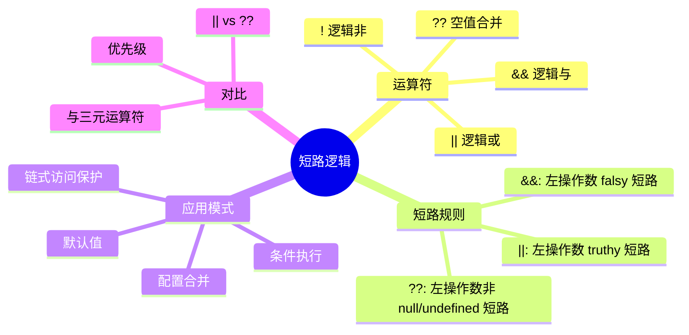
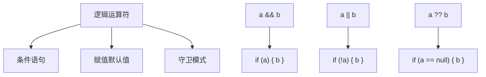
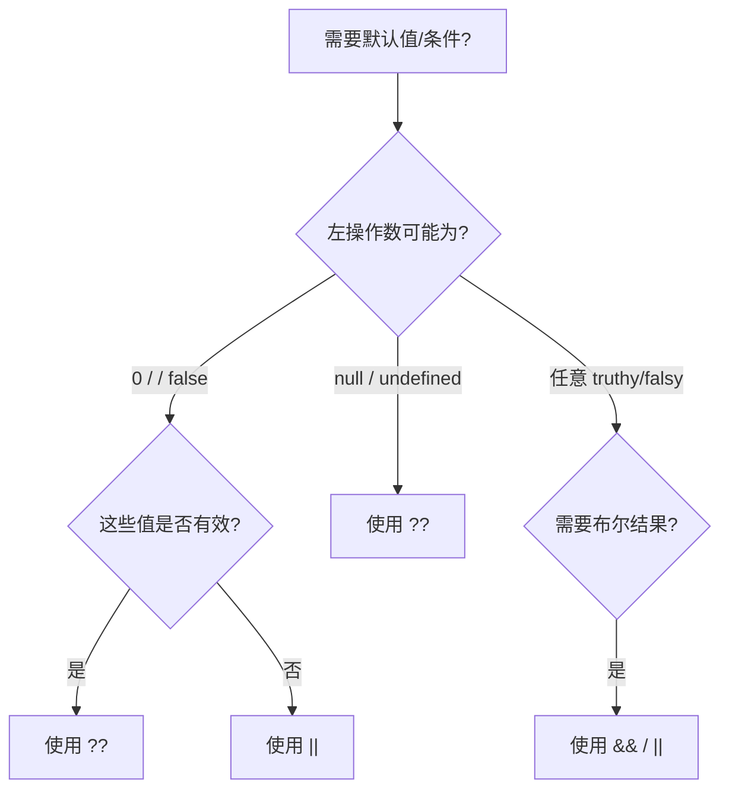
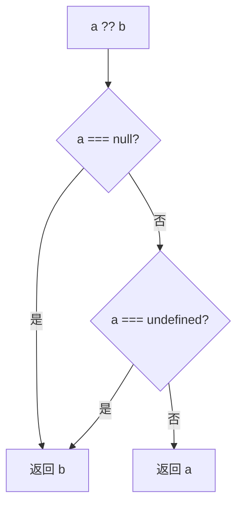
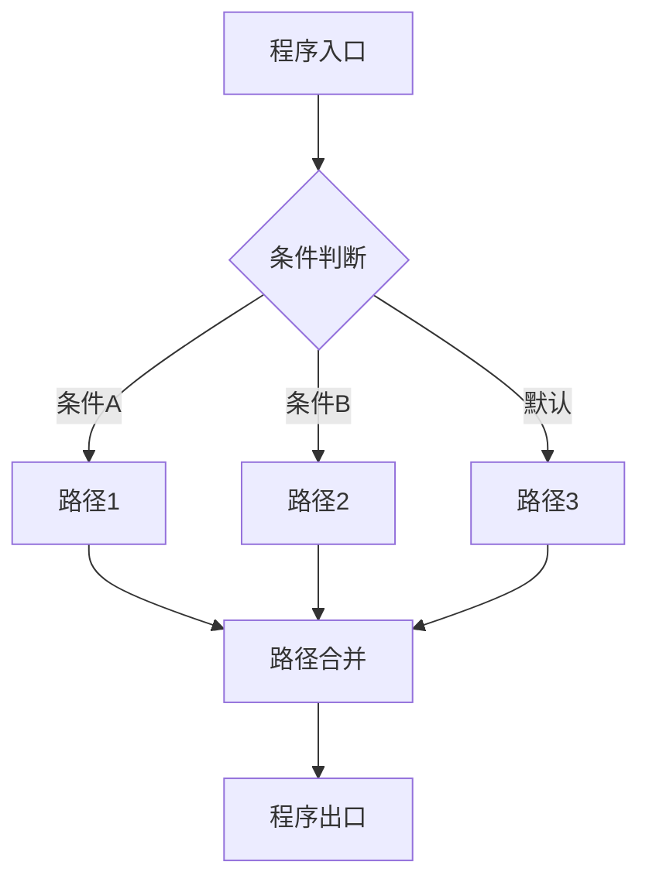

# 短路逻辑与逻辑运算符（Short-Circuit & Logical Operators）

> **形式化定义**：短路逻辑运算符（`&&`、`||`、`??`）是 ECMAScript 规范中基于**惰性求值（Lazy Evaluation）**的二元运算符。`&&` 在左操作数为 falsy 时短路，`||` 在左操作数为 truthy 时短路，`??`（空值合并运算符，ES2020）仅在左操作数为 `null` 或 `undefined` 时求值右操作数。ECMA-262 §13.12 定义了逻辑运算符的语义，其求值规则直接映射到**命题逻辑的真值表**。
>
> 对齐版本：ECMAScript 2025 (ES16) §13.12 | TypeScript 5.8–6.0

---

## 1. 概念定义 (Concept Definition)

### 1.1 形式化定义

ECMA-262 §13.12 *Binary Logical Operators* 定义了短路语义：

> *"The value produced by a && or || operator is not necessarily of type Boolean. The value produced will always be the value of one of the two operand expressions."*

逻辑运算符的数学表示：

```
a && b  ≡  a ? b : a      (若 a falsy，返回 a；否则返回 b)
a || b  ≡  a ? a : b      (若 a truthy，返回 a；否则返回 b)
a ?? b  ≡  a !== null && a !== undefined ? a : b
```

### 1.2 概念层级图谱



---

## 2. 属性与特征 (Properties & Characteristics)

### 2.1 逻辑运算符属性矩阵

| 特性 | `&&` | `||` | `??` |
|------|------|------|------|
| 短路条件 | 左操作数 falsy | 左操作数 truthy | 左操作数非 null/undefined |
| 返回值类型 | 操作数原始类型 | 操作数原始类型 | 操作数原始类型 |
| 强制布尔转换 | 否 | 否 | 否 |
| 与 `!` 组合 | `!` 强制转换 | `!` 强制转换 | — |
| 优先级 | 中等 | 低 | 低 |

### 2.2 `||` vs `??` 的区别

```javascript
const a = 0;
const b = "";
const c = null;

a || "default"; // "default"（0 是 falsy）
a ?? "default"; // 0（0 不是 null/undefined）

b || "default"; // "default"（"" 是 falsy）
b ?? "default"; // ""（"" 不是 null/undefined）

c || "default"; // "default"
c ?? "default"; // "default"
```

---

## 3. 关系分析 (Relationship Analysis)

### 3.1 逻辑运算符与条件语句的关系



---

## 4. 机制解释 (Mechanism Explanation)

### 4.1 短路求值的执行流程

```mermaid
flowchart TD
    A[a && b] --> B[求值 a]
    B --> C{ToBoolean(a)?}
    C -->|falsy| D[返回 a]
    C -->|truthy| E[求值 b]
    E --> F[返回 b]

    G[a || b] --> H[求值 a]
    H --> I{ToBoolean(a)?}
    I -->|truthy| J[返回 a]
    I -->|falsy| K[求值 b]
    K --> L[返回 b]
```

---

## 5. 论证与分析 (Argumentation & Analysis)

### 5.1 `||` vs `??` 的选择策略

| 场景 | 推荐 | 原因 |
|------|------|------|
| 配置项默认值 | `??` | 允许 0 和 "" |
| 布尔标志默认值 | `||` | 需要 falsy 都使用默认值 |
| 可选链后备值 | `??` | 仅对 null/undefined 后备 |
| 函数参数默认值 | 参数默认值语法 | 最清晰 |

### 5.2 常见误区

**误区 1**：`??` 与 `||` 混用

```javascript
// ❌ 意外地将 0 替换为默认值
const count = data.count || 10; // 如果 count 为 0，变成 10！

// ✅ 仅对 null/undefined 使用默认值
const count = data.count ?? 10; // count=0 时保持 0
```

**误区 2**：短路导致副作用不执行

```javascript
// ❌ 条件调用可能不执行
condition && sideEffect(); // condition 为 falsy 时不执行

// ✅ 显式 if 更清晰
if (condition) {
  sideEffect();
}
```

---

## 6. 实例与示例 (Examples)

### 6.1 正例：配置对象合并

```javascript
// ✅ 使用 ?? 保持有效的 falsy 值
const config = {
  port: userConfig.port ?? 3000,      // 允许 port = 0
  host: userConfig.host ?? "localhost", // 允许 host = ""
  debug: userConfig.debug ?? false     // 允许 debug = false
};
```

### 6.2 正例：条件执行链

```javascript
// ✅ 使用 && 进行条件执行
isReady && processData();

// ✅ 使用 || 提供后备值
const name = user.name || "Anonymous";

// ✅ 使用 ?? 进行 nullish 后备
const value = maybeNull ?? computeDefault();
```

---

## 7. 权威参考与国际化对齐 (References)

- **ECMA-262 §13.12** — Binary Logical Operators
- **ECMA-262 §13.5.3** — The typeof Operator
- **MDN: Logical operators** — <https://developer.mozilla.org/en-US/docs/Web/JavaScript/Reference/Operators>

---

## 8. 思维表征总结 (Cognitive Representations)

### 8.1 逻辑运算符选择决策树



### 8.2 运算符优先级速查

| 优先级 | 运算符 | 结合性 |
|--------|--------|--------|
| 高 | `!` | 右结合 |
| 中 | `&&` | 左结合 |
| 低 | `\|\|` | 左结合 |
| 低 | `??` | 左结合 |

> ⚠️ `??` 和 `||` 混合使用需括号：`a ?? (b || c)`

---

## 9. 公理化表述与形式证明 (Axiomatization & Formal Proof)

### 9.1 短路逻辑的公理化基础

**公理 1（&& 的结合性）**：
> `(a && b) && c = a && (b && c)`，左结合。

**公理 2（|| 的吸收性）**：
> `a || (a && b) = a`。

**公理 3（?? 的定义域）**：
> `a ?? b` 当且仅当 `a === null || a === undefined` 时返回 `b`，否则返回 `a`。

### 9.2 定理与证明

**定理 1（&& 的幂等性）**：
> `a && a = a`。

*证明*：
> 若 `a` 为 falsy，`a && a` 短路返回 `a`。
> 若 `a` 为 truthy，求值第二个 `a`，返回 `a`。
> 两种情形均返回 `a`。
> ∎

**定理 2（?? 与 || 的差异性）**：
> 存在值 `v` 使得 `v || d ≠ v ?? d`。具体地，当 `v ∈ {0, "", false, NaN}` 时，差异成立。

*证明*：
> 设 `v = 0`，`d = "default"`。
> `0 || "default" = "default"`（0 是 falsy）。
> `0 ?? "default" = 0`（0 不是 null/undefined）。
> 因此 `0 || "default" ≠ 0 ?? "default"`。
> ∎

### 9.3 真值表：逻辑运算符的完备行为

| a | b | a && b | a \|\| b | a ?? b |
|---|---|--------|----------|--------|
| true | true | true | true | true |
| true | false | false | true | true |
| false | true | false | true | false |
| false | false | false | false | false |
| null | any | null | any | any |
| undefined | any | undefined | any | any |
| 0 | "d" | "d" | 0 | 0 |
| "" | "d" | "d" | "" | "" |

---

## 10. 推理链与演绎分析 (Deductive Reasoning Chain)

### 10.1 演绎推理：从操作数到返回值



### 10.2 反事实推理：如果没有 ?? 运算符

> **反设**：ES2020 没有引入 `??` 运算符。
> **推演结果**：
>
> 1. `0` 和 `""` 作为有效值时，使用 `||` 会导致意外默认值替换
> 2. 开发者需要写 `(a !== null && a !== undefined) ? a : b`
> 3. 可选链 `?.` 的后备值模式不完整
> **结论**：`??` 的引入填补了 `||` 在 falsy-but-valid 值场景下的语义缺失。

---

**参考规范**：ECMA-262 §13.12 | MDN: Logical operators


---

## 9. 公理化表述与形式证明 (Axiomatization & Formal Proof)

### 9.1 公理化基础

**公理 1（控制流完备性）**：
> 任何程序的控制流可通过顺序、分支、循环三种基本结构组合实现（Bohm-Jacopini 定理）。

**公理 2（短路求值的最小计算）**：
> 逻辑运算符在满足结果确定性的前提下，求值最少的操作数。

**公理 3（异常传播的确定性）**：
> 异常一旦抛出，沿调用栈向上传播，直到被捕获或到达全局上下文。

### 9.2 定理与证明

**定理 1（条件分支的互斥性）**：
> 在 `if...else if...else` 链中，至多一个分支被执行。

*证明*：
> ECMA-262 规定条件分支按顺序求值，首个 truthy 条件对应的分支执行后，跳过后续所有分支。
> ∎

**定理 2（finally 的执行保证）**：
> `finally` 块中的代码无论 `try` 块如何完成（正常、return、throw），都会执行。

*证明*：
> ECMA-262 §13.15.8 规定 finally 块的完成记录优先级高于 try/catch。
> ∎

**定理 3（循环终止的必要条件）**：
> `for`、`while`、`do...while` 循环终止的必要条件是循环体内存在使循环条件最终为 falsy 的操作。

*证明*：
> 若循环条件永真且循环体内无 break/return/throw，根据 ECMA-262 §14.7，循环将无限执行。
> ∎

### 9.3 真值表：控制流运算符行为

| a | b | a && b | a || b | a ?? b | !a |
|---|---|--------|--------|--------|-----|
| true | true | true | true | true | false |
| true | false | false | true | true | false |
| false | true | false | true | false | true |
| false | false | false | false | false | true |
| null | any | null | any | any | true |
| undefined | any | undefined | any | any | true |
| 0 | "d" | "d" | 0 | 0 | true |
| "" | "d" | "d" | "" | "" | true |

---

## 10. 推理链与演绎分析 (Deductive Reasoning Chain)

### 10.1 演绎推理：从代码结构到执行路径



### 10.2 归纳推理：从运行时行为推导控制流问题

| 现象 | 可能原因 | 解决方案 |
|------|---------|---------|
| 意外执行分支 | 条件判断逻辑错误 | 审查布尔表达式 |
| 无限循环 | 循环条件永真 | 检查终止条件 |
| 跳过预期代码 | 提前 return/continue | 检查控制流语句 |
| 资源未释放 | 异常中断流程 | 使用 try...finally 或 using |
| 异步操作未等待 | 缺少 await | 添加 await 或 Promise 链 |

### 10.3 反事实推理

> **反设**：ECMAScript 不支持任何控制流语句（if/switch/loop/try）。
>
> **推演结果**：
>
> 1. 所有程序只能顺序执行，无法根据条件选择路径
> 2. 重复操作必须通过递归实现，存在栈溢出风险
> 3. 错误处理无法分离正常逻辑与异常逻辑
> 4. 图灵完备性仍可通过函数调用和递归保持，但表达力大幅下降
>
> **结论**：控制流语句是结构化编程的基石，提供了表达复杂算法的基本构件。

---

## 11. 形式语义说明

### 11.1 操作语义

操作语义（Operational Semantics）描述了语句如何改变程序状态：

```
(if (C) S₁ else S₂, σ) → (S₁, σ)  if eval(C, σ) = true
(if (C) S₁ else S₂, σ) → (S₂, σ)  if eval(C, σ) = false
```

其中 σ 表示程序状态（变量绑定集合）。

### 11.2 指称语义

指称语义（Denotational Semantics）将语句映射为数学函数：

```
[[if (C) S₁ else S₂]](σ) =
  [[S₁]](σ)  if [[C]](σ) = true
  [[S₂]](σ)  if [[C]](σ) = false
```

---

## 12. 性能与最佳实践

### 12.1 性能考量

| 结构 | 时间复杂度 | 空间复杂度 | 备注 |
|------|-----------|-----------|------|
| if...else | O(1) | O(1) | 条件求值 |
| switch | O(n) 最坏 | O(1) | n = case 数量 |
| try...catch | 无异常时 O(1) | O(1) | 有异常时开销大 |
| for 循环 | O(迭代次数) | O(1) | 取决于循环体 |
| Promise.then | O(1) | O(1) | 微任务队列调度 |
| async/await | O(1) | O(1) | 生成器状态机开销 |

### 12.2 最佳实践总结

```javascript
// ✅ 优先使用严格相等
if (x === 5) { /* ... */ }

// ✅ 使用 switch 进行离散值匹配
switch (status) {
  case "active": /* ... */ break;
  case "inactive": /* ... */ break;
  default: /* ... */;
}

// ✅ 使用 ?? 而非 || 进行默认值赋值
const port = config.port ?? 3000;

// ✅ 使用可选链进行安全访问
const name = user?.profile?.name;

// ✅ 使用 using 管理资源
using file = await openFile(path);

// ✅ 并行异步操作使用 Promise.all
const [a, b] = await Promise.all([fetchA(), fetchB()]);

// ✅ 生成器实现惰性序列
function* range(n) { for (let i = 0; i < n; i++) yield i; }
```

---

## 13. 思维模型总结

### 13.1 控制流选择速查矩阵

| 需求 | 推荐结构 | 替代方案 |
|------|---------|---------|
| 布尔条件分支 | if...else | 三元运算符 ?: |
| 离散值匹配 | switch | 对象映射表 |
| 计数循环 | for | while |
| 条件循环 | while / do...while | for (;;) |
| 遍历可迭代对象 | for...of | Array.forEach |
| 遍历对象属性 | for...in + hasOwn | Object.keys |
| 错误处理 | try...catch...finally | Promise.catch |
| 资源管理 | using / await using | try...finally |
| 默认值赋值 | ?? | ||（仅布尔场景）|
| 安全深层访问 | ?. | && 链 |
| 异步顺序执行 | await | Promise.then 链 |
| 异步并行执行 | Promise.all | Promise.race |
| 惰性序列 | function* | 闭包 |
| 异步数据流 | async function* | 事件流 |

---

## 14. 权威参考完整列表

| 来源 | 链接 | 相关章节 |
|------|------|---------|
| ECMA-262 | tc39.es/ecma262 | §13-14 |
| TypeScript Handbook | typescriptlang.org/docs | Control Flow Analysis |
| MDN: Control flow | developer.mozilla.org | Statements |
| MDN: Loops | developer.mozilla.org | Loops_and_iteration |
| MDN: Exception | developer.mozilla.org | try...catch |

---

**参考规范**：ECMA-262 §13-14 | MDN: Control flow | TypeScript Handbook
