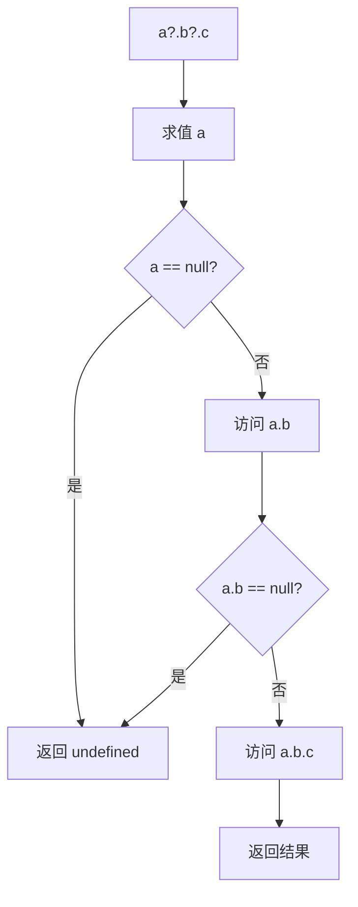
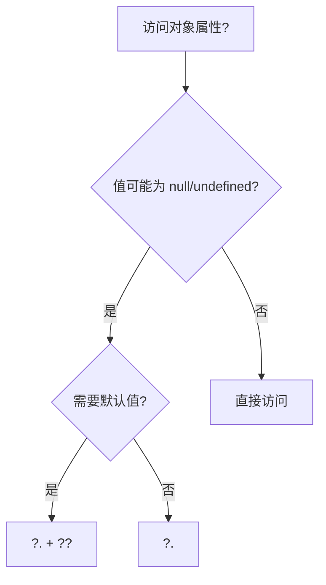
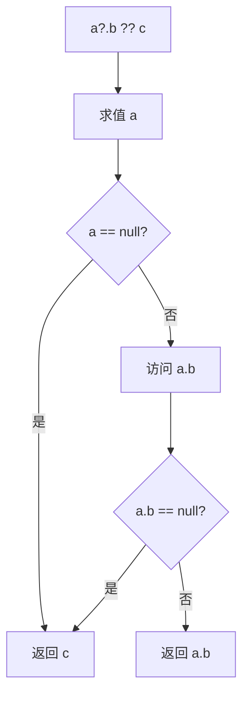
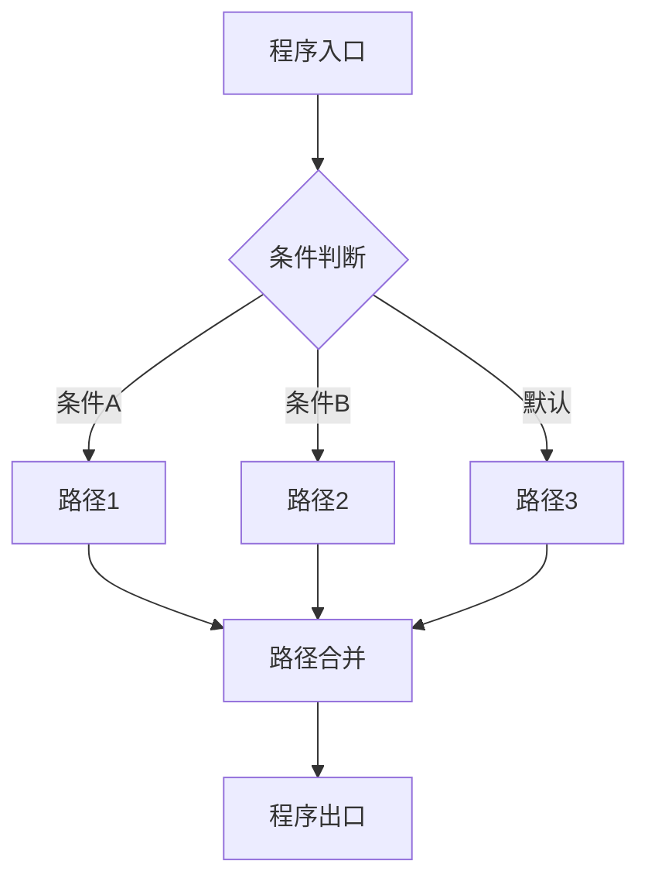

# 空值合并与可选链（Nullish Coalescing & Optional Chaining）

> **形式化定义**：空值合并运算符 `??`（ES2020）和可选链运算符 `?.`（ES2020）是 ECMAScript 规范中处理**部分存在（Partial Presence）**的语法特性。`??` 在左操作数为 `null` 或 `undefined` 时求值右操作数，否则返回左操作数。`?.` 在访问链中遇到 `null` 或 `undefined` 时短路返回 `undefined`，而非抛出 TypeError。ECMA-262 §13.12 定义了 `??` 的语义，§13.3 定义了 `?.` 的语法。
>
> 对齐版本：ECMAScript 2025 (ES16) §13.12 | TypeScript 5.8–6.0

---

## 1. 概念定义 (Concept Definition)

### 1.1 形式化定义

ECMA-262 定义了 `??` 和 `?.` 的语义：

> **空值合并**：`a ?? b` ≡ `a !== null && a !== undefined ? a : b`
>
> **可选链**：`a?.b` ≡ `a === null || a === undefined ? undefined : a.b`

### 1.2 概念层级图谱

```mermaid
mindmap
  root((空值合并与可选链))
    ?? 空值合并
      null/undefined 检测
      与 || 的区别
      默认值赋值
    ?. 可选链
      属性访问 ?.
      方法调用 ?.()
      数组访问 ?.[]
    组合使用
      a?.b ?? default
      安全访问 + 默认值
    对比
      lodash get
      传统 && 链
      TypeScript 非空断言 !
```

---

## 2. 属性与特征 (Properties & Characteristics)

### 2.1 运算符属性矩阵

| 特性 | `??` | `?.` |
|------|------|------|
| 操作数 | 两个表达式 | 访问链 |
| 短路条件 | 左操作数非 null/undefined | 中间值为 null/undefined |
| 返回值 | 左或右操作数 | 访问结果或 undefined |
| 与 `||` 互斥 | 是（需括号） | — |
| TypeScript 支持 | ✅ | ✅ |

### 2.2 `??` vs `||` 的精确差异

```javascript
// falsy 值处理差异
0 ?? "default";     // 0
0 || "default";     // "default"

"" ?? "default";    // ""
"" || "default";    // "default"

false ?? "default"; // false
false || "default"; // "default"

NaN ?? "default";   // NaN
NaN || "default";   // "default"

null ?? "default";  // "default"
null || "default";  // "default"
```

---

## 3. 关系分析 (Relationship Analysis)

### 3.1 可选链与传统访问的对比

```javascript
// 传统方式
const street = user && user.address && user.address.street;

// 可选链方式
const street = user?.address?.street;

// 组合默认值
const street = user?.address?.street ?? "Unknown";
```

---

## 4. 机制解释 (Mechanism Explanation)

### 4.1 可选链的执行流程



---

## 5. 论证与分析 (Argumentation & Analysis)

### 5.1 可选链的适用边界

| 场景 | 推荐 | 不推荐 |
|------|------|--------|
| 深层属性访问 | ✅ `a?.b?.c` | ❌ `a && a.b && a.b.c` |
| 函数调用 | ✅ `fn?.()` | ❌ `fn && fn()` |
| 数组访问 | ✅ `arr?.[0]` | ❌ `arr && arr[0]` |
| 赋值左侧 | ❌ 不可使用 | ✅ 需显式检查 |
| 需要区分 null/undefined 和缺失 | ❌ | ✅ 需自定义检查 |

---

## 6. 实例与示例 (Examples)

### 6.1 正例：深层对象安全访问

```javascript
const user = {
  profile: {
    address: {
      street: "Main St"
    }
  }
};

// ✅ 可选链 + 空值合并
const street = user?.profile?.address?.street ?? "Unknown";
console.log(street); // "Main St"

// ✅ 方法可选调用
const result = obj?.calculate?.(1, 2) ?? 0;
```

### 6.2 反例：过度使用可选链

```javascript
// ❌ 已知必然存在时使用可选链
const name = user?.name; // 如果 user 必然存在，直接用 user.name

// ❌ 可选链用于赋值
user?.name = "Alice"; // SyntaxError！
```

---

## 7. 权威参考与国际化对齐 (References)

- **ECMA-262 §13.12** — Nullish Coalescing Operator
- **ECMA-262 §13.3** — Optional Chains
- **MDN: Nullish coalescing** — <https://developer.mozilla.org/en-US/docs/Web/JavaScript/Reference/Operators/Nullish_coalescing>
- **MDN: Optional chaining** — <https://developer.mozilla.org/en-US/docs/Web/JavaScript/Reference/Operators/Optional_chaining>

---

## 8. 思维表征总结 (Cognitive Representations)

### 8.1 访问模式决策树



---

## 9. 公理化表述与形式证明 (Axiomatization & Formal Proof)

### 9.1 公理化基础

**公理 1（可选链的短路性）**：
> `a?.b` 当 `a` 为 `null` 或 `undefined` 时，不求值 `b`，直接返回 `undefined`。

**公理 2（空值合并的定义域）**：
> `a ?? b` 的定义域为所有值，仅在 `a ∈ {null, undefined}` 时使用 `b`。

### 9.2 定理与证明

**定理 1（可选链的组合等价性）**：
> `a?.b?.c` ≡ `(a == null ? undefined : a.b)?.c`

*证明*：
> 根据 ECMA-262 §13.3，可选链从左到右求值，遇到第一个 `null`/`undefined` 即短路。
> ∎

### 9.3 真值表：?? 与 || 的差异

| a | a \|\| "d" | a ?? "d" | 说明 |
|---|-----------|----------|------|
| 0 | "d" | 0 | || 误判 0 |
| "" | "d" | "" | || 误判 "" |
| false | "d" | false | || 误判 false |
| null | "d" | "d" | 两者一致 |
| undefined | "d" | "d" | 两者一致 |

---

## 10. 推理链与演绎分析 (Deductive Reasoning Chain)

### 10.1 演绎推理



### 10.2 反事实推理

> **反设**：ES2020 没有引入 `?.` 和 `??`。
> **推演结果**：深层对象访问需要大量 `&&` 链，代码冗长且易错；falsy-but-valid 值无法安全使用默认值。
> **结论**：`?.` 和 `??` 是现代 JavaScript 处理部分存在的核心语法糖。

---

**参考规范**：ECMA-262 §13.12 | MDN: Optional chaining / Nullish coalescing


---

## 9. 公理化表述与形式证明 (Axiomatization & Formal Proof)

### 9.1 公理化基础

**公理 1（控制流完备性）**：
> 任何程序的控制流可通过顺序、分支、循环三种基本结构组合实现（Bohm-Jacopini 定理）。

**公理 2（短路求值的最小计算）**：
> 逻辑运算符在满足结果确定性的前提下，求值最少的操作数。

**公理 3（异常传播的确定性）**：
> 异常一旦抛出，沿调用栈向上传播，直到被捕获或到达全局上下文。

### 9.2 定理与证明

**定理 1（条件分支的互斥性）**：
> 在 `if...else if...else` 链中，至多一个分支被执行。

*证明*：
> ECMA-262 规定条件分支按顺序求值，首个 truthy 条件对应的分支执行后，跳过后续所有分支。
> ∎

**定理 2（finally 的执行保证）**：
> `finally` 块中的代码无论 `try` 块如何完成（正常、return、throw），都会执行。

*证明*：
> ECMA-262 §13.15.8 规定 finally 块的完成记录优先级高于 try/catch。
> ∎

**定理 3（循环终止的必要条件）**：
> `for`、`while`、`do...while` 循环终止的必要条件是循环体内存在使循环条件最终为 falsy 的操作。

*证明*：
> 若循环条件永真且循环体内无 break/return/throw，根据 ECMA-262 §14.7，循环将无限执行。
> ∎

### 9.3 真值表：控制流运算符行为

| a | b | a && b | a || b | a ?? b | !a |
|---|---|--------|--------|--------|-----|
| true | true | true | true | true | false |
| true | false | false | true | true | false |
| false | true | false | true | false | true |
| false | false | false | false | false | true |
| null | any | null | any | any | true |
| undefined | any | undefined | any | any | true |
| 0 | "d" | "d" | 0 | 0 | true |
| "" | "d" | "d" | "" | "" | true |

---

## 10. 推理链与演绎分析 (Deductive Reasoning Chain)

### 10.1 演绎推理：从代码结构到执行路径



### 10.2 归纳推理：从运行时行为推导控制流问题

| 现象 | 可能原因 | 解决方案 |
|------|---------|---------|
| 意外执行分支 | 条件判断逻辑错误 | 审查布尔表达式 |
| 无限循环 | 循环条件永真 | 检查终止条件 |
| 跳过预期代码 | 提前 return/continue | 检查控制流语句 |
| 资源未释放 | 异常中断流程 | 使用 try...finally 或 using |
| 异步操作未等待 | 缺少 await | 添加 await 或 Promise 链 |

### 10.3 反事实推理

> **反设**：ECMAScript 不支持任何控制流语句（if/switch/loop/try）。
>
> **推演结果**：
>
> 1. 所有程序只能顺序执行，无法根据条件选择路径
> 2. 重复操作必须通过递归实现，存在栈溢出风险
> 3. 错误处理无法分离正常逻辑与异常逻辑
> 4. 图灵完备性仍可通过函数调用和递归保持，但表达力大幅下降
>
> **结论**：控制流语句是结构化编程的基石，提供了表达复杂算法的基本构件。

---

## 11. 形式语义说明

### 11.1 操作语义

操作语义（Operational Semantics）描述了语句如何改变程序状态：

```
(if (C) S₁ else S₂, σ) → (S₁, σ)  if eval(C, σ) = true
(if (C) S₁ else S₂, σ) → (S₂, σ)  if eval(C, σ) = false
```

其中 σ 表示程序状态（变量绑定集合）。

### 11.2 指称语义

指称语义（Denotational Semantics）将语句映射为数学函数：

```
[[if (C) S₁ else S₂]](σ) =
  [[S₁]](σ)  if [[C]](σ) = true
  [[S₂]](σ)  if [[C]](σ) = false
```

---

## 12. 性能与最佳实践

### 12.1 性能考量

| 结构 | 时间复杂度 | 空间复杂度 | 备注 |
|------|-----------|-----------|------|
| if...else | O(1) | O(1) | 条件求值 |
| switch | O(n) 最坏 | O(1) | n = case 数量 |
| try...catch | 无异常时 O(1) | O(1) | 有异常时开销大 |
| for 循环 | O(迭代次数) | O(1) | 取决于循环体 |
| Promise.then | O(1) | O(1) | 微任务队列调度 |
| async/await | O(1) | O(1) | 生成器状态机开销 |

### 12.2 最佳实践总结

```javascript
// ✅ 优先使用严格相等
if (x === 5) { /* ... */ }

// ✅ 使用 switch 进行离散值匹配
switch (status) {
  case "active": /* ... */ break;
  case "inactive": /* ... */ break;
  default: /* ... */;
}

// ✅ 使用 ?? 而非 || 进行默认值赋值
const port = config.port ?? 3000;

// ✅ 使用可选链进行安全访问
const name = user?.profile?.name;

// ✅ 使用 using 管理资源
using file = await openFile(path);

// ✅ 并行异步操作使用 Promise.all
const [a, b] = await Promise.all([fetchA(), fetchB()]);

// ✅ 生成器实现惰性序列
function* range(n) { for (let i = 0; i < n; i++) yield i; }
```

---

## 13. 思维模型总结

### 13.1 控制流选择速查矩阵

| 需求 | 推荐结构 | 替代方案 |
|------|---------|---------|
| 布尔条件分支 | if...else | 三元运算符 ?: |
| 离散值匹配 | switch | 对象映射表 |
| 计数循环 | for | while |
| 条件循环 | while / do...while | for (;;) |
| 遍历可迭代对象 | for...of | Array.forEach |
| 遍历对象属性 | for...in + hasOwn | Object.keys |
| 错误处理 | try...catch...finally | Promise.catch |
| 资源管理 | using / await using | try...finally |
| 默认值赋值 | ?? | ||（仅布尔场景）|
| 安全深层访问 | ?. | && 链 |
| 异步顺序执行 | await | Promise.then 链 |
| 异步并行执行 | Promise.all | Promise.race |
| 惰性序列 | function* | 闭包 |
| 异步数据流 | async function* | 事件流 |

---

## 14. 权威参考完整列表

| 来源 | 链接 | 相关章节 |
|------|------|---------|
| ECMA-262 | tc39.es/ecma262 | §13-14 |
| TypeScript Handbook | typescriptlang.org/docs | Control Flow Analysis |
| MDN: Control flow | developer.mozilla.org | Statements |
| MDN: Loops | developer.mozilla.org | Loops_and_iteration |
| MDN: Exception | developer.mozilla.org | try...catch |

---

**参考规范**：ECMA-262 §13-14 | MDN: Control flow | TypeScript Handbook
