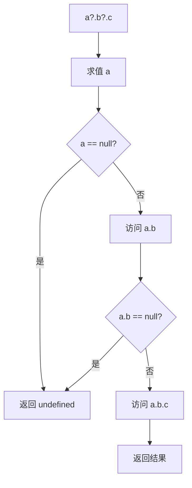
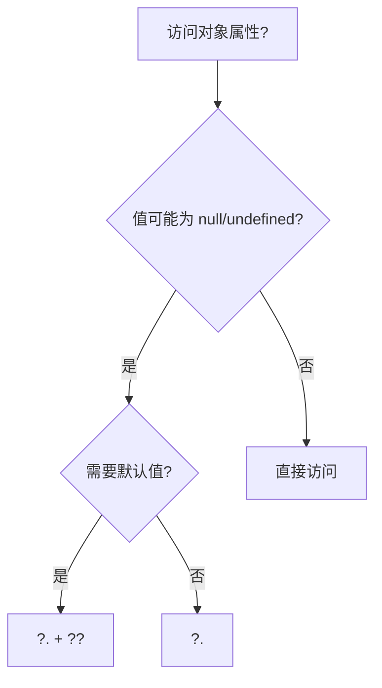
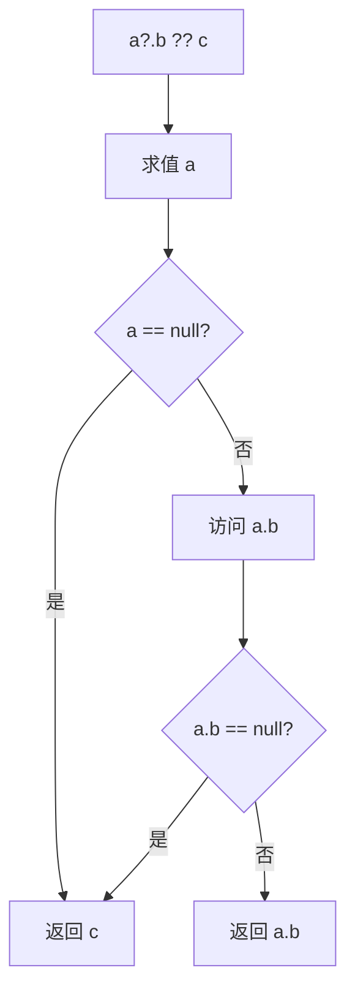

# 空值合并与可选链（Nullish Coalescing & Optional Chaining）

> **形式化定义**：空值合并运算符 `??`（ES2020）和可选链运算符 `?.`（ES2020）是 ECMAScript 规范中处理**部分存在（Partial Presence）**的语法特性。`??` 在左操作数为 `null` 或 `undefined` 时求值右操作数，否则返回左操作数。`?.` 在访问链中遇到 `null` 或 `undefined` 时短路返回 `undefined`，而非抛出 TypeError。ECMA-262 §13.12 定义了 `??` 的语义，§13.3 定义了 `?.` 的语法。
>
> 对齐版本：ECMAScript 2025 (ES16) §13.12 | TypeScript 5.8–6.0

---

## 1. 概念定义 (Concept Definition)

### 1.1 形式化定义

ECMA-262 定义了 `??` 和 `?.` 的语义：

> **空值合并**：`a ?? b` ≡ `a !== null && a !== undefined ? a : b`
>
> **可选链**：`a?.b` ≡ `a === null || a === undefined ? undefined : a.b`

### 1.2 概念层级图谱

```mermaid
mindmap
  root((空值合并与可选链))
    ?? 空值合并
      null/undefined 检测
      与 || 的区别
      默认值赋值
    ?. 可选链
      属性访问 ?.
      方法调用 ?.()
      数组访问 ?.[]
    组合使用
      a?.b ?? default
      安全访问 + 默认值
    对比
      lodash get
      传统 && 链
      TypeScript 非空断言 !
```

---

## 2. 属性与特征 (Properties & Characteristics)

### 2.1 运算符属性矩阵

| 特性 | `??` | `?.` |
|------|------|------|
| 操作数 | 两个表达式 | 访问链 |
| 短路条件 | 左操作数非 null/undefined | 中间值为 null/undefined |
| 返回值 | 左或右操作数 | 访问结果或 undefined |
| 与 `\|\|` 互斥 | 是（需括号） | — |
| TypeScript 支持 | ✅ | ✅ |

### 2.2 `??` vs `||` 的精确差异

```javascript
// falsy 值处理差异
0 ?? "default";     // 0
0 || "default";     // "default"

"" ?? "default";    // ""
"" || "default";    // "default"

false ?? "default"; // false
false || "default"; // "default"

NaN ?? "default";   // NaN
NaN || "default";   // "default"

null ?? "default";  // "default"
null || "default";  // "default"
```

---

## 3. 关系分析 (Relationship Analysis)

### 3.1 可选链与传统访问的对比

```javascript
// 传统方式
const street = user && user.address && user.address.street;

// 可选链方式
const street = user?.address?.street;

// 组合默认值
const street = user?.address?.street ?? "Unknown";
```

---

## 4. 机制解释 (Mechanism Explanation)

### 4.1 可选链的执行流程



---

## 5. 论证与分析 (Argumentation & Analysis)

### 5.1 可选链的适用边界

| 场景 | 推荐 | 不推荐 |
|------|------|--------|
| 深层属性访问 | ✅ `a?.b?.c` | ❌ `a && a.b && a.b.c` |
| 函数调用 | ✅ `fn?.()` | ❌ `fn && fn()` |
| 数组访问 | ✅ `arr?.[0]` | ❌ `arr && arr[0]` |
| 赋值左侧 | ❌ 不可使用 | ✅ 需显式检查 |
| 需要区分 null/undefined 和缺失 | ❌ | ✅ 需自定义检查 |

---

## 6. 实例与示例 (Examples)

### 6.1 正例：深层对象安全访问

```javascript
const user = {
  profile: {
    address: {
      street: "Main St"
    }
  }
};

// ✅ 可选链 + 空值合并
const street = user?.profile?.address?.street ?? "Unknown";
console.log(street); // "Main St"

// ✅ 方法可选调用
const result = obj?.calculate?.(1, 2) ?? 0;
```

### 6.2 反例：过度使用可选链

```javascript
// ❌ 已知必然存在时使用可选链
const name = user?.name; // 如果 user 必然存在，直接用 user.name

// ❌ 可选链用于赋值
user?.name = "Alice"; // SyntaxError！
```

### 6.3 高级组合模式

```typescript
// 处理深层嵌套的 API 响应
interface ApiResponse {
  data?: {
    items?: Array<{
      metadata?: {
        tags?: string[];
      };
    }>;
  };
}

function getFirstTag(response: ApiResponse): string | undefined {
  return response.data?.items?.[0]?.metadata?.tags?.[0];
}

// 动态属性访问 + 可选链
function getLocalizedLabel(
  translations: Record<string, Record<string, string>>,
  lang: string,
  key: string
): string {
  return translations[lang]?.[key] ?? translations['en']?.[key] ?? key;
}

// 可选链与括号表达式
const methodName = 'getValue';
const value = obj?.[methodName]?.();

// 可选链与构造函数
const instance = MyClass?.prototype?.constructor?.name;
```

### 6.4 与 TypeScript  narrowing 的结合

```typescript
interface User {
  name: string;
  address?: {
    city: string;
    zip?: string;
  };
}

function formatAddress(user: User): string {
  // 可选链 + 空值合并提供默认值
  const city = user.address?.city ?? 'Unknown City';
  const zip = user.address?.zip ?? '00000';

  // TypeScript 知道 user.address 在此 narrowing 后仍然存在
  if (user.address) {
    // user.address 被收窄为 { city: string; zip?: string }
    return `${user.address.city}, ${zip}`;
  }

  return city;
}
```

### 6.5 短路求值与副作用

```javascript
// 右侧仅在需要时求值（短路）
let counter = 0;
function getDefault() {
  counter++;
  return 'default';
}

const a = 'value' ?? getDefault(); // getDefault 不会被调用
const b = null ?? getDefault();     // getDefault 被调用
console.log(counter); // 1

// 可选链同样短路：后续属性访问不会执行
const obj = null;
const x = obj?.expensiveComputation(); // expensiveComputation 不会执行
```

---

## 7. 权威参考与国际化对齐 (References)

- **ECMA-262 §13.12** — Nullish Coalescing Operator
- **ECMA-262 §13.3** — Optional Chains
- **MDN: Nullish coalescing** — <https://developer.mozilla.org/en-US/docs/Web/JavaScript/Reference/Operators/Nullish_coalescing>
- **MDN: Optional chaining** — <https://developer.mozilla.org/en-US/docs/Web/JavaScript/Reference/Operators/Optional_chaining>
- **MDN: Logical OR vs Nullish coalescing** — <https://developer.mozilla.org/en-US/docs/Web/JavaScript/Reference/Operators/Nullish_coalescing#relationship_with_the_logical_or_operator>
- **TypeScript Handbook — Narrowing** — <https://www.typescriptlang.org/docs/handbook/2/narrowing.html>
- **Can I Use — Optional Chaining** — <https://caniuse.com/mdn-javascript_operators_optional_chaining>
- **Can I Use — Nullish Coalescing** — <https://caniuse.com/mdn-javascript_operators_nullish_coalescing>
- **TC39 Proposal — Optional Chaining** — <https://github.com/tc39/proposal-optional-chaining>
- **TC39 Proposal — Nullish Coalescing** — <https://github.com/tc39/proposal-nullish-coalescing>
- **V8 Blog — Optional Chaining** — <https://v8.dev/features/optional-chaining>
- **V8 Blog — Nullish Coalescing** — <https://v8.dev/features/nullish-coalescing>
- **2ality — Optional Chaining in JavaScript** — <https://2ality.com/2019/07/optional-chaining.html>
- **2ality — Nullish Coalescing** — <https://2ality.com/2019/08/nullish-coalescing.html>

---

## 8. 思维表征总结 (Cognitive Representations)

### 8.1 访问模式决策树



### 8.2 常见错误排查

| 错误现象 | 原因 | 正确写法 |
|---------|------|---------|
| `SyntaxError` | 赋值左侧使用 `?.` | `if (obj) obj.prop = value` |
| `Uncaught TypeError` | 忘记 `?.` 前对象本身可能为 null | `obj?.prop?.nested` |
| 意外的默认值 | 使用 `\|\|` 误判 falsy 值 | 用 `??` 替代 `\|\|` |
| `undefined` 无法索引 | `arr?.[0]` 误写为 `arr[0]?` | `arr?.[0]` |
| 函数调用失败 | `fn()` 未检查 fn 是否存在 | `fn?.()` |

---

## 9. 公理化表述与形式证明 (Axiomatization & Formal Proof)

### 9.1 公理化基础

**公理 1（可选链的短路性）**：
> `a?.b` 当 `a` 为 `null` 或 `undefined` 时，不求值 `b`，直接返回 `undefined`。

**公理 2（空值合并的定义域）**：
> `a ?? b` 的定义域为所有值，仅在 `a ∈ {null, undefined}` 时使用 `b`。

### 9.2 定理与证明

**定理 1（可选链的组合等价性）**：
> `a?.b?.c` ≡ `(a == null ? undefined : a.b)?.c`

*证明*：
> 根据 ECMA-262 §13.3，可选链从左到右求值，遇到第一个 `null`/`undefined` 即短路。
> ∎

**定理 2（空值合并的结合律限制）**：
> `??` 是右结合的：`a ?? b ?? c` ≡ `a ?? (b ?? c)`

*证明*：
> ECMA-262 §13.12 规定空值合并运算符为 right-associative。
> ∎

### 9.3 真值表：?? 与 || 的差异

| a | a \|\| "d" | a ?? "d" | 说明 |
|---|-----------|----------|------|
| 0 | "d" | 0 | || 误判 0 |
| "" | "d" | "" | || 误判 "" |
| false | "d" | false | || 误判 false |
| NaN | "d" | NaN | || 误判 NaN |
| null | "d" | "d" | 两者一致 |
| undefined | "d" | "d" | 两者一致 |

---

## 10. 推理链与演绎分析 (Deductive Reasoning Chain)

### 10.1 演绎推理



### 10.2 反事实推理

> **反设**：ES2020 没有引入 `?.` 和 `??`。
> **推演结果**：深层对象访问需要大量 `&&` 链，代码冗长且易错；falsy-but-valid 值无法安全使用默认值。
> **结论**：`?.` 和 `??` 是现代 JavaScript 处理部分存在的核心语法糖。

---

## 11. 性能与最佳实践

### 11.1 性能考量

| 结构 | 时间复杂度 | 空间复杂度 | 备注 |
|------|-----------|-----------|------|
| `?.` 属性访问 | O(1) | O(1) | 每次访问增加一次 nullish 检查 |
| `??` 运算符 | O(1) | O(1) | 严格比较，比 `\|\|` 略快（无类型转换） |
| 深层 `?.` 链 | O(k) | O(1) | k = 链长度，短路时提前返回 |

### 11.2 最佳实践总结

```javascript
// ✅ 优先使用 ?? 而非 || 进行默认值赋值
const port = config.port ?? 3000;

// ✅ 使用可选链进行安全访问
const name = user?.profile?.name;

// ✅ 深层访问配合空值合并提供兜底
const theme = user?.preferences?.theme ?? 'light';

// ✅ 可选链用于回调调用
onComplete?.(result);

// ✅ 数组安全索引
const first = items?.[0];

// ❌ 不要与 && 混用导致优先级混乱
const bad = a && b?.c ?? d; // 难以阅读，应加括号
const good = (a && b?.c) ?? d;

// ❌ 不要对已知非空对象使用可选链
const userName = user?.name; // 如果 user 一定存在，直接用 user.name
```

---

## 12. 思维模型总结

### 12.1 访问模式速查矩阵

| 需求 | 推荐结构 | 替代方案 |
|------|---------|---------|
| 安全深层属性访问 | `?.` | `&&` 链（已过时） |
| 安全方法调用 | `?.()` | `typeof fn === 'function' && fn()` |
| 安全数组索引 | `?.[]` | `arr && arr[i]` |
| 排除 null/undefined 的默认值 | `??` | `\|\|`（会误判 falsy） |
| 组合安全访问 + 默认值 | `?. ??` | lodash `get` |
| 强制非空断言（TypeScript） | `!` | 需确保运行时确实非空 |

---

## 13. 权威参考完整列表

| 来源 | 链接 | 相关章节 |
|------|------|---------|
| ECMA-262 | [tc39.es/ecma262](https://tc39.es/ecma262/) | §13.3, §13.12 |
| TypeScript Handbook | [typescriptlang.org/docs](https://www.typescriptlang.org/docs/) | Control Flow Analysis |
| MDN: Optional chaining | [developer.mozilla.org](https://developer.mozilla.org/en-US/docs/Web/JavaScript/Reference/Operators/Optional_chaining) | Operators |
| MDN: Nullish coalescing | [developer.mozilla.org](https://developer.mozilla.org/en-US/docs/Web/JavaScript/Reference/Operators/Nullish_coalescing) | Operators |
| MDN: Logical OR | [developer.mozilla.org](https://developer.mozilla.org/en-US/docs/Web/JavaScript/Reference/Operators/Logical_OR) | Operators |

---

**参考规范**：ECMA-262 §13.3 | ECMA-262 §13.12 | MDN: Optional chaining / Nullish coalescing
