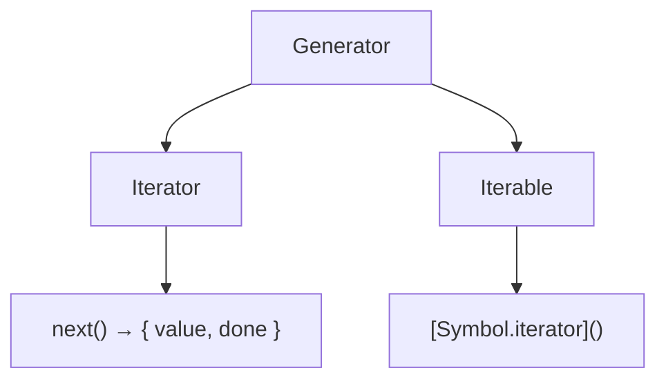
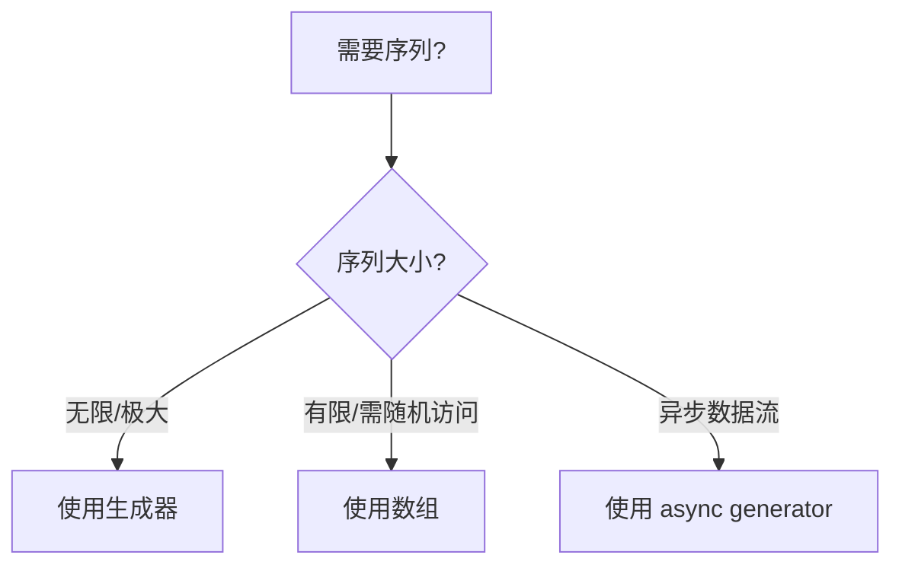

# 生成器与迭代器控制（Generators & Iterator Control）

> **形式化定义**：生成器（Generator）是 ECMAScript 2015（ES6）引入的特殊函数类型，通过 `function*` 声明，内部使用 `yield` 暂停执行并返回迭代值，通过 `next()` 恢复执行。生成器实现了**协程（Coroutine）**的半对称模型，允许函数在保持局部状态的情况下多次进入和退出。ECMA-262 §27.3 定义了 GeneratorFunction 的语义，§7.4 定义了迭代协议。
>
> 对齐版本：ECMAScript 2025 (ES16) §27.3 | TypeScript 5.8–6.0

---

## 1. 概念定义 (Concept Definition)

### 1.1 形式化定义

ECMA-262 §27.3 定义了生成器的语义：

> *"A Generator is an instance of a generator function and conforms to both the Iterator and Iterable interfaces."*

生成器的状态机模型：

```
Generator States: { suspendedStart, suspendedYield, executing, completed }
Transitions:
  suspendedStart --next()--> executing --yield--> suspendedYield
  suspendedYield --next()--> executing --return/throw--> completed
```

### 1.2 概念层级图谱

```mermaid
mindmap
  root((生成器与迭代器))
    生成器
      function*
      yield / yield*
      next() / return() / throw()
    迭代器协议
      Symbol.iterator
      { next, return, throw }
    异步生成器
      async function*
      for await...of
    应用场景
      惰性序列
      状态机
      数据流
      协程
```

---

## 2. 属性与特征 (Properties & Characteristics)

### 2.1 生成器属性矩阵

| 特性 | 同步生成器 | 异步生成器 |
|------|-----------|-----------|
| 声明 | `function*` | `async function*` |
| yield | `yield` | `yield` / `yield await` |
| 返回值 | `{ value, done }` | `Promise<{ value, done }>` |
| 消费方式 | `for...of` | `for await...of` |
| 错误处理 | `generator.throw()` | `generator.throw()` + Promise reject |

### 2.2 yield 表达式类型

| 形式 | 语义 | 示例 |
|------|------|------|
| `yield x` | 产出值 x | `yield 1` |
| `yield* iterable` | 委托迭代 | `yield* [1, 2, 3]` |
| `x = yield` | 接收外部值 | `const val = yield` |

---

## 3. 关系分析 (Relationship Analysis)

### 3.1 生成器与迭代器的关系



---

## 4. 机制解释 (Mechanism Explanation)

### 4.1 生成器的执行流程

```mermaid
flowchart TD
    A[调用 generator.next()] --> B[恢复执行]
    B --> C[执行到 yield]
    C --> D[返回 { value, done: false }]
    D --> E[状态: suspendedYield]
    E --> A
    C --> F[执行到 return/结束]
    F --> G[返回 { value, done: true }]
```

### 4.2 双向通信

```javascript
function* bidirectional() {
  const received = yield "first"; // 产出 "first"，接收外部值
  yield `received: ${received}`;
}

const gen = bidirectional();
console.log(gen.next());           // { value: "first", done: false }
console.log(gen.next("hello"));    // { value: "received: hello", done: false }
```

---

## 5. 论证与分析 (Argumentation & Analysis)

### 5.1 生成器 vs 数组

| 维度 | 生成器 | 数组 |
|------|--------|------|
| 内存占用 | O(1)（按需生成） | O(n)（全部存储） |
| 无限序列 | ✅ | ❌ |
| 随机访问 | ❌ | ✅ |
| 多次遍历 | 需重新创建 | ✅ |
| 延迟计算 | ✅ | ❌ |

---

## 6. 实例与示例 (Examples)

### 6.1 正例：无限 Fibonacci 序列

```javascript
function* fibonacci() {
  let [a, b] = [0, 1];
  while (true) {
    yield a;
    [a, b] = [b, a + b];
  }
}

const fib = fibonacci();
for (let i = 0; i < 10; i++) {
  console.log(fib.next().value);
}
```

### 6.2 正例：异步生成器

```javascript
async function* fetchPages(url) {
  let nextUrl = url;
  while (nextUrl) {
    const response = await fetch(nextUrl);
    const data = await response.json();
    yield data.results;
    nextUrl = data.next;
  }
}

for await (const page of fetchPages("/api/items")) {
  console.log(page);
}
```

### 6.3 正例：手动实现迭代器协议

```javascript
// 不依赖 function*，手动实现可迭代对象
class Range {
  constructor(start, end) {
    this.start = start;
    this.end = end;
  }

  [Symbol.iterator]() {
    let current = this.start;
    const last = this.end;
    return {
      next() {
        if (current <= last) {
          return { value: current++, done: false };
        }
        return { done: true };
      },
      return() {
        console.log('Iterator early return');
        return { done: true };
      }
    };
  }
}

const range = new Range(1, 3);
for (const n of range) {
  console.log(n); // 1, 2, 3
}
```

### 6.4 正例：生成器组合与 yield* 委托

```javascript
function* inner() {
  yield 2;
  yield 3;
}

function* outer() {
  yield 1;
  yield* inner();    // 委托给 inner 生成器
  yield 4;
  yield* [5, 6];     // 委托给数组的默认迭代器
}

console.log([...outer()]); // [1, 2, 3, 4, 5, 6]
```

### 6.5 正例：生成器作为状态机

```javascript
function* trafficLight() {
  while (true) {
    yield { state: 'green', duration: 5000 };
    yield { state: 'yellow', duration: 2000 };
    yield { state: 'red', duration: 5000 };
  }
}

const light = trafficLight();
console.log(light.next().value); // { state: 'green', duration: 5000 }
console.log(light.next().value); // { state: 'yellow', duration: 2000 }
```

### 6.6 正例：生成器 return() 与 throw() 方法

```javascript
function* withCleanup() {
  try {
    yield 'step 1';
    yield 'step 2';
    yield 'step 3';
  } finally {
    console.log('Cleanup executed');
  }
}

const gen2 = withCleanup();
console.log(gen2.next());          // { value: 'step 1', done: false }
console.log(gen2.return('early')); // { value: 'early', done: true }, 触发 finally

const gen3 = withCleanup();
console.log(gen3.next());          // { value: 'step 1', done: false }
try {
  gen3.throw(new Error('Boom'));   // 在 yield 处抛出异常
} catch (e) {
  console.log(e.message);          // 'Boom'
}
```

### 6.7 正例：递归树遍历生成器

```javascript
const tree = {
  value: 1,
  children: [
    { value: 2, children: [{ value: 4, children: [] }] },
    { value: 3, children: [{ value: 5, children: [] }] }
  ]
};

function* traverse(node) {
  yield node.value;
  for (const child of node.children) {
    yield* traverse(child);
  }
}

console.log([...traverse(tree)]); // [1, 2, 4, 3, 5]
```

---

## 7. 权威参考与国际化对齐 (References)

- **ECMA-262 §27.3** — Generator Objects: <https://tc39.es/ecma262/#sec-generator-objects>
- **ECMA-262 §7.4** — Operations on Iterator Objects: <https://tc39.es/ecma262/#sec-operations-on-iterator-objects>
- **MDN: function*** — <https://developer.mozilla.org/en-US/docs/Web/JavaScript/Reference/Statements/function*>
- **MDN: Iteration protocols** — <https://developer.mozilla.org/en-US/docs/Web/JavaScript/Reference/Iteration_protocols>
- **MDN: yield** — <https://developer.mozilla.org/en-US/docs/Web/JavaScript/Reference/Operators/yield>
- **MDN: yield*** — <https://developer.mozilla.org/en-US/docs/Web/JavaScript/Reference/Operators/yield*>
- **MDN: AsyncGenerator** — <https://developer.mozilla.org/en-US/docs/Web/JavaScript/Reference/Global_Objects/AsyncGenerator>
- **V8 Blog: Understanding Generators** — <https://v8.dev/blog/tags/generators>
- **JavaScript.info: Generators** — <https://javascript.info/generators>
- **TC39 Proposal: Async Iteration** — <https://github.com/tc39/proposal-async-iteration>
- **V8 Blog: Faster async generators and iterators** — <https://v8.dev/blog/fast-async-iteration>
- **MDN: for await...of** — <https://developer.mozilla.org/en-US/docs/Web/JavaScript/Reference/Statements/for-await...of>
- **JavaScript Engines: Iterator internals** — <https://v8.dev/blog/tags/iterators>

---

## 8. 思维表征总结 (Cognitive Representations)

### 8.1 生成器使用决策树



---

## 9. 公理化表述与形式证明 (Axiomatization & Formal Proof)

### 9.1 公理化基础

**公理 1（生成器的暂停性）**：
> `yield x` 暂停生成器执行，保存完整词法环境，返回 `x`。

**公理 2（next 的恢复性）**：
> `generator.next(v)` 恢复生成器执行，`v` 作为上一个 `yield` 表达式的返回值。

### 9.2 定理与证明

**定理 1（生成器的迭代器完备性）**：
> 每个生成器对象同时实现 Iterator 和 Iterable 接口。

*证明*：
> 生成器对象具有 `next()` 方法（Iterator）。
> 生成器对象的 `[Symbol.iterator]` 返回自身（Iterable）。
> ∎

---

## 10. 推理链与演绎分析 (Deductive Reasoning Chain)

### 10.1 演绎推理

```mermaid
graph TD
    A[function* gen()] --> B[调用 gen()]
    B --> C[创建 Generator 对象]
    C --> D[状态: suspendedStart]
    D --> E[next()]
    E --> F[执行到 yield]
    F --> G[状态: suspendedYield]
    G --> H[返回 { value, done }]
```

### 10.2 反事实推理

> **反设**：ES6 没有引入生成器。
> **推演结果**：异步编程只能通过回调和 Promise；协程模式无法实现；无限序列需用闭包模拟。
> **结论**：生成器是 JavaScript 从回调地狱走向 async/await 的关键中间层。

---

**参考规范**：ECMA-262 §27.3 | MDN: Generators
