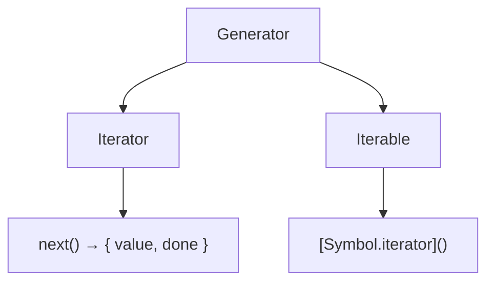
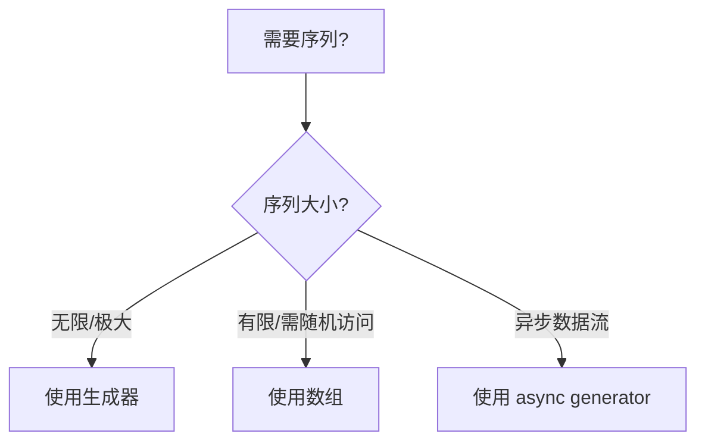
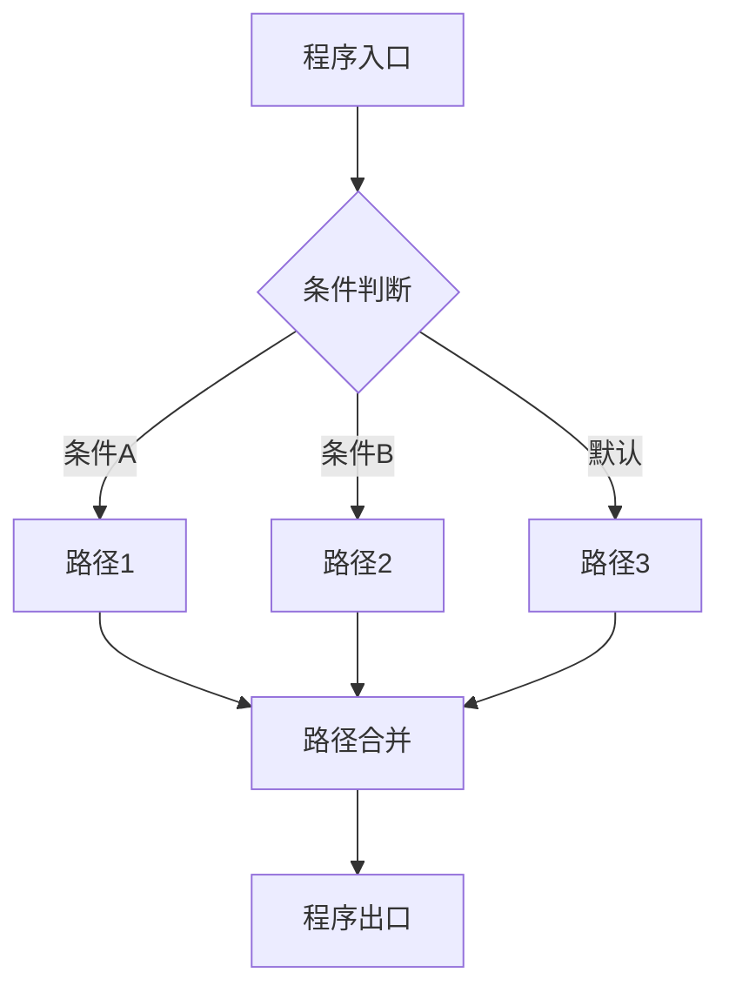

# 生成器与迭代器控制（Generators & Iterator Control）

> **形式化定义**：生成器（Generator）是 ECMAScript 2015（ES6）引入的特殊函数类型，通过 `function*` 声明，内部使用 `yield` 暂停执行并返回迭代值，通过 `next()` 恢复执行。生成器实现了**协程（Coroutine）**的半对称模型，允许函数在保持局部状态的情况下多次进入和退出。ECMA-262 §27.3 定义了 GeneratorFunction 的语义，§7.4 定义了迭代协议。
>
> 对齐版本：ECMAScript 2025 (ES16) §27.3 | TypeScript 5.8–6.0

---

## 1. 概念定义 (Concept Definition)

### 1.1 形式化定义

ECMA-262 §27.3 定义了生成器的语义：

> *"A Generator is an instance of a generator function and conforms to both the Iterator and Iterable interfaces."*

生成器的状态机模型：

```
Generator States: { suspendedStart, suspendedYield, executing, completed }
Transitions:
  suspendedStart --next()--> executing --yield--> suspendedYield
  suspendedYield --next()--> executing --return/throw--> completed
```

### 1.2 概念层级图谱

```mermaid
mindmap
  root((生成器与迭代器))
    生成器
      function*
      yield / yield*
      next() / return() / throw()
    迭代器协议
      Symbol.iterator
      { next, return, throw }
    异步生成器
      async function*
      for await...of
    应用场景
      惰性序列
      状态机
      数据流
      协程
```

---

## 2. 属性与特征 (Properties & Characteristics)

### 2.1 生成器属性矩阵

| 特性 | 同步生成器 | 异步生成器 |
|------|-----------|-----------|
| 声明 | `function*` | `async function*` |
| yield | `yield` | `yield` / `yield await` |
| 返回值 | `{ value, done }` | `Promise<{ value, done }>` |
| 消费方式 | `for...of` | `for await...of` |
| 错误处理 | `generator.throw()` | `generator.throw()` + Promise reject |

### 2.2 yield 表达式类型

| 形式 | 语义 | 示例 |
|------|------|------|
| `yield x` | 产出值 x | `yield 1` |
| `yield* iterable` | 委托迭代 | `yield* [1, 2, 3]` |
| `x = yield` | 接收外部值 | `const val = yield` |

---

## 3. 关系分析 (Relationship Analysis)

### 3.1 生成器与迭代器的关系



---

## 4. 机制解释 (Mechanism Explanation)

### 4.1 生成器的执行流程

```mermaid
flowchart TD
    A[调用 generator.next()] --> B[恢复执行]
    B --> C[执行到 yield]
    C --> D[返回 { value, done: false }]
    D --> E[状态: suspendedYield]
    E --> A
    C --> F[执行到 return/结束]
    F --> G[返回 { value, done: true }]
```

### 4.2 双向通信

```javascript
function* bidirectional() {
  const received = yield "first"; // 产出 "first"，接收外部值
  yield `received: ${received}`;
}

const gen = bidirectional();
console.log(gen.next());           // { value: "first", done: false }
console.log(gen.next("hello"));    // { value: "received: hello", done: false }
```

---

## 5. 论证与分析 (Argumentation & Analysis)

### 5.1 生成器 vs 数组

| 维度 | 生成器 | 数组 |
|------|--------|------|
| 内存占用 | O(1)（按需生成） | O(n)（全部存储） |
| 无限序列 | ✅ | ❌ |
| 随机访问 | ❌ | ✅ |
| 多次遍历 | 需重新创建 | ✅ |
| 延迟计算 | ✅ | ❌ |

---

## 6. 实例与示例 (Examples)

### 6.1 正例：无限 Fibonacci 序列

```javascript
function* fibonacci() {
  let [a, b] = [0, 1];
  while (true) {
    yield a;
    [a, b] = [b, a + b];
  }
}

const fib = fibonacci();
for (let i = 0; i < 10; i++) {
  console.log(fib.next().value);
}
```

### 6.2 正例：异步生成器

```javascript
async function* fetchPages(url) {
  let nextUrl = url;
  while (nextUrl) {
    const response = await fetch(nextUrl);
    const data = await response.json();
    yield data.results;
    nextUrl = data.next;
  }
}

for await (const page of fetchPages("/api/items")) {
  console.log(page);
}
```

---

## 7. 权威参考与国际化对齐 (References)

- **ECMA-262 §27.3** — Generator Objects
- **ECMA-262 §7.4** — Operations on Iterator Objects
- **MDN: function***— <https://developer.mozilla.org/en-US/docs/Web/JavaScript/Reference/Statements/function>*
- **MDN: Iteration protocols** — <https://developer.mozilla.org/en-US/docs/Web/JavaScript/Reference/Iteration_protocols>

---

## 8. 思维表征总结 (Cognitive Representations)

### 8.1 生成器使用决策树



---

## 9. 公理化表述与形式证明 (Axiomatization & Formal Proof)

### 9.1 公理化基础

**公理 1（生成器的暂停性）**：
> `yield x` 暂停生成器执行，保存完整词法环境，返回 `x`。

**公理 2（next 的恢复性）**：
> `generator.next(v)` 恢复生成器执行，`v` 作为上一个 `yield` 表达式的返回值。

### 9.2 定理与证明

**定理 1（生成器的迭代器完备性）**：
> 每个生成器对象同时实现 Iterator 和 Iterable 接口。

*证明*：
> 生成器对象具有 `next()` 方法（Iterator）。
> 生成器对象的 `[Symbol.iterator]` 返回自身（Iterable）。
> ∎

---

## 10. 推理链与演绎分析 (Deductive Reasoning Chain)

### 10.1 演绎推理

```mermaid
graph TD
    A[function* gen()] --> B[调用 gen()]
    B --> C[创建 Generator 对象]
    C --> D[状态: suspendedStart]
    D --> E[next()]
    E --> F[执行到 yield]
    F --> G[状态: suspendedYield]
    G --> H[返回 { value, done }]
```

### 10.2 反事实推理

> **反设**：ES6 没有引入生成器。
> **推演结果**：异步编程只能通过回调和 Promise；协程模式无法实现；无限序列需用闭包模拟。
> **结论**：生成器是 JavaScript 从回调地狱走向 async/await 的关键中间层。

---

**参考规范**：ECMA-262 §27.3 | MDN: Generators


---

## 9. 公理化表述与形式证明 (Axiomatization & Formal Proof)

### 9.1 公理化基础

**公理 1（控制流完备性）**：
> 任何程序的控制流可通过顺序、分支、循环三种基本结构组合实现（Bohm-Jacopini 定理）。

**公理 2（短路求值的最小计算）**：
> 逻辑运算符在满足结果确定性的前提下，求值最少的操作数。

**公理 3（异常传播的确定性）**：
> 异常一旦抛出，沿调用栈向上传播，直到被捕获或到达全局上下文。

### 9.2 定理与证明

**定理 1（条件分支的互斥性）**：
> 在 `if...else if...else` 链中，至多一个分支被执行。

*证明*：
> ECMA-262 规定条件分支按顺序求值，首个 truthy 条件对应的分支执行后，跳过后续所有分支。
> ∎

**定理 2（finally 的执行保证）**：
> `finally` 块中的代码无论 `try` 块如何完成（正常、return、throw），都会执行。

*证明*：
> ECMA-262 §13.15.8 规定 finally 块的完成记录优先级高于 try/catch。
> ∎

**定理 3（循环终止的必要条件）**：
> `for`、`while`、`do...while` 循环终止的必要条件是循环体内存在使循环条件最终为 falsy 的操作。

*证明*：
> 若循环条件永真且循环体内无 break/return/throw，根据 ECMA-262 §14.7，循环将无限执行。
> ∎

### 9.3 真值表：控制流运算符行为

| a | b | a && b | a || b | a ?? b | !a |
|---|---|--------|--------|--------|-----|
| true | true | true | true | true | false |
| true | false | false | true | true | false |
| false | true | false | true | false | true |
| false | false | false | false | false | true |
| null | any | null | any | any | true |
| undefined | any | undefined | any | any | true |
| 0 | "d" | "d" | 0 | 0 | true |
| "" | "d" | "d" | "" | "" | true |

---

## 10. 推理链与演绎分析 (Deductive Reasoning Chain)

### 10.1 演绎推理：从代码结构到执行路径



### 10.2 归纳推理：从运行时行为推导控制流问题

| 现象 | 可能原因 | 解决方案 |
|------|---------|---------|
| 意外执行分支 | 条件判断逻辑错误 | 审查布尔表达式 |
| 无限循环 | 循环条件永真 | 检查终止条件 |
| 跳过预期代码 | 提前 return/continue | 检查控制流语句 |
| 资源未释放 | 异常中断流程 | 使用 try...finally 或 using |
| 异步操作未等待 | 缺少 await | 添加 await 或 Promise 链 |

### 10.3 反事实推理

> **反设**：ECMAScript 不支持任何控制流语句（if/switch/loop/try）。
>
> **推演结果**：
>
> 1. 所有程序只能顺序执行，无法根据条件选择路径
> 2. 重复操作必须通过递归实现，存在栈溢出风险
> 3. 错误处理无法分离正常逻辑与异常逻辑
> 4. 图灵完备性仍可通过函数调用和递归保持，但表达力大幅下降
>
> **结论**：控制流语句是结构化编程的基石，提供了表达复杂算法的基本构件。

---

## 11. 形式语义说明

### 11.1 操作语义

操作语义（Operational Semantics）描述了语句如何改变程序状态：

```
(if (C) S₁ else S₂, σ) → (S₁, σ)  if eval(C, σ) = true
(if (C) S₁ else S₂, σ) → (S₂, σ)  if eval(C, σ) = false
```

其中 σ 表示程序状态（变量绑定集合）。

### 11.2 指称语义

指称语义（Denotational Semantics）将语句映射为数学函数：

```
[[if (C) S₁ else S₂]](σ) =
  [[S₁]](σ)  if [[C]](σ) = true
  [[S₂]](σ)  if [[C]](σ) = false
```

---

## 12. 性能与最佳实践

### 12.1 性能考量

| 结构 | 时间复杂度 | 空间复杂度 | 备注 |
|------|-----------|-----------|------|
| if...else | O(1) | O(1) | 条件求值 |
| switch | O(n) 最坏 | O(1) | n = case 数量 |
| try...catch | 无异常时 O(1) | O(1) | 有异常时开销大 |
| for 循环 | O(迭代次数) | O(1) | 取决于循环体 |
| Promise.then | O(1) | O(1) | 微任务队列调度 |
| async/await | O(1) | O(1) | 生成器状态机开销 |

### 12.2 最佳实践总结

```javascript
// ✅ 优先使用严格相等
if (x === 5) { /* ... */ }

// ✅ 使用 switch 进行离散值匹配
switch (status) {
  case "active": /* ... */ break;
  case "inactive": /* ... */ break;
  default: /* ... */;
}

// ✅ 使用 ?? 而非 || 进行默认值赋值
const port = config.port ?? 3000;

// ✅ 使用可选链进行安全访问
const name = user?.profile?.name;

// ✅ 使用 using 管理资源
using file = await openFile(path);

// ✅ 并行异步操作使用 Promise.all
const [a, b] = await Promise.all([fetchA(), fetchB()]);

// ✅ 生成器实现惰性序列
function* range(n) { for (let i = 0; i < n; i++) yield i; }
```

---

## 13. 思维模型总结

### 13.1 控制流选择速查矩阵

| 需求 | 推荐结构 | 替代方案 |
|------|---------|---------|
| 布尔条件分支 | if...else | 三元运算符 ?: |
| 离散值匹配 | switch | 对象映射表 |
| 计数循环 | for | while |
| 条件循环 | while / do...while | for (;;) |
| 遍历可迭代对象 | for...of | Array.forEach |
| 遍历对象属性 | for...in + hasOwn | Object.keys |
| 错误处理 | try...catch...finally | Promise.catch |
| 资源管理 | using / await using | try...finally |
| 默认值赋值 | ?? | ||（仅布尔场景）|
| 安全深层访问 | ?. | && 链 |
| 异步顺序执行 | await | Promise.then 链 |
| 异步并行执行 | Promise.all | Promise.race |
| 惰性序列 | function* | 闭包 |
| 异步数据流 | async function* | 事件流 |

---

## 14. 权威参考完整列表

| 来源 | 链接 | 相关章节 |
|------|------|---------|
| ECMA-262 | tc39.es/ecma262 | §13-14 |
| TypeScript Handbook | typescriptlang.org/docs | Control Flow Analysis |
| MDN: Control flow | developer.mozilla.org | Statements |
| MDN: Loops | developer.mozilla.org | Loops_and_iteration |
| MDN: Exception | developer.mozilla.org | try...catch |

---

**参考规范**：ECMA-262 §13-14 | MDN: Control flow | TypeScript Handbook
