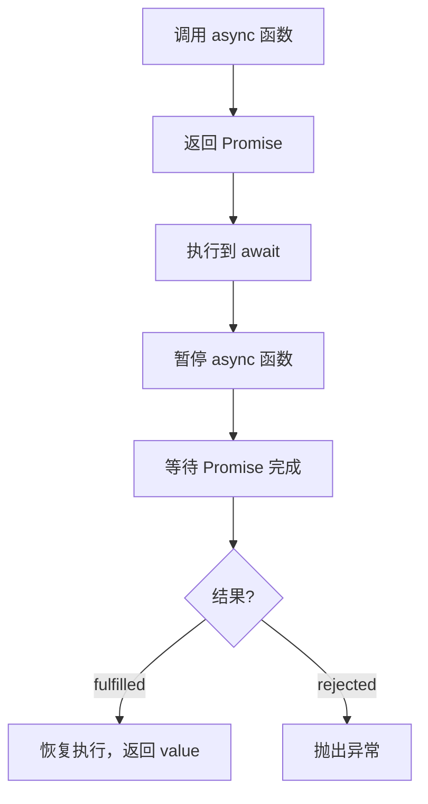
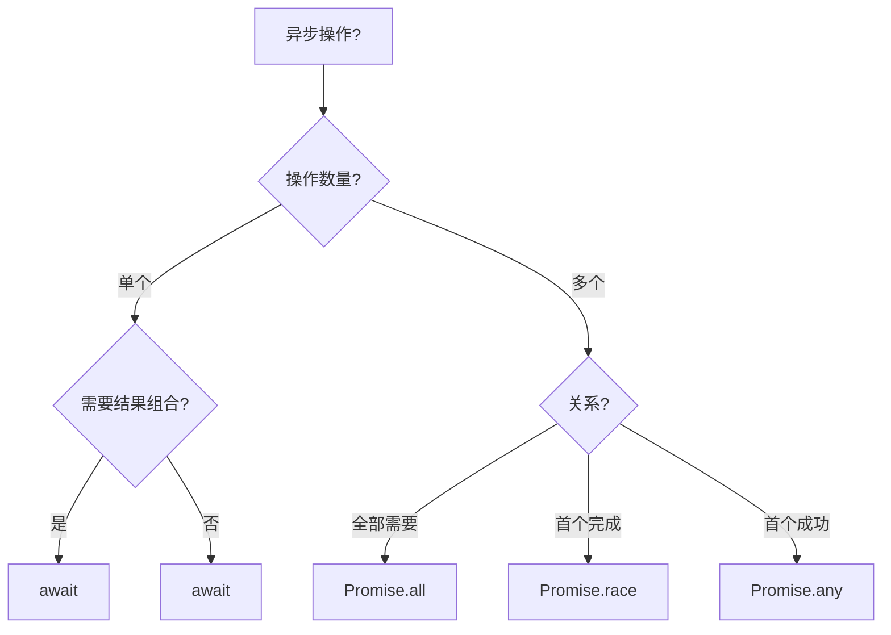
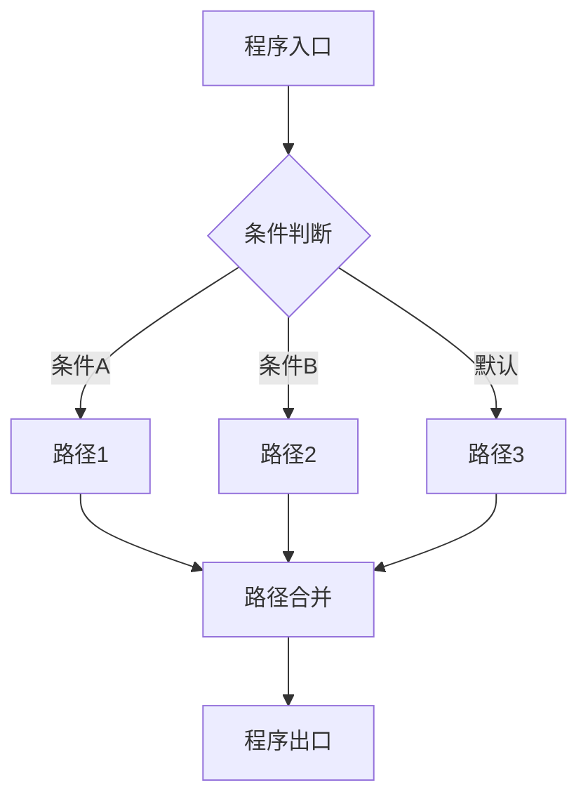

# 异步控制流（Async Control Flow）

> **形式化定义**：异步控制流是 ECMAScript 中处理非阻塞操作的控制流机制，核心基于 **Promise**（ES2015）和 **async/await**（ES2017）语法糖。Promise 是**单子（Monad）**的 JavaScript 实现，提供 `then/catch/finally` 链式接口。async/await 通过生成器和 Promise 的语法转换，将异步代码编写为看似同步的形式。ECMA-262 §27.2 定义了 Promise 的语义，§15.8 定义了 async 函数的语义。
>
> 对齐版本：ECMAScript 2025 (ES16) §27.2 | TypeScript 5.8–6.0

---

## 1. 概念定义 (Concept Definition)

### 1.1 形式化定义

ECMA-262 §27.2 定义了 Promise：

> *"A Promise is an object that is used as a placeholder for the eventual results of a deferred (and possibly asynchronous) computation."*

Promise 状态机：

```
Promise States: { pending, fulfilled, rejected }
Transitions:
  pending --resolve(v)--> fulfilled(v)
  pending --reject(e)--> rejected(e)
  fulfilled / rejected --(terminal)--
```

### 1.2 概念层级图谱

```mermaid
mindmap
  root((异步控制流))
    Promise
      状态机: pending/fulfilled/rejected
      then/catch/finally
      Promise.all/race/allSettled/any
    Async/Await
      async function
      await 表达式
      语法糖转换
    底层机制
      微任务队列 Microtask
      事件循环 Event Loop
      调用栈 Call Stack
    错误处理
      try/catch + await
      .catch()
      unhandledrejection
```

---

## 2. 属性与特征 (Properties & Characteristics)

### 2.1 Promise 属性矩阵

| 特性 | Promise | Callback | async/await |
|------|---------|----------|-------------|
| 组合性 | ✅ 链式 | ❌ 回调地狱 | ✅ 顺序写法 |
| 错误处理 | `.catch()` | 手动传递 | `try/catch` |
| 同步写法 | ❌ | ❌ | ✅ |
| 调试友好度 | 中等 | 差 | 好 |
| 性能 | 微任务开销 | 最小 | 微任务开销 |

### 2.2 Promise 静态方法

| 方法 | 语义 | 失败行为 |
|------|------|---------|
| `Promise.all` | 全部成功 | 首个 reject |
| `Promise.race` | 首个完成 | 首个 reject |
| `Promise.allSettled` | 全部完成 | 永不 reject |
| `Promise.any` | 首个成功 | AggregateError |

---

## 3. 关系分析 (Relationship Analysis)

### 3.1 async/await 与 Promise 的关系

```javascript
// async/await
async function getData() {
  const user = await fetchUser();
  const posts = await fetchPosts(user.id);
  return posts;
}

// 等效 Promise 链
function getData() {
  return fetchUser()
    .then(user => fetchPosts(user.id));
}
```

---

## 4. 机制解释 (Mechanism Explanation)

### 4.1 async/await 的执行流程



### 4.2 Promise 微任务调度

```javascript
console.log("1");
Promise.resolve().then(() => console.log("2"));
console.log("3");

// 输出: 1, 3, 2
// Promise.then 放入微任务队列，在当前调用栈清空后执行
```

---

## 5. 论证与分析 (Argumentation & Analysis)

### 5.1 async/await vs Promise 链

| 场景 | 推荐 | 原因 |
|------|------|------|
| 顺序异步操作 | async/await | 可读性高 |
| 并行异步操作 | Promise.all | 语义明确 |
| 竞速场景 | Promise.race | 语义明确 |
| 简单链式 | Promise.then | 更简洁 |

### 5.2 常见误区

**误区 1**：忘记 await

```javascript
// ❌ 忘记 await
async function bad() {
  const user = fetchUser(); // 返回 Promise，不是 User！
  console.log(user.name);   // undefined
}

// ✅ 正确 await
async function good() {
  const user = await fetchUser();
  console.log(user.name);
}
```

**误区 2**：并行 await

```javascript
// ❌ 串行执行
const a = await fetchA();
const b = await fetchB();

// ✅ 并行执行
const [a, b] = await Promise.all([fetchA(), fetchB()]);
```

---

## 6. 实例与示例 (Examples)

### 6.1 正例：错误处理模式

```javascript
async function robustFetch() {
  try {
    const response = await fetch("/api/data");
    if (!response.ok) {
      throw new Error(`HTTP ${response.status}`);
    }
    return await response.json();
  } catch (error) {
    console.error("Fetch failed:", error);
    return null;
  }
}
```

### 6.2 正例：并行控制

```javascript
async function loadDashboard() {
  const [user, posts, notifications] = await Promise.all([
    fetchUser(),
    fetchPosts(),
    fetchNotifications()
  ]);
  return { user, posts, notifications };
}
```

---

## 7. 权威参考与国际化对齐 (References)

- **ECMA-262 §27.2** — Promise Objects
- **ECMA-262 §15.8** — Async Function Definitions
- **MDN: Promise** — <https://developer.mozilla.org/en-US/docs/Web/JavaScript/Reference/Global_Objects/Promise>
- **MDN: async function** — <https://developer.mozilla.org/en-US/docs/Web/JavaScript/Reference/Statements/async_function>

---

## 8. 思维表征总结 (Cognitive Representations)

### 8.1 异步模式选择决策树



---

## 9. 公理化表述与形式证明 (Axiomatization & Formal Proof)

### 9.1 公理化基础

**公理 1（Promise 的不可变性）**：
> Promise 一旦 settled（fulfilled 或 rejected），状态不可改变。

**公理 2（async 函数的 Promise 返回）**：
> 所有 async 函数隐式返回 Promise，return 值被包装为 fulfilled Promise。

### 9.2 定理与证明

**定理 1（await 的展开等价性）**：
> `const v = await p;` 语义等价于 `p.then(v => /* 后续代码 */)`。

*证明*：
> ECMA-262 §15.8 规定 async 函数在遇到 await 时暂停，将后续代码注册为 Promise 的 then 回调。
> ∎

### 9.3 真值表：Promise 状态转换

| 初始状态 | 操作 | 结果状态 | 说明 |
|---------|------|---------|------|
| pending | resolve(v) | fulfilled(v) | 成功 |
| pending | reject(e) | rejected(e) | 失败 |
| fulfilled | resolve/reject | 不变 | 已确定 |
| rejected | resolve/reject | 不变 | 已确定 |

---

## 10. 推理链与演绎分析 (Deductive Reasoning Chain)

### 10.1 演绎推理

```mermaid
graph TD
    A[async function f()] --> B[调用 f()]
    B --> C[返回 Promise]
    C --> D[执行函数体]
    D --> E[await promise]
    E --> F[暂停，注册回调]
    F --> G[Promise 完成]
    G --> H[恢复执行]
```

### 10.2 反事实推理

> **反设**：ES2017 没有引入 async/await。
> **推演结果**：异步代码必须使用 Promise.then 链或回调，深层嵌套可读性差，错误处理分散。
> **结论**：async/await 是 JavaScript 异步编程的语法革命，使异步代码的编写和调试接近同步体验。

---

**参考规范**：ECMA-262 §27.2 | MDN: Promise / async function


---

## 9. 公理化表述与形式证明 (Axiomatization & Formal Proof)

### 9.1 公理化基础

**公理 1（控制流完备性）**：
> 任何程序的控制流可通过顺序、分支、循环三种基本结构组合实现（Bohm-Jacopini 定理）。

**公理 2（短路求值的最小计算）**：
> 逻辑运算符在满足结果确定性的前提下，求值最少的操作数。

**公理 3（异常传播的确定性）**：
> 异常一旦抛出，沿调用栈向上传播，直到被捕获或到达全局上下文。

### 9.2 定理与证明

**定理 1（条件分支的互斥性）**：
> 在 `if...else if...else` 链中，至多一个分支被执行。

*证明*：
> ECMA-262 规定条件分支按顺序求值，首个 truthy 条件对应的分支执行后，跳过后续所有分支。
> ∎

**定理 2（finally 的执行保证）**：
> `finally` 块中的代码无论 `try` 块如何完成（正常、return、throw），都会执行。

*证明*：
> ECMA-262 §13.15.8 规定 finally 块的完成记录优先级高于 try/catch。
> ∎

**定理 3（循环终止的必要条件）**：
> `for`、`while`、`do...while` 循环终止的必要条件是循环体内存在使循环条件最终为 falsy 的操作。

*证明*：
> 若循环条件永真且循环体内无 break/return/throw，根据 ECMA-262 §14.7，循环将无限执行。
> ∎

### 9.3 真值表：控制流运算符行为

| a | b | a && b | a || b | a ?? b | !a |
|---|---|--------|--------|--------|-----|
| true | true | true | true | true | false |
| true | false | false | true | true | false |
| false | true | false | true | false | true |
| false | false | false | false | false | true |
| null | any | null | any | any | true |
| undefined | any | undefined | any | any | true |
| 0 | "d" | "d" | 0 | 0 | true |
| "" | "d" | "d" | "" | "" | true |

---

## 10. 推理链与演绎分析 (Deductive Reasoning Chain)

### 10.1 演绎推理：从代码结构到执行路径



### 10.2 归纳推理：从运行时行为推导控制流问题

| 现象 | 可能原因 | 解决方案 |
|------|---------|---------|
| 意外执行分支 | 条件判断逻辑错误 | 审查布尔表达式 |
| 无限循环 | 循环条件永真 | 检查终止条件 |
| 跳过预期代码 | 提前 return/continue | 检查控制流语句 |
| 资源未释放 | 异常中断流程 | 使用 try...finally 或 using |
| 异步操作未等待 | 缺少 await | 添加 await 或 Promise 链 |

### 10.3 反事实推理

> **反设**：ECMAScript 不支持任何控制流语句（if/switch/loop/try）。
>
> **推演结果**：
>
> 1. 所有程序只能顺序执行，无法根据条件选择路径
> 2. 重复操作必须通过递归实现，存在栈溢出风险
> 3. 错误处理无法分离正常逻辑与异常逻辑
> 4. 图灵完备性仍可通过函数调用和递归保持，但表达力大幅下降
>
> **结论**：控制流语句是结构化编程的基石，提供了表达复杂算法的基本构件。

---

## 11. 形式语义说明

### 11.1 操作语义

操作语义（Operational Semantics）描述了语句如何改变程序状态：

```
(if (C) S₁ else S₂, σ) → (S₁, σ)  if eval(C, σ) = true
(if (C) S₁ else S₂, σ) → (S₂, σ)  if eval(C, σ) = false
```

其中 σ 表示程序状态（变量绑定集合）。

### 11.2 指称语义

指称语义（Denotational Semantics）将语句映射为数学函数：

```
[[if (C) S₁ else S₂]](σ) =
  [[S₁]](σ)  if [[C]](σ) = true
  [[S₂]](σ)  if [[C]](σ) = false
```

---

## 12. 性能与最佳实践

### 12.1 性能考量

| 结构 | 时间复杂度 | 空间复杂度 | 备注 |
|------|-----------|-----------|------|
| if...else | O(1) | O(1) | 条件求值 |
| switch | O(n) 最坏 | O(1) | n = case 数量 |
| try...catch | 无异常时 O(1) | O(1) | 有异常时开销大 |
| for 循环 | O(迭代次数) | O(1) | 取决于循环体 |
| Promise.then | O(1) | O(1) | 微任务队列调度 |
| async/await | O(1) | O(1) | 生成器状态机开销 |

### 12.2 最佳实践总结

```javascript
// ✅ 优先使用严格相等
if (x === 5) { /* ... */ }

// ✅ 使用 switch 进行离散值匹配
switch (status) {
  case "active": /* ... */ break;
  case "inactive": /* ... */ break;
  default: /* ... */;
}

// ✅ 使用 ?? 而非 || 进行默认值赋值
const port = config.port ?? 3000;

// ✅ 使用可选链进行安全访问
const name = user?.profile?.name;

// ✅ 使用 using 管理资源
using file = await openFile(path);

// ✅ 并行异步操作使用 Promise.all
const [a, b] = await Promise.all([fetchA(), fetchB()]);

// ✅ 生成器实现惰性序列
function* range(n) { for (let i = 0; i < n; i++) yield i; }
```

---

## 13. 思维模型总结

### 13.1 控制流选择速查矩阵

| 需求 | 推荐结构 | 替代方案 |
|------|---------|---------|
| 布尔条件分支 | if...else | 三元运算符 ?: |
| 离散值匹配 | switch | 对象映射表 |
| 计数循环 | for | while |
| 条件循环 | while / do...while | for (;;) |
| 遍历可迭代对象 | for...of | Array.forEach |
| 遍历对象属性 | for...in + hasOwn | Object.keys |
| 错误处理 | try...catch...finally | Promise.catch |
| 资源管理 | using / await using | try...finally |
| 默认值赋值 | ?? | ||（仅布尔场景）|
| 安全深层访问 | ?. | && 链 |
| 异步顺序执行 | await | Promise.then 链 |
| 异步并行执行 | Promise.all | Promise.race |
| 惰性序列 | function* | 闭包 |
| 异步数据流 | async function* | 事件流 |

---

## 14. 权威参考完整列表

| 来源 | 链接 | 相关章节 |
|------|------|---------|
| ECMA-262 | tc39.es/ecma262 | §13-14 |
| TypeScript Handbook | typescriptlang.org/docs | Control Flow Analysis |
| MDN: Control flow | developer.mozilla.org | Statements |
| MDN: Loops | developer.mozilla.org | Loops_and_iteration |
| MDN: Exception | developer.mozilla.org | try...catch |

---

**参考规范**：ECMA-262 §13-14 | MDN: Control flow | TypeScript Handbook
