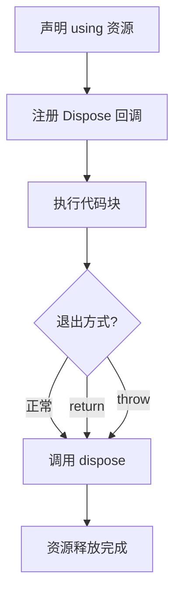
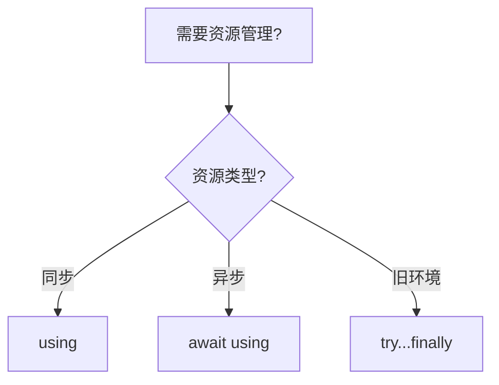

# 显式资源管理（Explicit Resource Management）

> **形式化定义**：显式资源管理（Explicit Resource Management）是 ECMAScript 2023（ES14）引入的语法特性，通过 `using` 声明和 `Symbol.dispose` / `Symbol.asyncDispose` 协议实现资源的自动释放。该特性基于 **RAII（Resource Acquisition Is Initialization）** 模式，确保在代码块退出时（无论正常、返回或异常）调用资源的清理方法。ECMA-262 §14.3 定义了 `using` 声明的语义。
>
> 对齐版本：ECMAScript 2025 (ES16) §14.3 | TypeScript 5.2+

---

## 1. 概念定义 (Concept Definition)

### 1.1 形式化定义

ECMA-262 §14.3 定义了 `using` 声明：

> *"A using declaration creates a binding and registers a disposal callback that is executed when the containing block or module is exited."*

资源管理的形式化语义：

```
using x = resource;
// 等效于:
const x = resource;
try {
  // 使用资源
} finally {
  x[Symbol.dispose]();
}
```

### 1.2 概念层级图谱

```mermaid
mindmap
  root((显式资源管理))
    using 声明
      块级资源管理
      模块级资源管理
      同步释放
    await using
      异步资源管理
      asyncDispose
    Disposable 协议
      Symbol.dispose
      Symbol.asyncDispose
      [Symbol.dispose]()
    对比
      try...finally
      C# using
      Python with
    应用场景
      文件句柄
      数据库连接
      锁
      计时器
```

---

## 2. 属性与特征 (Properties & Characteristics)

### 2.1 资源管理属性矩阵

| 特性 | `try...finally` | `using` | `await using` |
|------|----------------|---------|--------------|
| 语法冗余 | 高 | 低 | 低 |
| 异常安全 | ✅ | ✅ | ✅ |
| 提前返回安全 | 需手动 | ✅ | ✅ |
| 异步释放 | 手动 | ❌ | ✅ |
| 多资源管理 | 嵌套复杂 | 声明式 | 声明式 |
| TypeScript 支持 | ✅ | ✅ (5.2+) | ✅ (5.2+) |

---

## 3. 关系分析 (Relationship Analysis)

### 3.1 `using` 与 `try...finally` 的关系

```javascript
// try...finally
function withFile(path) {
  const file = openFile(path);
  try {
    return processFile(file);
  } finally {
    file.close();
  }
}

// using
function withFile(path) {
  using file = openFile(path);
  return processFile(file);
  // file.close() 自动调用
}
```

---

## 4. 机制解释 (Mechanism Explanation)

### 4.1 `using` 的执行流程



---

## 5. 论证与分析 (Argumentation & Analysis)

### 5.1 使用场景

| 场景 | 推荐 | 原因 |
|------|------|------|
| 文件句柄 | `using` | 确保关闭 |
| 数据库连接 | `await using` | 异步关闭 |
| 临时目录 | `using` | 自动清理 |
| 锁 | `using` | 确保释放 |

---

## 6. 实例与示例 (Examples)

### 6.1 正例：文件资源管理

```javascript
function processFile(path) {
  using file = openFile(path);
  return file.readLines();
  // file.close() 自动调用
}
```

### 6.2 正例：异步资源

```javascript
async function queryDatabase() {
  await using conn = await getConnection();
  const result = await conn.query("SELECT * FROM users");
  return result;
  // conn 异步释放
}
```

---

## 7. 权威参考与国际化对齐 (References)

- **ECMA-262 §14.3** — Using Declarations
- **MDN: Explicit resource management** — <https://developer.mozilla.org/en-US/docs/Web/JavaScript/Reference/Statements/using>

---

## 8. 思维表征总结 (Cognitive Representations)

### 8.1 资源管理选择决策树



---

---

## 深化补充：高级用法与权威参考

### 多资源同时管理

```typescript
// 多个 using 声明按逆序释放
using file1 = openFile('a.txt'),
      file2 = openFile('b.txt'),
      lock = acquireLock('resource-lock');
// 执行代码...
// 释放顺序: lock → file2 → file1
```

### DisposableStack / AsyncDisposableStack

```typescript
// 管理多个动态资源
function processMany(paths: string[]) {
  const stack = new DisposableStack();
  const files = paths.map(p => {
    const f = openFile(p);
    stack.use(f); // 注册到栈
    return f;
  });
  using group = stack; // 块结束时一次性释放全部
  return files.map(f => f.readLines());
}

// 异步版本
async function processAsync(resources: AsyncDisposable[]) {
  const stack = new AsyncDisposableStack();
  for (const r of resources) {
    stack.use(await r);
  }
  await using group = stack;
  // ...
}
```

### SuppressedError

```typescript
// 当 dispose 过程中抛出异常，原异常不会丢失
function riskyResource() {
  return {
    [Symbol.dispose]() {
      throw new Error('dispose failed');
    }
  };
}

try {
  using r = riskyResource();
  throw new Error('main failed'); // 原异常
} catch (e: any) {
  // e 可能是 SuppressedError
  if (e instanceof SuppressedError) {
    console.log('Primary error:', e.error.message);      // 'main failed'
    console.log('Suppressed error:', e.suppressed.message); // 'dispose failed'
  }
}
```

### 自定义 Disposable 对象

```typescript
import { readFileSync, unlinkSync, writeFileSync } from 'node:fs';

class TempFile implements Disposable {
  #path: string;
  constructor(name: string) {
    this.#path = `/tmp/${name}`;
    writeFileSync(this.#path, '');
  }
  get path() { return this.#path; }
  [Symbol.dispose]() {
    try { unlinkSync(this.#path); } catch { /* ignore */ }
  }
}

{
  using tmp = new TempFile('data.json');
  writeFileSync(tmp.path, '{"key":"value"}');
} // 自动清理临时文件
```

### 迭代器与显式资源管理

```typescript
// 自定义可释放迭代器
class LineReader implements Disposable {
  #handle: number;
  #buffer: string[] = [];

  constructor(path: string) {
    this.#handle = openSync(path, 'r'); // 伪代码
  }

  *[Symbol.iterator]() {
    for (const line of this.#buffer) yield line;
  }

  [Symbol.dispose]() {
    closeSync(this.#handle); // 伪代码
    console.log('LineReader disposed');
  }
}

{
  using reader = new LineReader('data.txt');
  for (const line of reader) {
    console.log(line);
  }
} // 自动调用 dispose
```

### 数据库连接池的异步资源管理

```typescript
import { Pool, PoolClient } from 'pg';

const pool = new Pool({ connectionString: '...' });

async function queryUser(id: number) {
  await using client = await pool.connect();
  const result = await client.query('SELECT * FROM users WHERE id = $1', [id]);
  return result.rows[0];
  // client[Symbol.asyncDispose]() 自动释放回连接池
}
```

### 对比：Python `with` 与 C# `using`

```typescript
// Python: with open('file') as f: ...
// C#: using var f = new StreamReader("file");

// JavaScript using 声明与之等价，但支持 await using
// 关键差异：JS 的 DisposableStack 允许动态注册
const stack = new DisposableStack();
stack.defer(() => console.log('cleanup 1'));
stack.defer(() => console.log('cleanup 2'));
using group = stack;
// 输出: cleanup 2
//       cleanup 1
```

### 权威外部链接索引

| 来源 | 链接 | 说明 |
|------|------|------|
| ECMA-262 §14.3 | <https://tc39.es/ecma262/#sec-using-statement> | Using 声明规范 |
| MDN — using | <https://developer.mozilla.org/en-US/docs/Web/JavaScript/Reference/Statements/using> | 显式资源管理文档 |
| MDN — Symbol.dispose | <https://developer.mozilla.org/en-US/docs/Web/JavaScript/Reference/Global_Objects/Symbol/dispose> | dispose 符号文档 |
| MDN — SuppressedError | <https://developer.mozilla.org/en-US/docs/Web/JavaScript/Reference/Global_Objects/SuppressedError> | SuppressedError 文档 |
| TypeScript 5.2 Release Notes | <https://devblogs.microsoft.com/typescript/announcing-typescript-5-2/#using> | TS 5.2 using 支持 |
| TC39 Explicit Resource Management | <https://github.com/tc39/proposal-explicit-resource-management> | 提案仓库 |
| Node.js — Explicit Resource Management | <https://nodejs.org/docs/latest/api/globals.html#using> | Node.js 实现 |
| C# using statement | <https://learn.microsoft.com/en-us/dotnet/csharp/language-reference/statements/using> | C# using 参考 |
| Python with statement | <https://docs.python.org/3/reference/compound_stmts.html#the-with-statement> | Python with 参考 |
| Rust RAII | <https://doc.rust-lang.org/rust-by-example/scope/raii.html> | Rust RAII 参考 |
