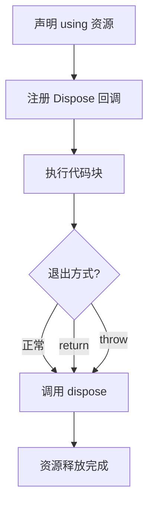
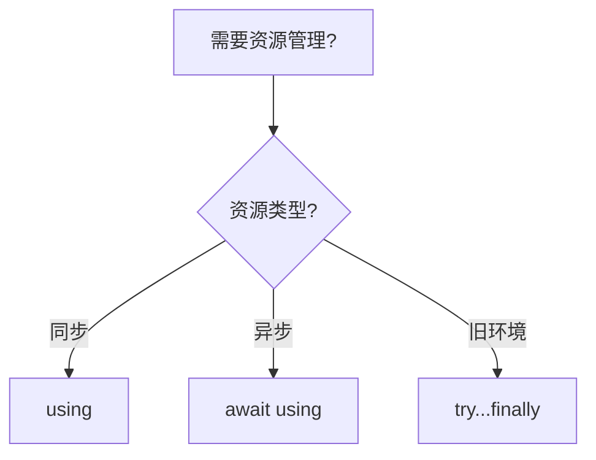
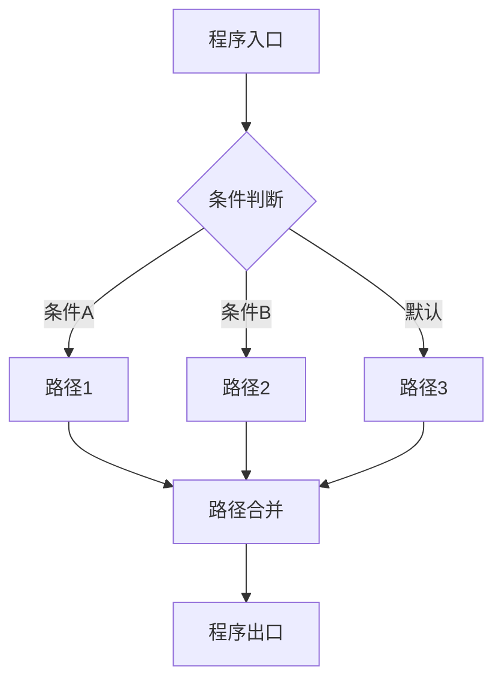

# 显式资源管理（Explicit Resource Management）

> **形式化定义**：显式资源管理（Explicit Resource Management）是 ECMAScript 2023（ES14）引入的语法特性，通过 `using` 声明和 `Symbol.dispose` / `Symbol.asyncDispose` 协议实现资源的自动释放。该特性基于 **RAII（Resource Acquisition Is Initialization）** 模式，确保在代码块退出时（无论正常、返回或异常）调用资源的清理方法。ECMA-262 §14.3 定义了 `using` 声明的语义。
>
> 对齐版本：ECMAScript 2025 (ES16) §14.3 | TypeScript 5.2+

---

## 1. 概念定义 (Concept Definition)

### 1.1 形式化定义

ECMA-262 §14.3 定义了 `using` 声明：

> *"A using declaration creates a binding and registers a disposal callback that is executed when the containing block or module is exited."*

资源管理的形式化语义：

```
using x = resource;
// 等效于:
const x = resource;
try {
  // 使用资源
} finally {
  x[Symbol.dispose]();
}
```

### 1.2 概念层级图谱

```mermaid
mindmap
  root((显式资源管理))
    using 声明
      块级资源管理
      模块级资源管理
      同步释放
    await using
      异步资源管理
      asyncDispose
    Disposable 协议
      Symbol.dispose
      Symbol.asyncDispose
      [Symbol.dispose]()
    对比
      try...finally
      C# using
      Python with
    应用场景
      文件句柄
      数据库连接
      锁
      计时器
```

---

## 2. 属性与特征 (Properties & Characteristics)

### 2.1 资源管理属性矩阵

| 特性 | `try...finally` | `using` | `await using` |
|------|----------------|---------|--------------|
| 语法冗余 | 高 | 低 | 低 |
| 异常安全 | ✅ | ✅ | ✅ |
| 提前返回安全 | 需手动 | ✅ | ✅ |
| 异步释放 | 手动 | ❌ | ✅ |
| 多资源管理 | 嵌套复杂 | 声明式 | 声明式 |
| TypeScript 支持 | ✅ | ✅ (5.2+) | ✅ (5.2+) |

---

## 3. 关系分析 (Relationship Analysis)

### 3.1 `using` 与 `try...finally` 的关系

```javascript
// try...finally
function withFile(path) {
  const file = openFile(path);
  try {
    return processFile(file);
  } finally {
    file.close();
  }
}

// using
function withFile(path) {
  using file = openFile(path);
  return processFile(file);
  // file.close() 自动调用
}
```

---

## 4. 机制解释 (Mechanism Explanation)

### 4.1 `using` 的执行流程



---

## 5. 论证与分析 (Argumentation & Analysis)

### 5.1 使用场景

| 场景 | 推荐 | 原因 |
|------|------|------|
| 文件句柄 | `using` | 确保关闭 |
| 数据库连接 | `await using` | 异步关闭 |
| 临时目录 | `using` | 自动清理 |
| 锁 | `using` | 确保释放 |

---

## 6. 实例与示例 (Examples)

### 6.1 正例：文件资源管理

```javascript
function processFile(path) {
  using file = openFile(path);
  return file.readLines();
  // file.close() 自动调用
}
```

### 6.2 正例：异步资源

```javascript
async function queryDatabase() {
  await using conn = await getConnection();
  const result = await conn.query("SELECT * FROM users");
  return result;
  // conn 异步释放
}
```

---

## 7. 权威参考与国际化对齐 (References)

- **ECMA-262 §14.3** — Using Declarations
- **MDN: Explicit resource management** — <https://developer.mozilla.org/en-US/docs/Web/JavaScript/Reference/Statements/using>

---

## 8. 思维表征总结 (Cognitive Representations)

### 8.1 资源管理选择决策树



---

## 9. 公理化表述与形式证明 (Axiomatization & Formal Proof)

### 9.1 公理化基础

**公理 1（资源释放的确定性）**：
> `using` 声明的资源在作用域退出时必定调用 `[Symbol.dispose]()`，不受控制流影响。

### 9.2 定理与证明

**定理 1（using 的异常安全性）**：
> `using` 声明的资源在异常抛出时仍会被释放。

*证明*：
> ECMA-262 §14.3 规定 `using` 声明注册的资源在块退出时（包括异常传播）执行 dispose。
> ∎

---

## 10. 推理链与演绎分析 (Deductive Reasoning Chain)

### 10.1 演绎推理

```mermaid
graph TD
    A[using resource = acquire()] --> B[注册 Dispose]
    B --> C[执行代码]
    C --> D[作用域退出]
    D --> E[调用 resource[Symbol.dispose]()]
    E --> F[资源释放]
```

### 10.2 反事实推理

> **反设**：没有 `using` 声明。
> **推演结果**：资源管理依赖 `try...finally`，代码冗长，容易遗漏释放。
> **结论**：`using` 声明将 RAII 模式引入 JavaScript，提升资源管理的可靠性和代码简洁性。

---

**参考规范**：ECMA-262 §14.3 | MDN: Explicit resource management


---

## 9. 公理化表述与形式证明 (Axiomatization & Formal Proof)

### 9.1 公理化基础

**公理 1（控制流完备性）**：
> 任何程序的控制流可通过顺序、分支、循环三种基本结构组合实现（Bohm-Jacopini 定理）。

**公理 2（短路求值的最小计算）**：
> 逻辑运算符在满足结果确定性的前提下，求值最少的操作数。

**公理 3（异常传播的确定性）**：
> 异常一旦抛出，沿调用栈向上传播，直到被捕获或到达全局上下文。

### 9.2 定理与证明

**定理 1（条件分支的互斥性）**：
> 在 `if...else if...else` 链中，至多一个分支被执行。

*证明*：
> ECMA-262 规定条件分支按顺序求值，首个 truthy 条件对应的分支执行后，跳过后续所有分支。
> ∎

**定理 2（finally 的执行保证）**：
> `finally` 块中的代码无论 `try` 块如何完成（正常、return、throw），都会执行。

*证明*：
> ECMA-262 §13.15.8 规定 finally 块的完成记录优先级高于 try/catch。
> ∎

**定理 3（循环终止的必要条件）**：
> `for`、`while`、`do...while` 循环终止的必要条件是循环体内存在使循环条件最终为 falsy 的操作。

*证明*：
> 若循环条件永真且循环体内无 break/return/throw，根据 ECMA-262 §14.7，循环将无限执行。
> ∎

### 9.3 真值表：控制流运算符行为

| a | b | a && b | a || b | a ?? b | !a |
|---|---|--------|--------|--------|-----|
| true | true | true | true | true | false |
| true | false | false | true | true | false |
| false | true | false | true | false | true |
| false | false | false | false | false | true |
| null | any | null | any | any | true |
| undefined | any | undefined | any | any | true |
| 0 | "d" | "d" | 0 | 0 | true |
| "" | "d" | "d" | "" | "" | true |

---

## 10. 推理链与演绎分析 (Deductive Reasoning Chain)

### 10.1 演绎推理：从代码结构到执行路径



### 10.2 归纳推理：从运行时行为推导控制流问题

| 现象 | 可能原因 | 解决方案 |
|------|---------|---------|
| 意外执行分支 | 条件判断逻辑错误 | 审查布尔表达式 |
| 无限循环 | 循环条件永真 | 检查终止条件 |
| 跳过预期代码 | 提前 return/continue | 检查控制流语句 |
| 资源未释放 | 异常中断流程 | 使用 try...finally 或 using |
| 异步操作未等待 | 缺少 await | 添加 await 或 Promise 链 |

### 10.3 反事实推理

> **反设**：ECMAScript 不支持任何控制流语句（if/switch/loop/try）。
>
> **推演结果**：
>
> 1. 所有程序只能顺序执行，无法根据条件选择路径
> 2. 重复操作必须通过递归实现，存在栈溢出风险
> 3. 错误处理无法分离正常逻辑与异常逻辑
> 4. 图灵完备性仍可通过函数调用和递归保持，但表达力大幅下降
>
> **结论**：控制流语句是结构化编程的基石，提供了表达复杂算法的基本构件。

---

## 11. 形式语义说明

### 11.1 操作语义

操作语义（Operational Semantics）描述了语句如何改变程序状态：

```
(if (C) S₁ else S₂, σ) → (S₁, σ)  if eval(C, σ) = true
(if (C) S₁ else S₂, σ) → (S₂, σ)  if eval(C, σ) = false
```

其中 σ 表示程序状态（变量绑定集合）。

### 11.2 指称语义

指称语义（Denotational Semantics）将语句映射为数学函数：

```
[[if (C) S₁ else S₂]](σ) =
  [[S₁]](σ)  if [[C]](σ) = true
  [[S₂]](σ)  if [[C]](σ) = false
```

---

## 12. 性能与最佳实践

### 12.1 性能考量

| 结构 | 时间复杂度 | 空间复杂度 | 备注 |
|------|-----------|-----------|------|
| if...else | O(1) | O(1) | 条件求值 |
| switch | O(n) 最坏 | O(1) | n = case 数量 |
| try...catch | 无异常时 O(1) | O(1) | 有异常时开销大 |
| for 循环 | O(迭代次数) | O(1) | 取决于循环体 |
| Promise.then | O(1) | O(1) | 微任务队列调度 |
| async/await | O(1) | O(1) | 生成器状态机开销 |

### 12.2 最佳实践总结

```javascript
// ✅ 优先使用严格相等
if (x === 5) { /* ... */ }

// ✅ 使用 switch 进行离散值匹配
switch (status) {
  case "active": /* ... */ break;
  case "inactive": /* ... */ break;
  default: /* ... */;
}

// ✅ 使用 ?? 而非 || 进行默认值赋值
const port = config.port ?? 3000;

// ✅ 使用可选链进行安全访问
const name = user?.profile?.name;

// ✅ 使用 using 管理资源
using file = await openFile(path);

// ✅ 并行异步操作使用 Promise.all
const [a, b] = await Promise.all([fetchA(), fetchB()]);

// ✅ 生成器实现惰性序列
function* range(n) { for (let i = 0; i < n; i++) yield i; }
```

---

## 13. 思维模型总结

### 13.1 控制流选择速查矩阵

| 需求 | 推荐结构 | 替代方案 |
|------|---------|---------|
| 布尔条件分支 | if...else | 三元运算符 ?: |
| 离散值匹配 | switch | 对象映射表 |
| 计数循环 | for | while |
| 条件循环 | while / do...while | for (;;) |
| 遍历可迭代对象 | for...of | Array.forEach |
| 遍历对象属性 | for...in + hasOwn | Object.keys |
| 错误处理 | try...catch...finally | Promise.catch |
| 资源管理 | using / await using | try...finally |
| 默认值赋值 | ?? | ||（仅布尔场景）|
| 安全深层访问 | ?. | && 链 |
| 异步顺序执行 | await | Promise.then 链 |
| 异步并行执行 | Promise.all | Promise.race |
| 惰性序列 | function* | 闭包 |
| 异步数据流 | async function* | 事件流 |

---

## 14. 权威参考完整列表

| 来源 | 链接 | 相关章节 |
|------|------|---------|
| ECMA-262 | tc39.es/ecma262 | §13-14 |
| TypeScript Handbook | typescriptlang.org/docs | Control Flow Analysis |
| MDN: Control flow | developer.mozilla.org | Statements |
| MDN: Loops | developer.mozilla.org | Loops_and_iteration |
| MDN: Exception | developer.mozilla.org | try...catch |

---

**参考规范**：ECMA-262 §13-14 | MDN: Control flow | TypeScript Handbook

---

## 15. 高级主题与前沿发展

### 15.1 TC39 相关提案

| 提案 | 阶段 | 说明 |
|------|------|------|
| Pattern Matching | Stage 1 | 原生模式匹配语法 |
| Pipeline Operator | Stage 2 | 管道操作符 |> |
| Record & Tuple | Stage 2 | 不可变数据结构 |
| Decorators | Stage 3 | 装饰器语法 |

### 15.2 与其他语言的对比

| 特性 | JavaScript | Python | Rust | Haskell |
|------|-----------|--------|------|---------|
| 异常处理 | try/catch | try/except | Result<T,E> | Either |
| 资源管理 | using (ES2023) | with | RAII | bracket |
| 模式匹配 | 提案中 | match | match | 原生支持 |
| 异步 | async/await | async/await | async/await | IO Monad |

---

**参考规范**：ECMA-262 §13-14 | TC39 Proposals | MDN: Control flow
