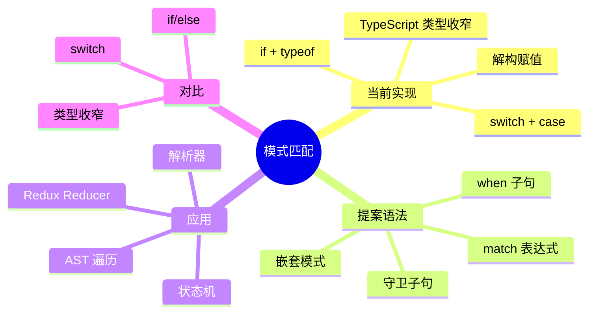

# 模式匹配（Pattern Matching）

> **形式化定义**：模式匹配（Pattern Matching）是 TC39 处于 Stage 1 的提案，旨在为 ECMAScript 提供声明式的结构解构和条件匹配语法。该特性受 Haskell、Rust、Scala 等函数式语言启发，允许基于值的**结构形状**而非仅仅是**类型**进行分支选择。当前实现主要依赖 TypeScript 的类型收窄和 ECMAScript 的解构赋值，未来可能引入原生 `match` 表达式。
>
> 对齐版本：TC39 Pattern Matching Proposal (Stage 1) | TypeScript 5.8–6.0

---

## 1. 概念定义 (Concept Definition)

### 1.1 形式化定义

TC39 提案定义了模式匹配的语法：

> *"Pattern matching is a mechanism for checking a value against a pattern and, if the match succeeds, extracting data from the value according to the pattern."*

模式匹配的数学表示：

```
match (E) {
  when P₁: S₁;
  when P₂: S₂;
  default: Sₙ;
}
≡  E matches P₁ → S₁
   E matches P₂ → S₂
   otherwise → Sₙ
```

### 1.2 概念层级图谱



---

## 2. 属性与特征 (Properties & Characteristics)

### 2.1 模式匹配属性矩阵

| 特性 | 当前 JS/TS | TC39 提案 |
|------|-----------|-----------|
| 结构匹配 | 解构 + if | `when { x, y }` |
| 值匹配 | switch | `when 42` |
| 数组匹配 | 数组解构 | `when [a, b, ...rest]` |
| 守卫条件 | if | `when x if x > 0` |
| 穷尽检查 | TS 编译器 | 原生支持 |
| 表达式返回值 | 三元运算符 | match 表达式 |

---

## 3. 关系分析 (Relationship Analysis)

### 3.1 模式匹配与类型收窄的关系

```typescript
// TypeScript 类型收窄（当前最佳实践）
function process(shape: Circle | Square | Triangle) {
  if (shape.kind === "circle") {
    return Math.PI * shape.radius ** 2;
  } else if (shape.kind === "square") {
    return shape.size ** 2;
  } else {
    return 0.5 * shape.base * shape.height;
  }
}
```

---

## 4. 机制解释 (Mechanism Explanation)

### 4.1 TC39 提案语法示例

```javascript
// 提案中的 match 语法（尚未标准化）
const result = match (shape) {
  when { kind: "circle", radius }: Math.PI * radius ** 2,
  when { kind: "square", size }: size ** 2,
  when { kind: "triangle", base, height }: 0.5 * base * height,
  default: 0
};
```

---

## 5. 论证与分析 (Argumentation & Analysis)

### 5.1 模式匹配的优势

| 优势 | 说明 |
|------|------|
| 声明式 | 描述"是什么"而非"怎么做" |
| 穷尽性 | 编译器可检查是否覆盖所有情况 |
| 可组合 | 模式可嵌套、可扩展 |
| 表达式 | match 可作为表达式返回值 |

---

## 6. 实例与示例 (Examples)

### 6.1 正例：Redux Reducer

```typescript
// 使用 TypeScript 的 Discriminated Union
type Action =
  | { type: "increment"; payload: number }
  | { type: "decrement"; payload: number }
  | { type: "reset" };

function reducer(state: number, action: Action): number {
  switch (action.type) {
    case "increment": return state + action.payload;
    case "decrement": return state - action.payload;
    case "reset": return 0;
    default: return state; // 穷尽检查确保不会执行
  }
}
```

---

## 7. 权威参考与国际化对齐 (References)

- **TC39 Pattern Matching Proposal** — <https://github.com/tc39/proposal-pattern-matching>
- **TypeScript Handbook: Narrowing** — <https://www.typescriptlang.org/docs/handbook/2/narrowing.html>

---

## 8. 思维表征总结 (Cognitive Representations)

### 8.1 模式匹配 vs switch

| 特性 | switch | 模式匹配 |
|------|--------|---------|
| 匹配方式 | 严格相等 | 结构匹配 |
| 绑定变量 | ❌ | ✅ |
| 嵌套匹配 | ❌ | ✅ |
| 守卫条件 | ❌ | ✅ |
| 表达式返回值 | ❌ | ✅ |

---

---

## 深化补充：今日可用的模式匹配与权威参考

### ts-pattern 库实战

```typescript
import { match, P } from 'ts-pattern';

type Response =
  | { type: 'success'; data: string }
  | { type: 'error'; message: string }
  | { type: 'loading' };

function handle(response: Response): string {
  return match(response)
    .with({ type: 'success', data: P.string }, (r) => `Data: ${r.data}`)
    .with({ type: 'error' }, (r) => `Error: ${r.message}`)
    .with({ type: 'loading' }, () => 'Loading...')
    .exhaustive(); // 编译时穷尽检查
}
```

### 数组与元组模式

```typescript
import { match, P } from 'ts-pattern';

const value = [1, 2, 3] as const;

const result = match(value)
  .with([P.number, P.number, P.number], ([a, b, c]) => a + b + c)
  .with([P.number, P.number], ([a, b]) => a + b)
  .with([P.number], ([a]) => a)
  .with([], () => 0)
  .exhaustive();
```

### 嵌套对象模式

```typescript
import { match, P } from 'ts-pattern';

type Event =
  | { type: 'user'; data: { name: string; age: number } }
  | { type: 'admin'; data: { permissions: string[] } };

match(event)
  .with({ type: 'user', data: { age: P.number } }, (e) => {
    return e.data.age >= 18 ? `Adult: ${e.data.name}` : `Minor: ${e.data.name}`;
  })
  .with({ type: 'admin', data: { permissions: P.array(P.string) } }, (e) => {
    return `Admin with ${e.data.permissions.length} permissions`;
  })
  .otherwise(() => 'Unknown');
```

### 守卫子句（Guard）

```typescript
import { match, P } from 'ts-pattern';

match({ x: 10, y: 20 })
  .with({ x: P.number, y: P.number }, ({ x, y }) => x === y, () => 'Equal')
  .with({ x: P.number, y: P.number }, ({ x, y }) => x > y, () => 'X greater')
  .otherwise(() => 'Y greater');
```

### TypeScript 穷尽性检查与 `never`

```typescript
type Shape =
  | { kind: 'circle'; radius: number }
  | { kind: 'square'; size: number }
  | { kind: 'triangle'; base: number; height: number };

function area(shape: Shape): number {
  switch (shape.kind) {
    case 'circle': return Math.PI * shape.radius ** 2;
    case 'square': return shape.size ** 2;
    case 'triangle': return 0.5 * shape.base * shape.height;
    default:
      // 若新增 Shape variant 但未处理，此处会触发编译错误
      const _exhaustive: never = shape;
      return _exhaustive;
  }
}
```

### 提案 match 语法与生成器模式

```typescript
// TC39 Stage 1 提案的 match 表达式支持守卫和嵌套
// https://github.com/tc39/proposal-pattern-matching

// 当前用 ts-pattern 模拟生成器/迭代器匹配
import { match, P } from 'ts-pattern';

function* fib() {
  let [a, b] = [0, 1];
  while (true) { yield a; [a, b] = [b, a + b]; }
}

const iter = fib();
const first = match([iter.next(), iter.next(), iter.next()])
  .with([{ value: P.number }, { value: P.number }, { value: P.number }], ([a, b, c]) => [a.value, b.value, c.value])
  .otherwise(() => []);

// first: [0, 1, 1]
```

### 权威外部链接索引

| 来源 | 链接 | 说明 |
|------|------|------|
| TC39 Pattern Matching Proposal | <https://github.com/tc39/proposal-pattern-matching> | 官方提案仓库 |
| TypeScript Handbook — Narrowing | <https://www.typescriptlang.org/docs/handbook/2/narrowing.html> | 类型收窄文档 |
| TypeScript Handbook — Discriminated Unions | <https://www.typescriptlang.org/docs/handbook/2/narrowing.html#discriminated-unions> | 可辨识联合文档 |
| ts-pattern | <https://github.com/gvergnaud/ts-pattern> | 运行时模式匹配库 |
| Pattern Matching in TypeScript | <https://pattern-matching.dev/> | 模式匹配教程 |
| Rust — Pattern Matching | <https://doc.rust-lang.org/book/ch18-00-patterns.html> | Rust 模式匹配参考 |
| Scala — Pattern Matching | <https://docs.scala-lang.org/tour/pattern-matching.html> | Scala 模式匹配参考 |
| F# — Pattern Matching | <https://learn.microsoft.com/en-us/dotnet/fsharp/language-reference/pattern-matching> | F# 模式匹配参考 |
| Haskell — Pattern Matching | <https://www.haskell.org/tutorial/patterns.html> | Haskell 模式匹配参考 |
| ECMA-262 — Destructuring | <https://tc39.es/ecma262/#sec-destructuring-assignment> | 解构赋值规范 |

---

## 深化补充二：高级模式匹配实战

### 可选值（Option/Maybe）模式

```typescript
type Option<T> = { _tag: 'Some'; value: T } | { _tag: 'None' };

function map<T, U>(opt: Option<T>, fn: (v: T) => U): Option<U> {
  // 当前用 switch 实现，未来可用 match 表达式
  switch (opt._tag) {
    case 'Some': return { _tag: 'Some', value: fn(opt.value) };
    case 'None': return { _tag: 'None' };
  }
}

// TC39 提案未来语法：
// const result = match (opt) {
//   when { _tag: 'Some', value }: { _tag: 'Some', value: fn(value) },
//   when { _tag: 'None' }: { _tag: 'None' }
// };
```

### JSON Schema 结构匹配

```typescript
import { match, P } from 'ts-pattern';

type APIResponse =
  | { status: 'success'; data: { users: { id: number; name: string }[] } }
  | { status: 'error'; code: number; message: string };

const handle = (res: APIResponse) =>
  match(res)
    .with(
      { status: 'success', data: { users: P.array({ id: P.number, name: P.string }) } },
      (r) => r.data.users.map(u => u.name)
    )
    .with({ status: 'error', code: P.number }, (r) => [`Error ${r.code}: ${r.message}`])
    .exhaustive();
```

### 递归数据结构匹配

```typescript
type Expr =
  | { type: 'literal'; value: number }
  | { type: 'add'; left: Expr; right: Expr }
  | { type: 'multiply'; left: Expr; right: Expr };

function evaluate(expr: Expr): number {
  return match(expr)
    .with({ type: 'literal' }, (e) => e.value)
    .with({ type: 'add' }, (e) => evaluate(e.left) + evaluate(e.right))
    .with({ type: 'multiply' }, (e) => evaluate(e.left) * evaluate(e.right))
    .exhaustive();
}

// evaluate({ type: 'add', left: { type: 'literal', value: 2 }, right: { type: 'literal', value: 3 } }) === 5
```

### 守卫子句与范围匹配

```typescript
import { match, P } from 'ts-pattern';

function grade(score: number): string {
  return match(score)
    .with(P.number.when(n => n >= 90 && n <= 100), () => 'A')
    .with(P.number.when(n => n >= 80 && n < 90), () => 'B')
    .with(P.number.when(n => n >= 70 && n < 80), () => 'C')
    .with(P.number.when(n => n >= 60 && n < 70), () => 'D')
    .with(P.number.when(n => n >= 0 && n < 60), () => 'F')
    .otherwise(() => 'Invalid');
}
```

---

## 更多权威参考

- **TC39 Pattern Matching Proposal (Stage 1)** — <https://github.com/tc39/proposal-pattern-matching>
- **TypeScript Handbook: Narrowing** — <https://www.typescriptlang.org/docs/handbook/2/narrowing.html>
- **ts-pattern Documentation** — <https://github.com/gvergnaud/ts-pattern>
- **Rust: Pattern Matching** — <https://doc.rust-lang.org/book/ch18-00-patterns.html>
- **Scala: Pattern Matching** — <https://docs.scala-lang.org/tour/pattern-matching.html>
- **F#: Pattern Matching** — <https://learn.microsoft.com/en-us/dotnet/fsharp/language-reference/pattern-matching>
- **Haskell: Pattern Matching** — <https://www.haskell.org/tutorial/patterns.html>
- **ECMA-262: Destructuring Assignment** — <https://tc39.es/ecma262/#sec-destructuring-assignment>
- **Pattern Matching in TypeScript (pattern-matching.dev)** — <https://pattern-matching.dev/>
- **Functional Programming: Option Type** — <https://en.wikipedia.org/wiki/Option_type>
