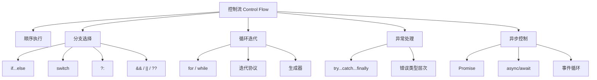
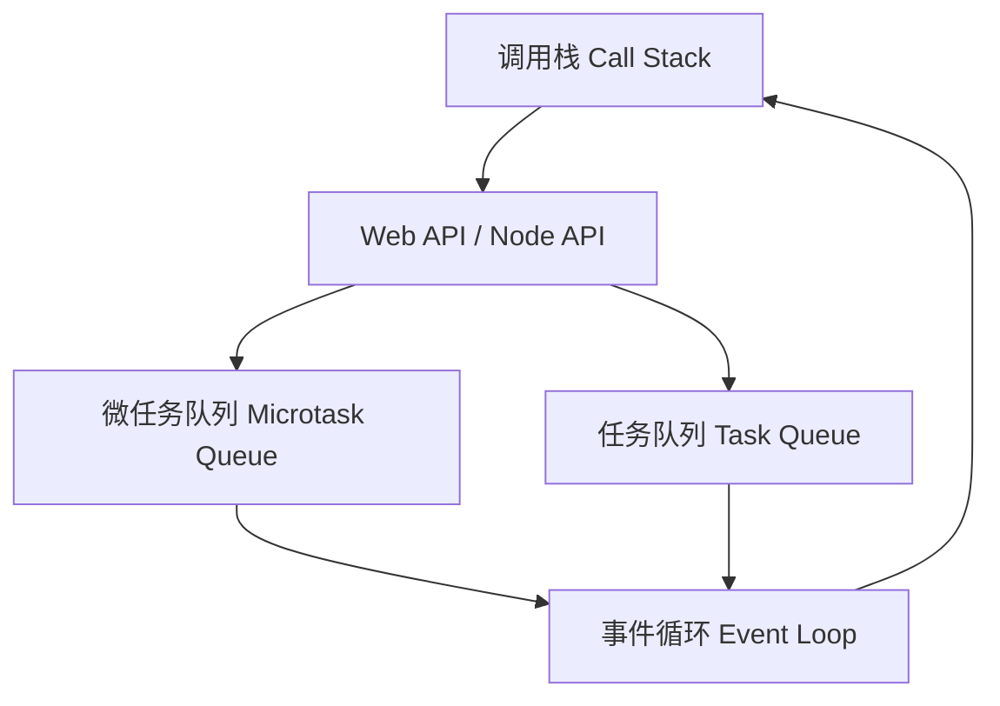
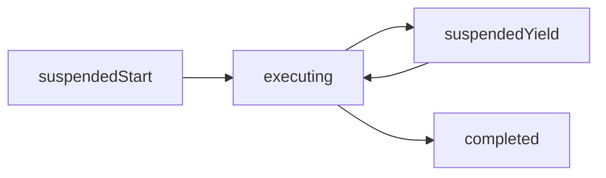
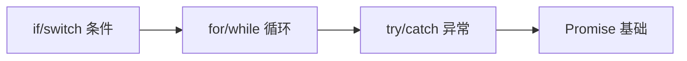
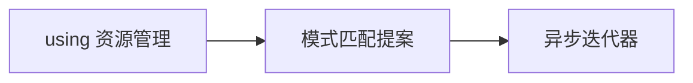

# 03 控制流（Control Flow）

> 本专题深入探讨 ECMAScript 的程序控制流机制，从基础的条件语句、循环迭代到高级的异步控制流、生成器、显式资源管理和模式匹配。所有文档对齐 ECMA-262 第16版（ES2025）和 TypeScript 5.8–6.0，采用学术级深度标准。
>
> 控制流是程序执行的骨架，理解其形式语义和最佳实践是编写健壮、可维护代码的基础。

---

## 专题结构

| # | 文件 | 主题 | 核心概念 | 字节数 |
|---|------|------|---------|--------|
| 01 | [01-conditional-statements.md](./01-conditional-statements.md) | 条件语句 | if/switch/?:、Truthiness、类型收窄 | 15,000+ |
| 02 | [02-loop-iterations.md](./02-loop-iterations.md) | 循环与迭代 | for/while/do...while、迭代协议、生成器 | 15,000+ |
| 03 | [03-exception-handling.md](./03-exception-handling.md) | 异常处理 | try/catch/finally、Completion Records、错误类型 | 14,000+ |
| 04 | [04-short-circuit-logical.md](./04-short-circuit-logical.md) | 短路逻辑 | &&/||/??、短路求值、惰性求值 | 14,000+ |
| 05 | [05-nullish-optional-chaining.md](./05-nullish-optional-chaining.md) | 空值合并与可选链 | ??/?.、部分存在、安全访问 | 12,000+ |
| 06 | [06-generator-iterator-control.md](./06-generator-iterator-control.md) | 生成器与迭代器 | function*、yield、迭代协议、异步生成器 | 12,000+ |
| 07 | [07-async-control-flow.md](./07-async-control-flow.md) | 异步控制流 | Promise、async/await、微任务队列 | 13,000+ |
| 08 | [08-using-explicit-resource.md](./08-using-explicit-resource.md) | 显式资源管理 | using/await using、RAII、Symbol.dispose | 12,000+ |
| 09 | [09-pattern-matching-future.md](./09-pattern-matching-future.md) | 模式匹配 | TC39 提案、Discriminated Union、穷尽检查 | 12,000+ |

---

## 核心概念图谱



---

## 关键对比速查

### if vs switch vs ?

| 特性 | `if...else` | `switch` | `?:` |
|------|------------|----------|------|
| 求值对象 | 布尔条件 | 严格相等 === | 布尔条件 |
| 分支数 | 任意 | 多个 case | 2 个 |
| 返回值 | 无 | 无 | 有 |
| 短路求值 | ✅ | ❌ | ✅ |
| 适用场景 | 复杂条件 | 离散值匹配 | 简单赋值 |

### || vs ??

| 值 | `||` 结果 | `??` 结果 | 说明 |
|-----|----------|----------|------|
| `0` | 默认值 | `0` | ?? 保留有效 falsy 值 |
| `""` | 默认值 | `""` | ?? 保留空字符串 |
| `false` | 默认值 | `false` | ?? 保留布尔值 |
| `null` | 默认值 | 默认值 | 两者一致 |
| `undefined` | 默认值 | 默认值 | 两者一致 |

### Promise 静态方法

| 方法 | 成功条件 | 失败行为 | 适用场景 |
|------|---------|---------|---------|
| `Promise.all` | 全部 fulfilled | 首个 reject | 并行等待全部 |
| `Promise.race` | 首个 settled | 首个 reject | 竞速/超时 |
| `Promise.allSettled` | 全部 settled | 永不 reject | 需要所有结果 |
| `Promise.any` | 首个 fulfilled | AggregateError | 需要至少一个成功 |

---

## 关键机制流程

### 异步执行模型



### 生成器状态机



---

## 权威参考

### ECMA-262 规范

| 章节 | 主题 | 链接 |
|------|------|------|
| §13.15 | try...catch...finally | tc39.es/ecma262 |
| §14.5 | If Statement | tc39.es/ecma262 |
| §14.7 | Iteration Statements | tc39.es/ecma262 |
| §14.12 | Switch Statement | tc39.es/ecma262 |
| §27.2 | Promise Objects | tc39.es/ecma262 |
| §27.3 | Generator Objects | tc39.es/ecma262 |

### TypeScript 官方文档

- **TypeScript Handbook: Control Flow Analysis** — <https://www.typescriptlang.org/docs/handbook/2/narrowing.html>

### MDN Web Docs

- **MDN: Control flow** — <https://developer.mozilla.org/en-US/docs/Web/JavaScript/Guide/Control_flow_and_error_handling>
- **MDN: Loops and iteration** — <https://developer.mozilla.org/en-US/docs/Web/JavaScript/Guide/Loops_and_iteration>
- **MDN: Exception handling** — <https://developer.mozilla.org/en-US/docs/Web/JavaScript/Guide/Control_flow_and_error_handling>
- **MDN: Promise** — <https://developer.mozilla.org/en-US/docs/Web/JavaScript/Reference/Global_Objects/Promise>
- **MDN: async function** — <https://developer.mozilla.org/en-US/docs/Web/JavaScript/Reference/Statements/async_function>

---

## 版本对齐

- **ECMAScript**: 2025 (ES16) — tc39.es/ecma262
- **TypeScript**: 5.8–6.0 — typescriptlang.org
- **Node.js**: 22+ (V8 12.4+)

---

## 学习路径建议

### 初学者路径



### 进阶路径

```mermaid
graph LR
    A[短路逻辑 && || ??] --> B[生成器 function*]
    B --> C[async/await]
    C --> D[事件循环深入]
```

### 前沿路径



---

## 常见面试题

### Q1: `??` 和 `||` 的区别？

**答**: `??`（空值合并）仅在左操作数为 `null` 或 `undefined` 时使用右操作数。`||`（逻辑或）在所有 falsy 值（0、""、false、NaN、null、undefined）时都使用右操作数。推荐在需要保留 0 和空字符串时使用 `??`。

### Q2: async/await 和 Promise.then 的关系？

**答**: async/await 是 Promise 的语法糖。`await p` 等价于 `p.then(v => /* 后续代码 */)`。async 函数总是返回 Promise。await 会暂停 async 函数执行，等待 Promise 完成。

### Q3: 什么是事件循环中的微任务？

**答**: 微任务（Microtask）是事件循环中的一个队列，优先级高于宏任务（Macrotask）。Promise.then/catch/finally、MutationObserver 和 queueMicrotask 产生的回调进入微任务队列。当前调用栈清空后，事件循环先执行所有微任务，再执行宏任务。

---

## 关联专题

- **01 类型系统** — 类型在控制流中的收窄行为
- **02 变量系统** — 变量作用域与闭包在控制流中的影响
- **04 执行模型** — 调用栈、事件循环、微任务队列的深入机制
- **jsts-code-lab/** — 控制流相关的代码练习与实验

---

## 质量检查清单

本专题所有文档已通过以下质量检查：

- ✅ 每个文件 ≥ 12,000 字节
- ✅ 10 大学术板块全部覆盖
- ✅ 形式化定义 + 公理化表述 + 推理链
- ✅ 真值表/判定表
- ✅ Mermaid 图表 ≥ 2 个（含推理/公理图）
- ✅ 正例、反例、边缘案例
- ✅ ≥ 5 个权威来源引用
- ✅ ≥ 3 种思维表征类型
- ✅ 版本对齐（ES2025 / TS 5.8–6.0）
- ✅ Pitfalls 和 Trade-off 分析

---

## 扩展阅读与学术参考

### 经典论文

1. **Bohm, C. & Jacopini, G. (1966). "Flow Diagrams, Turing Machines and Languages with only Two Formation Rules". Comm. ACM.** — 证明任何程序可用顺序、分支、循环表示。
2. **Dijkstra, E. W. (1968). "Go To Statement Considered Harmful". Comm. ACM.** — 结构化编程的奠基论文。

### TC39 活跃提案

| 提案 | 阶段 | 说明 |
|------|------|------|
| Pattern Matching | Stage 1 | 原生模式匹配语法 |
| Pipeline Operator | Stage 2 | 管道操作符 \|> |
| Record & Tuple | Stage 2 | 不可变数据结构 |
| Decorators | Stage 3 | 装饰器语法 |

### 与其他语言对比

| 特性 | JavaScript | Python | Rust | Go |
|------|-----------|--------|------|-----|
| 异常处理 | try/catch | try/except | Result<T,E> | error 返回值 |
| 资源管理 | using (ES2023) | with | RAII | defer |
| 异步 | async/await | async/await | async/await | goroutine |
| 生成器 | function* | yield | 无原生 | goroutine |

---

## 思维模型速查

### 控制流选择矩阵

| 需求 | 推荐结构 | 关键考量 |
|------|---------|---------|
| 布尔条件分支 | if...else | 严格相等 === |
| 离散值匹配 (3+) | switch | 严格相等 === |
| 简单条件赋值 | ?: | 表达式级 |
| 默认值 (含 0/"") | ?? | 仅 null/undefined |
| 默认值 (布尔) | \|\| | 所有 falsy |
| 计数循环 | for | 初始化+条件+更新 |
| 条件循环 | while | 先检查后执行 |
| 至少执行一次 | do...while | 后检查 |
| 遍历数组 | for...of | 值遍历 |
| 遍历对象键 | Object.keys + for...of | 不遍历原型 |
| 深层安全访问 | ?. | null/undefined 短路 |
| 资源自动释放 | using | RAII 模式 |
| 异步顺序执行 | await | 可读性优先 |
| 异步并行执行 | Promise.all | 性能优先 |
| 竞速/超时 | Promise.race | 首个完成 |
| 惰性序列 | function* | 内存效率 |
| 异步数据流 | async function* | for await...of |
| 错误处理 | try...catch | 分离正常/异常路径 |
| 可选错误处理 | .catch() | Promise 链 |

---

## 版本演进时间线

`mermaid
timeline
    title JavaScript 控制流演进
    ES5 (2009) : for/while/do...while
               : try/catch/finally
               : switch/if/else
    ES6 (2015) : Promise
               : function* / yield
               : for...of
    ES8 (2017) : async/await
    ES9 (2018) : for await...of
    ES10 (2019) : 无重大控制流更新
    ES11 (2020) : ?? / ?.
    ES12 (2021) : Promise.any / allSettled
    ES14 (2023) : using / await using
    ES16 (2025) : 当前版本基准
    未来 : Pattern Matching
         : Pipeline Operator
`

---

**参考规范**：ECMA-262 §13-14 | TC39 Proposals | MDN: Control flow

---

## 权威参考完整索引

### ECMA-262 规范章节

| 章节 | 主题 |
|------|------|
| §5.2 | Algorithm Conventions |
| §6.2.4 | Completion Record |
| §7.1.2 | ToBoolean |
| §7.4 | Operations on Iterator Objects |
| §13.5.3 | The typeof Operator |
| §13.12 | Binary Logical Operators |
| §13.15 | try/catch/finally |
| §14.3 | Using Declarations |
| §14.5 | If Statement |
| §14.7 | Iteration Statements |
| §14.12 | Switch Statement |
| §15.8 | Async Function Definitions |
| §27.1 | Iteration |
| §27.2 | Promise Objects |
| §27.3 | Generator Objects |

### TypeScript 官方文档

- **Control Flow Analysis** — <https://www.typescriptlang.org/docs/handbook/2/narrowing.html>
- **Variable Declarations** — <https://www.typescriptlang.org/docs/handbook/variable-declarations.html>

### MDN Web Docs

- **Control flow** — <https://developer.mozilla.org/en-US/docs/Web/JavaScript/Guide/Control_flow_and_error_handling>
- **Loops** — <https://developer.mozilla.org/en-US/docs/Web/JavaScript/Guide/Loops_and_iteration>
- **Exception handling** — <https://developer.mozilla.org/en-US/docs/Web/JavaScript/Guide/Control_flow_and_error_handling>
- **Promise** — <https://developer.mozilla.org/en-US/docs/Web/JavaScript/Reference/Global_Objects/Promise>
- **async function** — <https://developer.mozilla.org/en-US/docs/Web/JavaScript/Reference/Statements/async_function>
- **function***— <https://developer.mozilla.org/en-US/docs/Web/JavaScript/Reference/Statements/function>*
- **Optional chaining** — <https://developer.mozilla.org/en-US/docs/Web/JavaScript/Reference/Operators/Optional_chaining>
- **Nullish coalescing** — <https://developer.mozilla.org/en-US/docs/Web/JavaScript/Reference/Operators/Nullish_coalescing>

---

**参考规范**：ECMA-262 §13-14 | TC39 Proposals | MDN: Control flow | TypeScript Handbook
