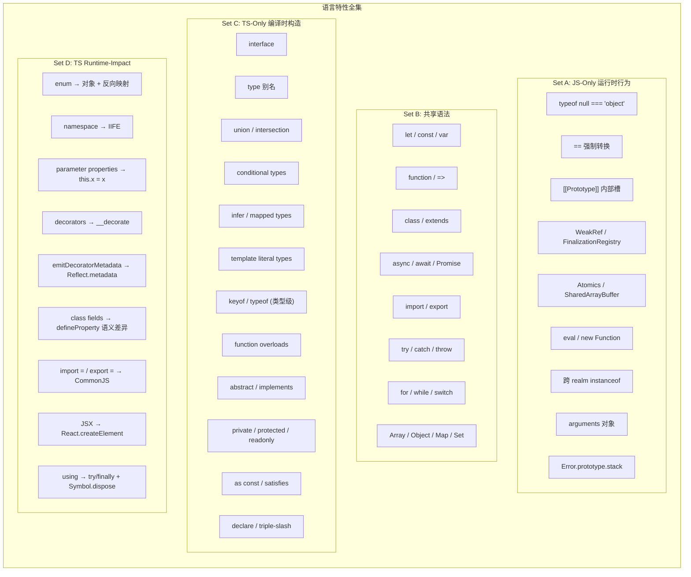

# JS/TS 对称差总览矩阵

> 本文档用集合论视角，将 JavaScript 与 TypeScript 的全部语言特性划分为四个互不相交的集合。

---

## 核心模型



---

## 四集特性总表

### Set A: JS-Only 运行时行为（TS 无法建模）

| 特性 | JS 运行时表现 | TS 类型行为 | 为什么 TS 无法建模 |
|------|-------------|------------|-----------------|
| `typeof null` | `"object"` | `object \| null` 联合类型 | 历史 bug，引擎层面 |
| `==` 强制转换 | `[] == false`, `"" == false` | 编译器只检查 `===` | 抽象操作算法过于动态 |
| `[[Prototype]]` | 原型链动态查找 | `instanceof` 窄化 | 内部槽，非语言语法 |
| `[[Extensible]]` | `Object.preventExtensions` | 无类型影响 | 运行时对象状态 |
| `WeakRef` | GC 可达性依赖 | `WeakRef<T>` 但 GC 时机未知 | GC 非确定性 |
| `FinalizationRegistry` | 回调在 GC 后触发 | 无 | GC 时机不可预测 |
| `Atomics` | 多线程内存操作 | 无并发类型系统 | 内存模型超越类型 |
| `eval` | 当前词法作用域执行 | 返回 `any` | 动态代码无法静态分析 |
| `new Function` | 全局作用域执行 | 返回 `Function` | 同 eval |
| `with` | 动态变量解析 | **编译错误** | 静态分析不可能 |
| `arguments` | 类数组对象 | 剩余参数替代 | 非标准数组行为 |
| `Error.stack` | 字符串或非标准 | `string \| undefined` | 非 ECMA-262 标准 |
| 跨 realm `instanceof` | `false` | 仍认为是子类型 | 不同全局构造函数 |
| 方括号动态访问 | `obj[randomKey]` | 退化为索引签名 | 键名不可静态确定 |

### Set B: 共享语法（JS 和 TS 完全一致）

| 语法 | JS 运行时 | TS 编译时 | 运行时影响 |
|------|----------|----------|-----------|
| `let` / `const` / `var` | 词法/函数/全局作用域 | 类型推断基座 | 无额外生成 |
| `function` / 箭头函数 | 函数对象创建 | 参数/返回类型标注 | 无额外生成 |
| `class` / `extends` | 原型链 + constructor | 字段类型、方法签名 | 无额外生成（字段除外） |
| `async` / `await` | Promise 包装/解包 | Promise<T> 泛型 | 无额外生成 |
| `import` / `export` | ESM 模块加载 | 模块类型解析 | 无额外生成（目标为 ESM 时） |
| `try` / `catch` / `throw` | 异常控制流 | `unknown` catch 参数 | 无额外生成 |
| `for` / `while` / `switch` | 循环/分支 | 穷尽性检查 | 无额外生成 |
| `Array` / `Object` / `Map` | 内置对象 | 泛型实例化 | 无额外生成 |
| `Symbol` / `BigInt` | 原始值类型 | 字面量类型 | 无额外生成 |
| `?.` / `??` | 空值合并/可选链 | narrowing | 无额外生成 |
| `using` / `await using` | 资源清理 | dispose 类型检查 | 生成 try/finally |

### Set C: TS-Only 编译时构造（运行时完全擦除）

| 特性 | TS 编译时作用 | 运行时残留 | JS 等价方案 |
|------|-------------|-----------|------------|
| `interface` | 结构类型声明 | **零** | JSDoc `@typedef` |
| `type` 别名 | 类型级宏 | **零** | JSDoc `@typedef` |
| `A \| B` (union) | 或类型 | **零** | `typeof` 分支检查 |
| `A & B` (intersection) | 与类型 | **零** | `Object.assign` |
| `T extends U ? X : Y` | 条件类型分支 | **零** | 无法实现 |
| `infer R` | 类型提取 | **零** | 无法实现 |
| `{ [K in T]: V }` | 属性映射 | **零** | 无法实现 |
| `` `prefix-${T}` `` | 字符串操作 | **零** | 正则验证 |
| `keyof T` | 键名联合 | **零** | `Object.keys` (丢失类型) |
| `typeof x` (类型级) | 类型查询 | **零** | JS `typeof` 返回 primitive string |
| function overloads | 调用签名多态 | **零** | 手动 `typeof` dispatch |
| `abstract class` | 禁止实例化 | **零** | 构造函数检查 `new.target` |
| `implements` | 结构契约检查 | **零** | duck typing |
| `private` / `protected` | 访问控制 | **零** (修饰符消失) | `#private` / WeakMap / 闭包 |
| `readonly` | 只读约束 | **零** | `Object.defineProperty` |
| `as const` | 字面量类型收窄 | **零** | `Object.freeze` |
| `satisfies` | 结构验证 + 窄保留 | **零** | `assertShape()` 运行时函数 |
| `declare module` | 外部类型声明 | **零** | 无 |
| `/// <reference>` | 编译依赖声明 | **零** | 无 |

### Set D: Runtime-Impacting TS 特性（编译后产生 JS 代码）

| 特性 | 编译前 TS | 编译后 JS | 运行时影响 | 可避免？ |
|------|----------|----------|-----------|---------|
| `enum` | `enum Color { Red }` | `var Color; (function (Color) { Color[Color["Red"] = 0] = "Red"; })(Color \|\| (Color = {}));` | 生成对象 + 反向映射 | 用 `const enum` (零开销) 或字面量 union |
| `const enum` | `const enum C { A = 1 }` | 直接内联 `1` | **零运行时** | — |
| `namespace` | `namespace X { export fn() {} }` | `var X; (function (X) { X.fn = function(){}; })(X \|\| (X = {}));` | IIFE + 对象赋值 | 用 ES Module |
| parameter properties | `constructor(public x: number)` | `constructor(x) { this.x = x; }` | 生成赋值语句 | 手写 `this.x = x` |
| decorators | `@logged method(){}` | `__decorate([logged], ...)` | 辅助函数调用 | 无（若需装饰器语义） |
| `emitDecoratorMetadata` | 开启后自动注入 | `Reflect.metadata("design:paramtypes", [...])` | 增加 polyfill 依赖 + 包体积 | 关闭该选项 |
| class fields | `x = 10` | `Object.defineProperty` 或 `this.x = 10` | 枚举性/可配置性差异 | 统一 `useDefineForClassFields` |
| `import = require()` | `import fs = require("fs")` | `const fs = require("fs")` | CommonJS require | 用标准 ESM import |
| `export =` | `export = MyModule` | `module.exports = MyModule` | CommonJS 导出 | 用标准 ESM export |
| `JSX` | `<div />` | `React.createElement("div", null)` | 虚拟 DOM 对象创建 | 预编译（如 SolidJS） |
| `using` | `using x = resource` | `try { ... } finally { x[Symbol.dispose](); }` | 生成 try/finally | 手写资源管理 |

---

## TS 类型擦除保证与例外

### 擦除保证（Erasability Guarantee）

> 除 Set D 中的特性外，所有 TS 类型注解在编译后**完全消失**，不生成任何 JS 代码。

```typescript
// 编译前
function greet(user: { name: string; age: number }): string {
  return `Hello ${user.name}`;
}

// 编译后 (ES2022 target)
function greet(user) {
  return `Hello ${user.name}`;
}
```

### 擦除例外完整清单

| 特性类别 | 运行时残留 | 控制方式 |
|---------|-----------|---------|
| enum | 对象 + 反向映射 | `const enum` → 零残留 |
| namespace | IIFE | 不用 namespace |
| parameter properties | `this.x = x` | 手写赋值 |
| decorators | `__decorate` 调用 | 不用装饰器 |
| emitDecoratorMetadata | `Reflect.metadata` | tsconfig 关闭 |
| class fields | defineProperty / 赋值 | 配置编译选项 |
| legacy import/export | `require` / `module.exports` | 用标准 ESM |
| JSX | `React.createElement` | 预编译框架 |
| using | try/finally | 手写 |

---

## 学习路径建议

```
入门开发者
  ├── 先学 Set B（共享语法）→ JS 核心
  ├── 再学 Set C（TS-Only）→ 类型系统
  └── 了解 Set A（JS-Only）→ 运行时陷阱

高级开发者
  ├── 深入 Set A → 引擎内部原理
  ├── 掌握 Set D → 控制编译产物
  └── 理解 Set C 与 Set A 的边界 → 类型系统局限性

架构师
  └── 综合运用四集知识 → 设计类型安全且运行时高效的系统
```

---

## 关联文档

- `01-js-only-runtime-features.md` — Set A 深度分析
- `02-ts-only-compile-time-features.md` — Set C 深度分析
- `03-runtime-impacting-ts-features.md` — Set D 深度分析
- `04-what-ts-cannot-check.md` — 类型系统边界
- `05-ts-to-js-reverse-mapping.md` — 反向等价方案
