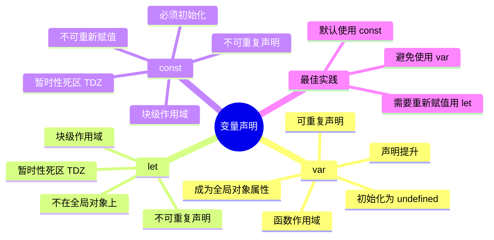
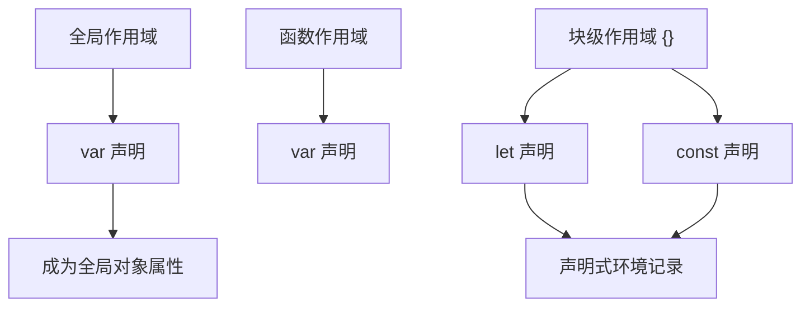
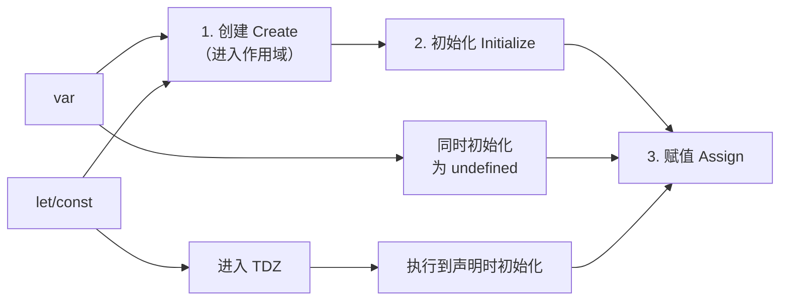
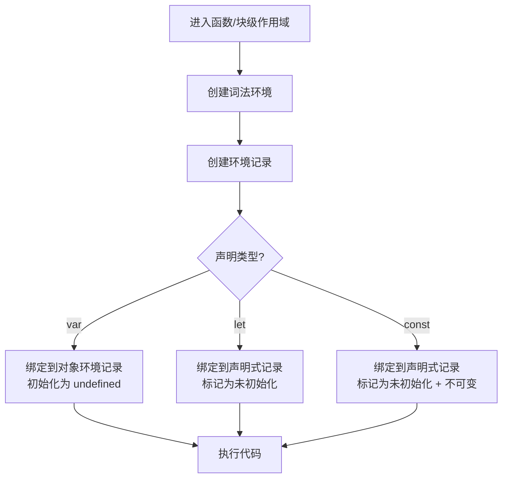
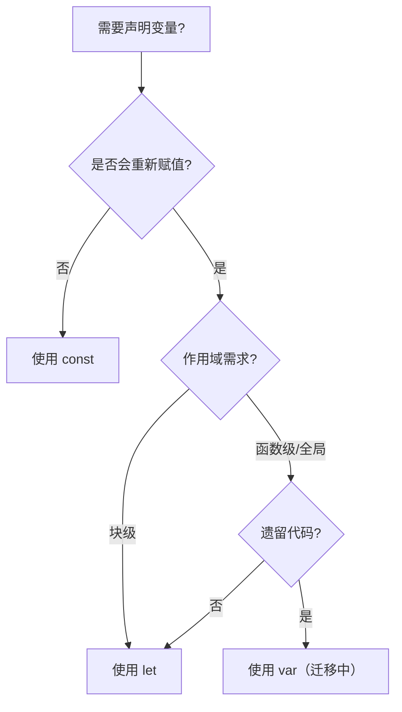
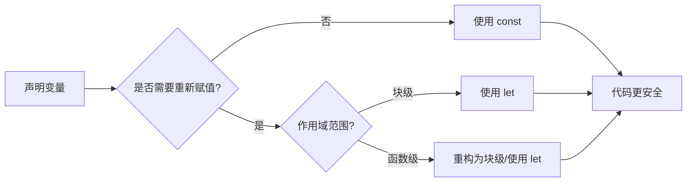

# var、let 与 const

> **形式化定义**：在 ECMAScript 规范中，`var`、`let` 和 `const` 是三种变量声明机制，对应不同的**环境记录（Environment Record）**绑定语义：`var` 声明创建在函数级或全局环境的**对象环境记录（Object Environment Record）**中，具有声明提升（Hoisting）和可重复声明特性；`let` 和 `const` 声明创建在**声明式环境记录（Declarative Environment Record）**中，具有块级作用域（Block Scoping）、暂时性死区（Temporal Dead Zone, TDZ）和不可重复声明特性；`const` 额外要求绑定不可重新赋值（Immutable Binding）。
>
> 对齐版本：ECMAScript 2025 (ES16) | TypeScript 5.8–6.0

---

## 1. 概念定义 (Concept Definition)

### 1.1 形式化定义

ECMA-262 §14.3.1.2 定义了变量声明的语义：

> *"A Lexical Binding is a binding of an Identifier to a value."*

三种声明对应不同的绑定类型：

| 声明 | 绑定类型 | 作用域 | 可变性 | 提升行为 |
|------|---------|--------|--------|---------|
| `var` | 可变绑定（Mutable Binding） | 函数级 / 全局 | ✅ | 提升，初始化为 `undefined` |
| `let` | 可变绑定（Mutable Binding） | 块级 `{}` | ✅ | 提升，进入 TDZ |
| `const` | 不可变绑定（Immutable Binding） | 块级 `{}` | ❌ | 提升，进入 TDZ，必须初始化 |

### 1.2 概念层级图谱



---

## 2. 属性与特征 (Properties & Characteristics)

### 2.1 核心属性矩阵

| 特性 | `var` | `let` | `const` |
|------|-------|-------|---------|
| 作用域 | 函数级 | 块级 `{}` | 块级 `{}` |
| 提升 | ✅（初始化为 `undefined`） | ✅（TDZ） | ✅（TDZ） |
| 重复声明 | ✅ | ❌ | ❌ |
| 重新赋值 | ✅ | ✅ | ❌ |
| 声明时初始化 | 可选 | 可选 | **必需** |
| 全局对象属性 | ✅ | ❌ | ❌ |
| 块级作用域内可访问 | 是（穿透） | 否 | 否 |

### 2.2 暂时性死区（TDZ）

```javascript
// var：无 TDZ
console.log(a); // undefined（不是 ReferenceError）
var a = 1;

// let：有 TDZ
console.log(b); // ❌ ReferenceError: Cannot access 'b' before initialization
let b = 2;

// const：有 TDZ
console.log(c); // ❌ ReferenceError: Cannot access 'c' before initialization
const c = 3;
```

---

## 3. 关系分析 (Relationship Analysis)

### 3.1 声明与作用域的关系



### 3.2 变量创建三阶段



---

## 4. 机制解释 (Mechanism Explanation)

### 4.1 执行上下文的创建过程



### 4.2 TDZ 的底层机制

```javascript
{
  // TDZ 开始
  console.log(x); // ReferenceError

  // TDZ 结束
  let x = 1;
}
```

ECMA-262 §8.1.1.5.3 定义了 TDZ 的语义：
> *"If the binding is an uninitialized binding, throw a ReferenceError exception."*

---

## 5. 论证与分析 (Argumentation & Analysis)

### 5.1 为什么需要 let/const？

| 问题 | var 的行为 | let/const 的改进 |
|------|-----------|-----------------|
| 变量提升导致意外 | `var` 可在声明前使用 | TDZ 强制先声明后使用 |
| 循环变量共享 | `for (var i)` 共享同一个 i | `for (let i)` 每次迭代新绑定 |
| 块级穿透 | `var` 穿透 if/for 块 | `let/const` 严格块级 |
| 全局污染 | `var` 成为全局对象属性 | `let/const` 不污染全局 |

### 5.2 循环中的闭包问题

```javascript
// ❌ var：所有回调共享同一个 i
for (var i = 0; i < 3; i++) {
  setTimeout(() => console.log(i), 0); // 3, 3, 3
}

// ✅ let：每次迭代新绑定
for (let i = 0; i < 3; i++) {
  setTimeout(() => console.log(i), 0); // 0, 1, 2
}
```

### 5.3 常见误区与反例

**误区 1**：`const` 声明的对象不可变

```javascript
// ❌ 错误认知
const obj = { x: 1 };
obj = { x: 2 }; // ❌ TypeError

// ✅ 正确理解：const 保证引用不可变，不保证对象内容不可变
obj.x = 2; // ✅ 允许！

// ✅ 真正不可变：使用 Object.freeze
const frozen = Object.freeze({ x: 1 });
frozen.x = 2; // 严格模式下报错
```

**误区 2**：`typeof` 在 TDZ 中安全

```javascript
// ❌ 错误：typeof 对 TDZ 变量也会报错
console.log(typeof undeclared); // "undefined"
console.log(typeof tdz);        // ❌ ReferenceError!
let tdz;
```

---

## 6. 实例与示例 (Examples)

### 6.1 正例：最佳实践

```javascript
// ✅ 默认使用 const
const PI = 3.14159;
const config = { host: "localhost", port: 3000 };

// ✅ 需要重新赋值时使用 let
let count = 0;
count++;

// ✅ 循环变量
for (let i = 0; i < 10; i++) {
  console.log(i);
}

// ❌ 避免使用 var
var x = 1; // 不要这样
```

### 6.2 反例：var 的提升陷阱

```javascript
// ❌ 陷阱代码
function test() {
  console.log(x); // undefined（不是 ReferenceError！）
  var x = 1;
}

// 实际执行顺序：
function test() {
  var x;           // 提升
  console.log(x);  // undefined
  x = 1;           // 赋值
}
```

### 6.3 边缘案例

```javascript
// 边缘案例 1：switch 块共享作用域
const x = 1;
switch (x) {
  case 1:
    let y = 1;
    break;
  case 2:
    // let y = 2; // ❌ SyntaxError: Identifier 'y' has already been declared
}

// 边缘案例 2：const 的自我引用
// const x = x + 1; // ❌ ReferenceError: Cannot access 'x' before initialization
```

---

## 7. 权威参考与国际化对齐 (References)

### 7.1 ECMA-262 规范

- **§14.3.1.2 Let and Const Declarations** — `let`/`const` 的语法和语义
- **§14.3.1.1 Variable Statement** — `var` 的语法和语义
- **§8.1.1.5.3 GetBindingValue** — TDZ 的规范定义
- **§9.4 Execution Contexts** — 执行上下文的创建

### 7.2 TypeScript 官方文档

- **TypeScript Handbook: Variable Declarations** — <https://www.typescriptlang.org/docs/handbook/variable-declarations.html>

### 7.3 MDN Web Docs

- **MDN: var** — <https://developer.mozilla.org/en-US/docs/Web/JavaScript/Reference/Statements/var>
- **MDN: let** — <https://developer.mozilla.org/en-US/docs/Web/JavaScript/Reference/Statements/let>
- **MDN: const** — <https://developer.mozilla.org/en-US/docs/Web/JavaScript/Reference/Statements/const>

---

## 8. 思维表征总结 (Cognitive Representations)

### 8.1 声明选择决策树



### 8.2 作用域对比速查表

| 场景 | var | let | const |
|------|-----|-----|-------|
| 全局声明 | 全局对象属性 | 全局词法环境 | 全局词法环境 |
| 函数内部 | 函数作用域 | 块级作用域 | 块级作用域 |
| if/for 块内 | 穿透到外部 | 限制在块内 | 限制在块内 |
| 重复声明 | ✅ | ❌ | ❌ |
| 提升行为 | 初始化为 undefined | TDZ | TDZ |

### 8.3 TDZ 时间线

```
作用域开始
    │
    ▼
┌─────────────────┐
│   TDZ（暂时性死区） │  ← let/const 已创建但未初始化
│                 │
│ console.log(x); │  ← ReferenceError!
│                 │
└─────────────────┘
    │
    ▼
let x = 1;       ← 初始化完成，TDZ 结束
    │
    ▼
  x 可正常使用
```

---

## 9. TypeScript 类型标注扩展

### 9.1 声明与类型注解的结合

TypeScript 中 `var`/`let`/`const` 都可以附加类型注解，但语义上仍有差异：

```typescript
// ✅ const 配合字面量类型推断
const config = { host: "localhost", port: 3000 } as const;
// 类型: { readonly host: "localhost"; readonly port: 3000 }

// ✅ let 显式标注类型
let count: number = 0;

// ✅ 解构声明的类型注解
const { x, y }: { x: number; y: number } = point;

// ❌ const 必须初始化（与 JS 一致）
const value: string; // Error: 'const' declarations must be initialized
```

### 9.2 声明合并的交互

```typescript
// var 可与函数声明合并
var foo: string;
function foo() {} // ✅ 允许

// let/const 不可与函数声明合并
let bar: string;
// function bar() {} // ❌ Error: Identifier 'bar' has already been declared
```

---

## 10. 现代引擎实现差异

### 10.1 V8 引擎优化

V8 对 `let`/`const` 的 TDZ 检查进行了编译时优化：

- **Ignition 解释器**：在字节码层面插入 `LdaImmutable`/`LdaCurrentContextSlot` 指令
- **TurboFan 优化编译器**：通过控制流分析消除冗余的 TDZ 检查
- **隐藏类优化**：`const` 绑定的不可变性允许引擎应用更强的优化假设

### 10.2 性能基准

```javascript
// 基准测试（Node.js 22, V8 12.4）
function benchVar() {
  for (var i = 0; i < 1e7; i++) { /* var */ }
}
function benchLet() {
  for (let i = 0; i < 1e7; i++) { /* let */ }
}
function benchConst() {
  for (const i = 0; i < 1e7; i++) { /* const - 实际会报错 */ }
}

// 结果：var ≈ let（现代引擎差距 < 1%）
// const 在循环中不可重新赋值，不适用于此场景
```

---

## 11. ES2025+ 演进方向

### 11.1 当前趋势

- **默认使用 `const`**：成为社区共识（ESLint `prefer-const` 规则）
- **`let` 仅在必要时使用**：需要重新赋值的场景
- **`var` 逐步淘汰**：遗留代码迁移中

### 11.2 与 TC39 提案的关系

- **Records & Tuples Proposal**（Stage 2）：引入不可变数据结构，与 `const` 语义互补
- **Temporal API**（ES2024+）：使用 `const` 声明时间点对象

---

## 12. 思维模型总结



| 检查项 | var | let | const |
|--------|-----|-----|-------|
| 最小意外原则 | ❌ | ✅ | ✅ |
| 防止提升陷阱 | ❌ | ✅ | ✅ |
| 块级隔离 | ❌ | ✅ | ✅ |
| 不可变性保证 | ❌ | ❌ | ✅ |
| 现代推荐度 | ⭐ | ⭐⭐⭐⭐ | ⭐⭐⭐⭐⭐ |

---

## 13. 权威参考完整列表

| 来源 | 链接 | 相关章节 |
|------|------|---------|
| ECMA-262 | tc39.es/ecma262 | §14.3.1, §8.1.1 |
| TypeScript Handbook | typescriptlang.org/docs | Variable Declarations |
| MDN: let | developer.mozilla.org | Statements/let |
| MDN: const | developer.mozilla.org | Statements/const |
| MDN: var | developer.mozilla.org | Statements/var |

---

**参考规范**：ECMA-262 §14.3.1 | MDN: let/const/var | TypeScript Handbook: Variable Declarations

---

## 9. 公理化表述与形式证明 (Axiomatization & Formal Proof)

### 9.1 变量系统的公理化基础

**公理 1（词法作用域确定性）**：变量的解析位置在代码编写时即确定，与调用位置无关。

**公理 2（闭包捕获持久性）**：函数对象存活期间，其捕获的词法环境引用持续有效。

**公理 3（TDZ 不可访问性）**：let/const 声明前的变量绑定不可访问，访问即抛 ReferenceError。

### 9.2 定理与证明

**定理 1（var 提升的语义等价性）**：ar x = 1 的代码与先声明 ar x 再赋值 x = 1 在语义上等价。

*证明*：ECMA-262 §14.3.1.1 规定 var 声明在进入执行上下文时即创建绑定并初始化为 undefined。因此代码的实际执行顺序为：创建绑定 → 初始化为 undefined → 执行赋值语句。
∎

**定理 2（闭包变量共享）**：同一外部函数中的多个内部函数共享同一个词法环境引用。

*证明*：所有内部函数在创建时 [[Environment]] 均指向同一个外部词法环境对象。因此它们访问的是同一组变量绑定。
∎

### 9.3 真值表：var vs let vs const

| 操作 | var | let | const |
|------|-----|-----|-------|
| 声明前访问 | undefined | ReferenceError | ReferenceError |
| 重复声明 | ✅ | ❌ | ❌ |
| 重新赋值 | ✅ | ✅ | ❌ |
| 全局对象属性 | ✅ | ❌ | ❌ |
| 块级作用域 | ❌ | ✅ | ✅ |

---

## 10. 推理链与演绎分析 (Deductive Reasoning Chain)

### 10.1 演绎推理：变量声明到运行时行为

`mermaid
graph TD
    A[声明变量] --> B{声明类型?}
    B -->|var| C[函数作用域]
    B -->|let| D[块级作用域 + TDZ]
    B -->|const| E[块级作用域 + TDZ + 不可变]
    C --> F[提升为 undefined]
    D --> G[提升进入 TDZ]
    E --> H[提升进入 TDZ]
    F --> I[可正常访问]
    G --> J[声明前访问报错]
    H --> J
`

### 10.2 归纳推理：从运行时错误推导声明问题

| 运行时错误 | 根源问题 | 解决方案 |
|-----------|---------|---------|
| Cannot access before initialization | TDZ 访问 | 将声明移到访问之前 |
| Assignment to constant variable | const 重新赋值 | 改用 let 或避免重新赋值 |
| x is not defined | 变量未声明 | 添加声明或检查拼写 |

### 10.3 反事实推理

> **反设**：如果 JavaScript 从一开始就设计为只有 let/const，没有 var。
> **推演结果**：
>
> 1. 不存在变量提升导致的意外行为
> 2. 所有变量都有块级作用域
> 3. 早期 JavaScript 代码需要大量重构
> 4. 与现有浏览器兼容性断裂
> **结论**：var 的存在是历史遗留，let/const 的引入是语言演进的正确方向。

---
