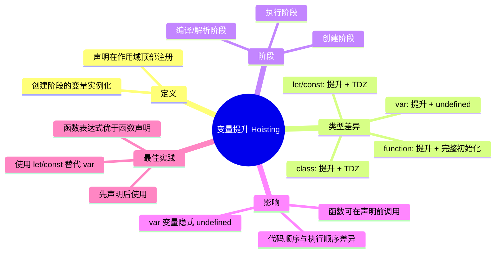
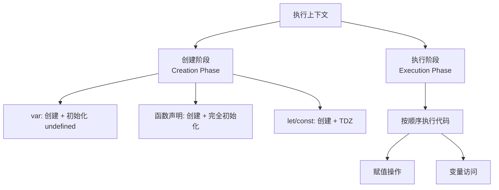
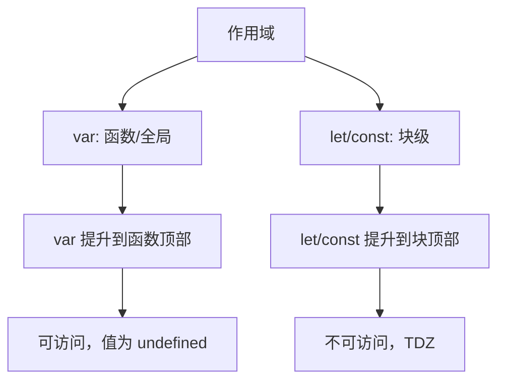
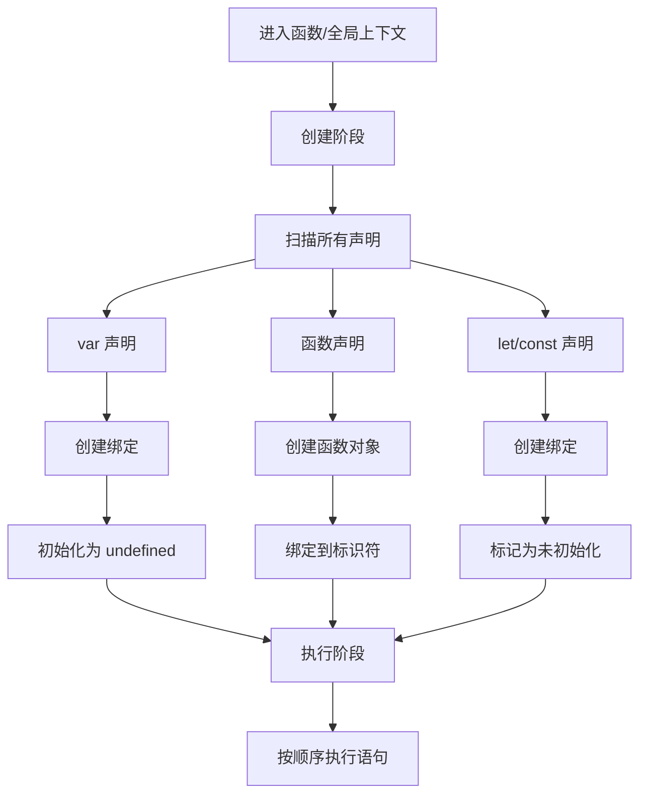
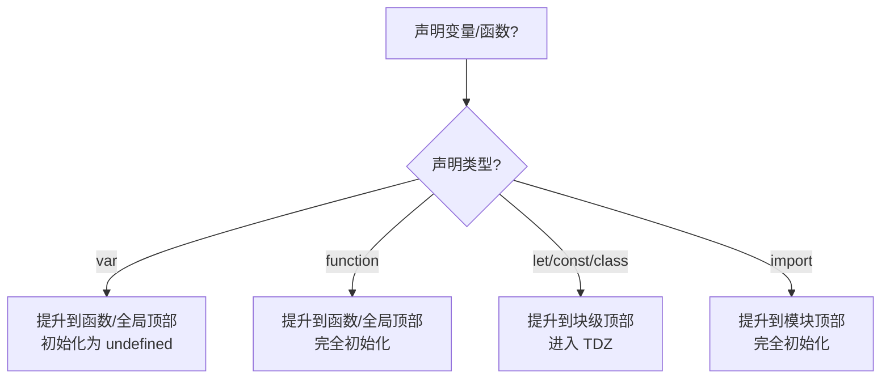
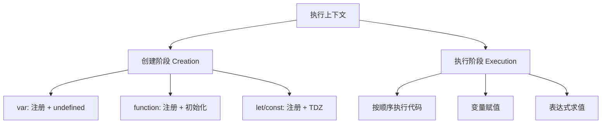

# 变量提升（Hoisting）

> **形式化定义**：变量提升（Hoisting）是 ECMAScript 执行上下文创建阶段（Creation Phase）的语义行为，指在代码执行前，JavaScript 引擎将所有 `var` 声明和函数声明（Function Declaration）提升到其作用域顶部的过程。`var` 声明被提升并初始化为 `undefined`；函数声明被提升并完全初始化（包括函数体）；`let`/`const`/`class` 声明也被提升，但进入暂时性死区（TDZ），访问时抛出 `ReferenceError`。
>
> 对齐版本：ECMAScript 2025 (ES16) §8.1.1.2

---

## 1. 概念定义 (Concept Definition)

### 1.1 形式化定义

ECMA-262 §8.1.1.2 *CreateMutableBinding(N, D)* 和 §9.2 *ECMAScript Function Objects* 定义了提升的语义基础。

变量提升的本质是**执行上下文创建阶段**的变量实例化（Variable Instantiation）：

| 声明类型 | 提升行为 | 初始化值 | 可访问性 |
|---------|---------|---------|---------|
| `var` | 是 | `undefined` | 声明前可访问（值为 `undefined`） |
| 函数声明 | 是 | 完整的函数对象 | 声明前可调用 |
| `let` | 是 | 无（TDZ） | 声明前 `ReferenceError` |
| `const` | 是 | 无（TDZ） | 声明前 `ReferenceError` |
| `class` | 是 | 无（TDZ） | 声明前 `ReferenceError` |
| `import` | 是 | 模块导出值 | 声明前可访问（模块语义） |

### 1.2 概念层级图谱



---

## 2. 属性与特征 (Properties & Characteristics)

### 2.1 提升行为矩阵

| 声明 | 作用域 | 提升 | 初始化时机 | 声明前访问 |
|------|--------|------|-----------|-----------|
| `var x` | 函数/全局 | ✅ | 创建阶段 | `undefined` |
| `function f(){}` | 函数/全局 | ✅ | 创建阶段 | 完整函数 |
| `let x` | 块级 | ✅ | 执行到声明 | `ReferenceError` |
| `const x` | 块级 | ✅ | 执行到声明 | `ReferenceError` |
| `class C` | 块级 | ✅ | 执行到声明 | `ReferenceError` |
| `import {x}` | 模块 | ✅ | 模块加载 | 模块导出值 |

### 2.2 执行上下文的两阶段



---

## 3. 关系分析 (Relationship Analysis)

### 3.1 提升与作用域的关系



### 3.2 函数声明 vs 函数表达式

```javascript
// ✅ 函数声明：被提升
declared(); // 可以调用！
function declared() {
  console.log("declared");
}

// ❌ 函数表达式：不被提升
// expressed(); // TypeError: expressed is not a function
var expressed = function() {
  console.log("expressed");
};
```

---

## 4. 机制解释 (Mechanism Explanation)

### 4.1 变量实例化流程



### 4.2 实际代码的等效转换

```javascript
// 原始代码
function example() {
  console.log(a); // undefined
  console.log(b); // ReferenceError

  var a = 1;
  let b = 2;
}

// 引擎实际处理（概念等效）
function example() {
  var a = undefined;  // var 提升
  let b;              // let 提升（但处于 TDZ）

  console.log(a);     // undefined
  console.log(b);     // ReferenceError!

  a = 1;
  b = 2;              // TDZ 结束
}
```

---

## 5. 论证与分析 (Argumentation & Analysis)

### 5.1 为什么函数声明可以被提升？

函数声明提升是 JavaScript 设计中**有意为之**的特性，支持**互递归函数**的定义：

```javascript
// 互递归：even 和 odd 互相调用
function even(n) {
  return n === 0 || odd(n - 1);
}

function odd(n) {
  return n !== 0 && even(n - 1);
}

console.log(even(4)); // true
console.log(odd(3));  // true
```

### 5.2 var 提升的负面影响

| 问题 | 示例 | 后果 |
|------|------|------|
| 隐式 undefined | `console.log(x); var x = 1;` | 意外行为 |
| 重复声明 | `var x = 1; var x = 2;` | 静默覆盖 |
| 穿透块级 | `if (true) { var x = 1; }` | 泄漏到外部 |

### 5.3 常见误区

**误区 1**：只有 `var` 被提升

```javascript
// ❌ let/const 也被提升，只是进入 TDZ
console.log(a); // ReferenceError（说明 a 已注册）
let a = 1;
```

**误区 2**：函数表达式被提升

```javascript
// ❌ 只有函数声明被提升
foo(); // TypeError: foo is not a function
var foo = function() {};

// 实际等效于：
var foo = undefined;
foo(); // undefined is not a function
foo = function() {};
```

---

## 6. 实例与示例 (Examples)

### 6.1 正例：函数声明提升的合理使用

```javascript
// ✅ 互递归定义
function isEven(n) {
  if (n === 0) return true;
  return isOdd(n - 1);
}

function isOdd(n) {
  if (n === 0) return false;
  return isEven(n - 1);
}

// ✅ 代码组织：辅助函数定义在使用之后
function main() {
  console.log("Starting...");
  helper();
}

function helper() {
  console.log("Helper called");
}

main();
```

### 6.2 反例：var 提升陷阱

```javascript
// ❌ 隐式 undefined 导致意外行为
var name = "global";

function greet() {
  console.log(name); // undefined（不是 "global"！）
  var name = "local";
  console.log(name); // "local"
}

greet();

// 实际等效于：
function greet() {
  var name = undefined; // 提升
  console.log(name);    // undefined
  name = "local";
  console.log(name);    // "local"
}
```

### 6.3 边缘案例

```javascript
// 边缘 1：函数声明与 var 的冲突
var foo = 1;
function foo() {}
console.log(typeof foo); // "number"（var 赋值覆盖了函数声明）

// 边缘 2：块级中的函数声明（非严格模式）
if (true) {
  function blockFn() { return "block"; }
}
console.log(blockFn()); // "block"（块级函数提升）

// 边缘 3：TDZ 中的暂时性访问
let x = x + 1; // ReferenceError: Cannot access 'x' before initialization
```

---

## 7. 权威参考与国际化对齐 (References)

### 7.1 ECMA-262 规范

- **§8.1.1.2 CreateMutableBinding** — 可变绑定的创建
- **§9.2.6 FunctionInitialize** — 函数对象的初始化
- **§14.3.1.1 Variable Statement** — var 声明的语义

### 7.2 MDN Web Docs

- **MDN: Hoisting** — <https://developer.mozilla.org/en-US/docs/Glossary/Hoisting>
- **MDN: var** — <https://developer.mozilla.org/en-US/docs/Web/JavaScript/Reference/Statements/var>

---

## 8. 思维表征总结 (Cognitive Representations)

### 8.1 提升行为决策树



### 8.2 提升对比速查表

| 声明 | 提升到 | 初始化 | 声明前可用? |
|------|--------|--------|------------|
| `var x` | 函数/全局顶部 | `undefined` | ✅ |
| `function f(){}` | 函数/全局顶部 | 完整函数 | ✅ |
| `let x` | 块级顶部 | TDZ | ❌ |
| `const x` | 块级顶部 | TDZ | ❌ |
| `class C` | 块级顶部 | TDZ | ❌ |

---

## 9. TypeScript 中的提升

### 9.1 类型安全的提升

TypeScript 编译器在编译时即可检测提升相关的问题：

```typescript
// ✅ 编译错误
console.log(x); // Error: Variable 'x' is used before being assigned
let x: number = 1;

// ✅ 函数声明提升是类型安全的
console.log(greet("World")); // ✅ 允许
function greet(name: string): string {
  return `Hello, ${name}`;
}
```

### 9.2 块级函数声明

```typescript
// TypeScript 中块级函数声明在 ES2015+ 目标下
if (true) {
  function blockScoped() { return true; }
}
// blockScoped(); // Error in strict TS
```

---

## 10. 现代最佳实践

### 10.1 避免提升问题的策略

```javascript
// ✅ 策略 1：始终先声明后使用
const config = { host: "localhost" };
function process() {
  return config.host;
}

// ✅ 策略 2：使用函数表达式（不被提升）
const process = () => config.host;

// ✅ 策略 3：使用 ESLint 规则
// "no-use-before-define": "error"
```

### 10.2 ES 模块中的提升

```javascript
// 模块中的提升行为
console.log(importedValue); // ✅ 允许，import 被提升
import { importedValue } from "./module.js";

// export 也有提升行为
export { value }; // value 可在后面定义
const value = 1;
```

---

## 11. 历史演进与替代方案

### 11.1 var 到 let/const 的演进

| 时期 | 主导声明 | 原因 |
|------|---------|------|
| ES5 及以前 | `var` | 唯一选择 |
| ES6 (2015) | `var` + `let`/`const` | 新特性引入 |
| ES2017+ | `let`/`const` | 社区推荐 |
| 现代 (2024+) | `const` > `let` > `var` | ESLint, Prettier 默认 |

### 11.2 IIFE 到块级作用域的演进

```javascript
// ES5：使用 IIFE 创建块级作用域
var results = [];
for (var i = 0; i < 3; i++) {
  (function(capturedI) {
    results.push(function() { return capturedI; });
  })(i);
}

// ES6+：let 天然支持块级作用域
const results2 = [];
for (let i = 0; i < 3; i++) {
  results2.push(() => i);
}
```

---

## 12. 思维模型总结

### 12.1 提升行为速查矩阵

| 声明类型 | 作用域 | 提升 | 声明前状态 | 可访问性 |
|---------|--------|------|-----------|---------|
| `var x` | 函数/全局 | ✅ | `undefined` | ✅ 可访问 |
| `function f(){}` | 函数/全局 | ✅ | 完整函数对象 | ✅ 可调用 |
| `let x` | 块级 | ✅ | 未初始化（TDZ） | ❌ ReferenceError |
| `const x` | 块级 | ✅ | 未初始化（TDZ） | ❌ ReferenceError |
| `class C` | 块级 | ✅ | 未初始化（TDZ） | ❌ ReferenceError |
| `import {x}` | 模块 | ✅ | 模块导出值 | ✅ 可访问 |

### 11.2 执行上下文两阶段模型



---

## 12. 权威参考完整列表

| 来源 | 链接 | 相关章节 |
|------|------|---------|
| ECMA-262 | tc39.es/ecma262 | §8.1.1.2, §9.2.6, §14.3.1, §13.3.1 |
| MDN | developer.mozilla.org | Glossary/Hoisting |
| TypeScript | typescriptlang.org | Variable Declarations |

### 12.1 核心规范引用

- **§8.1.1.2 CreateMutableBinding** — 可变绑定创建
- **§9.2.6 FunctionInitialize** — 函数初始化
- **§14.3.1.1 Variable Statement** — var 声明语义
- **§13.3.1 Let and Const Declarations** — let/const 声明语义
- **§14.6 Class Definitions** — class 声明与 TDZ

---

**参考规范**：ECMA-262 §8.1.1.2 | MDN: Hoisting | TypeScript Handbook

---

## 9. 公理化表述与形式证明 (Axiomatization & Formal Proof)

### 9.1 变量系统的公理化基础

**公理 1（词法作用域确定性）**：变量的解析位置在代码编写时即确定，与调用位置无关。

**公理 2（闭包捕获持久性）**：函数对象存活期间，其捕获的词法环境引用持续有效。

**公理 3（TDZ 不可访问性）**：let/const 声明前的变量绑定不可访问，访问即抛 ReferenceError。

### 9.2 定理与证明

**定理 1（var 提升的语义等价性）**：ar x = 1 的代码与先声明 ar x 再赋值 x = 1 在语义上等价。

*证明*：ECMA-262 §14.3.1.1 规定 var 声明在进入执行上下文时即创建绑定并初始化为 undefined。因此代码的实际执行顺序为：创建绑定 → 初始化为 undefined → 执行赋值语句。
∎

**定理 2（闭包变量共享）**：同一外部函数中的多个内部函数共享同一个词法环境引用。

*证明*：所有内部函数在创建时 [[Environment]] 均指向同一个外部词法环境对象。因此它们访问的是同一组变量绑定。
∎

### 9.3 真值表：var vs let vs const

| 操作 | var | let | const |
|------|-----|-----|-------|
| 声明前访问 | undefined | ReferenceError | ReferenceError |
| 重复声明 | ✅ | ❌ | ❌ |
| 重新赋值 | ✅ | ✅ | ❌ |
| 全局对象属性 | ✅ | ❌ | ❌ |
| 块级作用域 | ❌ | ✅ | ✅ |

---

## 10. 推理链与演绎分析 (Deductive Reasoning Chain)

### 10.1 演绎推理：变量声明到运行时行为

`mermaid
graph TD
    A[声明变量] --> B{声明类型?}
    B -->|var| C[函数作用域]
    B -->|let| D[块级作用域 + TDZ]
    B -->|const| E[块级作用域 + TDZ + 不可变]
    C --> F[提升为 undefined]
    D --> G[提升进入 TDZ]
    E --> H[提升进入 TDZ]
    F --> I[可正常访问]
    G --> J[声明前访问报错]
    H --> J
`

### 10.2 归纳推理：从运行时错误推导声明问题

| 运行时错误 | 根源问题 | 解决方案 |
|-----------|---------|---------|
| Cannot access before initialization | TDZ 访问 | 将声明移到访问之前 |
| Assignment to constant variable | const 重新赋值 | 改用 let 或避免重新赋值 |
| x is not defined | 变量未声明 | 添加声明或检查拼写 |

### 10.3 反事实推理

> **反设**：如果 JavaScript 从一开始就设计为只有 let/const，没有 var。
> **推演结果**：
>
> 1. 不存在变量提升导致的意外行为
> 2. 所有变量都有块级作用域
> 3. 早期 JavaScript 代码需要大量重构
> 4. 与现有浏览器兼容性断裂
> **结论**：var 的存在是历史遗留，let/const 的引入是语言演进的正确方向。

---
