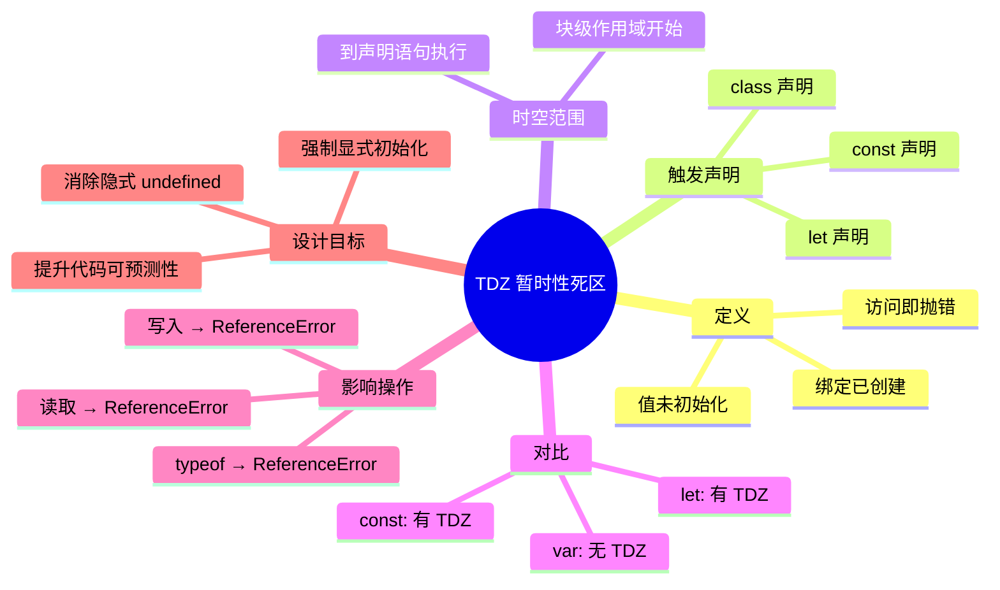
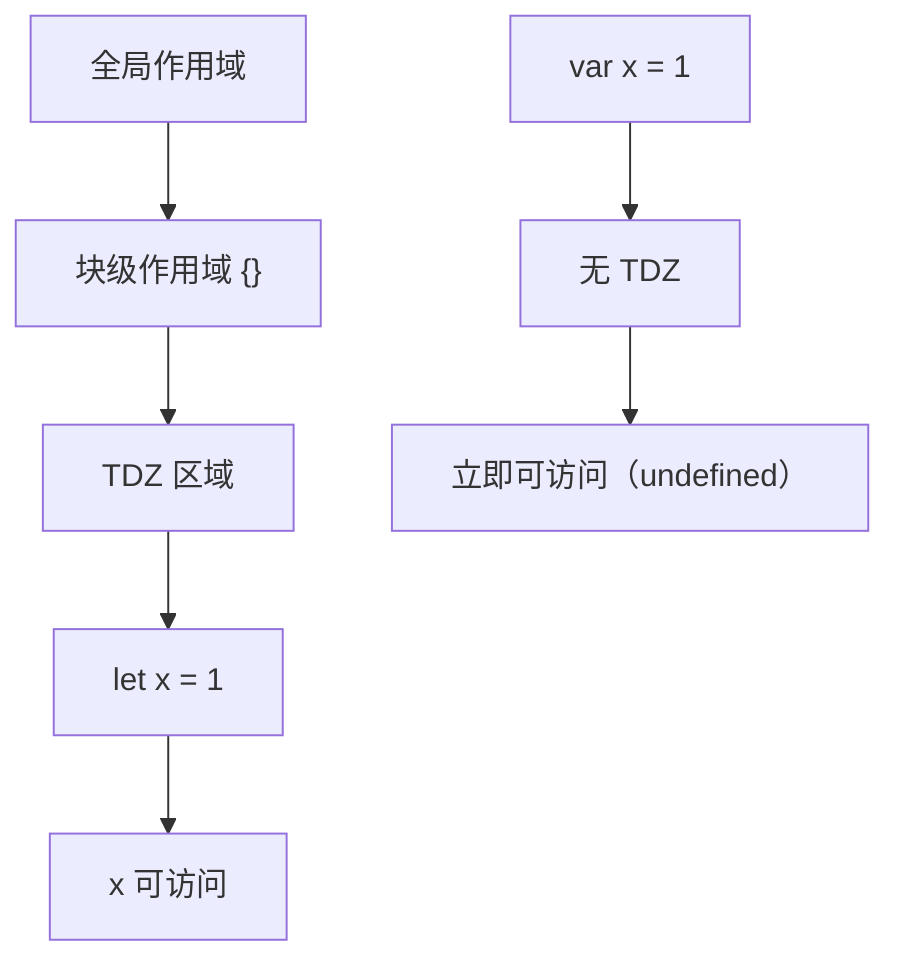
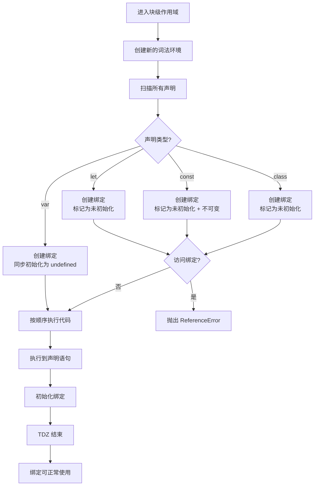

# 暂时性死区（Temporal Dead Zone）

> **形式化定义**：暂时性死区（Temporal Dead Zone, TDZ）是 ECMAScript 规范中 `let`、`const` 和 `class` 声明的核心语义特性，指从**块级作用域创建**到**变量声明语句执行**之间的时间段。在此期间，变量绑定已存在于词法环境的声明式环境记录（Declarative Environment Record）中，但处于**未初始化状态**（uninitialized binding），任何读取、写入或 `typeof` 操作都会抛出 `ReferenceError: Cannot access 'x' before initialization`。
>
> TDZ 是 ES6 引入 `let`/`const` 时设计的核心安全机制，旨在彻底消除 `var` 声明提升（Hoisting）导致的隐式 `undefined` 访问问题。对齐版本：ECMAScript 2025 (ES16) §8.1.1.5.3。

---

## 1. 概念定义 (Concept Definition)

### 1.1 形式化定义

ECMA-262 §8.1.1.5.3 *GetBindingValue(N, S)* 算法：

> *"If the binding for N in envRec is an **uninitialized binding**, throw a **ReferenceError** exception."*

变量绑定的生命周期三阶段：

| 阶段 | 规范操作 | `var` | `let`/`const`/`class` |
|------|---------|-------|----------------------|
| **创建** CreateBinding | 在环境记录中注册标识符 | 作用域入口 | 作用域入口 |
| **初始化** InitializeBinding | 设置绑定的初始值 | 创建时同步（`undefined`） | 声明语句执行时 |
| **赋值** SetMutableBinding | 修改绑定值 | 赋值语句执行时 | 赋值语句执行时（`const` 禁止） |

**TDZ = 阶段1完成 → 阶段2开始之间的时空间隙**

### 1.2 概念层级图谱



---

## 2. 属性与特征 (Properties & Characteristics)

### 2.1 TDZ 核心属性矩阵

| 属性 | 说明 | 示例 |
|------|------|------|
| 作用域类型 | 块级 `{}` | `if`/`for`/`while`/`{}` 块 |
| 声明类型 | `let` / `const` / `class` | `let x = 1` |
| 错误类型 | `ReferenceError` | `Cannot access 'x' before initialization` |
| `typeof` 安全 | **否**（与未声明变量不同） | `typeof tdzVar` → 报错 |
| 函数参数 | 默认参数存在 TDZ | `function f(a = b, b) {}` |
| 循环变量 | 每次迭代新绑定，各自 TDZ | `for (let i = 0; i < 3; i++)` |
| 时间跨度 | 作用域入口 → 声明语句 | 物理行号差 |

### 2.2 TDZ 的时空可视化

```javascript
{
  // ═══════════════════════════════════════
  // │           TDZ 开始                    │
  // │                                       │
  // │  console.log(x); // ❌ ReferenceError │
  // │                                       │
  // │  typeof x;       // ❌ ReferenceError │
  // │                                       │
  // ═══════════════════════════════════════

  let x = 1;  // ← TDZ 结束，初始化完成

  console.log(x); // ✅ 1
}
```

---

## 3. 关系分析 (Relationship Analysis)

### 3.1 TDZ 与作用域链的关系



### 3.2 typeof 的语义差异

```javascript
// 未声明变量：typeof 安全
console.log(typeof undeclaredVar); // "undefined"（安全）

// TDZ 变量：typeof 不安全
console.log(typeof tdzVar);        // ❌ ReferenceError!
let tdzVar;
```

| 场景 | 结果 | 原因 |
|------|------|------|
| `typeof undeclared` | `"undefined"` | 标识符未在任何环境记录中注册 |
| `typeof tdzVar` | `ReferenceError` | 标识符已注册但未初始化 |

---

## 4. 机制解释 (Mechanism Explanation)

### 4.1 执行上下文的变量实例化流程



### 4.2 默认参数的 TDZ 机制

```javascript
// 参数列表也有自己的作用域
function foo(a = b, b) {
  // 参数作用域: a, b
  // a 的默认值 b 在 b 的 TDZ 中访问
}

foo(undefined, 1); // ❌ ReferenceError: Cannot access 'b' before initialization
```

**执行过程**：

```
1. 创建参数作用域
2. 注册 a, b
3. 评估 a 的默认值 → 需要访问 b
4. b 处于 TDZ → ReferenceError
```

**修复**：调整参数顺序

```javascript
function foo(b, a = b) { // ✅ b 先初始化
  return a;
}
foo(1); // 1
```

---

## 5. 论证与分析 (Argumentation & Analysis)

### 5.1 为什么需要 TDZ？

| 问题 | `var` 的静默失败 | `let`/`const` 的显式报错 |
|------|----------------|------------------------|
| 声明前访问 | `undefined` | `ReferenceError` |
| 调试难度 | 高（隐式错误传播） | 低（立即失败） |
| 代码可读性 | 声明位置不明确 | 强制先声明后使用 |
| 运行时安全 | 低 | 高 |

### 5.2 TDZ 的争议与权衡

| 观点 | 论据 |
|------|------|
| **支持 TDZ** | 消除隐式错误、强制显式初始化、提升代码质量 |
| **批评 TDZ** | `typeof` 不一致性、学习曲线陡峭、遗留代码迁移成本 |

### 5.3 typeof 的不一致性

```javascript
// 这个不一致是设计上的权衡
if (typeof x === "undefined") {
  // 对未声明变量安全
}

// 但对 TDZ 变量不安全
try {
  typeof x; // ReferenceError!
  let x;
} catch (e) {
  console.log(e.message); // Cannot access 'x' before initialization
}
```

---

## 6. 实例与示例 (Examples)

### 6.1 正例：TDZ 防止逻辑错误

```javascript
// ❌ var：隐式 undefined 导致意外行为
function varExample() {
  console.log(value); // undefined（不是错误！）
  if (value === undefined) {
    value = "default"; // 意外进入此分支
  }
  var value = "actual";
  return value;
}

// ✅ let：TDZ 强制显式处理
function letExample() {
  // console.log(value); // ❌ ReferenceError（立即发现错误）
  let value = "actual";
  return value;
}
```

### 6.2 反例：typeof 陷阱

```javascript
// ❌ 危险代码
function checkFeature() {
  if (typeof newFeature === "undefined") {
    // 准备降级处理
  }
  let newFeature = loadFeature(); // ❌ 上面的 typeof 已抛出 ReferenceError!
}

// ✅ 修复：确保声明在 typeof 之前
function checkFeatureFixed() {
  let newFeature;
  if (typeof newFeature === "undefined") {
    newFeature = loadFeature();
  }
}
```

### 6.3 边缘案例

```javascript
// 边缘 1：循环中的 TDZ
for (let i = 0; i < 3; i++) {
  // 每次迭代创建新的 i，各自有独立的 TDZ
  setTimeout(() => console.log(i), 0); // 0, 1, 2
}

// 边缘 2：switch 块共享作用域
switch (1) {
  case 1:
    let x = 1;
    break;
  case 2:
    // let x = 2; // ❌ SyntaxError: Identifier 'x' has already been declared
    // 因为 switch 的 {} 是同一个块级作用域
}

// ✅ 修复：添加嵌套块
switch (1) {
  case 1: {
    let x = 1;
    break;
  }
  case 2: {
    let x = 2; // ✅ 不同的块级作用域
    break;
  }
}

// 边缘 3：const 的自我引用
// const x = x + 1; // ❌ ReferenceError!
// 右侧的 x 在 TDZ 中
```

---

## 7. 权威参考与国际化对齐 (References)

### 7.1 ECMA-262 规范

- **§8.1.1.5.3 GetBindingValue(N, S)** — TDZ 的核心规范定义
- **§13.3.1 Let and Const Declarations** — let/const 声明的语法和语义
- **§14.6 Class Definitions** — class 声明的 TDZ 行为

### 7.2 TypeScript 官方文档

- **TypeScript Handbook: Variable Declarations** — <https://www.typescriptlang.org/docs/handbook/variable-declarations.html>

### 7.3 MDN Web Docs

- **MDN: let > Temporal Dead Zone** — <https://developer.mozilla.org/en-US/docs/Web/JavaScript/Reference/Statements/let#temporal_dead_zone_tdz>
- **MDN: const** — <https://developer.mozilla.org/en-US/docs/Web/JavaScript/Reference/Statements/const>

---

## 8. 思维表征总结 (Cognitive Representations)

### 8.1 TDZ 时间线模型

```
┌─────────────────────────────────────────┐
│  块级作用域开始                            │
│      │                                  │
│      ▼                                  │
│  ┌─────────────────────────────────┐    │
│  │        TDZ（暂时性死区）          │    │
│  │                                 │    │
│  │  let x;  ← 声明语句              │    │
│  │                                 │    │
│  │  之前访问 x → ReferenceError     │    │
│  │  typeof x → ReferenceError       │    │
│  │                                 │    │
│  └─────────────────────────────────┘    │
│      │                                  │
│      ▼                                  │
│  x 初始化完成，可正常使用                   │
└─────────────────────────────────────────┘
```

### 8.2 var vs let vs const 行为对比

| 操作 | `var x` | `let x` | `const x` |
|------|---------|---------|-----------|
| 作用域开始 | 绑定 + 初始化 undefined | 绑定，未初始化 | 绑定，未初始化 |
| 声明前访问 | `undefined` | `ReferenceError` | `ReferenceError` |
| `typeof` | `"undefined"` | `ReferenceError` | `ReferenceError` |
| 声明时初始化 | 可选 | 可选 | **必需** |
| 重新赋值 | ✅ | ✅ | ❌ |

---

## 9. TypeScript 中的 TDZ 扩展

### 9.1 编译时检测

TypeScript 编译器在编译阶段即可检测部分 TDZ 违规：

```typescript
// ✅ TS 编译错误（比运行时更早发现）
function test() {
  console.log(x); // Error: Block-scoped variable 'x' used before its declaration
  let x = 1;
}

// ✅ 使用 beforeInit 检查
let y: number;
// console.log(y); // Error: Variable 'y' is used before being assigned
y = 1;
```

### 9.2 严格模式下的额外检查

```typescript
// strictNullChecks + noImplicitAny
function maybeInit(cond: boolean) {
  let value: string;
  if (cond) {
    value = "initialized";
  }
  // console.log(value); // Error: Variable 'value' is used before being assigned
  return value; // 可能也是 Error
}
```

---

## 10. TDZ 与工程实践

### 10.1 避免 TDZ 错误的模式

```javascript
// ✅ 模式 1：始终先声明后使用
function good() {
  const config = loadConfig();
  const result = process(config);
  return result;
}

// ✅ 模式 2：使用默认值避免未初始化
function greet(name = "World") {
  return `Hello, ${name}`;
}

// ✅ 模式 3：IIFE 隔离作用域
const value = (() => {
  const temp = compute();
  return transform(temp);
})();
```

### 10.2 常见 Pitfalls

| 陷阱 | 示例 | 修复 |
|------|------|------|
| 循环中的函数 | `for (let i; i<3; i++) fns.push(()=>i)` | 使用 let 而非 var |
| 默认参数互引 | `function f(a=b, b) {}` | 调整参数顺序 |
| switch 块内 | `case 1: let x; case 2: let x` | 添加块级作用域 `{}` |
| typeof 误用 | `typeof x` 在 TDZ 中 | 确保声明在 typeof 之前 |

---

## 11. TDZ 的历史演进

### 11.1 ES6 (2015) 引入

- `let` 和 `const` 首次引入 TDZ 语义
- 旨在修复 `var` 的提升导致的意外行为

### 11.2 ES2015+ 完善

- ES2015：`class` 声明也引入 TDZ
- ES2020：`globalThis` 不暴露 `let`/`const` 绑定
- ES2022：Class Fields 与 TDZ 的交互规范

### 11.3 引擎实现演进

| 引擎 | TDZ 支持 | 优化 |
|------|---------|------|
| V8 (Chrome/Node) | 完整 | TurboFan 消除冗余检查 |
| SpiderMonkey (Firefox) | 完整 | IonMonkey 优化 |
| JavaScriptCore (Safari) | 完整 | DFG/FTE 优化 |

---

**参考规范**：ECMA-262 §8.1.1.5.3 | MDN: Temporal Dead Zone | TypeScript Handbook

---

## 9. 公理化表述与形式证明 (Axiomatization & Formal Proof)

### 9.1 变量系统的公理化基础

**公理 1（词法作用域确定性）**：变量的解析位置在代码编写时即确定，与调用位置无关。

**公理 2（闭包捕获持久性）**：函数对象存活期间，其捕获的词法环境引用持续有效。

**公理 3（TDZ 不可访问性）**：let/const 声明前的变量绑定不可访问，访问即抛 ReferenceError。

### 9.2 定理与证明

**定理 1（var 提升的语义等价性）**：ar x = 1 的代码与先声明 ar x 再赋值 x = 1 在语义上等价。

*证明*：ECMA-262 §14.3.1.1 规定 var 声明在进入执行上下文时即创建绑定并初始化为 undefined。因此代码的实际执行顺序为：创建绑定 → 初始化为 undefined → 执行赋值语句。
∎

**定理 2（闭包变量共享）**：同一外部函数中的多个内部函数共享同一个词法环境引用。

*证明*：所有内部函数在创建时 [[Environment]] 均指向同一个外部词法环境对象。因此它们访问的是同一组变量绑定。
∎

### 9.3 真值表：var vs let vs const

| 操作 | var | let | const |
|------|-----|-----|-------|
| 声明前访问 | undefined | ReferenceError | ReferenceError |
| 重复声明 | ✅ | ❌ | ❌ |
| 重新赋值 | ✅ | ✅ | ❌ |
| 全局对象属性 | ✅ | ❌ | ❌ |
| 块级作用域 | ❌ | ✅ | ✅ |

---

## 10. 推理链与演绎分析 (Deductive Reasoning Chain)

### 10.1 演绎推理：变量声明到运行时行为

`mermaid
graph TD
    A[声明变量] --> B{声明类型?}
    B -->|var| C[函数作用域]
    B -->|let| D[块级作用域 + TDZ]
    B -->|const| E[块级作用域 + TDZ + 不可变]
    C --> F[提升为 undefined]
    D --> G[提升进入 TDZ]
    E --> H[提升进入 TDZ]
    F --> I[可正常访问]
    G --> J[声明前访问报错]
    H --> J
`

### 10.2 归纳推理：从运行时错误推导声明问题

| 运行时错误 | 根源问题 | 解决方案 |
|-----------|---------|---------|
| Cannot access before initialization | TDZ 访问 | 将声明移到访问之前 |
| Assignment to constant variable | const 重新赋值 | 改用 let 或避免重新赋值 |
| x is not defined | 变量未声明 | 添加声明或检查拼写 |

### 10.3 反事实推理

> **反设**：如果 JavaScript 从一开始就设计为只有 let/const，没有 var。
> **推演结果**：
>
> 1. 不存在变量提升导致的意外行为
> 2. 所有变量都有块级作用域
> 3. 早期 JavaScript 代码需要大量重构
> 4. 与现有浏览器兼容性断裂
> **结论**：var 的存在是历史遗留，let/const 的引入是语言演进的正确方向。

---
