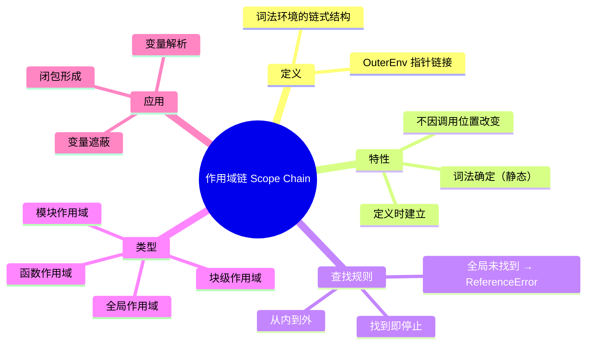
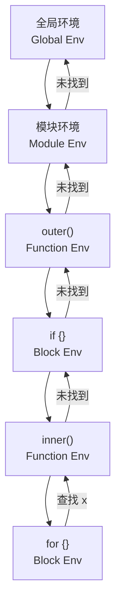

# 作用域链（Scope Chain）

> **形式化定义**：作用域链（Scope Chain）是 ECMAScript 规范中变量解析的查找机制，由一系列**词法环境（Lexical Environment）**按创建顺序链接而成。当引擎需要解析一个标识符时，从当前执行上下文的词法环境开始，沿着 `[[OuterEnv]]` 指针逐级向上查找，直到找到该标识符或到达全局环境。作用域链是静态（词法）确定的，在函数定义时建立，不因调用位置改变。
>
> 对齐版本：ECMAScript 2025 (ES16) §8.1

---

## 1. 概念定义 (Concept Definition)

### 1.1 形式化定义

ECMA-262 §8.1 *Lexical Environments* 定义了作用域链的构成：

> *"A Lexical Environment consists of an Environment Record and a possibly null reference to an outer Lexical Environment."*

作用域链的数学表示：

```
ScopeChain = [LocalEnv, OuterEnv₁, OuterEnv₂, ..., GlobalEnv]
```

其中每个环境通过 `[[OuterEnv]]` 内部槽链接。

### 1.2 概念层级图谱



---

## 2. 属性与特征 (Properties & Characteristics)

### 2.1 作用域链属性矩阵

| 属性 | 说明 |
|------|------|
| 确定性 | 词法（静态）确定，非动态 |
| 方向 | 单向从内到外，不可逆向 |
| 深度 | 理论上无限制（受调用栈限制） |
| 查找复杂度 | O(n)，n 为链深度 |
| 可变性 | 运行时不可修改链结构 |

### 2.2 作用域类型对比

| 作用域类型 | 创建时机 | 生命周期 | OuterEnv |
|-----------|---------|---------|---------|
| 全局 | 脚本/模块开始 | 持续 | `null` |
| 函数 | 函数调用 | 函数执行期间 | 定义时的环境 |
| 块级 | 进入块 | 块执行期间 | 当前环境 |
| 模块 | 模块加载 | 模块存活期间 | 全局 |
| with/eval | 运行时 | 动态 | 动态 |

---

## 3. 关系分析 (Relationship Analysis)

### 3.1 作用域链结构图



### 3.2 作用域链与闭包的关系

```mermaid
graph LR
    A[函数定义] --> B[捕获当前作用域链]
    B --> C[函数对象.[[Environment]]]
    C --> D[在其他位置调用]
    D --> E[使用捕获的作用域链解析变量]
    E --> F[闭包形成]
```

---

## 4. 机制解释 (Mechanism Explanation)

### 4.1 变量解析算法

ECMA-262 §8.1.2.1 *ResolveBinding(name)* 算法：

```
1. 获取当前执行上下文的词法环境 env
2. 在 env 的环境记录中查找 name
3. 如果找到，返回绑定
4. 如果未找到，获取 env.[[OuterEnv]]
5. 如果 OuterEnv 为 null，抛出 ReferenceError
6. 否则，env = OuterEnv，回到步骤 2
```

### 4.2 代码示例

```javascript
const globalVar = "global";

function outer() {
  const outerVar = "outer";

  function inner() {
    const innerVar = "inner";

    console.log(innerVar);  // "inner"（当前环境）
    console.log(outerVar);  // "outer"（OuterEnv）
    console.log(globalVar); // "global"（全局环境）
  }

  inner();
}

outer();
```

**作用域链**：`inner env → outer env → global env`

---

## 5. 论证与分析 (Argumentation & Analysis)

### 5.1 作用域链的性能影响

| 场景 | 影响 | 优化 |
|------|------|------|
| 深层作用域链 | 查找时间增加 | 引擎缓存常用变量 |
| 全局变量访问 | 最慢（需遍历整个链） | 使用局部变量缓存 |
| with/eval | 破坏优化 | 避免使用 |

### 5.2 变量遮蔽（Shadowing）

```javascript
const x = "global";

function outer() {
  const x = "outer"; // 遮蔽全局 x

  function inner() {
    const x = "inner"; // 遮蔽 outer 的 x
    console.log(x); // "inner"
  }

  inner();
  console.log(x); // "outer"
}

outer();
console.log(x); // "global"
```

### 5.3 常见误区

**误区 1**：作用域链是动态的

```javascript
// ❌ 错误认知
const obj = {
  name: "obj",
  getName: function() {
    return this.name;
  }
};

const fn = obj.getName;
fn(); // undefined（this 是动态的，但作用域链是静态的）
```

**误区 2**：`with` 语句改变作用域链

```javascript
// ❌ 避免使用 with
with (Math) {
  console.log(PI); // 3.14159
  // with 动态添加对象到作用域链前端
  // 严重破坏引擎优化，严格模式禁止
}
```

---

## 6. 实例与示例 (Examples)

### 6.1 正例：作用域链的合理使用

```javascript
// ✅ 模块化模式
const Module = (function() {
  const privateVar = "secret"; // 私有变量

  function privateFn() {
    return privateVar;
  }

  return {
    publicFn() {
      return privateFn(); // 通过作用域链访问私有变量
    }
  };
})();

Module.publicFn(); // "secret"
```

### 6.2 反例：全局变量污染

```javascript
// ❌ 全局变量依赖
let count = 0; // 全局变量

function increment() {
  return ++count; // 依赖全局作用域链查找
}

// ✅ 修复：使用参数和返回值
function incrementSafe(count) {
  return count + 1;
}
```

### 6.3 边缘案例

```javascript
// 边缘 1：catch 块的作用域
const e = "global";
try {
  throw new Error("test");
} catch (e) { // catch 参数在块级作用域中
  console.log(e.message); // "test"
}
console.log(e); // "global"

// 边缘 2：eval 动态作用域
const x = "global";
function test() {
  const x = "local";
  eval('console.log(x)'); // "local"（eval 使用当前作用域链）
}
test();
```

---

## 7. 权威参考与国际化对齐 (References)

### 7.1 ECMA-262 规范

- **§8.1 Lexical Environments** — 词法环境的定义
- **§8.1.2.1 ResolveBinding(name)** — 变量解析算法

### 7.2 MDN Web Docs

- **MDN: Scope** — <https://developer.mozilla.org/en-US/docs/Glossary/Scope>
- **MDN: Scope Chain** — <https://developer.mozilla.org/en-US/docs/Web/JavaScript/Closures#scope_chain>

---

## 8. 思维表征总结 (Cognitive Representations)

### 8.1 作用域链可视化

```
┌─────────────────────────────────────────────┐
│           全局环境                             │
│  ┌───────────────────────────────────────┐  │
│  │         outer() 环境                    │  │
│  │  ┌─────────────────────────────────┐  │  │
│  │  │       inner() 环境               │  │  │
│  │  │  ┌───────────────────────────┐  │  │  │
│  │  │  │     if {} 块级环境          │  │  │  │
│  │  │  │                             │  │  │  │
│  │  │  │  查找变量：                  │  │  │  │
│  │  │  │  1. 当前环境 → 2. inner →   │  │  │  │
│  │  │  │  3. outer → 4. 全局          │  │  │  │
│  │  │  └───────────────────────────┘  │  │  │
│  │  └─────────────────────────────────┘  │  │
│  └───────────────────────────────────────┘  │
└─────────────────────────────────────────────┘
```

### 8.2 作用域链 vs this 绑定对比

| 特性 | 作用域链 | this 绑定 |
|------|---------|----------|
| 确定性 | 词法（静态） | 动态 |
| 决定时机 | 函数定义时 | 函数调用时 |
| 修改方式 | 不可修改 | call/apply/bind |
| 查找方向 | 从内到外 | 由调用方式决定 |

---

## 9. TypeScript 中的作用域链

### 9.1 类型解析与作用域链

TypeScript 的类型解析也遵循类似的作用域链规则：

```typescript
// 类型作用域链
interface Global {
  name: string;
}

function outer() {
  interface Local {
    value: number;
  }

  function inner() {
    const obj: Local = { value: 1 }; // ✅ 通过作用域链访问 Local
    const global: Global = { name: "test" }; // ✅ 访问全局类型
  }
}
```

### 9.2 命名空间与作用域

```typescript
namespace Outer {
  export const x = 1;

  namespace Inner {
    export const y = 2;
    console.log(x); // ✅ 访问外部命名空间
  }
}
```

---

## 10. 作用域链与性能优化

### 10.1 变量查找优化策略

```javascript
// ❌ 深层作用域链查找
function process(data) {
  for (let i = 0; i < data.length; i++) {
    data[i] = data[i] * Math.PI; // 每次循环查找 Math
  }
}

// ✅ 缓存到局部作用域
function processOptimized(data) {
  const PI = Math.PI; // 缓存到局部作用域
  for (let i = 0; i < data.length; i++) {
    data[i] = data[i] * PI; // 局部查找，更快
  }
}
```

### 10.2 作用域链深度影响

| 链深度 | 查找复杂度 | 优化建议 |
|--------|-----------|---------|
| 1-2 层 | O(1) ~ O(2) | 无需优化 |
| 3-5 层 | O(3) ~ O(5) | 考虑缓存 |
| 5+ 层 | O(n) | 必须优化 |

---

## 11. 思维模型总结

### 11.1 作用域链可视化

```
查找变量 "x":

  ┌─────────────┐
  │  当前环境    │ ← 第1步：查找 x
  └──────┬──────┘
         │ 未找到
         ▼
  ┌─────────────┐
  │  外层环境    │ ← 第2步：查找 x
  └──────┬──────┘
         │ 未找到
         ▼
  ┌─────────────┐
  │  全局环境    │ ← 第3步：查找 x
  └──────┬──────┘
         │ 未找到
         ▼
     ReferenceError
```

### 11.2 作用域类型速查

| 类型 | 创建 | OuterEnv | 示例 |
|------|------|---------|------|
| 全局 | 脚本开始 | null | `const x = 1` |
| 函数 | 函数调用 | 定义时的环境 | `function f() {}` |
| 块级 | 进入 `{}` | 当前环境 | `if (true) {}` |
| 模块 | 模块加载 | 全局 | `export const x = 1` |

---

## 12. 作用域链与模块化

### 12.1 ES 模块的作用域链

```javascript
// module-a.js
export const a = 1;

// module-b.js
import { a } from "./module-a.js";
const b = 2;

// module-b 的作用域链：
// Module Env → Global Env
// a 和 b 都在 Module 的环境记录中
```

### 12.2 CommonJS 的作用域链

```javascript
// commonjs-module.js
const local = 1; // 模块局部变量
module.exports = { local };

// CommonJS 模块被包装在函数中：
// (function(exports, require, module, __filename, __dirname) {
//   // 模块代码
// })()
```

---

## 13. 思维模型总结

### 13.1 作用域链可视化

```
查找变量 "x":

  ┌─────────────┐
  │  当前环境    │ ← 第1步：查找 x
  └──────┬──────┘
         │ 未找到
         ▼
  ┌─────────────┐
  │  外层环境    │ ← 第2步：查找 x
  └──────┬──────┘
         │ 未找到
         ▼
  ┌─────────────┐
  │  全局环境    │ ← 第3步：查找 x
  └──────┬──────┘
         │ 未找到
         ▼
     ReferenceError
```

### 13.2 作用域类型速查

| 类型 | 创建 | OuterEnv | 示例 |
|------|------|---------|------|
| 全局 | 脚本开始 | null | `const x = 1` |
| 函数 | 函数调用 | 定义时的环境 | `function f() {}` |
| 块级 | 进入 `{}` | 当前环境 | `if (true) {}` |
| 模块 | 模块加载 | 全局 | `export const x = 1` |

---

**参考规范**：ECMA-262 §8.1 | MDN: Scope | TypeScript Handbook

---

## 9. 公理化表述与形式证明 (Axiomatization & Formal Proof)

### 9.1 变量系统的公理化基础

**公理 1（词法作用域确定性）**：变量的解析位置在代码编写时即确定，与调用位置无关。

**公理 2（闭包捕获持久性）**：函数对象存活期间，其捕获的词法环境引用持续有效。

**公理 3（TDZ 不可访问性）**：let/const 声明前的变量绑定不可访问，访问即抛 ReferenceError。

### 9.2 定理与证明

**定理 1（var 提升的语义等价性）**：ar x = 1 的代码与先声明 ar x 再赋值 x = 1 在语义上等价。

*证明*：ECMA-262 §14.3.1.1 规定 var 声明在进入执行上下文时即创建绑定并初始化为 undefined。因此代码的实际执行顺序为：创建绑定 → 初始化为 undefined → 执行赋值语句。
∎

**定理 2（闭包变量共享）**：同一外部函数中的多个内部函数共享同一个词法环境引用。

*证明*：所有内部函数在创建时 [[Environment]] 均指向同一个外部词法环境对象。因此它们访问的是同一组变量绑定。
∎

### 9.3 真值表：var vs let vs const

| 操作 | var | let | const |
|------|-----|-----|-------|
| 声明前访问 | undefined | ReferenceError | ReferenceError |
| 重复声明 | ✅ | ❌ | ❌ |
| 重新赋值 | ✅ | ✅ | ❌ |
| 全局对象属性 | ✅ | ❌ | ❌ |
| 块级作用域 | ❌ | ✅ | ✅ |

---

## 10. 推理链与演绎分析 (Deductive Reasoning Chain)

### 10.1 演绎推理：变量声明到运行时行为

`mermaid
graph TD
    A[声明变量] --> B{声明类型?}
    B -->|var| C[函数作用域]
    B -->|let| D[块级作用域 + TDZ]
    B -->|const| E[块级作用域 + TDZ + 不可变]
    C --> F[提升为 undefined]
    D --> G[提升进入 TDZ]
    E --> H[提升进入 TDZ]
    F --> I[可正常访问]
    G --> J[声明前访问报错]
    H --> J
`

### 10.2 归纳推理：从运行时错误推导声明问题

| 运行时错误 | 根源问题 | 解决方案 |
|-----------|---------|---------|
| Cannot access before initialization | TDZ 访问 | 将声明移到访问之前 |
| Assignment to constant variable | const 重新赋值 | 改用 let 或避免重新赋值 |
| x is not defined | 变量未声明 | 添加声明或检查拼写 |

### 10.3 反事实推理

> **反设**：如果 JavaScript 从一开始就设计为只有 let/const，没有 var。
> **推演结果**：
>
> 1. 不存在变量提升导致的意外行为
> 2. 所有变量都有块级作用域
> 3. 早期 JavaScript 代码需要大量重构
> 4. 与现有浏览器兼容性断裂
> **结论**：var 的存在是历史遗留，let/const 的引入是语言演进的正确方向。

---
