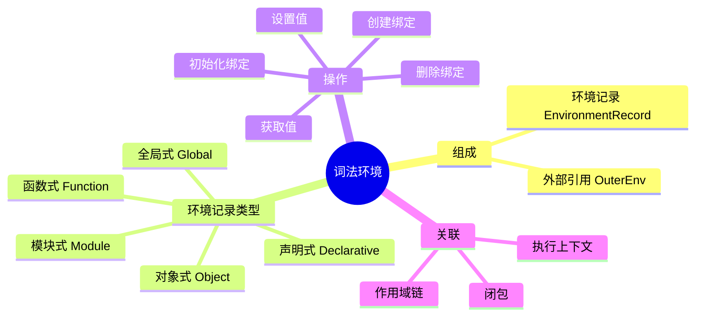
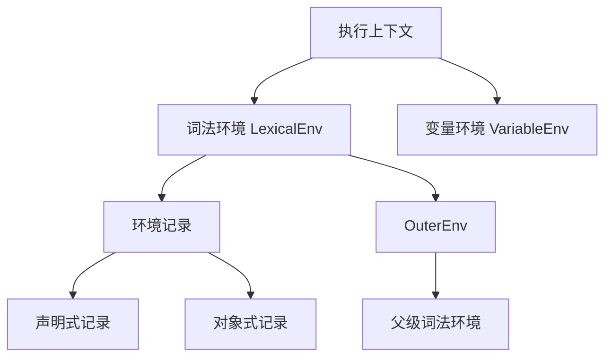
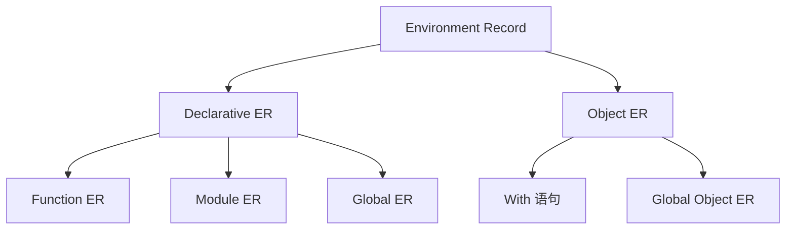
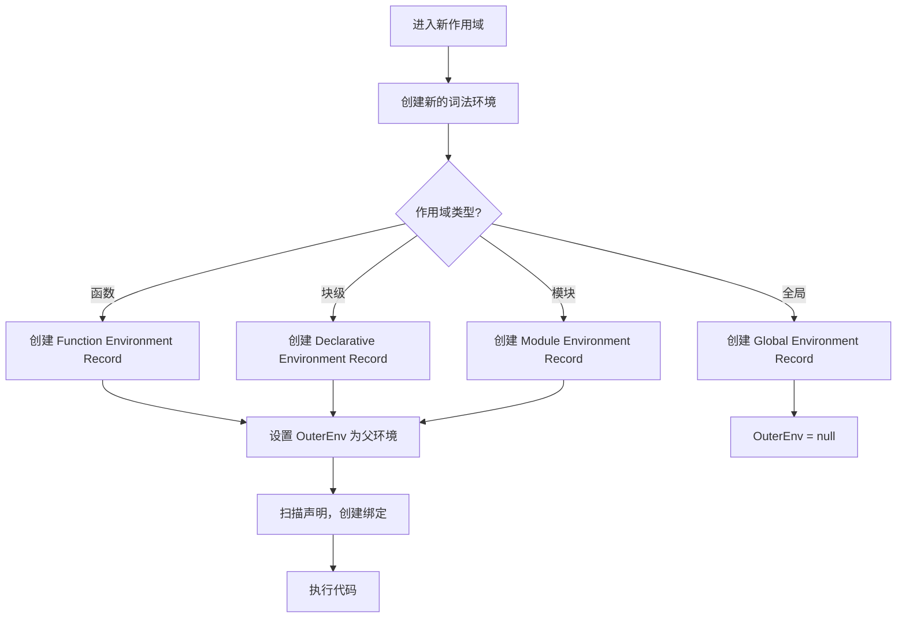

# 词法环境（Lexical Environment）

> **形式化定义**：词法环境（Lexical Environment）是 ECMAScript 规范中定义的核心抽象结构，用于管理标识符（变量名、函数名等）与值的绑定关系。每个词法环境由两个组件构成：**环境记录（Environment Record）** —— 存储变量绑定的实际数据结构；以及一个可能为 `null` 的**外部词法环境引用（Outer Lexical Environment Reference）** —— 指向父级词法环境，形成作用域链。
>
> 对齐版本：ECMAScript 2025 (ES16) §8.1

---

## 1. 概念定义 (Concept Definition)

### 1.1 形式化定义

ECMA-262 §8.1 定义了词法环境的结构：

> *"A Lexical Environment is a specification type used to define the association of Identifiers to specific variables and functions based upon the lexical nesting structure of ECMAScript code."*

词法环境的数学表示：

```
LexicalEnvironment = (EnvironmentRecord, OuterEnv)
```

其中：

- **EnvironmentRecord**：存储标识符绑定的记录
- **OuterEnv**：指向外部词法环境的引用（可能为 `null`）

### 1.2 概念层级图谱



---

## 2. 属性与特征 (Properties & Characteristics)

### 2.1 环境记录类型矩阵

| 类型 | 用途 | 存储方式 | 示例 |
|------|------|---------|------|
| **Declarative** | `let`/`const`/`class`/`function` | 内部哈希表 | 函数体内的 let |
| **Object** | `var` / `with` | 绑定到对象属性 | 全局 var → globalThis |
| **Function** | 函数参数/局部变量 | 声明式 + 参数映射 | 函数调用时创建 |
| **Module** | 模块导出/导入 | 声明式 + 模块记录 | ES 模块顶层 |
| **Global** | 全局变量 | 对象式（globalThis） | 脚本顶层 |

### 2.2 词法环境的核心操作

ECMA-262 定义了以下环境记录操作：

| 操作 | 说明 | 适用类型 |
|------|------|---------|
| `HasBinding(N)` | 检查是否有绑定 N | 所有 |
| `CreateMutableBinding(N, D)` | 创建可变绑定 | 所有 |
| `CreateImmutableBinding(N, S)` | 创建不可变绑定 | 声明式 |
| `InitializeBinding(N, V)` | 初始化绑定 | 所有 |
| `SetMutableBinding(N, V, S)` | 设置可变绑定值 | 所有 |
| `GetBindingValue(N, S)` | 获取绑定值 | 所有 |
| `DeleteBinding(N)` | 删除绑定 | 对象式 |

---

## 3. 关系分析 (Relationship Analysis)

### 3.1 词法环境与执行上下文的关系



### 3.2 环境记录类型层次



---

## 4. 机制解释 (Mechanism Explanation)

### 4.1 词法环境的创建过程



### 4.2 变量查找的完整流程

```javascript
const globalVar = "global";

function outer(param) {
  const localVar = "local";

  function inner() {
    console.log(localVar);  // 如何找到 "local"?
  }

  inner();
}

outer("arg");
```

**查找路径**：

```
inner 的 LexicalEnv
  ├── ER: { } (inner 没有局部变量)
  └── OuterEnv → outer 的 LexicalEnv
        ├── ER: { param: "arg", localVar: "local", inner: <function> }
        └── OuterEnv → global 的 LexicalEnv
              ├── ER: { globalVar: "global", outer: <function> }
              └── OuterEnv → null
```

---

## 5. 论证与分析 (Argumentation & Analysis)

### 5.1 为什么需要两种环境记录？

| 特性 | 声明式环境记录 | 对象式环境记录 |
|------|-------------|-------------|
| 绑定存储 | 内部数据结构 | 绑定到对象属性 |
| 性能 | 快（引擎优化友好） | 慢（需对象属性访问） |
| 可删除性 | 不可删除 | 可删除（`delete`） |
| 使用场景 | `let`/`const`/`function` | `var` / `with` |

### 5.2 全局环境的特殊性

```javascript
// 全局环境是混合的：声明式 + 对象式
const constVar = 1; // 存储在声明式记录中
let letVar = 2;     // 存储在声明式记录中
var varVar = 3;     // 存储在对象式记录中（globalThis.varVar）

console.log(globalThis.varVar); // 3 ✅
console.log(globalThis.letVar); // undefined ❌
```

---

## 6. 实例与示例 (Examples)

### 6.1 正例：环境记录的可视化

```javascript
// 多层词法环境
const a = "global-a";

function foo(b) {
  const c = "foo-c";

  function bar(d) {
    const e = "bar-e";
    console.log(a, b, c, d, e); // 通过作用域链访问所有变量
  }

  bar("bar-d");
}

foo("foo-b");
```

### 6.2 反例：with 语句的问题

```javascript
// ❌ 避免使用 with
const obj = { x: 1, y: 2 };

with (obj) {
  console.log(x); // 1
  x = 10;         // 修改 obj.x
}

console.log(obj.x); // 10

// with 的问题：
// 1. 性能差（对象式环境记录）
// 2. 难以分析（静态分析困难）
// 3. 严格模式禁止
```

### 6.3 边缘案例

```javascript
// 边缘 1：eval 创建新绑定
function test() {
  eval('var evalVar = 1'); // 在 eval 的环境中创建绑定
  console.log(evalVar);    // 1
}

// 边缘 2：catch 块的环境记录
try {
  throw new Error("test");
} catch (e) {
  // catch 创建新的声明式环境记录，e 绑定在其中
  console.log(e.message);
}
// console.log(e); // ReferenceError
```

---

## 7. 权威参考与国际化对齐 (References)

### 7.1 ECMA-262 规范

- **§8.1 Lexical Environments** — 词法环境的完整定义
- **§8.1.1 Environment Records** — 环境记录的分类和操作
- **§8.1.1.1 Declarative Environment Records**
- **§8.1.1.2 Object Environment Records**

### 7.2 MDN Web Docs

- **MDN: Lexical Environment** — <https://developer.mozilla.org/en-US/docs/Web/JavaScript/Closures#lexical_scoping>

---

## 8. 思维表征总结 (Cognitive Representations)

### 8.1 词法环境结构图

```
┌─────────────────────────────────────┐
│      全局词法环境                     │
│  ┌───────────────────────────────┐  │
│  │  全局环境记录                    │  │
│  │  - 声明式: let/const            │  │
│  │  - 对象式: var/function (global)│  │
│  └───────────────────────────────┘  │
│  OuterEnv = null                    │
└──────────────┬──────────────────────┘
               │
               ▼
┌─────────────────────────────────────┐
│      函数 foo 词法环境               │
│  ┌───────────────────────────────┐  │
│  │  函数环境记录                    │  │
│  │  - 参数: b                      │  │
│  │  - 局部: c                      │  │
│  │  - 函数: bar                    │  │
│  └───────────────────────────────┘  │
│  OuterEnv → 全局                     │
└──────────────┬──────────────────────┘
               │
               ▼
┌─────────────────────────────────────┐
│      函数 bar 词法环境               │
│  ┌───────────────────────────────┐  │
│  │  函数环境记录                    │  │
│  │  - 参数: d                      │  │
│  │  - 局部: e                      │  │
│  └───────────────────────────────┘  │
│  OuterEnv → foo                      │
└─────────────────────────────────────┘
```

### 8.2 环境记录类型速查

| 声明类型 | 环境记录类型 | 是否可删除 |
|---------|------------|-----------|
| `let`/`const` | 声明式 | ❌ |
| `var` | 对象式 | ✅ |
| `function` | 声明式 | ❌ |
| `class` | 声明式 | ❌ |
| `import` | 模块声明式 | ❌ |

---

## 9. TypeScript 中的词法环境

TypeScript 编译器在类型检查阶段也维护类似的"类型环境"（Type Environment）：

```typescript
// 类型环境与值环境并行
const x: number = 1;  // 值环境: x = 1, 类型环境: x: number

function foo(param: string): boolean {
  // foo 的类型环境包含: param: string, 返回值: boolean
  const local: number = 1;
  return param.length > 0;
}
```

---

## 10. 引擎实现细节

### 10.1 V8 引擎优化

V8 将词法环境实现为：

- **上下文（Context）**：固定大小的数组，存储局部变量
- **上下文链（Context Chain）**：通过 `prev` 指针链接
- **优化**：逃逸分析后，部分变量可直接分配到寄存器

### 10.2 性能基准

| 操作 | 时间复杂度 | 说明 |
|------|-----------|------|
| 局部变量访问 | O(1) | 直接索引 |
| 外层变量访问 | O(n) | n = 作用域链深度 |
| 全局变量访问 | O(1) | 通过 globalThis |

---

## 11. 词法环境与闭包的深度关系

### 11.1 闭包的形成机制

```mermaid
graph LR
    A[函数定义] --> B[捕获当前词法环境]
    B --> C[存储在 [[Environment]]]
    C --> D[函数作为值传递]
    D --> E[在其他作用域调用]
    E --> F[通过 OuterEnv 访问外部变量]
    F --> G[闭包形成]
```

### 11.2 闭包内存模型

```javascript
function outer() {
  const a = 1;
  const b = 2;

  return function inner() {
    return a; // 仅引用 a，不引用 b
  };
}

const fn = outer();
// 内存中保留：
// - inner 函数对象
// - outer 的词法环境（仅保留 a）
// - b 可能被垃圾回收（如果引擎优化）
```

---

## 12. 思维模型总结

### 12.1 词法环境结构速查

```
┌─────────────────────────────────────┐
│      词法环境 LexicalEnvironment      │
├─────────────────────────────────────┤
│  EnvironmentRecord                   │
│  ├─ 绑定1: 值1                        │
│  ├─ 绑定2: 值2                        │
│  └─ 绑定3: 值3                        │
├─────────────────────────────────────┤
│  OuterEnv → 父级词法环境               │
└─────────────────────────────────────┘
```

### 12.2 环境记录选择决策

| 声明类型 | 环境记录 | 初始化 | 可删除 |
|---------|---------|--------|--------|
| `let`/`const` | 声明式 | 执行到声明 | ❌ |
| `var` | 对象式 | 创建阶段 undefined | ✅ |
| `function` | 声明式 | 创建阶段完整 | ❌ |
| `class` | 声明式 | 执行到声明 | ❌ |
| `import` | 模块声明式 | 模块加载 | ❌ |

---

**参考规范**：ECMA-262 §8.1 | MDN: Lexical Environment | TypeScript Handbook

---

## 9. 公理化表述与形式证明 (Axiomatization & Formal Proof)

### 9.1 变量系统的公理化基础

**公理 1（词法作用域确定性）**：变量的解析位置在代码编写时即确定，与调用位置无关。

**公理 2（闭包捕获持久性）**：函数对象存活期间，其捕获的词法环境引用持续有效。

**公理 3（TDZ 不可访问性）**：let/const 声明前的变量绑定不可访问，访问即抛 ReferenceError。

### 9.2 定理与证明

**定理 1（var 提升的语义等价性）**：ar x = 1 的代码与先声明 ar x 再赋值 x = 1 在语义上等价。

*证明*：ECMA-262 §14.3.1.1 规定 var 声明在进入执行上下文时即创建绑定并初始化为 undefined。因此代码的实际执行顺序为：创建绑定 → 初始化为 undefined → 执行赋值语句。
∎

**定理 2（闭包变量共享）**：同一外部函数中的多个内部函数共享同一个词法环境引用。

*证明*：所有内部函数在创建时 [[Environment]] 均指向同一个外部词法环境对象。因此它们访问的是同一组变量绑定。
∎

### 9.3 真值表：var vs let vs const

| 操作 | var | let | const |
|------|-----|-----|-------|
| 声明前访问 | undefined | ReferenceError | ReferenceError |
| 重复声明 | ✅ | ❌ | ❌ |
| 重新赋值 | ✅ | ✅ | ❌ |
| 全局对象属性 | ✅ | ❌ | ❌ |
| 块级作用域 | ❌ | ✅ | ✅ |

---

## 10. 推理链与演绎分析 (Deductive Reasoning Chain)

### 10.1 演绎推理：变量声明到运行时行为

`mermaid
graph TD
    A[声明变量] --> B{声明类型?}
    B -->|var| C[函数作用域]
    B -->|let| D[块级作用域 + TDZ]
    B -->|const| E[块级作用域 + TDZ + 不可变]
    C --> F[提升为 undefined]
    D --> G[提升进入 TDZ]
    E --> H[提升进入 TDZ]
    F --> I[可正常访问]
    G --> J[声明前访问报错]
    H --> J
`

### 10.2 归纳推理：从运行时错误推导声明问题

| 运行时错误 | 根源问题 | 解决方案 |
|-----------|---------|---------|
| Cannot access before initialization | TDZ 访问 | 将声明移到访问之前 |
| Assignment to constant variable | const 重新赋值 | 改用 let 或避免重新赋值 |
| x is not defined | 变量未声明 | 添加声明或检查拼写 |

### 10.3 反事实推理

> **反设**：如果 JavaScript 从一开始就设计为只有 let/const，没有 var。
> **推演结果**：
>
> 1. 不存在变量提升导致的意外行为
> 2. 所有变量都有块级作用域
> 3. 早期 JavaScript 代码需要大量重构
> 4. 与现有浏览器兼容性断裂
> **结论**：var 的存在是历史遗留，let/const 的引入是语言演进的正确方向。

---
