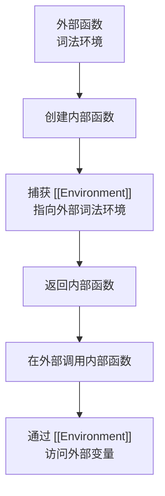
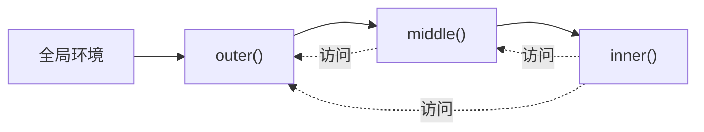
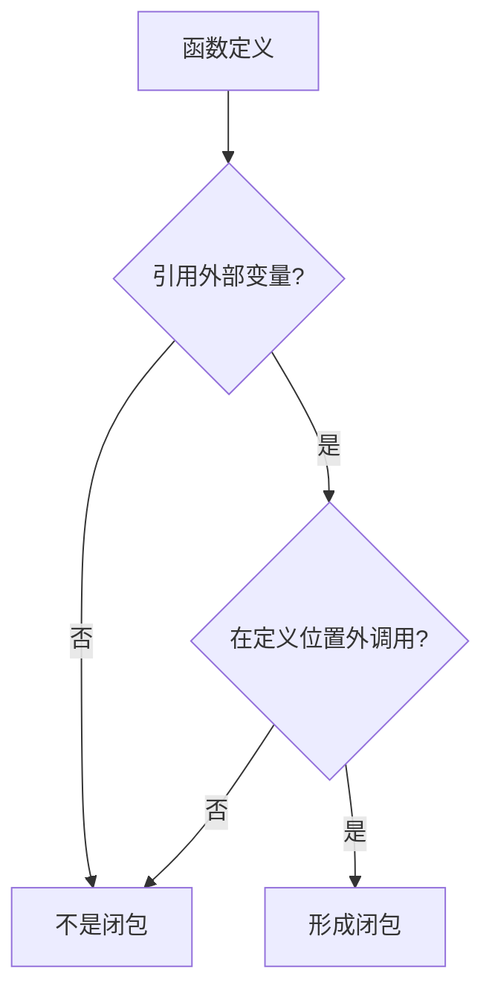
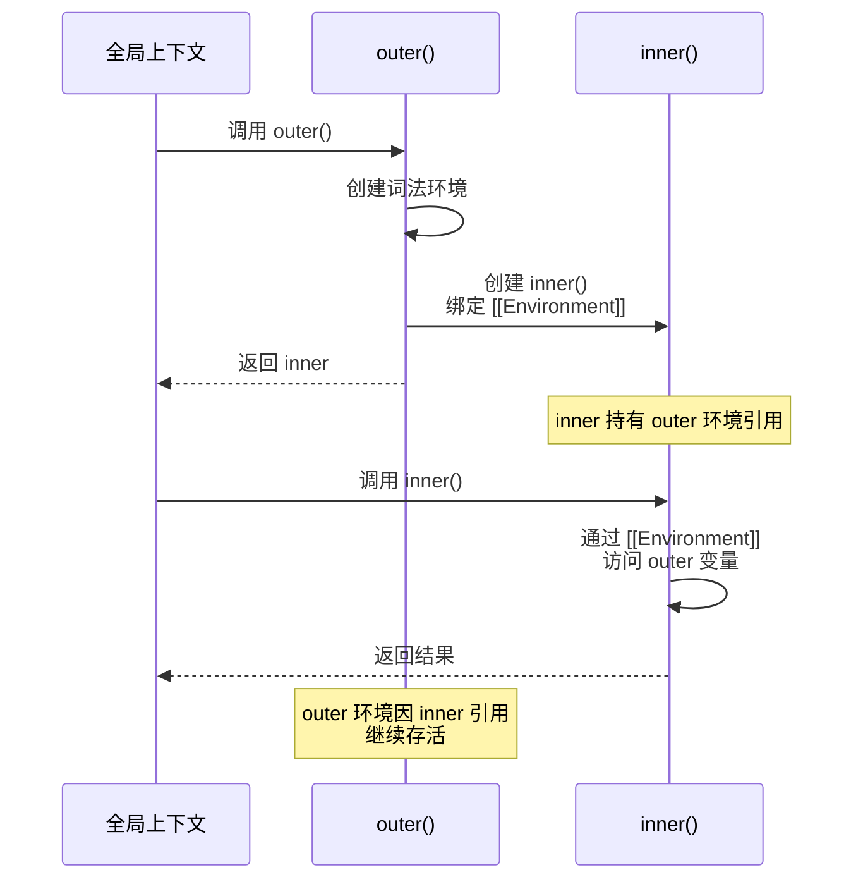

# 闭包深入

> **形式化定义**：闭包（Closure）是 ECMAScript 规范中**词法环境（Lexical Environment）**的引用捕获机制，当一个函数（Function Object）被创建时，其内部槽 `[[Environment]]` 绑定到当前的词法环境；当该函数在定义位置之外被调用时，通过 `[[Environment]]` 访问其创建时捕获的变量绑定，形成跨越时空的变量引用关系。
>
> 对齐版本：ECMAScript 2025 (ES16)

---

## 1. 概念定义 (Concept Definition)

### 1.1 形式化定义

ECMA-262 §9.2 定义了函数的创建过程：

> *"When a function is created, its [[Environment]] internal slot is set to the LexicalEnvironment of the running execution context."*

闭包的三要素：

| 要素 | 描述 |
|------|------|
| 函数对象 | 包含 `[[Environment]]` 内部槽 |
| 词法环境 | 创建时的变量绑定集合 |
| 引用保持 | 只要函数对象存在，词法环境就不会被垃圾回收 |

### 1.2 概念层级图谱

```mermaid
mindmap
  root((闭包))
    定义
      函数 + 词法环境引用
      [[Environment]] 槽
    形成条件
      函数内部引用外部变量
      函数在定义位置外被调用
    内存模型
      词法环境保留
      被引用变量保留
      未被引用变量可释放
    应用场景
      模块模式
      柯里化
      防抖/节流
      私有状态
    风险
      内存泄漏
      意外共享
      循环引用
```

---

## 2. 属性与特征 (Properties & Characteristics)

### 2.1 闭包属性矩阵

| 属性 | 说明 |
|------|------|
| 词法作用域 | 捕获定义时的作用域，而非调用时的作用域 |
| 变量引用 | 捕获的是变量引用，而非变量值的副本 |
| 生命周期 | 与函数对象生命周期绑定 |
| 垃圾回收 | 仅保留被引用的变量，其余可被优化释放 |
| 性能影响 | 轻微（环境记录保留在内存中） |

### 2.2 闭包 vs 其他作用域机制

| 机制 | 绑定时机 | 访问范围 | 生命周期 |
|------|---------|---------|---------|
| 闭包 | 函数创建时 | 词法环境 | 函数对象存活期间 |
| this | 函数调用时 | 动态绑定 | 单次调用 |
| 块级作用域 | 进入块时 | 当前块 | 块执行完毕 |
| 模块作用域 | 模块加载时 | 模块内 | 模块存活期间 |

---

## 3. 关系分析 (Relationship Analysis)

### 3.1 闭包与词法环境的关系



### 3.2 闭包链



---

## 4. 机制解释 (Mechanism Explanation)

### 4.1 闭包的创建与调用

```javascript
function createCounter() {
  let count = 0; // 被闭包捕获的变量

  return {
    increment: () => ++count,
    decrement: () => --count,
    getCount: () => count
  };
}

const counter = createCounter();
counter.increment(); // count = 1
counter.increment(); // count = 2
console.log(counter.getCount()); // 2
```

**内存模型**：

```
createCounter 的词法环境
├── count: 2  ← 被 counter 对象引用，保留在内存中
└── (其他变量) ← 未被引用，可被垃圾回收

counter 对象
├── increment: function → [[Environment]] → createCounter 环境
├── decrement: function → [[Environment]] → createCounter 环境
└── getCount: function → [[Environment]] → createCounter 环境
```

### 4.2 变量捕获的语义

```javascript
function createFunctions() {
  const functions = [];

  for (var i = 0; i < 3; i++) {
    functions.push(() => i); // 所有函数捕获同一个 i
  }

  return functions;
}

const fns = createFunctions();
console.log(fns[0]()); // 3（不是 0！）
console.log(fns[1]()); // 3（不是 1！）
console.log(fns[2]()); // 3（不是 2！）
```

**问题分析**：所有闭包共享同一个 `i` 变量，循环结束后 `i = 3`。

**解决方案**：

```javascript
// ✅ 使用 let 创建每次迭代的新绑定
for (let i = 0; i < 3; i++) {
  functions.push(() => i); // 每次迭代捕获不同的 i
}

// ✅ 使用 IIFE 创建新作用域
for (var i = 0; i < 3; i++) {
  (function(capturedI) {
    functions.push(() => capturedI);
  })(i);
}
```

---

## 5. 论证与分析 (Argumentation & Analysis)

### 5.1 闭包的内存影响

| 场景 | 内存占用 | 优化可能 |
|------|---------|---------|
| 小闭包（少量变量） | 低 | ✅ 引擎自动优化 |
| 大闭包（大量变量） | 高 | ⚠️ 手动释放引用 |
| 循环引用 | 泄漏风险 | ❌ 需手动打破 |

### 5.2 常见误区与反例

**误区 1**：闭包捕获的是值的副本

```javascript
// ❌ 错误认知
function create() {
  let x = 1;
  return () => x++; // 捕获的是 x 的引用，不是副本
}

const fn = create();
console.log(fn()); // 1
console.log(fn()); // 2（x 被修改了！）
```

**误区 2**：闭包导致内存泄漏

```javascript
// ❌ 潜在泄漏
function setup() {
  const hugeData = new Array(1000000);

  document.getElementById("btn").addEventListener("click", () => {
    console.log("clicked"); // 未使用 hugeData
  });
}

// ✅ 现代引擎优化：只保留被引用的变量
// 如果闭包未引用 hugeData，它可能被释放
```

**误区 3**：使用 eval 破坏闭包优化

```javascript
// ❌ eval 阻止优化
function bad() {
  let x = 1;
  return () => eval("x++"); // 引擎无法确定引用了哪些变量
}
```

---

## 6. 实例与示例 (Examples)

### 6.1 正例：模块模式

```javascript
const CounterModule = (function() {
  let count = 0; // 私有变量

  return {
    increment() { return ++count; },
    decrement() { return --count; },
    getCount() { return count; }
  };
})();

CounterModule.increment();
console.log(CounterModule.getCount()); // 1
// count 不可直接访问
```

### 6.2 正例：柯里化

```javascript
function curry(fn) {
  return function curried(...args) {
    if (args.length >= fn.length) {
      return fn.apply(this, args);
    }
    return function(...nextArgs) {
      return curried.apply(this, args.concat(nextArgs));
    };
  };
}

const add = curry((a, b, c) => a + b + c);
const add5 = add(5);
const add5And3 = add5(3);
console.log(add5And3(2)); // 10
```

### 6.3 反例：意外共享

```javascript
// ❌ 意外共享
const handlers = [];
for (var i = 0; i < 3; i++) {
  handlers.push(() => console.log(i));
}
handlers.forEach(h => h()); // 3, 3, 3

// ✅ 修复：使用 let
for (let i = 0; i < 3; i++) {
  handlers.push(() => console.log(i));
}
handlers.forEach(h => h()); // 0, 1, 2
```

---

## 7. 权威参考与国际化对齐 (References)

### 7.1 ECMA-262 规范

- **§9.2 ECMAScript Function Objects** — 函数的 `[[Environment]]` 槽
- **§8.1 Lexical Environments** — 词法环境的定义
- **§9.4 Execution Contexts** — 执行上下文的创建

### 7.2 MDN Web Docs

- **MDN: Closures** — <https://developer.mozilla.org/en-US/docs/Web/JavaScript/Closures>

---

## 8. 思维表征总结 (Cognitive Representations)

### 8.1 闭包形成条件



### 8.2 闭包内存模型

```
┌─────────────────────┐
│   全局执行上下文      │
│                     │
│  createCounter()    │
│  └─ 词法环境         │
│     ├─ count: 2     │ ← 被 counter 引用，保留
│     └─ (其他变量)    │ ← 未引用，可释放
│                     │
│  counter 对象        │
│  ├─ increment ──┐   │
│  ├─ decrement ──┤   │
│  └─ getCount ───┘   │
│       │             │
│       └─ [[Environment]] → createCounter 的词法环境
└─────────────────────┘
```

---

## 9. 闭包与 TypeScript 类型系统

### 9.1 类型化的闭包

```typescript
// ✅ 类型安全的计数器工厂
interface Counter {
  increment(): number;
  decrement(): number;
  readonly count: number;
}

function createCounter(initial = 0): Counter {
  let count = initial;

  return {
    increment() { return ++count; },
    decrement() { return --count; },
    get count() { return count; }
  };
}

const counter = createCounter(10);
console.log(counter.count); // 10
```

### 9.2 泛型闭包

```typescript
// ✅ 类型安全的 memoize
function memoize<T extends (...args: any[]) => any>(fn: T): T {
  const cache = new Map<string, ReturnType<T>>();

  return ((...args: Parameters<T>) => {
    const key = JSON.stringify(args);
    if (cache.has(key)) return cache.get(key)!;
    const result = fn(...args);
    cache.set(key, result);
    return result;
  }) as T;
}

const fib = memoize((n: number): number => {
  if (n <= 1) return n;
  return fib(n - 1) + fib(n - 2);
});
```

---

## 10. 闭包在异步编程中的应用

### 10.1 异步迭代器

```javascript
// ✅ 异步生成器（闭包捕获状态）
async function* createAsyncCounter(start = 0) {
  let count = start;
  while (true) {
    yield count++;
    await new Promise(r => setTimeout(r, 1000));
  }
}

const counter = createAsyncCounter(1);
for await (const num of counter) {
  console.log(num);
  if (num >= 5) break;
}
```

### 10.2 Promise 链中的闭包

```javascript
// ✅ 闭包保持请求上下文
function createRequestHandler(requestId) {
  const startTime = Date.now();

  return {
    onSuccess(data) {
      console.log(`[${requestId}] Success in ${Date.now() - startTime}ms`);
      return data;
    },
    onError(err) {
      console.error(`[${requestId}] Failed:`, err.message);
      throw err;
    }
  };
}

fetch("/api/data")
  .then(r => r.json())
  .then(createRequestHandler("req-123").onSuccess)
  .catch(createRequestHandler("req-123").onError);
```

---

## 11. 闭包内存管理最佳实践

### 11.1 释放闭包引用

```javascript
// ❌ 事件监听器中的闭包可能导致泄漏
function setupLeak() {
  const largeData = new Array(1000000);

  document.addEventListener("click", function handler() {
    // 即使不使用 largeData，闭包仍持有引用
    console.log("clicked");
  });
}

// ✅ 使用 WeakMap 避免强引用
const weakCache = new WeakMap();

function setupSafe(obj) {
  const data = { /* 相关数据 */ };
  weakCache.set(obj, data);
  // 当 obj 被垃圾回收时，data 也可被回收
}
```

### 11.2 性能优化矩阵

| 技术 | 场景 | 效果 |
|------|------|------|
| 仅引用需要的变量 | 减少环境记录大小 | 减少内存占用 |
| 使用 WeakMap/WeakSet | 缓存对象关联数据 | 避免循环引用 |
| 及时移除事件监听 | DOM 操作 | 释放闭包环境 |
| 避免在循环中创建闭包 | 大量迭代 | 减少内存分配 |

### 11.3 闭包与执行上下文的完整生命周期



---

**参考规范**：ECMA-262 §9.2 | MDN: Closures | TypeScript Handbook

---

## 9. 公理化表述与形式证明 (Axiomatization & Formal Proof)

### 9.1 变量系统的公理化基础

**公理 1（词法作用域确定性）**：变量的解析位置在代码编写时即确定，与调用位置无关。

**公理 2（闭包捕获持久性）**：函数对象存活期间，其捕获的词法环境引用持续有效。

**公理 3（TDZ 不可访问性）**：let/const 声明前的变量绑定不可访问，访问即抛 ReferenceError。

### 9.2 定理与证明

**定理 1（var 提升的语义等价性）**：ar x = 1 的代码与先声明 ar x 再赋值 x = 1 在语义上等价。

*证明*：ECMA-262 §14.3.1.1 规定 var 声明在进入执行上下文时即创建绑定并初始化为 undefined。因此代码的实际执行顺序为：创建绑定 → 初始化为 undefined → 执行赋值语句。
∎

**定理 2（闭包变量共享）**：同一外部函数中的多个内部函数共享同一个词法环境引用。

*证明*：所有内部函数在创建时 [[Environment]] 均指向同一个外部词法环境对象。因此它们访问的是同一组变量绑定。
∎

### 9.3 真值表：var vs let vs const

| 操作 | var | let | const |
|------|-----|-----|-------|
| 声明前访问 | undefined | ReferenceError | ReferenceError |
| 重复声明 | ✅ | ❌ | ❌ |
| 重新赋值 | ✅ | ✅ | ❌ |
| 全局对象属性 | ✅ | ❌ | ❌ |
| 块级作用域 | ❌ | ✅ | ✅ |

---

## 10. 推理链与演绎分析 (Deductive Reasoning Chain)

### 10.1 演绎推理：变量声明到运行时行为

`mermaid
graph TD
    A[声明变量] --> B{声明类型?}
    B -->|var| C[函数作用域]
    B -->|let| D[块级作用域 + TDZ]
    B -->|const| E[块级作用域 + TDZ + 不可变]
    C --> F[提升为 undefined]
    D --> G[提升进入 TDZ]
    E --> H[提升进入 TDZ]
    F --> I[可正常访问]
    G --> J[声明前访问报错]
    H --> J
`

### 10.2 归纳推理：从运行时错误推导声明问题

| 运行时错误 | 根源问题 | 解决方案 |
|-----------|---------|---------|
| Cannot access before initialization | TDZ 访问 | 将声明移到访问之前 |
| Assignment to constant variable | const 重新赋值 | 改用 let 或避免重新赋值 |
| x is not defined | 变量未声明 | 添加声明或检查拼写 |

### 10.3 反事实推理

> **反设**：如果 JavaScript 从一开始就设计为只有 let/const，没有 var。
> **推演结果**：
>
> 1. 不存在变量提升导致的意外行为
> 2. 所有变量都有块级作用域
> 3. 早期 JavaScript 代码需要大量重构
> 4. 与现有浏览器兼容性断裂
> **结论**：var 的存在是历史遗留，let/const 的引入是语言演进的正确方向。

---
