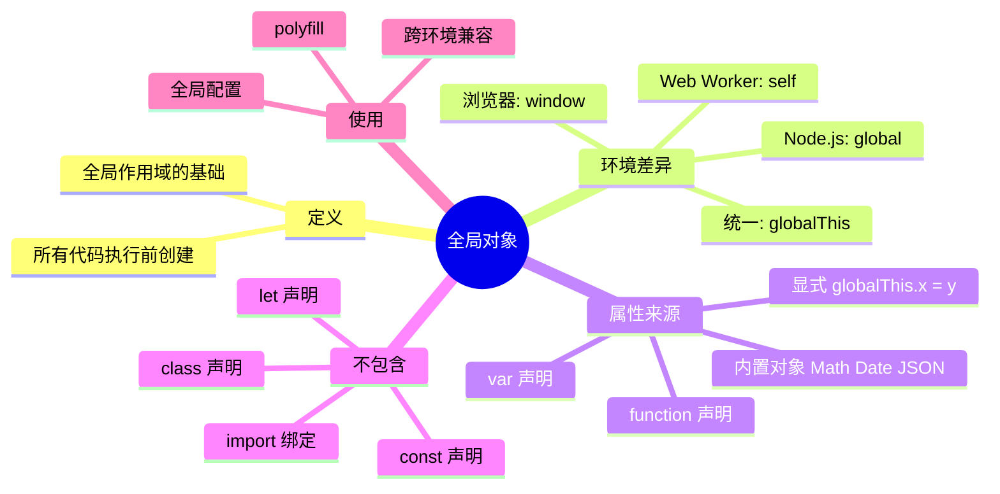
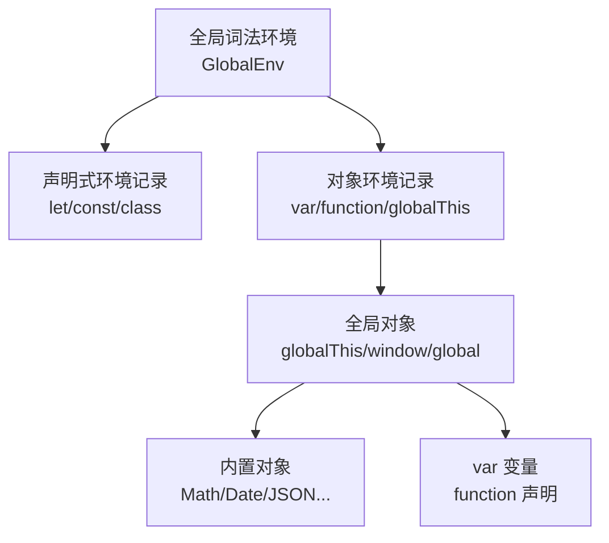
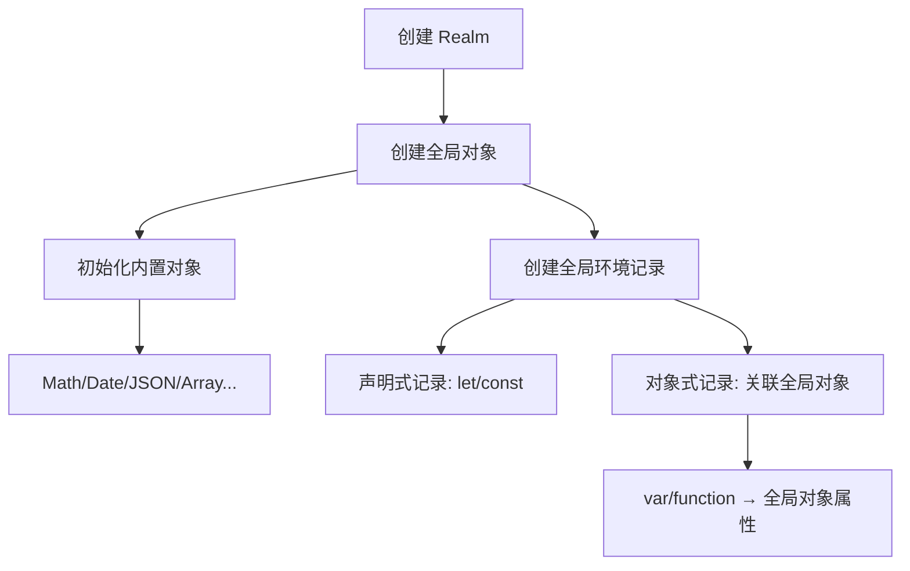
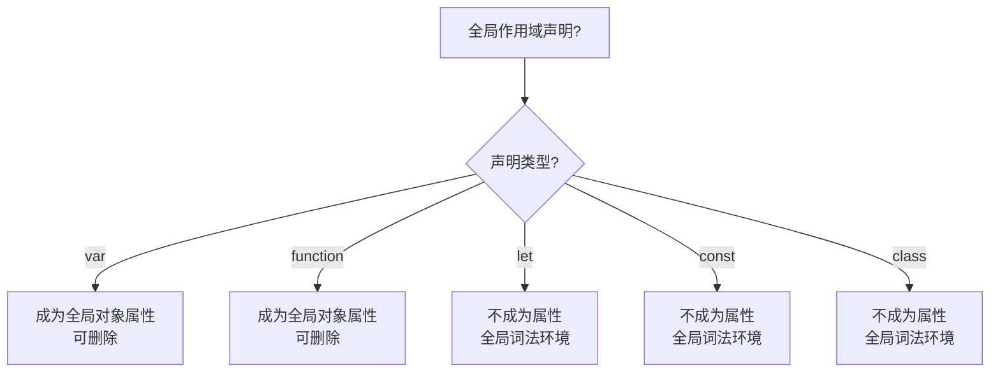
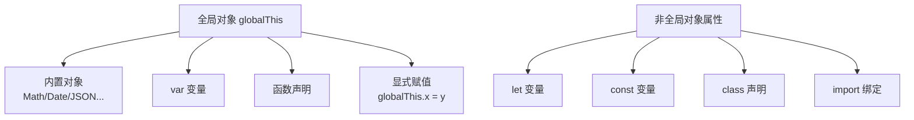
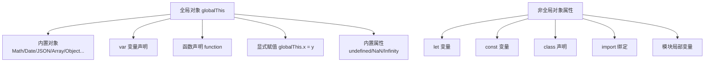

# 全局对象（Global Object）

> **形式化定义**：全局对象（Global Object）是 ECMAScript 规范中在所有执行上下文之前创建的特殊对象，作为脚本或模块的全局作用域的基础。在浏览器环境中表现为 `window`（或 `self`/`top`/`frames`/`globalThis`），在 Node.js 环境中表现为 `global`（或 `globalThis`）。全局对象上的属性对应全局变量（通过 `var` 或函数声明创建），而 `let`/`const` 声明的变量虽然也在全局作用域中，但不成为全局对象的属性。
>
> 对齐版本：ECMAScript 2025 (ES16) §18.1 | TypeScript 5.8–6.0

---

## 1. 概念定义 (Concept Definition)

### 1.1 形式化定义

ECMA-262 §18.1 定义了全局对象：

> *"Before ECMAScript code is executed, a global object is created."*

全局对象的核心属性：

| 属性 | 说明 |
|------|------|
| 创建时机 | 任何代码执行之前 |
| 唯一性 | 每个 realm 一个全局对象 |
| 属性来源 | 内置对象、`var` 声明、函数声明、显式赋值 |
| 可访问性 | 通过 `globalThis`（ES2020+）统一访问 |

### 1.2 概念层级图谱



---

## 2. 属性与特征 (Properties & Characteristics)

### 2.1 全局对象属性矩阵

| 属性类别 | 来源 | 是否可枚举 | 是否可配置 | 是否可删除 |
|---------|------|-----------|-----------|-----------|
| 内置对象 | 规范定义 | 否 | 否 | 否 |
| `var` 声明 | 用户代码 | 是 | 是 | 是 |
| 函数声明 | 用户代码 | 是 | 是 | 是 |
| 显式赋值 | 用户代码 | 是 | 是 | 是 |
| `let`/`const` | 用户代码 | — | — | —（非属性） |

### 2.2 跨环境全局对象引用

| 环境 | 全局对象 | 自引用属性 | ES2020+ |
|------|---------|-----------|---------|
| 浏览器 | `window` | `window.window` | `globalThis` |
| Node.js | `global` | `global.global` | `globalThis` |
| Web Worker | `self` | `self.self` | `globalThis` |
| 严格模式函数 | `undefined` | — | `globalThis` |

---

## 3. 关系分析 (Relationship Analysis)

### 3.1 全局对象与全局词法环境的关系



### 3.2 var vs let vs const 在全局作用域的差异

```javascript
// 浏览器环境
var varVar = "var";
let letVar = "let";
const constVar = "const";

console.log(window.varVar);   // "var" ✅
console.log(window.letVar);   // undefined ❌
console.log(window.constVar); // undefined ❌
```

---

## 4. 机制解释 (Mechanism Explanation)

### 4.1 全局环境的创建过程



### 4.2 globalThis 的引入（ES2020）

```javascript
// ES2020 之前：跨环境访问全局对象的 hack
const getGlobal = (function() {
  if (typeof globalThis !== 'undefined') return globalThis;
  if (typeof self !== 'undefined') return self;
  if (typeof window !== 'undefined') return window;
  if (typeof global !== 'undefined') return global;
  throw new Error('Unable to locate global object');
})();

// ES2020+：统一使用 globalThis
console.log(globalThis.Math.PI); // 3.14159...
```

---

## 5. 论证与分析 (Argumentation & Analysis)

### 5.1 为什么 let/const 不成为全局对象属性？

| 原因 | 说明 |
|------|------|
| 安全隔离 | 避免意外覆盖内置对象 |
| 模块化 | 支持模块系统的私有变量 |
| 避免污染 | 减少全局命名空间污染 |
| 可预测性 | `let`/`const` 的行为在所有作用域一致 |

### 5.2 全局对象的负面影响

| 问题 | 说明 | 解决方案 |
|------|------|---------|
| 命名冲突 | 多人开发覆盖全局变量 | 使用模块系统 |
| 隐式依赖 | 代码依赖全局状态 | 使用参数传递 |
| 测试困难 | 全局状态难以隔离 | 使用依赖注入 |
| 安全风险 | 恶意代码修改全局对象 | CSP、严格模式 |

### 5.3 常见误区

**误区 1**：全局函数中的 `this` 指向全局对象

```javascript
// ❌ 严格模式下不是
"use strict";
function test() {
  console.log(this); // undefined（不是全局对象！）
}
test();
```

**误区 2**：所有全局变量都在全局对象上

```javascript
// ❌ let/const 不在全局对象上
let x = 1;
console.log(globalThis.x); // undefined
```

---

## 6. 实例与示例 (Examples)

### 6.1 正例：跨环境兼容

```javascript
// ✅ 使用 globalThis 实现跨环境兼容
const globalObject = globalThis;

// 安全的全局配置
if (!globalObject.myApp) {
  globalObject.myApp = {
    version: "1.0.0",
    config: {}
  };
}
```

### 6.2 正例：Polyfill 模式

```javascript
// ✅ 安全的 polyfill
if (!globalThis.structuredClone) {
  globalThis.structuredClone = function structuredClone(value) {
    return JSON.parse(JSON.stringify(value));
  };
}
```

### 6.3 反例：全局变量污染

```javascript
// ❌ 全局变量污染
var counter = 0; // 任何人都可以修改

function increment() {
  return ++counter;
}

// ✅ 修复：使用模块/闭包
const CounterModule = (function() {
  let counter = 0; // 私有变量
  return {
    increment() { return ++counter; }
  };
})();
```

---

## 7. 权威参考与国际化对齐 (References)

### 7.1 ECMA-262 规范

- **§18.1 The Global Object** — 全局对象的定义
- **§8.1.1.4 Global Environment Records** — 全局环境记录

### 7.2 MDN Web Docs

- **MDN: globalThis** — <https://developer.mozilla.org/en-US/docs/Web/JavaScript/Reference/Global_Objects/globalThis>
- **MDN: Global Object** — <https://developer.mozilla.org/en-US/docs/Glossary/Global_object>

---

## 8. 思维表征总结 (Cognitive Representations)

### 8.1 全局对象属性决策树



### 8.2 跨环境全局对象速查

| 环境 | 全局对象 | 推荐使用 |
|------|---------|---------|
| 浏览器主线程 | `window` | `globalThis` |
| Node.js | `global` | `globalThis` |
| Web Worker | `self` | `globalThis` |
| 严格模式函数 | `undefined` | `globalThis` |

---

## 9. TypeScript 中的全局对象

### 9.1 全局类型声明

```typescript
// 扩展全局对象类型
declare global {
  interface Window {
    myApp: {
      version: string;
    };
  }
}

// 使用
window.myApp.version; // ✅ 类型安全
```

### 9.2 模块中的全局变量

```typescript
// 在模块中声明全局变量
declare global {
  var legacyGlobal: string; // var → 全局对象属性
}

// let/const 不使用 global 声明
```

---

## 10. 现代最佳实践

### 10.1 避免全局污染的策略

```javascript
// ✅ 策略 1：使用 ES 模块
// module.js
export const config = { apiUrl: "https://api.example.com" };

// ✅ 策略 2：使用 IIFE
const MyLib = (function() {
  const privateData = {};
  return { publicApi: {} };
})();

// ✅ 策略 3：命名空间对象
const MyApp = MyApp || {};
MyApp.utils = {};
MyApp.config = {};
```

---

## 11. 全局对象的历史演进

### 11.1 ES2020 之前的全局对象访问

```javascript
// ES2020 之前的跨环境 hack
const getGlobal = (function() {
  if (typeof globalThis !== 'undefined') return globalThis;
  if (typeof self !== 'undefined') return self;
  if (typeof window !== 'undefined') return window;
  if (typeof global !== 'undefined') return global;
  throw new Error('Unable to locate global object');
})();
```

### 11.2 globalThis 的标准化

ES2020 引入 `globalThis` 作为跨环境统一访问全局对象的标准方式：

| 环境 | globalThis 指向 |
|------|----------------|
| 浏览器 | `window` |
| Node.js | `global` |
| Web Worker | `self` |
| Deno | `window` |
| Bun | `globalThis` |

---

## 12. 思维模型总结

### 12.1 全局对象属性来源



### 12.2 全局状态管理策略

```javascript
// ✅ 策略 1：单例模式
const AppState = {
  config: {},
  getConfig() { return this.config; }
};

// ✅ 策略 2：依赖注入
function createApp(config) {
  return {
    config,
    start() { /* 使用 config */ }
  };
}

// ❌ 避免：直接修改全局对象
globalThis.config = {}; // 不要这样做
```

---

## 13. 全局对象与安全

### 13.1 CSP 与全局对象

内容安全策略（CSP）限制全局对象上某些属性的使用：

```javascript
// CSP 限制 eval 时
try {
  eval("var x = 1"); // CSP 可能阻止
} catch (e) {
  console.log("eval blocked by CSP");
}

// 使用 Function 构造函数也受限
new Function("return 1"); // 同样可能被 CSP 阻止
```

### 13.2 沙箱环境中的全局对象

```javascript
// iframe 中的独立全局对象
const iframe = document.createElement("iframe");
document.body.appendChild(iframe);

const iframeGlobal = iframe.contentWindow;
console.log(iframeGlobal !== window); // true

// iframeGlobal 有独立的：
// - 全局对象
// - 内置对象（Array, Object, etc.）
// - 独立的 globalThis
```

---

## 14. 思维模型总结

### 14.1 全局对象属性来源完整图



### 14.2 全局对象速查矩阵

| 声明/操作 | 成为全局对象属性 | 全局作用域可访问 | 说明 |
|-----------|---------------|----------------|------|
| `var x` | ✅ | ✅ | 对象环境记录 |
| `function f(){}` | ✅ | ✅ | 对象环境记录 |
| `let x` | ❌ | ✅ | 声明式记录 |
| `const x` | ❌ | ✅ | 声明式记录 |
| `class C` | ❌ | ✅ | 声明式记录 |
| `import {x}` | ❌ | ✅ | 模块环境记录 |
| `globalThis.x = y` | ✅ | ✅ | 显式赋值 |

---

**参考规范**：ECMA-262 §18.1 | MDN: globalThis | TypeScript Handbook

---

## 9. 公理化表述与形式证明 (Axiomatization & Formal Proof)

### 9.1 变量系统的公理化基础

**公理 1（词法作用域确定性）**：变量的解析位置在代码编写时即确定，与调用位置无关。

**公理 2（闭包捕获持久性）**：函数对象存活期间，其捕获的词法环境引用持续有效。

**公理 3（TDZ 不可访问性）**：let/const 声明前的变量绑定不可访问，访问即抛 ReferenceError。

### 9.2 定理与证明

**定理 1（var 提升的语义等价性）**：ar x = 1 的代码与先声明 ar x 再赋值 x = 1 在语义上等价。

*证明*：ECMA-262 §14.3.1.1 规定 var 声明在进入执行上下文时即创建绑定并初始化为 undefined。因此代码的实际执行顺序为：创建绑定 → 初始化为 undefined → 执行赋值语句。
∎

**定理 2（闭包变量共享）**：同一外部函数中的多个内部函数共享同一个词法环境引用。

*证明*：所有内部函数在创建时 [[Environment]] 均指向同一个外部词法环境对象。因此它们访问的是同一组变量绑定。
∎

### 9.3 真值表：var vs let vs const

| 操作 | var | let | const |
|------|-----|-----|-------|
| 声明前访问 | undefined | ReferenceError | ReferenceError |
| 重复声明 | ✅ | ❌ | ❌ |
| 重新赋值 | ✅ | ✅ | ❌ |
| 全局对象属性 | ✅ | ❌ | ❌ |
| 块级作用域 | ❌ | ✅ | ✅ |

---

## 10. 推理链与演绎分析 (Deductive Reasoning Chain)

### 10.1 演绎推理：变量声明到运行时行为

`mermaid
graph TD
    A[声明变量] --> B{声明类型?}
    B -->|var| C[函数作用域]
    B -->|let| D[块级作用域 + TDZ]
    B -->|const| E[块级作用域 + TDZ + 不可变]
    C --> F[提升为 undefined]
    D --> G[提升进入 TDZ]
    E --> H[提升进入 TDZ]
    F --> I[可正常访问]
    G --> J[声明前访问报错]
    H --> J
`

### 10.2 归纳推理：从运行时错误推导声明问题

| 运行时错误 | 根源问题 | 解决方案 |
|-----------|---------|---------|
| Cannot access before initialization | TDZ 访问 | 将声明移到访问之前 |
| Assignment to constant variable | const 重新赋值 | 改用 let 或避免重新赋值 |
| x is not defined | 变量未声明 | 添加声明或检查拼写 |

### 10.3 反事实推理

> **反设**：如果 JavaScript 从一开始就设计为只有 let/const，没有 var。
> **推演结果**：
>
> 1. 不存在变量提升导致的意外行为
> 2. 所有变量都有块级作用域
> 3. 早期 JavaScript 代码需要大量重构
> 4. 与现有浏览器兼容性断裂
> **结论**：var 的存在是历史遗留，let/const 的引入是语言演进的正确方向。

---
