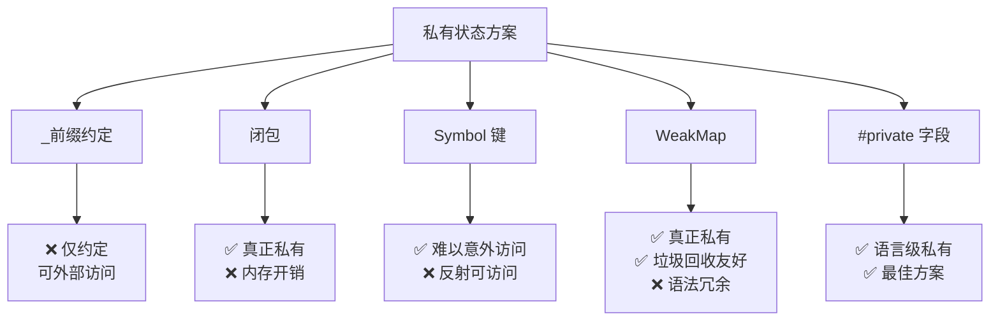
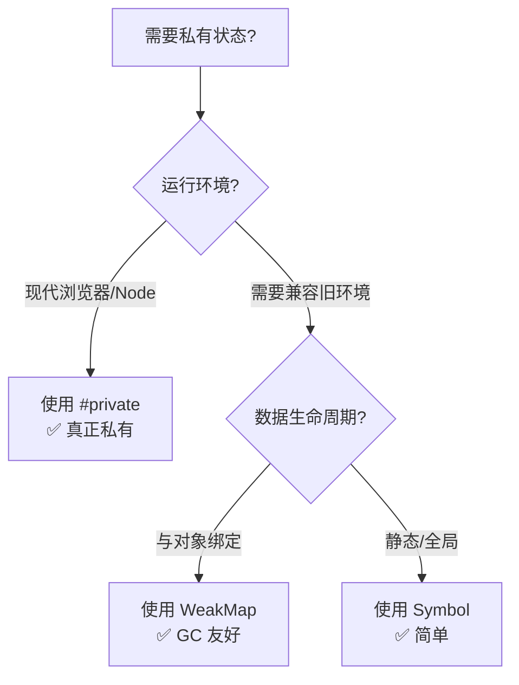
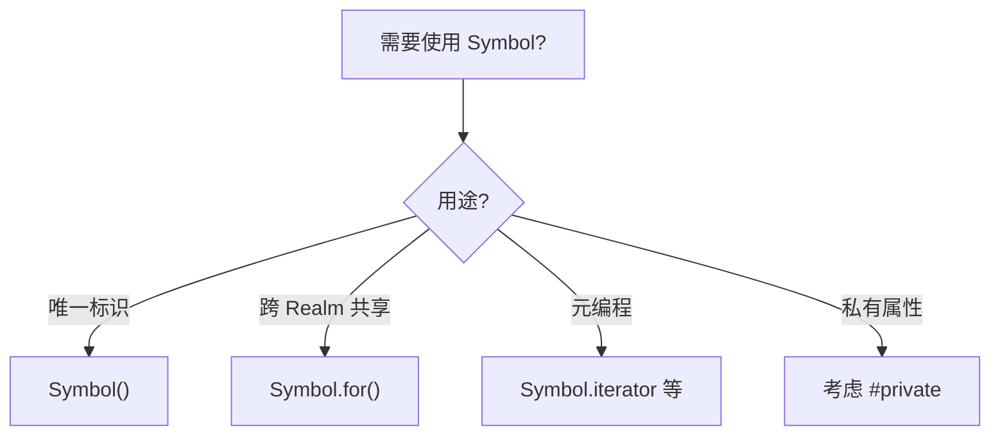

# Symbol 与私有状态

> **形式化定义**：Symbol 是 ECMAScript 2015（ES6）引入的第七种原始数据类型，每个 Symbol 值都是**唯一且不可变**的。`Symbol()` 工厂函数每次调用生成新的唯一值，`Symbol.for(key)` 在全局 Symbol 注册表中查找或创建共享 Symbol。在对象中，Symbol 键属性不会出现在 `for...in`、`Object.keys()`、`JSON.stringify()` 结果中，天然适合作为**伪私有属性**的键。TypeScript 4.2+ 引入了 `#private` 私有字段，在语言层面提供了真正的封装。
>
> 对齐版本：ECMAScript 2025 (ES16) §19.4 | TypeScript 5.8–6.0

---

## 1. 概念定义 (Concept Definition)

### 1.1 形式化定义

ECMA-262 §19.4 定义了 Symbol：

> *"The Symbol type is the set of all non-String values that may be used as the key of an Object property."*

Symbol 的核心属性：

| 属性 | 说明 |
|------|------|
| 唯一性 | 每个 `Symbol()` 调用生成唯一值 |
| 不可变性 | Symbol 值不可修改 |
| 原始类型 | 非对象，typeof 返回 `"symbol"` |
| 描述可选 | `Symbol("desc")` 便于调试 |
| 不可枚举 | 不参与 `for...in` / `Object.keys()` |

### 1.2 概念层级图谱

```mermaid
mindmap
  root((Symbol 与私有状态))
    Symbol
      唯一标识符
      不可枚举
      不可碰撞
    创建方式
      Symbol() 唯一
      Symbol.for() 共享
      Symbol.keyFor() 反向查找
    内置 Symbol
      Symbol.iterator
      Symbol.asyncIterator
      Symbol.toStringTag
      Symbol.hasInstance
    私有状态方案
      Symbol 键属性
      WeakMap 关联
      TypeScript #private
      TC39 私有字段提案
    对比
      _前缀约定
      WeakMap
      闭包
      #private
```

---

## 2. 属性与特征 (Properties & Characteristics)

### 2.1 Symbol 类型矩阵

| 特性 | 说明 | 示例 |
|------|------|------|
| 唯一性 | 每次调用生成新值 | `Symbol() !== Symbol()` |
| 描述性 | 可选描述字符串 | `Symbol("desc")` |
| typeof | `"symbol"` | `typeof Symbol() === "symbol"` |
| 隐式转换 | 禁止 | `Symbol() + ""` → TypeError |
| 枚举性 | 不可枚举 | `Object.keys({[sym]: 1})` → `[]` |

### 2.2 内置 Well-Known Symbols

| Symbol | 用途 | 触发场景 |
|--------|------|---------|
| `Symbol.iterator` | 定义默认迭代器 | `for...of` |
| `Symbol.asyncIterator` | 定义异步迭代器 | `for await...of` |
| `Symbol.toStringTag` | 自定义 `Object.prototype.toString` | `[object Xxx]` |
| `Symbol.hasInstance` | 自定义 `instanceof` | `obj instanceof Class` |
| `Symbol.toPrimitive` | 自定义原始值转换 | `Number(obj)` |
| `Symbol.species` | 派生对象构造函数 | `.map()` 等 |

---

## 3. 关系分析 (Relationship Analysis)

### 3.1 私有状态方案对比



### 3.2 私有方案对比矩阵

| 方案 | 真正私有 | 性能 | 语法 | 可序列化 | 推荐使用 |
|------|---------|------|------|---------|---------|
| `_prefix` | ❌ | ⭐⭐⭐⭐⭐ | 简单 | ✅ | 不推荐 |
| 闭包 | ✅ | ⭐⭐⭐ | 复杂 | ❌ | 小型类 |
| Symbol | ⚠️ | ⭐⭐⭐⭐ | 简单 | ❌ | 兼容场景 |
| WeakMap | ✅ | ⭐⭐⭐ | 冗余 | ❌ | 库实现 |
| `#private` | ✅ | ⭐⭐⭐⭐ | 简洁 | ❌ | **首选** |

---

## 4. 机制解释 (Mechanism Explanation)

### 4.1 Symbol 的创建与注册

```javascript
// 唯一 Symbol
const sym1 = Symbol("desc");
const sym2 = Symbol("desc");
console.log(sym1 === sym2); // false

// 全局注册表 Symbol
const shared1 = Symbol.for("shared");
const shared2 = Symbol.for("shared");
console.log(shared1 === shared2); // true

// 反向查找
console.log(Symbol.keyFor(shared1)); // "shared"
console.log(Symbol.keyFor(sym1));    // undefined
```

### 4.2 自定义迭代器

```javascript
const range = {
  from: 1,
  to: 5,
  [Symbol.iterator]() {
    let current = this.from;
    return {
      next: () => ({
        value: current++,
        done: current > this.to + 1
      })
    };
  }
};

for (const num of range) {
  console.log(num); // 1, 2, 3, 4, 5
}
```

---

## 5. 论证与分析 (Argumentation & Analysis)

### 5.1 Symbol 作为私有属性的局限性

```javascript
const _private = Symbol("private");

class MyClass {
  constructor() {
    this[_private] = "secret";
  }
}

const obj = new MyClass();

// ❌ 常规方法无法访问
console.log(Object.keys(obj)); // []

// ✅ 但反射可以访问
console.log(Reflect.ownKeys(obj)); // [Symbol(private)]
console.log(obj[_private]); // "secret"
```

### 5.2 TypeScript #private 的优势

```typescript
class SecureClass {
  #privateField: string = "truly private";

  getSecret(): string {
    return this.#privateField;
  }
}

const secure = new SecureClass();
// secure.#privateField; // ❌ TypeScript 编译错误 + 运行时错误
console.log(secure.getSecret()); // ✅ "truly private"
```

---

## 6. 实例与示例 (Examples)

### 6.1 正例：Symbol 枚举值

```javascript
// ✅ 使用 Symbol 替代字符串枚举
const Color = {
  RED: Symbol("red"),
  GREEN: Symbol("green"),
  BLUE: Symbol("blue")
};

function getColorHex(color) {
  switch (color) {
    case Color.RED: return "#FF0000";
    case Color.GREEN: return "#00FF00";
    case Color.BLUE: return "#0000FF";
  }
}

// ✅ 不会与其他库的 "red" 冲突
getColorHex(Color.RED); // "#FF0000"
```

### 6.2 正例：WeakMap 私有状态

```javascript
// ✅ 库实现中的私有状态
const _private = new WeakMap();

class PrivateState {
  constructor(secret) {
    _private.set(this, { secret, counter: 0 });
  }

  increment() {
    const state = _private.get(this);
    return ++state.counter;
  }

  getSecret() {
    return _private.get(this).secret;
  }
}

const instance = new PrivateState("my-secret");
console.log(instance.getSecret()); // "my-secret"
// 实例被垃圾回收时，WeakMap 中的数据自动释放
```

### 6.3 反例：Symbol 的隐式转换陷阱

```javascript
// ❌ Symbol 不能隐式转换
const sym = Symbol("test");
// console.log(sym + "hello"); // TypeError!
// console.log(`${sym}`);      // TypeError!

// ✅ 显式转换
console.log(sym.toString());     // "Symbol(test)"
console.log(String(sym));        // "Symbol(test)"
```

---

## 7. 权威参考与国际化对齐 (References)

### 7.1 ECMA-262 规范

- **§19.4 Symbol Objects** — Symbol 的完整定义
- **§19.4.2 Properties of the Symbol Constructor** — `Symbol.for()` / `Symbol.keyFor()`

### 7.2 TypeScript 官方文档

- **TypeScript: Private Fields** — <https://www.typescriptlang.org/docs/handbook/classes.html#private-fields>

### 7.3 MDN Web Docs

- **MDN: Symbol** — <https://developer.mozilla.org/en-US/docs/Web/JavaScript/Reference/Global_Objects/Symbol>
- **MDN: Private class fields** — <https://developer.mozilla.org/en-US/docs/Web/JavaScript/Reference/Classes/Private_class_fields>

---

## 8. 思维表征总结 (Cognitive Representations)

### 8.1 私有方案选择决策树



### 8.2 Symbol 使用速查

| 场景 | 推荐方案 | 原因 |
|------|---------|------|
| 唯一标识符 | `Symbol()` | 全局唯一 |
| 跨 Realm 共享 | `Symbol.for()` | 全局注册表 |
| 私有属性 | `#private` | 真正私有 |
| 元编程 | `Symbol.iterator` 等 | 协议覆盖 |

---

## 9. TypeScript 中的 Symbol 与私有字段

### 9.1 计算属性中的 Symbol

```typescript
const methodKey = Symbol("method");

interface MyInterface {
  [methodKey](): void;
}

class MyClass implements MyInterface {
  [methodKey]() {
    console.log("Symbol method called");
  }
}
```

### 9.2 私有字段完整示例

```typescript
class BankAccount {
  #balance: number = 0;
  #accountId: string;

  constructor(id: string, initialBalance: number = 0) {
    this.#accountId = id;
    this.#balance = initialBalance;
  }

  deposit(amount: number): void {
    if (amount <= 0) throw new Error("Invalid amount");
    this.#balance += amount;
  }

  getBalance(): number {
    return this.#balance;
  }
}

const account = new BankAccount("ACC-001", 100);
account.deposit(50);
console.log(account.getBalance()); // 150
// account.#balance; // ❌ 编译错误
```

---

## 10. 现代演进趋势

### 10.1 TC39 私有字段提案状态

| 特性 | 状态 | 说明 |
|------|------|------|
| `#private` | ES2022+ | 已标准化 |
| `#private static` | ES2022+ | 已标准化 |
| `#private in` | ES2022+ | 品牌检查 |
| `#private accessor` | Stage 3 | 私有 getter/setter |

### 10.2 最佳实践总结

```typescript
// ✅ 现代首选：#private
class Modern {
  #secret: string;
  constructor() { this.#secret = "safe"; }
}

// ✅ 需要运行时检查：Symbol + WeakMap
const _data = new WeakMap();
class Compatible {
  constructor() { _data.set(this, { secret: "safe" }); }
}

// ❌ 避免：仅 _前缀
class Bad {
  _secret: string; // 只是约定，无实际保护
}
```

---

## 11. Symbol 的高级用法

### 11.1 品牌检查（Brand Checking）

```javascript
// 使用 Symbol 进行类型品牌检查
const brand = Symbol("MyBrand");

class MyClass {
  constructor() {
    this[brand] = true;
  }

  static isMyClass(obj) {
    return obj && obj[brand] === true;
  }
}

const obj = new MyClass();
console.log(MyClass.isMyClass(obj)); // true
console.log(MyClass.isMyClass({}));   // false
```

### 11.2 元数据注解

```typescript
// 使用 Symbol 存储元数据
const metadataKey = Symbol("metadata");

function addMetadata(value: string) {
  return function(target: any, propertyKey: string) {
    const existing = Reflect.getMetadata(metadataKey, target, propertyKey) || [];
    Reflect.defineMetadata(metadataKey, [...existing, value], target, propertyKey);
  };
}
```

---

## 12. 思维模型总结

### 12.1 私有状态方案选择矩阵

| 方案 | 真正私有 | 性能 | 语法 | GC 友好 | 推荐使用 |
|------|---------|------|------|---------|---------|
| `_prefix` | ❌ | ⭐⭐⭐⭐⭐ | 简单 | ✅ | ❌ 不推荐 |
| 闭包 | ✅ | ⭐⭐⭐ | 复杂 | ❌ | 小型类 |
| Symbol | ⚠️ | ⭐⭐⭐⭐ | 简单 | ✅ | 兼容场景 |
| WeakMap | ✅ | ⭐⭐⭐ | 冗余 | ✅ | 库实现 |
| `#private` | ✅ | ⭐⭐⭐⭐ | 简洁 | ✅ | **⭐⭐⭐⭐⭐** |

### 12.2 Symbol 使用决策树



---

## 13. Symbol 的迭代器协议

### 13.1 自定义可迭代对象

```javascript
class Range {
  constructor(start, end) {
    this.start = start;
    this.end = end;
  }

  *[Symbol.iterator]() {
    for (let i = this.start; i <= this.end; i++) {
      yield i;
    }
  }
}

const range = new Range(1, 5);
console.log([...range]); // [1, 2, 3, 4, 5]
```

### 13.2 异步迭代器

```javascript
class AsyncRange {
  constructor(start, end, delay = 100) {
    this.start = start;
    this.end = end;
    this.delay = delay;
  }

  async *[Symbol.asyncIterator]() {
    for (let i = this.start; i <= this.end; i++) {
      await new Promise(r => setTimeout(r, this.delay));
      yield i;
    }
  }
}

(async () => {
  for await (const num of new AsyncRange(1, 3)) {
    console.log(num);
  }
})();
```

---

## 14. 思维模型总结

### 14.1 Symbol 使用场景速查

| 场景 | 推荐 Symbol API | 示例 |
|------|----------------|------|
| 唯一标识 | `Symbol()` | `const id = Symbol('id')` |
| 跨 Realm 共享 | `Symbol.for()` | `Symbol.for('app.shared')` |
| 反向查找 | `Symbol.keyFor()` | `Symbol.keyFor(shared)` |
| 迭代协议 | `Symbol.iterator` | `obj[Symbol.iterator]` |
| 异步迭代 | `Symbol.asyncIterator` | `obj[Symbol.asyncIterator]` |
| 类型标签 | `Symbol.toStringTag` | `[object MyClass]` |
| instanceof | `Symbol.hasInstance` | `obj instanceof Class` |
| 原始转换 | `Symbol.toPrimitive` | `Number(obj)` |

### 14.2 私有字段与 Symbol 对比总结

| 特性 | `#private` | `Symbol` | `WeakMap` |
|------|-----------|----------|-----------|
| 真正私有 | ✅ | ⚠️ | ✅ |
| 语法简洁 | ✅ | ✅ | ❌ |
| 反射不可访问 | ✅ | ❌ | ✅ |
| 性能 | 优秀 | 良好 | 良好 |
| 浏览器兼容 | 现代浏览器 | 全平台 | 全平台 |
| **推荐度** | **⭐⭐⭐⭐⭐** | ⭐⭐⭐ | ⭐⭐⭐⭐ |

---

**参考规范**：ECMA-262 §19.4 | MDN: Symbol | TypeScript Handbook: Classes

---

## 9. 公理化表述与形式证明 (Axiomatization & Formal Proof)

### 9.1 变量系统的公理化基础

**公理 1（词法作用域确定性）**：变量的解析位置在代码编写时即确定，与调用位置无关。

**公理 2（闭包捕获持久性）**：函数对象存活期间，其捕获的词法环境引用持续有效。

**公理 3（TDZ 不可访问性）**：let/const 声明前的变量绑定不可访问，访问即抛 ReferenceError。

### 9.2 定理与证明

**定理 1（var 提升的语义等价性）**：ar x = 1 的代码与先声明 ar x 再赋值 x = 1 在语义上等价。

*证明*：ECMA-262 §14.3.1.1 规定 var 声明在进入执行上下文时即创建绑定并初始化为 undefined。因此代码的实际执行顺序为：创建绑定 → 初始化为 undefined → 执行赋值语句。
∎

**定理 2（闭包变量共享）**：同一外部函数中的多个内部函数共享同一个词法环境引用。

*证明*：所有内部函数在创建时 [[Environment]] 均指向同一个外部词法环境对象。因此它们访问的是同一组变量绑定。
∎

### 9.3 真值表：var vs let vs const

| 操作 | var | let | const |
|------|-----|-----|-------|
| 声明前访问 | undefined | ReferenceError | ReferenceError |
| 重复声明 | ✅ | ❌ | ❌ |
| 重新赋值 | ✅ | ✅ | ❌ |
| 全局对象属性 | ✅ | ❌ | ❌ |
| 块级作用域 | ❌ | ✅ | ✅ |

---

## 10. 推理链与演绎分析 (Deductive Reasoning Chain)

### 10.1 演绎推理：变量声明到运行时行为

`mermaid
graph TD
    A[声明变量] --> B{声明类型?}
    B -->|var| C[函数作用域]
    B -->|let| D[块级作用域 + TDZ]
    B -->|const| E[块级作用域 + TDZ + 不可变]
    C --> F[提升为 undefined]
    D --> G[提升进入 TDZ]
    E --> H[提升进入 TDZ]
    F --> I[可正常访问]
    G --> J[声明前访问报错]
    H --> J
`

### 10.2 归纳推理：从运行时错误推导声明问题

| 运行时错误 | 根源问题 | 解决方案 |
|-----------|---------|---------|
| Cannot access before initialization | TDZ 访问 | 将声明移到访问之前 |
| Assignment to constant variable | const 重新赋值 | 改用 let 或避免重新赋值 |
| x is not defined | 变量未声明 | 添加声明或检查拼写 |

### 10.3 反事实推理

> **反设**：如果 JavaScript 从一开始就设计为只有 let/const，没有 var。
> **推演结果**：
>
> 1. 不存在变量提升导致的意外行为
> 2. 所有变量都有块级作用域
> 3. 早期 JavaScript 代码需要大量重构
> 4. 与现有浏览器兼容性断裂
> **结论**：var 的存在是历史遗留，let/const 的引入是语言演进的正确方向。

---
