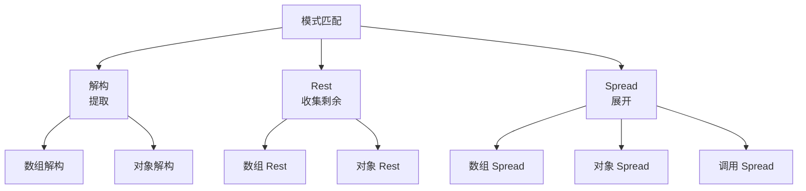
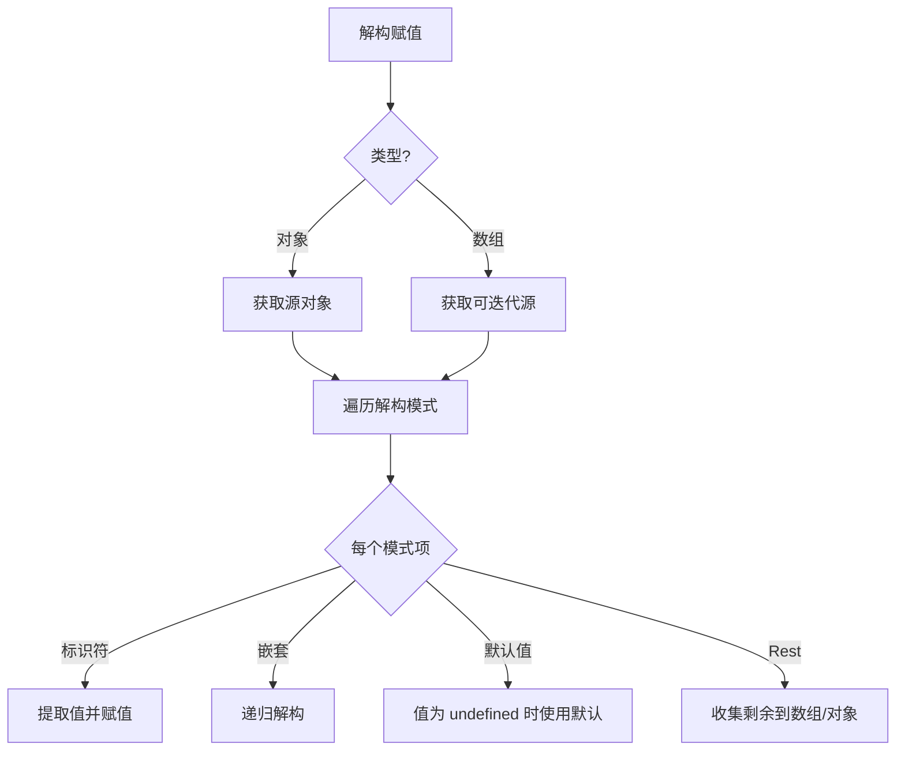
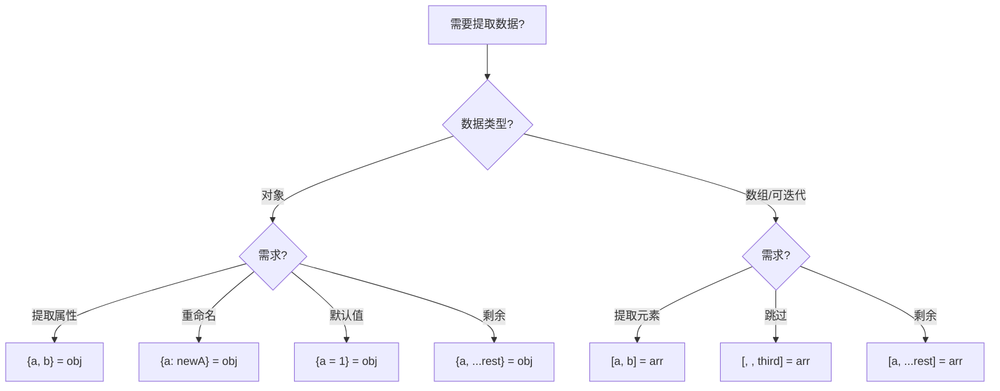
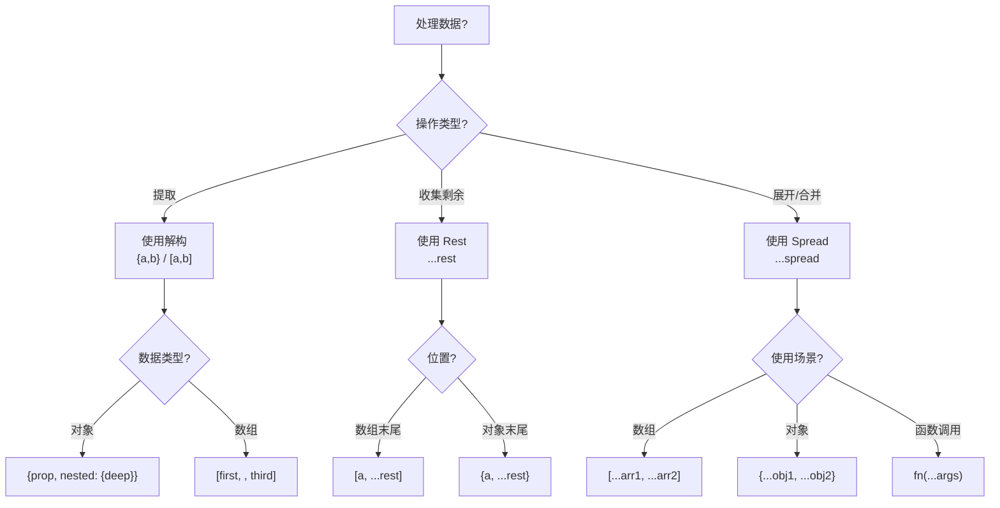

# 解构、Rest 与 Spread

> **形式化定义**：解构赋值（Destructuring Assignment）是 ECMAScript 2015（ES6）引入的语法特性，允许将数组或对象"解构"为独立的变量。Rest 参数（`...rest`）收集剩余元素为数组或对象，Spread 语法（`...spread`）将可迭代对象展开为独立元素。这三者共同构成了 JavaScript 中**模式匹配（Pattern Matching）**的基础语法，支持数组、对象、嵌套、默认值、重命名等复杂场景。
>
> 对齐版本：ECMAScript 2025 (ES16) §12.15 | TypeScript 5.8–6.0

---

## 1. 概念定义 (Concept Definition)

### 1.1 形式化定义

ECMA-262 §12.15 定义了解构赋值的语义：

> *"Destructuring Binding Patterns are used to extract values from data-structures into distinct variables."*

三种操作的核心定义：

| 操作 | 语法 | 作用 | 位置 |
|------|------|------|------|
| **解构** | `{a, b} = obj` | 提取属性到变量 | 赋值左侧 |
| **Rest** | `{a, ...rest}` | 收集剩余属性 | 解构模式内 |
| **Spread** | `[...arr]` | 展开可迭代对象 | 数组/对象/函数调用 |

### 1.2 概念层级图谱

```mermaid
mindmap
  root((解构/Rest/Spread))
    解构 Destructuring
      对象解构 {a, b}
      数组解构 [a, b]
      嵌套解构 {a: {b}}
      默认值 {a = 1}
      重命名 {a: newName}
    Rest
      数组剩余 [...rest]
      对象剩余 {...rest}
      函数参数 (...args)
    Spread
      数组展开 [...arr]
      对象展开 {...obj}
      函数调用 fn(...args)
    组合
      解构 + Rest
      Spread + 解构
      函数参数
```

---

## 2. 属性与特征 (Properties & Characteristics)

### 2.1 解构类型矩阵

| 类型 | 语法 | 来源 | 默认值 | 重命名 |
|------|------|------|--------|--------|
| 对象解构 | `{a, b}` | 对象属性 | `{a = 1}` | `{a: newA}` |
| 数组解构 | `[a, b]` | 数组索引 | `[a = 1]` | 不支持 |
| 嵌套解构 | `{a: {b}}` | 嵌套结构 | `{a: {b = 1}}` | 多层 |
| 参数解构 | `fn({a})` | 函数参数 | `fn({a = 1})` | `fn({a: newA})` |

### 2.2 Rest 与 Spread 对比

| 特性 | Rest (`...`) | Spread (`...`) |
|------|-------------|---------------|
| 位置 | 接收端（左侧） | 发送端（右侧） |
| 作用 | 收集 | 展开 |
| 数组 | `[a, ...rest]` | `[...arr1, ...arr2]` |
| 对象 | `{a, ...rest}` | `{...obj1, ...obj2}` |
| 函数 | `(...args)` | `fn(...args)` |
| 顺序 | 必须最后 | 任意位置 |

---

## 3. 关系分析 (Relationship Analysis)

### 3.1 解构、Rest、Spread 的关系



### 3.2 可迭代协议与 Spread

```javascript
// Spread 依赖可迭代协议（Symbol.iterator）
const iterable = {
  *[Symbol.iterator]() {
    yield 1;
    yield 2;
    yield 3;
  }
};

const arr = [...iterable]; // [1, 2, 3]
```

---

## 4. 机制解释 (Mechanism Explanation)

### 4.1 解构赋值的执行流程



### 4.2 对象展开的属性覆盖规则

```javascript
const obj1 = { a: 1, b: 2 };
const obj2 = { b: 3, c: 4 };

const merged = { ...obj1, ...obj2 };
// { a: 1, b: 3, c: 4 }
// obj2 的 b 覆盖 obj1 的 b

const reversed = { ...obj2, ...obj1 };
// { b: 2, c: 4, a: 1 }
// obj1 的 b 覆盖 obj2 的 b
```

---

## 5. 论证与分析 (Argumentation & Analysis)

### 5.1 解构的性能影响

| 场景 | 性能 | 建议 |
|------|------|------|
| 简单解构 | 无影响 | 始终使用 |
| 深层嵌套 | 轻微开销 | 避免过度嵌套 |
| 大量属性 | 考虑直接访问 | 性能敏感场景 |

### 5.2 常见误区

**误区 1**：解构创建的是引用还是副本

```javascript
// ❌ 解构对象属性得到的是引用
const obj = { nested: { value: 1 } };
const { nested } = obj;
nested.value = 2;
console.log(obj.nested.value); // 2（被修改了！）

// ✅ 需要深拷贝时使用结构化克隆
const { nested: cloned } = { nested: structuredClone(obj.nested) };
```

**误区 2**：默认值仅在 `undefined` 时生效

```javascript
// ❌ null 不会触发默认值
const { a = 1 } = { a: null };
console.log(a); // null（不是 1！）

// ✅ 默认值只对 undefined 生效
const { b = 1 } = { b: undefined };
console.log(b); // 1
```

**误区 3**：对象 Rest 不包含不可枚举属性

```javascript
const obj = { a: 1 };
Object.defineProperty(obj, 'b', { value: 2, enumerable: false });

const { a, ...rest } = obj;
console.log(rest); // {}（不包含 b）
```

---

## 6. 实例与示例 (Examples)

### 6.1 正例：函数参数解构

```javascript
// ✅ 参数解构 + 默认值
function createUser({
  name = "Anonymous",
  age = 0,
  role = "user"
} = {}) {
  return { name, age, role };
}

// 调用灵活
createUser();                    // { name: "Anonymous", age: 0, role: "user" }
createUser({ name: "Alice" });   // { name: "Alice", age: 0, role: "user" }
```

### 6.2 正例：数组与对象的组合使用

```javascript
// ✅ 配置合并
const defaultConfig = { host: "localhost", port: 3000 };
const userConfig = { port: 8080 };

const config = { ...defaultConfig, ...userConfig };
// { host: "localhost", port: 8080 }

// ✅ 数组操作
const arr1 = [1, 2, 3];
const arr2 = [4, 5, 6];
const combined = [...arr1, ...arr2]; // [1, 2, 3, 4, 5, 6]

// ✅ 函数调用
const nums = [1, 2, 3];
Math.max(...nums); // 3
```

### 6.3 反例：嵌套解构过度使用

```javascript
// ❌ 过度嵌套，可读性差
const {
  data: {
    user: {
      profile: {
        address: {
          city = "Unknown"
        } = {}
      } = {}
    } = {}
  } = {}
} = response;

// ✅ 更清晰的写法
const { data } = response;
const user = data?.user;
const city = user?.profile?.address?.city ?? "Unknown";
```

---

## 7. 权威参考与国际化对齐 (References)

### 7.1 ECMA-262 规范

- **§12.15 Destructuring Assignment** — 解构赋值的完整语义
- **§12.2.5 Array Initializer** — 数组展开
- **§12.2.6 Object Initializer** — 对象展开

### 7.2 TypeScript 官方文档

- **TypeScript Handbook: Destructuring** — <https://www.typescriptlang.org/docs/handbook/variable-declarations.html#destructuring>

### 7.3 MDN Web Docs

- **MDN: Destructuring assignment** — <https://developer.mozilla.org/en-US/docs/Web/JavaScript/Reference/Operators/Destructuring_assignment>
- **MDN: Spread syntax** — <https://developer.mozilla.org/en-US/docs/Web/JavaScript/Reference/Operators/Spread_syntax>
- **MDN: Rest parameters** — <https://developer.mozilla.org/en-US/docs/Web/JavaScript/Reference/Functions/rest_parameters>

---

## 8. 思维表征总结 (Cognitive Representations)

### 8.1 解构模式速查



### 8.2 操作符位置规则

| 操作 | 位置 | 方向 |
|------|------|------|
| 解构 | 赋值左侧 | 提取 |
| Rest | 模式末尾 | 收集 |
| Spread | 数组/对象/调用内部 | 展开 |

---

## 9. TypeScript 中的类型化解构

### 9.1 带类型的解构

```typescript
interface User {
  id: number;
  name: string;
  email?: string;
}

// ✅ 类型推断自动工作
function processUser({ id, name, email = "no-email" }: User) {
  console.log(id, name, email);
}

// ✅ 重命名 + 类型
const { name: userName }: { name: string } = { name: "Alice" };
```

### 9.2 元组解构

```typescript
// ✅ 元组解构
const point: [number, number, string?] = [10, 20, "label"];
const [x, y, label = "default"] = point;

// ✅ React useState 模式
const [state, setState] = useState<number>(0);
```

---

## 10. 现代最佳实践

### 10.1 解构使用指南

```javascript
// ✅ 函数参数解构（首选）
function render({ title, items = [] }) {
  return `<h1>${title}</h1>`;
}

// ✅ 配置对象解构
const { host = "localhost", port = 3000, ...rest } = config;

// ✅ 深拷贝对象
const clone = { ...original };

// ✅ 数组去重
const unique = [...new Set(array)];
```

### 10.2 避免的陷阱

```javascript
// ❌ 不要解构 null/undefined
const { a } = null; // TypeError!

// ✅ 使用默认值保护
const { a } = obj || {};

// ❌ 对象 Rest 浅拷贝
const { a, ...rest } = { a: 1, nested: { b: 2 } };
// rest.nested === original.nested（引用相同）
```

---

## 11. 解构与 Rest/Spread 的性能考量

### 11.1 性能影响分析

| 操作 | 时间复杂度 | 空间复杂度 | 说明 |
|------|-----------|-----------|------|
| 对象解构 | O(n) | O(1) | n = 解构的属性数 |
| 数组解构 | O(n) | O(1) | n = 解构的元素数 |
| 对象 Spread | O(n) | O(n) | 创建新对象，浅拷贝 |
| 数组 Spread | O(n) | O(n) | 创建新数组 |
| Rest 收集 | O(n) | O(n) | 创建新对象/数组 |

### 11.2 优化建议

```javascript
// ❌ 不必要的完整解构
function process({ a, b, c, d, e, f }) {
  return a + b; // 只用了 a, b
}

// ✅ 只解构需要的
function process({ a, b }) {
  return a + b;
}

// ❌ 大对象 Spread
const big = { /* 100+ 属性 */ };
const copy = { ...big }; //  expensive

// ✅ 只提取需要的
const { needed1, needed2 } = big;
```

---

## 12. 思维模型总结

### 12.1 操作符位置规则速查

| 操作符 | 位置 | 方向 | 结果 |
|--------|------|------|------|
| `{a, b}` | 赋值左侧 | 提取 | 对象属性 → 变量 |
| `[a, b]` | 赋值左侧 | 提取 | 数组元素 → 变量 |
| `...rest` | 模式末尾 | 收集 | 剩余 → 数组/对象 |
| `...spread` | 数组/对象/调用 | 展开 | 可迭代 → 独立元素 |

### 12.2 常见组合模式

```javascript
// 模式 1：函数参数解构 + 默认值
const createUser = ({ name, age = 0, roles = [] } = {}) => ({
  name, age, roles
});

// 模式 2：配置合并
const mergeConfig = (defaultConfig, userConfig) => ({
  ...defaultConfig,
  ...userConfig
});

// 模式 3：数组操作
const [head, ...tail] = array;
const combined = [...arr1, element, ...arr2];

// 模式 4：对象转换
const rename = ({ oldName: newName, ...rest }) => ({ newName, ...rest });
```

---

## 13. 解构与 TypeScript 高级模式

### 13.1 类型化的解构模式

```typescript
// ✅ 带类型注解的解构
interface Config {
  host: string;
  port: number;
  ssl?: boolean;
}

function connect({ host, port, ssl = false }: Config) {
  return `Connecting to ${host}:${port} ${ssl ? 'with SSL' : ''}`;
}

// ✅ 元组解构与类型
const point: [number, number] = [10, 20];
const [x, y]: [number, number] = point;

// ✅ 命名空间导入解构
import { type User, type Post } from "./types";
const { id, name }: User = getUser();
```

### 13.2 条件类型与解构结合

```typescript
type APIResponse<T> = { data: T; error?: string };

function handleResponse<T>({ data, error }: APIResponse<T>) {
  if (error) throw new Error(error);
  return data;
}
```

---

## 14. 思维模型总结

### 14.1 解构/Rest/Spread 决策树



### 14.2 性能与最佳实践速查

| 模式 | 性能 | 推荐 |
|------|------|------|
| 简单解构 | ⭐⭐⭐⭐⭐ | 始终使用 |
| 嵌套解构 (<3层) | ⭐⭐⭐⭐ | 合理使用 |
| 深层嵌套 (>3层) | ⭐⭐ | 使用可选链 |
| 对象 Spread 小对象 | ⭐⭐⭐⭐ | 合理使用 |
| 对象 Spread 大对象 | ⭐⭐ | 提取需要的属性 |
| 数组 Spread | ⭐⭐⭐⭐ | 合理使用 |

---

**参考规范**：ECMA-262 §12.15 | MDN: Destructuring | TypeScript Handbook

---

## 9. 公理化表述与形式证明 (Axiomatization & Formal Proof)

### 9.1 变量系统的公理化基础

**公理 1（词法作用域确定性）**：变量的解析位置在代码编写时即确定，与调用位置无关。

**公理 2（闭包捕获持久性）**：函数对象存活期间，其捕获的词法环境引用持续有效。

**公理 3（TDZ 不可访问性）**：let/const 声明前的变量绑定不可访问，访问即抛 ReferenceError。

### 9.2 定理与证明

**定理 1（var 提升的语义等价性）**：ar x = 1 的代码与先声明 ar x 再赋值 x = 1 在语义上等价。

*证明*：ECMA-262 §14.3.1.1 规定 var 声明在进入执行上下文时即创建绑定并初始化为 undefined。因此代码的实际执行顺序为：创建绑定 → 初始化为 undefined → 执行赋值语句。
∎

**定理 2（闭包变量共享）**：同一外部函数中的多个内部函数共享同一个词法环境引用。

*证明*：所有内部函数在创建时 [[Environment]] 均指向同一个外部词法环境对象。因此它们访问的是同一组变量绑定。
∎

### 9.3 真值表：var vs let vs const

| 操作 | var | let | const |
|------|-----|-----|-------|
| 声明前访问 | undefined | ReferenceError | ReferenceError |
| 重复声明 | ✅ | ❌ | ❌ |
| 重新赋值 | ✅ | ✅ | ❌ |
| 全局对象属性 | ✅ | ❌ | ❌ |
| 块级作用域 | ❌ | ✅ | ✅ |

---

## 10. 推理链与演绎分析 (Deductive Reasoning Chain)

### 10.1 演绎推理：变量声明到运行时行为

`mermaid
graph TD
    A[声明变量] --> B{声明类型?}
    B -->|var| C[函数作用域]
    B -->|let| D[块级作用域 + TDZ]
    B -->|const| E[块级作用域 + TDZ + 不可变]
    C --> F[提升为 undefined]
    D --> G[提升进入 TDZ]
    E --> H[提升进入 TDZ]
    F --> I[可正常访问]
    G --> J[声明前访问报错]
    H --> J
`

### 10.2 归纳推理：从运行时错误推导声明问题

| 运行时错误 | 根源问题 | 解决方案 |
|-----------|---------|---------|
| Cannot access before initialization | TDZ 访问 | 将声明移到访问之前 |
| Assignment to constant variable | const 重新赋值 | 改用 let 或避免重新赋值 |
| x is not defined | 变量未声明 | 添加声明或检查拼写 |

### 10.3 反事实推理

> **反设**：如果 JavaScript 从一开始就设计为只有 let/const，没有 var。
> **推演结果**：
>
> 1. 不存在变量提升导致的意外行为
> 2. 所有变量都有块级作用域
> 3. 早期 JavaScript 代码需要大量重构
> 4. 与现有浏览器兼容性断裂
> **结论**：var 的存在是历史遗留，let/const 的引入是语言演进的正确方向。

---
