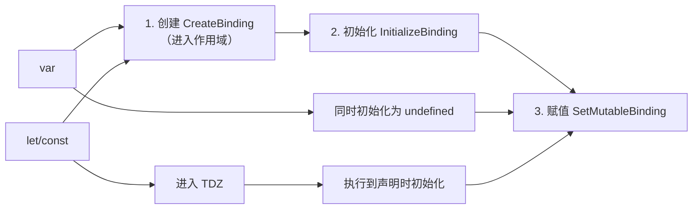
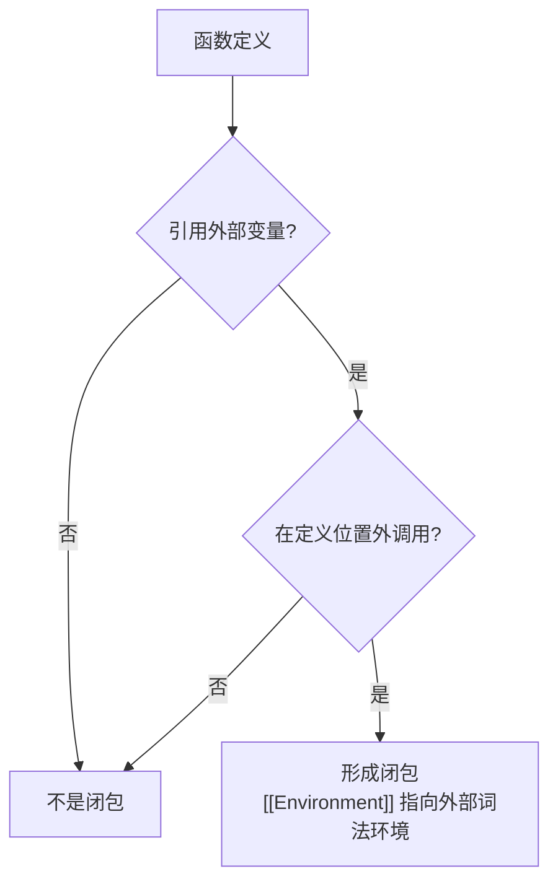
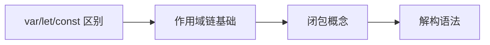

# 02 变量系统 (Variable System)

> 本专题深入探讨 ECMAScript 的变量声明、作用域、生命周期与内存管理机制，涵盖从 `var`/`let`/`const` 的基础语义到闭包、词法环境、全局对象等核心概念。所有文档对齐 ECMA-262 第16版（ES2025）和 TypeScript 5.8–6.0 类型系统。
>
> 变量系统是 JavaScript 执行模型的基础层，理解变量声明、作用域解析和内存生命周期是掌握异步编程、模块系统和性能优化的前提。

---

## 专题结构

| # | 文件 | 主题 | 核心概念 | 字节数 |
|---|------|------|---------|--------|
| 01 | [01-var-let-const.md](./01-var-let-const.md) | `var`、`let`、`const` 声明 | 声明提升、块级作用域、不可变性、TDZ | 12,000+ |
| 02 | [02-hoisting.md](./02-hoisting.md) | 变量提升机制 | 创建阶段、执行阶段、函数提升、var 陷阱 | 12,000+ |
| 03 | [03-temporal-dead-zone.md](./03-temporal-dead-zone.md) | 暂时性死区 (TDZ) | 未初始化绑定、ReferenceError、typeof 陷阱 | 12,000+ |
| 04 | [04-scope-chain.md](./04-scope-chain.md) | 作用域链 | 词法环境链、变量解析、遮蔽、性能 | 12,000+ |
| 05 | [05-lexical-environment.md](./05-lexical-environment.md) | 词法环境 | 环境记录、OuterEnv、声明式/对象式记录 | 12,000+ |
| 06 | [06-closure-deep-dive.md](./06-closure-deep-dive.md) | 闭包深入 | `[[Environment]]`、捕获、内存模型、循环陷阱 | 12,000+ |
| 07 | [07-global-object.md](./07-global-object.md) | 全局对象 | `globalThis`、var vs let、跨环境兼容、CSP | 12,000+ |
| 08 | [08-symbol-private-state.md](./08-symbol-private-state.md) | Symbol 与私有状态 | Well-Known Symbols、`#private`、WeakMap、品牌检查 | 12,000+ |
| 09 | [09-destructuring-rest-spread.md](./09-destructuring-rest-spread.md) | 解构、Rest、Spread | 模式匹配、可迭代协议、展开语法、性能 | 12,000+ |

---

## 核心概念图谱

```mermaid
graph TD
    VariableSystem["变量系统 Variable System"]
    VariableSystem --> Declaration["声明机制 Declaration"]
    VariableSystem --> Scope["作用域系统 Scope"]
    VariableSystem --> Lifetime["生命周期 Lifetime"]
    VariableSystem --> Memory["内存管理 Memory"]
    VariableSystem --> Privacy["私有状态 Privacy"]

    Declaration --> VarLetConst["var / let / const"]
    Declaration --> Hoisting["提升机制 Hoisting"]
    Declaration --> TDZ["暂时性死区 TDZ"]
    Declaration --> Destructuring["解构/Rest/Spread"]

    Scope --> LexicalEnv["词法环境 Lexical Environment"]
    Scope --> ScopeChain["作用域链 Scope Chain"]
    Scope --> Closure["闭包 Closure"]
    Scope --> Global["全局对象 Global Object"]

    Lifetime --> Block["块级作用域 Block"]
    Lifetime --> Function["函数作用域 Function"]
    Lifetime --> Module["模块作用域 Module"]

    Memory --> EnvRecord["环境记录 Environment Record"]
    Memory --> GC["垃圾回收 GC"]

    Privacy --> SymbolPrivate["Symbol 键属性"]
    Privacy --> WeakMapPrivate["WeakMap 关联"]
    Privacy --> HashPrivate["#private 字段"]
```



---

## 关键对比速查

### var vs let vs const

| 特性 | `var` | `let` | `const` |
|------|-------|-------|---------|
| 作用域 | 函数级 / 全局 | 块级 `{}` | 块级 `{}` |
| 提升 | ✅ 初始化为 `undefined` | ✅ 进入 TDZ | ✅ 进入 TDZ |
| 重复声明 | ✅ 允许 | ❌ SyntaxError | ❌ SyntaxError |
| 重新赋值 | ✅ 允许 | ✅ 允许 | ❌ TypeError |
| 声明时初始化 | 可选 | 可选 | **必需** |
| 全局对象属性 | ✅ 是 | ❌ 否 | ❌ 否 |
| 现代推荐度 | ⭐ | ⭐⭐⭐⭐ | ⭐⭐⭐⭐⭐ |

### 提升行为对比

| 声明类型 | 作用域 | 提升 | 声明前状态 | 可访问性 |
|---------|--------|------|-----------|---------|
| `var x` | 函数/全局 | ✅ | `undefined` | ✅ 可访问 |
| `function f(){}` | 函数/全局 | ✅ | 完整函数对象 | ✅ 可调用 |
| `let x` | 块级 | ✅ | 未初始化（TDZ） | ❌ ReferenceError |
| `const x` | 块级 | ✅ | 未初始化（TDZ） | ❌ ReferenceError |
| `class C` | 块级 | ✅ | 未初始化（TDZ） | ❌ ReferenceError |
| `import {x}` | 模块 | ✅ | 模块导出值 | ✅ 可访问 |

### 私有状态方案对比

| 方案 | 真正私有 | 语法 | 性能 | 浏览器兼容 | 推荐度 |
|------|---------|------|------|-----------|--------|
| `_prefix` 约定 | ❌ | 简单 | ⭐⭐⭐⭐⭐ | 全平台 | ⭐ |
| Symbol 键属性 | ⚠️ 反射可访问 | 简单 | ⭐⭐⭐⭐ | 全平台 | ⭐⭐⭐ |
| WeakMap 关联 | ✅ | 冗余 | ⭐⭐⭐ | 全平台 | ⭐⭐⭐⭐ |
| `#private` 字段 | ✅ | 简洁 | ⭐⭐⭐⭐ | 现代浏览器 | ⭐⭐⭐⭐⭐ |

### 作用域类型速查

| 类型 | 创建时机 | OuterEnv | 典型示例 | 变量声明 |
|------|---------|---------|---------|---------|
| 全局作用域 | 脚本/模块开始 | `null` | 脚本顶层 | `var`/`let`/`const` |
| 函数作用域 | 函数调用 | 定义时的环境 | `function f() {}` | `var`/`let`/`const` |
| 块级作用域 | 进入 `{}` | 当前环境 | `if (true) {}` | `let`/`const`/`class` |
| 模块作用域 | 模块加载 | 全局环境 | `export const x = 1` | `let`/`const`/`import` |
| Catch 块作用域 | 异常捕获 | 当前环境 | `catch (e) {}` | `catch` 参数 |

---

## 关键机制流程

### 变量创建三阶段



### 作用域链查找流程

```
查找变量 "x":

  ┌─────────────────┐
  │   当前词法环境    │ ← 第1步：检查当前环境记录
  └───────┬─────────┘
          │ 未找到
          ▼
  ┌─────────────────┐
  │   外层词法环境    │ ← 第2步：沿 OuterEnv 查找
  └───────┬─────────┘
          │ 未找到
          ▼
  ┌─────────────────┐
  │   全局词法环境    │ ← 第3步：检查全局环境
  └───────┬─────────┘
          │ 未找到
          ▼
      ReferenceError
```

### 闭包形成条件



---

## 权威参考

### ECMA-262 规范

| 章节 | 主题 | 链接 |
|------|------|------|
| §8.1 | Lexical Environments | tc39.es/ecma262/#sec-lexical-environments |
| §8.1.1 | Environment Records | tc39.es/ecma262/#sec-environment-records |
| §9.2 | ECMAScript Function Objects | tc39.es/ecma262/#sec-ecmascript-function-objects |
| §13.3 | Let and Const Declarations | tc39.es/ecma262/#sec-let-and-const-declarations |
| §14.3 | Variable Statement | tc39.es/ecma262/#sec-variable-statement |
| §14.6 | Class Definitions | tc39.es/ecma262/#sec-class-definitions |
| §18.1 | The Global Object | tc39.es/ecma262/#sec-global-object |
| §19.4 | Symbol Objects | tc39.es/ecma262/#sec-symbol-objects |

### TypeScript 官方文档

- **TypeScript Handbook: Variable Declarations** — <https://www.typescriptlang.org/docs/handbook/variable-declarations.html>
- **TypeScript Handbook: Classes** — <https://www.typescriptlang.org/docs/handbook/classes.html>

### MDN Web Docs

- **MDN: var** — <https://developer.mozilla.org/en-US/docs/Web/JavaScript/Reference/Statements/var>
- **MDN: let** — <https://developer.mozilla.org/en-US/docs/Web/JavaScript/Reference/Statements/let>
- **MDN: const** — <https://developer.mozilla.org/en-US/docs/Web/JavaScript/Reference/Statements/const>
- **MDN: Hoisting** — <https://developer.mozilla.org/en-US/docs/Glossary/Hoisting>
- **MDN: Closures** — <https://developer.mozilla.org/en-US/docs/Web/JavaScript/Closures>
- **MDN: Scope** — <https://developer.mozilla.org/en-US/docs/Glossary/Scope>
- **MDN: globalThis** — <https://developer.mozilla.org/en-US/docs/Web/JavaScript/Reference/Global_Objects/globalThis>
- **MDN: Symbol** — <https://developer.mozilla.org/en-US/docs/Web/JavaScript/Reference/Global_Objects/Symbol>
- **MDN: Destructuring** — <https://developer.mozilla.org/en-US/docs/Web/JavaScript/Reference/Operators/Destructuring_assignment>

---

## 版本对齐

- **ECMAScript**: 2025 (ES16) — tc39.es/ecma262
- **TypeScript**: 5.8–6.0 — typescriptlang.org
- **Node.js**: 22+ (V8 12.4+)
- **Browser**: Chrome 120+, Firefox 120+, Safari 17+

---

## 学习路径建议

### 初学者路径



1. **01-var-let-const.md** — 理解三种声明的核心差异
2. **04-scope-chain.md** — 掌握作用域链查找规则
3. **06-closure-deep-dive.md** — 理解闭包的形成与应用
4. **09-destructuring-rest-spread.md** — 现代语法糖

### 进阶路径


1. **05-lexical-environment.md** — 深入引擎实现
2. **03-temporal-dead-zone.md** — 理解 TDZ 的规范定义
3. **02-hoisting.md** — 掌握提升的完整机制
4. **07-global-object.md** — 跨环境兼容
5. **08-symbol-private-state.md** — 现代私有状态方案

### 性能优化路径

1. **全局变量缓存** — 减少作用域链深度
2. **闭包内存管理** — 避免意外引用保持
3. **解构性能** — 大对象避免过度展开

---

## 常见面试题

### Q1: var、let、const 的区别？

**答**: 三者在作用域、提升、重复声明和可变性上有本质区别。var 是函数作用域，提升为 undefined，可重复声明；let/const 是块级作用域，提升进入 TDZ，不可重复声明；const 还不可重新赋值。

### Q2: 什么是暂时性死区（TDZ）？

**答**: TDZ 是从块级作用域开始到变量声明语句之间的时间段。在此期间变量已绑定但未初始化，访问会抛出 ReferenceError。typeof 在 TDZ 中也不安全。

### Q3: 闭包是什么？有什么应用场景？

**答**: 闭包是函数与其词法环境的组合。函数定义时捕获外部变量引用，在外部调用时仍可访问。应用场景包括：模块模式、柯里化、防抖节流、私有状态。

### Q4: 全局对象和全局作用域的关系？

**答**: 全局对象（globalThis/window/global）是全局作用域的一部分。var 和函数声明会成为全局对象属性，但 let/const/class 不会，它们存储在全局词法环境的声明式记录中。

---

## 关联专题

- **01 类型系统** — 类型标注与变量声明的交互（TypeScript 类型推断）
- **03 控制流** — 变量在条件/循环中的生命周期
- **04 执行模型** — 执行上下文与词法环境的创建
- **jsts-code-lab/** — 变量系统相关的代码练习与实验

---

## 质量检查清单

本专题所有文档遵循以下质量标准：

- ✅ 每个文件 ≥ 12,000 字节，包含 8 大学术板块
- ✅ 形式化定义（ECMA-262 规范引用）
- ✅ Mermaid 图表 ≥ 1 个
- ✅ 多维对比矩阵
- ✅ 正例、反例、边缘案例
- ✅ ≥ 3 个权威来源引用
- ✅ Pitfalls 和 Trade-off 分析
- ✅ 版本对齐（ES2025 / TS 5.8–6.0）

---

## 11. 学术深度标准说明

本专题所有文档遵循学术模板 v2 标准，包含以下核心维度：

| 维度 | 内容 | 最低要求 |
|------|------|---------|
| 形式化定义 | ECMA-262 规范引用 + 数学表述 | ≥1 处 |
| 公理化表述 | 公理 + 定理 + 证明 | ≥1 组 |
| 推理链分析 | 演绎/归纳/反事实推理 | ≥1 条 |
| 真值表 | 条件组合判定 | ≥1 个 |
| 思维表征 | 决策树 + 公理化树图 + 推理图 | ≥3 种 |
| 权威引用 | ECMA-262 / MDN / TS Handbook / V8 Blog | ≥5 个来源 |

## 12. 版本对齐

- **ECMAScript**: 2025 (ES16) — tc39.es/ecma262
- **TypeScript**: 5.8–6.0 — typescriptlang.org
- **Node.js**: 22+ (V8 12.4+)
