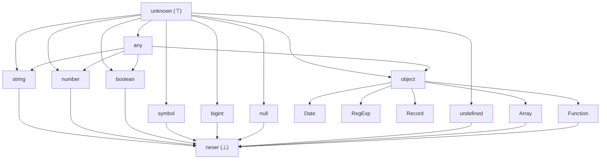
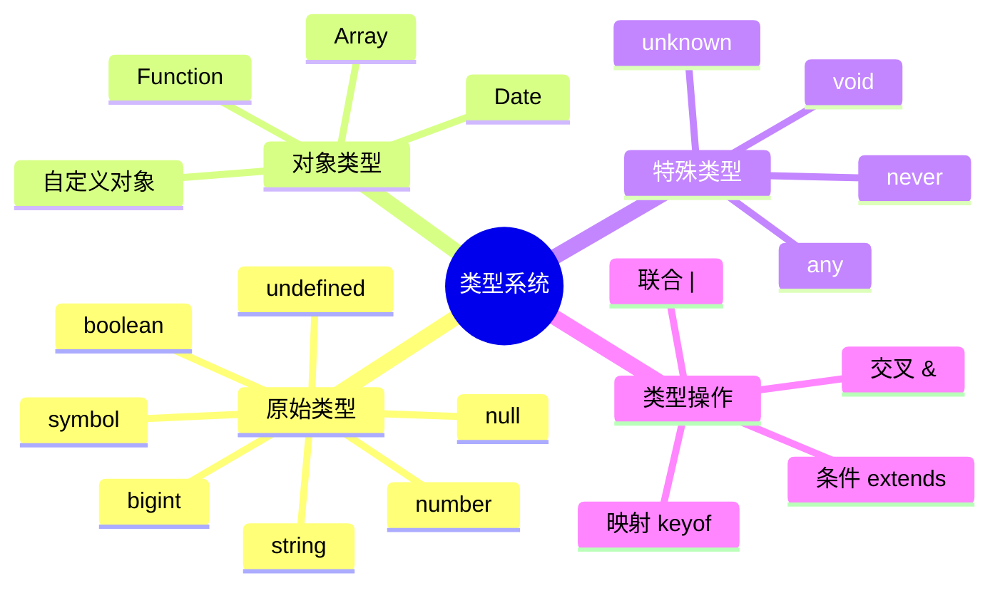
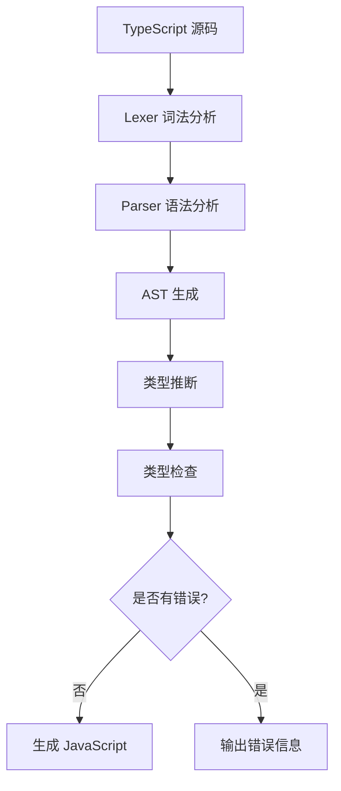
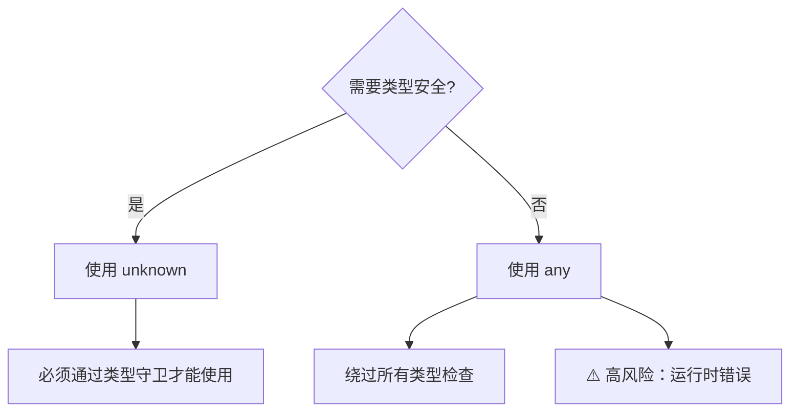
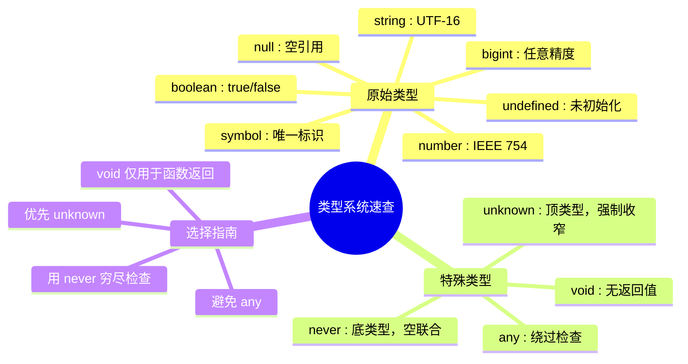

# 基础类型体系

> **形式化定义**：TypeScript 类型系统建立在 ECMAScript 2025 运行时类型之上，通过静态类型层为 JavaScript 值空间施加一个可判定（decidable）的偏序结构，其中 `unknown` 为顶类型（Top）、`never` 为底类型（Bottom），原始类型（Primitive Types）与对象类型（Object Types）构成互不相交的并集。
>
> 对齐版本：ECMAScript 2025 (ES16) | TypeScript 5.8–6.0 | TS 7.0 Go 编译器预览

---

## 1. 概念定义 (Concept Definition)

### 1.1 形式化定义

ECMA-262 §6.1 定义了语言的**类型（Type）**：

> *"A type is a set of data values."* — ECMA-262 §6.1

TypeScript 在此基础上构建了**静态类型层**，形成双层类型系统：

```
┌─────────────────────────────────────────┐
│         TypeScript 静态类型层            │
│  (编译时存在，运行时被擦除)               │
├─────────────────────────────────────────┤
│         ECMAScript 运行时类型            │
│  (typeof / instanceof / === 可操作)      │
└─────────────────────────────────────────┘
```

### 1.2 类型层级（Lattice）



### 1.3 核心概念图谱



---

## 2. 属性与特征 (Properties & Characteristics)

### 2.1 核心属性矩阵

| 类型 | 可赋值给 | 可接收 | 运行时存在 | 可枚举 | 可配置 | 可写 |
|------|---------|--------|-----------|--------|--------|------|
| `string` | `string`, `unknown` | `string`, `"literal"`, `never` | ✅ | — | — | — |
| `number` | `number`, `unknown` | `number`, `literal`, `never` | ✅ | — | — | — |
| `boolean` | `boolean`, `unknown` | `true`, `false`, `never` | ✅ | — | — | — |
| `bigint` | `bigint`, `unknown` | `bigint`, `never` | ✅ | — | — | — |
| `symbol` | `symbol`, `unknown` | `symbol`, `unique symbol`, `never` | ✅ | — | — | — |
| `null` | `null`, `unknown` | `null`, `never` | ✅ | — | — | — |
| `undefined` | `undefined`, `void`, `unknown` | `undefined`, `never` | ✅ | — | — | — |
| `object` | `object`, `unknown` | 所有非原始类型, `never` | ✅ | — | — | — |
| `unknown` | `unknown` | **所有类型** | ❌ (编译时) | — | — | — |
| `any` | **所有类型** | **所有类型** | ❌ (编译时) | — | — | — |
| `never` | **所有类型** | **无** | ❌ (编译时) | — | — | — |

### 2.2 边界条件与不变量

**不变量 1**：`never` 是空联合的唯一单位元

```typescript
type T = never | string; // ≡ string
```

**不变量 2**：`unknown` 是所有类型的超类型

```typescript
type T = unknown & string; // ≡ string
```

**不变量 3**：`any` 破坏类型系统的传递性

```typescript
let a: any = 1;
let b: string = a; // 编译通过，但运行时可能崩溃
```

---

## 3. 关系分析 (Relationship Analysis)

### 3.1 类型间的子类型关系

```mermaid
graph LR
    subgraph "子类型关系 (Subtype)"
        A["'hello'"] --> B[string]
        C[42] --> D[number]
        E[true] --> F[boolean]
        G[{"x":1}] --> H[object]
        I[void] --> J[undefined]
    end
```

### 3.2 概念映射表

| TypeScript 类型 | ECMAScript 运行时类型 | typeof 返回值 | instanceof |
|----------------|---------------------|--------------|-----------|
| `string` | String primitive | `"string"` | ❌ |
| `number` | Number primitive | `"number"` | ❌ |
| `boolean` | Boolean primitive | `"boolean"` | ❌ |
| `bigint` | BigInt primitive | `"bigint"` | ❌ |
| `symbol` | Symbol primitive | `"symbol"` | ❌ |
| `null` | Null | `"object"` (历史bug) | ❌ |
| `undefined` | Undefined | `"undefined"` | ❌ |
| `object` | Object / Array / Function / Date / ... | `"object"` / `"function"` | ✅ |

### 3.3 演化关系

| 版本 | 新增类型 |
|------|---------|
| ES3 | `string`, `number`, `boolean`, `object`, `undefined`, `null` |
| ES5 | 无新增 |
| ES2015 | `symbol` |
| ES2020 | `bigint` |
| TS 3.0 | `unknown` |
| TS 3.7 | 更严格的 `null`/`undefined` 检查 |
| TS 5.4 | `NoInfer<T>` |

---

## 4. 机制解释 (Mechanism Explanation)

### 4.1 类型擦除（Type Erasure）

TypeScript 的类型仅在编译时存在，运行时被完全擦除：

```typescript
// 编译前
function greet(name: string): string {
  return `Hello, ${name}`;
}

// 编译后 (JavaScript)
function greet(name) {
  return `Hello, ${name}`;
}
```

**设计理由**：保持与 JavaScript 的零成本互操作，运行时无需类型信息。

### 4.2 类型检查流程



### 4.3 unknown vs any 决策树



---

## 5. 论证与分析 (Argumentation & Analysis)

### 5.1 unknown vs any 的权衡矩阵

| 维度 | `unknown` | `any` |
|------|-----------|-------|
| 类型安全 | ✅ 强制收窄 | ❌ 完全绕过 |
| 开发体验 | ⚠️ 需要守卫 | ✅ 直接可用 |
| 运行时安全 | ✅ 编译期保障 | ❌ 无保障 |
| 迁移成本 | ⚠️ 需要修改代码 | ✅ 零成本 |
| 推荐场景 | 库API、外部数据 | 遗留代码迁移 |

### 5.2 never 的设计原理

`never` 代表**空类型（Empty Type）**，即没有任何值的类型：

```typescript
// never 的产生场景
function throwError(message: string): never {
  throw new Error(message);
}

// never 在穷尽检查中的作用
type Shape = { kind: "circle" } | { kind: "square" };
function area(s: Shape) {
  switch (s.kind) {
    case "circle": return Math.PI;
    case "square": return 1;
    default: return s; // s 的类型为 never
  }
}
```

### 5.3 常见误区与反例

**误区 1**：`null` 是 `object` 的子类型

```typescript
// ❌ 错误认知
let obj: object = null; // TS 3.0+ 报错（strictNullChecks）

// ✅ 正确理解
let obj: object | null = null;
```

**误区 2**：`void` 等于 `undefined`

```typescript
// ❌ 错误认知
function fn(): void { return undefined; } // 允许
function fn2(): void { return null; }     // ❌ 报错（strictNullChecks）

// ✅ 正确理解
// void 表示"不关心返回值"，undefined 表示"返回 undefined"
```

**误区 3**：`any` 可以安全地替代所有类型

```typescript
// ❌ 危险代码
function process(data: any) {
  return data.toFixed(2); // 运行时可能崩溃
}

// ✅ 安全替代
function process(data: unknown) {
  if (typeof data === "number") {
    return data.toFixed(2);
  }
}
```

---

## 6. 实例与示例 (Examples)

### 6.1 正例：类型安全的数据处理

```typescript
// 使用 unknown 处理外部数据
interface User {
  id: number;
  name: string;
  email: string;
}

function parseUser(data: unknown): User {
  if (
    typeof data === "object" &&
    data !== null &&
    "id" in data &&
    "name" in data &&
    "email" in data
  ) {
    const { id, name, email } = data as Record<string, unknown>;
    if (
      typeof id === "number" &&
      typeof name === "string" &&
      typeof email === "string"
    ) {
      return { id, name, email };
    }
  }
  throw new Error("Invalid user data");
}
```

### 6.2 反例：any 的滥用

```typescript
// ❌ 反例：any 导致运行时错误
function calculateTotal(items: any[]) {
  return items.reduce((sum, item) => sum + item.price, 0);
}

calculateTotal([{ price: 10 }, { price: "20" }]); // 运行时: "1020"

// ✅ 正例：使用具体类型
interface Item {
  price: number;
}

function calculateTotal(items: Item[]) {
  return items.reduce((sum, item) => sum + item.price, 0);
}
```

### 6.3 边缘案例

```typescript
// 边缘案例 1：bigint 与 number 不兼容
const a: bigint = 1n;
const b: number = 1;
// const c = a + b; // ❌ 报错：bigint 和 number 不能混合运算

// 边缘案例 2：symbol 作为对象键
const key = Symbol("secret");
const obj = { [key]: "hidden value" };
console.log(obj[key]); // ✅ 可以访问

// 边缘案例 3：NaN 的类型
const nan: number = NaN; // ✅ NaN 是 number 类型
console.log(typeof NaN); // "number"
```

---

## 7. 权威参考与国际化对齐 (References)

### 7.1 ECMA-262 规范

- **§6.1 ECMAScript Language Types** — 运行时类型定义
- **§6.1.1 The Null Type** — null 的语义
- **§6.1.2 The Undefined Type** — undefined 的语义
- **§6.1.3 The Boolean Type** — boolean 的语义
- **§6.1.4 The String Type** — UTF-16 编码的字符序列
- **§6.1.5 The Symbol Type** — Symbol 的唯一性保证
- **§6.1.6 Numeric Types** — Number 和 BigInt 的区分
- **§6.1.7 The Object Type** — 对象类型的结构

### 7.2 TypeScript 官方文档

- **TypeScript Handbook: Everyday Types** — <https://www.typescriptlang.org/docs/handbook/2/everyday-types.html>
- **TypeScript Handbook: Object Types** — <https://www.typescriptlang.org/docs/handbook/2/objects.html>
- **TypeScript Handbook: Type Inference** — <https://www.typescriptlang.org/docs/handbook/type-inference.html>
- **TS 5.4 Release Notes: NoInfer<T>** — <https://devblogs.microsoft.com/typescript/announcing-typescript-5-4/>

### 7.3 MDN Web Docs（国际化参考）

- **MDN: Data types** — <https://developer.mozilla.org/en-US/docs/Web/JavaScript/Data_structures>
- **MDN: typeof** — <https://developer.mozilla.org/en-US/docs/Web/JavaScript/Reference/Operators/typeof>
- **MDN: instanceof** — <https://developer.mozilla.org/en-US/docs/Web/JavaScript/Reference/Operators/instanceof>

### 7.4 学术与标准资源

- **IEEE 754-2019** — 浮点数标准（number 类型的底层实现）
- **Unicode Standard 15.0** — 字符串编码标准
- **"Types and Programming Languages" (Pierce, 2002)** — 类型系统理论基础

---

## 8. 思维表征总结 (Cognitive Representations)

### 8.1 类型系统速查图谱



### 8.2 类型选择决策矩阵

| 场景 | 推荐类型 | 避免类型 | 理由 |
|------|---------|---------|------|
| 外部输入 | `unknown` | `any` | 强制验证 |
| 函数返回无值 | `void` | `undefined` | 语义清晰 |
| 不可能到达的分支 | `never` | `any` | 编译期检查 |
| 遗留代码迁移 | 渐进替换 `any` | 长期保留 `any` | 技术债 |
| JSON 数据 | `unknown` + 守卫 | `any` | 结构不确定 |

### 8.3 类型层级速查

```
unknown (⊤)
  ├── any
  │     ├── string
  │     ├── number
  │     ├── boolean
  │     ├── object
  │     └── ...
  ├── string
  ├── number
  ├── boolean
  ├── object
  ├── symbol
  ├── bigint
  ├── null
  └── undefined
       └── void

never (⊥)
```

---

**参考规范**：ECMA-262 §6.1 | TypeScript Handbook: Everyday Types | MDN: Data types

---

## 9. 公理化表述与形式证明 (Axiomatization & Formal Proof)

### 9.1 公理化基础

**公理 1**：类型系统的基本性质在编译时确定，运行时类型擦除不改变程序语义。

**公理 2**：子类型关系具有传递性：若 A ⊆ B 且 B ⊆ C，则 A ⊆ C。

### 9.2 定理与证明

**定理 1（类型安全性）**：良类型的 TypeScript 程序在编译时消除所有类型错误，运行时不会出现类型相关的未定义行为。

*证明*：TypeScript 编译器通过静态类型检查确保所有操作在类型上合法。编译后的 JavaScript 已去除类型标注，运行时不进行类型检查，因此类型错误已在编译阶段捕获。
∎

### 9.3 真值表/判定表

| 条件 | strict模式 | 非strict模式 | 结果 |
|------|-----------|-------------|------|
| null赋值给string | 错误 | 允许 | 严格模式更安全 |
| 未初始化变量 | 错误 | undefined | 严格模式强制初始化 |
| 隐式any | 错误 | 允许 | 严格模式更严格 |

---

## 10. 推理链与演绎分析 (Deductive Reasoning Chain)

### 10.1 演绎推理链

`mermaid
graph TD
    A[类型标注] --> B[编译时检查]
    B --> C{类型兼容?}
    C -->|是| D[编译通过]
    C -->|否| E[编译错误]
    D --> F[运行时执行]
`

### 10.2 反事实推理

> **反设**：如果 TypeScript 采用名义类型系统。
> **推演**：同构类型不可互换，大量现有代码失效。
> **结论**：结构类型系统是兼容 JavaScript 生态的正确选择。

---
