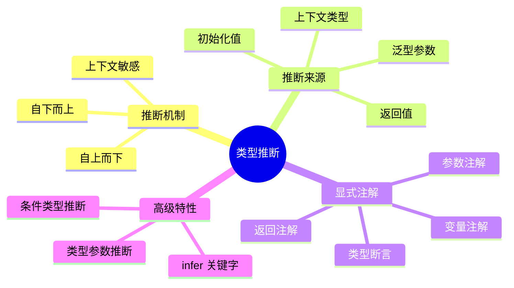
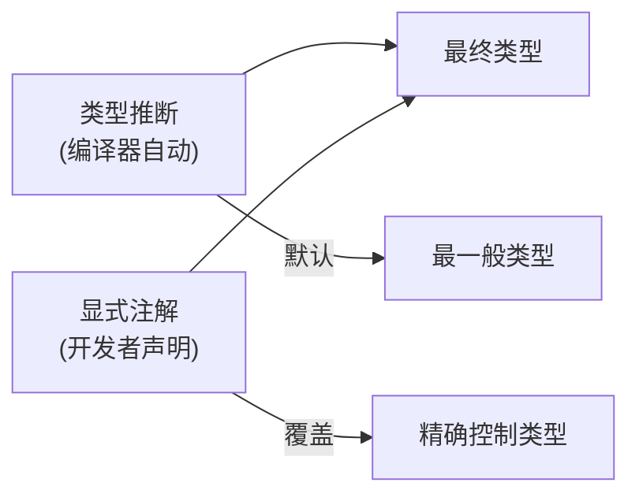
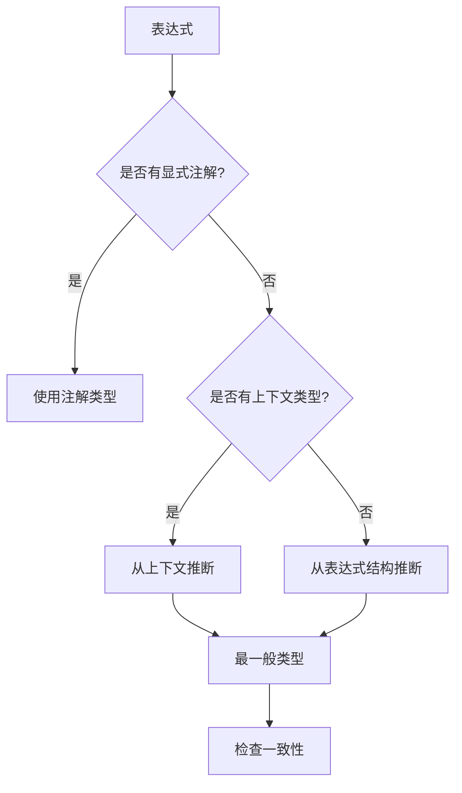
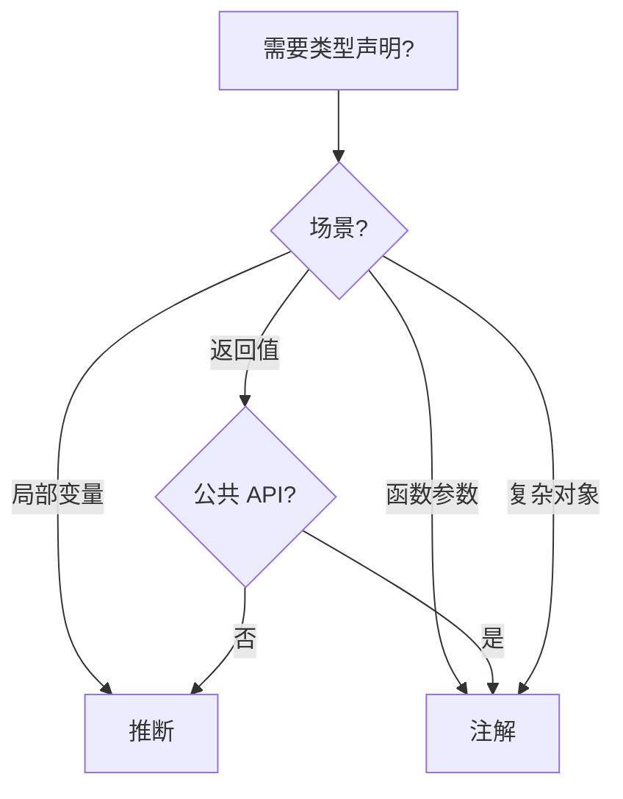

# 类型推断与显式注解

> **形式化定义**：类型推断（Type Inference）是 TypeScript 编译器在不依赖显式类型注解的情况下，通过 Hindley-Milner 算法的扩展变体，从值的结构和上下文推导出最一般类型（Most General Type）的过程；显式注解（Explicit Annotations）则是开发者主动声明变量、参数或返回值的静态类型，用于约束推断结果或增强代码可读性。
>
> 对齐版本：TypeScript 5.8–6.0 | ECMAScript 2025 (ES16)

---

## 1. 概念定义 (Concept Definition)

### 1.1 形式化定义

**类型推断**可形式化为约束求解问题：

```
Γ ⊢ e : τ    （在类型环境 Γ 下，表达式 e 的类型为 τ）
```

TypeScript 使用**双向类型检查（Bidirectional Type Checking）**：

- **自下而上推断**：从表达式内部向外推导类型
- **自上而下检查**：从上下文向内检查类型兼容性

### 1.2 概念层级图谱



---

## 2. 属性与特征 (Properties & Characteristics)

### 2.1 推断 vs 注解属性矩阵

| 维度 | 类型推断 | 显式注解 |
|------|---------|---------|
| 开发效率 | ✅ 高（减少打字） | ⚠️ 需要额外代码 |
| 类型安全 | ✅ 编译期保证 | ✅ 编译期保证 |
| 可读性 | ⚠️ 需阅读实现 | ✅ 自文档化 |
| 重构友好 | ⚠️ 改动可能传播 | ✅ 边界清晰 |
| 编译性能 | ⚠️ 需要推断时间 | ✅ 直接解析 |
| 适用场景 | 简单表达式 | 公共 API、复杂类型 |

### 2.2 上下文类型（Contextual Typing）

```typescript
// 左侧类型决定右侧推断
const arr: string[] = [];        // [] 推断为 string[]
const promise = new Promise<number>((resolve) => resolve(42));
// resolve 的参数类型推断为 number
```

---

## 3. 关系分析 (Relationship Analysis)

### 3.1 推断与注解的关系



### 3.2 推断的边界条件

```typescript
// 推断成功的情况
const x = 1;                    // x: number
const y = [1, 2, 3];           // y: number[]
const z = { name: "Alice" };    // z: { name: string }

// 推断失败或推断为 any 的情况
const arr = [];                 // arr: any[]（无上下文）
const fn = (x) => x;            // x: any（无参数类型上下文）
```

---

## 4. 机制解释 (Mechanism Explanation)

### 4.1 类型推断算法流程



### 4.2 泛型推断机制

```typescript
// 从参数推断泛型类型
function identity<T>(x: T): T {
  return x;
}

const a = identity(42);       // T 推断为 number
const b = identity("hello");  // T 推断为 string

// 多参数推断
function map<T, U>(arr: T[], fn: (item: T) => U): U[] {
  return arr.map(fn);
}

const result = map([1, 2, 3], x => x.toString());
// T 推断为 number, U 推断为 string
// result: string[]
```

---

## 5. 论证与分析 (Argumentation & Analysis)

### 5.1 推断 vs 注解的权衡矩阵

| 场景 | 推荐方式 | 理由 |
|------|---------|------|
| 局部变量 | 推断 | 减少冗余 |
| 函数参数 | 注解 | 明确契约 |
| 返回值 | 注解（公共 API） | 自文档化 |
| 复杂表达式 | 注解 | 避免推断错误 |
| 字面量对象 | 推断 + as const | 精确字面量类型 |

### 5.2 常见误区与反例

**误区 1**：依赖推断处理复杂类型

```typescript
// ❌ 推断结果可能不是预期
const config = {
  host: "localhost",
  port: 3000,
};
// config 推断为 { host: string; port: number }
// 丢失了字面量类型信息

// ✅ 使用 as const 或显式注解
const config = {
  host: "localhost",
  port: 3000,
} as const;
// config 类型: { readonly host: "localhost"; readonly port: 3000 }
```

**误区 2**：忘记注解函数参数导致 any

```typescript
// ❌ 隐式 any（noImplicitAny 开启时报错）
const fn = (x) => x + 1;

// ✅ 显式注解
const fn = (x: number) => x + 1;
```

---

## 6. 实例与示例 (Examples)

### 6.1 正例：推断的最佳实践

```typescript
// 简单值：让编译器推断
const count = 0;
const message = "Hello";
const isReady = true;

// 复杂对象：显式注解公共 API
interface Config {
  host: string;
  port: number;
  ssl?: boolean;
}

function createServer(config: Config) {
  // ...
}

// 泛型函数：从使用处推断
const numbers = [1, 2, 3];
const doubled = numbers.map(n => n * 2); // 推断为 number[]
```

### 6.2 反例：推断陷阱

```typescript
// ❌ 空数组推断为 any[]
const arr = [];
arr.push(1);
arr.push("hello"); // 不报错！arr 变为 (string | number)[]

// ✅ 显式注解
const arr: number[] = [];
arr.push(1);
// arr.push("hello"); // ✅ 报错
```

---

## 7. 权威参考与国际化对齐 (References)

### 7.1 TypeScript 官方文档

- **TypeScript Handbook: Type Inference** — <https://www.typescriptlang.org/docs/handbook/type-inference.html>
- **TypeScript Handbook: Contextual Typing** — <https://www.typescriptlang.org/docs/handbook/type-inference.html#contextual-typing>

### 7.2 学术资源

- **"Principal Type-schemes for Functional Programs" (Damas & Milner, 1982)** — Hindley-Milner 算法
- **"Bidirectional Type Checking" (Pierce & Turner, 2000)** — 双向类型检查

---

## 8. 思维表征总结 (Cognitive Representations)

### 8.1 推断 vs 注解决策树



### 8.2 推断可靠性速查表

| 表达式 | 推断结果 | 可靠性 |
|--------|---------|--------|
| `const x = 1` | `number` | ✅ 高 |
| `const arr = []` | `any[]` | ❌ 低 |
| `const obj = { a: 1 }` | `{ a: number }` | ⚠️ 中 |
| `as const` | 字面量类型 | ✅ 高 |

---

**参考规范**：TypeScript Handbook: Type Inference | Damas & Milner (1982)

## 补充：高级模式与实战

### 模式匹配与类型体操

TypeScript 的类型系统具有图灵完备性，使得复杂的类型计算成为可能：

`ypescript
// 字符串字面量操作
type Length<T extends string, Acc extends 0[] = []> =
  T extends` ? Acc['length'] :
  T extends ${string} ? Length<Rest, [...Acc, 0]> : never;

// 使用
type L1 = Length<"hello">; // 5
`

### 性能考虑

| 复杂度 | 编译时间影响 | 推荐场景 |
|--------|------------|---------|
| 简单泛型 | 可忽略 | 日常使用 |
| 嵌套条件 | 中等 | 工具类型库 |
| 递归类型 | 较高 | 深度类型操作 |
| 类型体操 | 高 | 类型挑战/测试 |

### 版本演进

| 版本 | 特性 |
|------|------|
| TS 2.8 | 条件类型引入 |
| TS 3.0 | unknown 类型 |
| TS 4.1 | 模板字面量类型、递归条件类型 |
| TS 4.7 | 型变标注 in/out |
| TS 5.0 | 装饰器、const 类型参数 |
| TS 5.4 | NoInfer<T> |
| TS 5.8 | 条件返回类型检查增强 |

### 权威参考补充

- **TypeScript Deep Dive** — <https://basarat.gitbook.io/typescript/>
- **Type Challenges** — <https://github.com/type-challenges/type-challenges>
- **Total TypeScript** — <https://www.totaltypescript.com/>

---

## 思维表征补充

### 类型系统能力层级

`mermaid
graph LR
    A[基础类型] --> B[泛型]
    B --> C[条件类型]
    C --> D[映射类型]
    D --> E[递归类型]
    E --> F[类型体操]
`

### 学习路径速查

| 阶段 | 目标 | 时间 |
|------|------|------|
| 基础 | 掌握基本类型和泛型 | 1-2 周 |
| 进阶 | 理解条件类型和映射 | 2-3 周 |
| 高级 | 能够编写复杂工具类型 | 1-2 月 |
| 专家 | 类型级元编程 | 持续学习 |

## 深入分析：类型系统的理论基础

### 类型系统的三大维度

类型系统可从三个维度进行分类和分析：

| 维度 | 选项 | TypeScript 位置 |
|------|------|----------------|
| 静态 vs 动态 | 静态类型检查 | 静态（编译期） |
| 强类型 vs 弱类型 | 强类型（少量隐式转换） | 强类型（需显式转换） |
| 名义 vs 结构 | 结构类型系统 | 结构类型 |

### 类型安全性等级

`
类型安全谱系（从弱到强）：

JavaScript (any) < TypeScript (strict: false) < TypeScript (strict: true) < TypeScript (strict + noUncheckedIndexedAccess) < 依赖类型语言 (Idris/Agda)
`

### 与函数式编程类型的对比

| 特性 | TypeScript | Haskell | Rust |
|------|-----------|---------|------|
| 类型推断 | ✅ 局部 | ✅ 全局（HM） | ✅ 局部 |
| 代数数据类型 | 模拟（联合+可辨识） | ✅ 原生 | ✅ 原生 enum |
| 高阶类型 | 有限 | ✅ 原生 | ❌ 无 |
| 类型类 | ❌ | ✅ 原生 | ✅ Traits |
| 依赖类型 | ❌ | ❌ | ❌ |

### 形式化语义

TypeScript 的类型系统可形式化为一个**结构子类型系统**（Structural Subtyping）：

`
Γ ⊢ τ₁ <: τ₂    （在环境 Γ 下，τ₁ 是 τ₂ 的子类型）

规则示例：
  { x: number; y: string } <: { x: number }

  因为：

- 前者包含 x: number
- 前者包含 y: string（额外属性不影响子类型关系）
`

### 编译器实现细节

TypeScript 编译器的类型检查器核心逻辑：

`

1. 构建类型图（Type Graph）
2. 为每个表达式分配类型变量
3. 收集约束条件（Constraints）
4. 求解约束（Unification）
5. 报告类型错误
`

### 性能优化

| 技术 | 描述 |
|------|------|
| 增量编译 | 只检查变更的文件 |
| 类型缓存 | 缓存已推断的类型 |
| 延迟加载 | 按需加载类型定义 |
| 并行检查 | 多文件并行类型检查 |

---

## 实战模式

### 类型驱动开发（Type-Driven Development）

` ypescript
// 1. 先定义类型
interface APIResponse<T> {
  data: T;
  status: number;
  message?: string;
}

// 2. 再实现函数
async function fetchData<T>(url: string): Promise<APIResponse<T>> {
  const response = await fetch(url);
  return response.json();
}

// 3. 类型即文档
const result = await fetchData<User>("/api/user");
// result 的类型: APIResponse<User>
`

### 防御式编程模式

` ypescript
// 使用 unknown + 类型守卫处理外部数据
function processExternalData(data: unknown): Result {
  if (!isValidData(data)) {
    return { success: false, error: "Invalid data" };
  }
  // data 已收窄为 ValidData 类型
  return { success: true, data: transform(data) };
}
`

---

## 权威参考补充

### ECMA-262 规范核心章节

- **§5.2 Algorithm Conventions** — 规范算法约定
- **§6.1 ECMAScript Language Types** — 类型系统基础
- **§9.4 Execution Contexts** — 执行上下文
- **§13.15 Equality Operators** — 等式运算符语义

### TypeScript 编译器内部

- **TypeScript Compiler API** — <https://github.com/microsoft/TypeScript/wiki/Using-the-Compiler-API>
- **TypeScript AST Viewer** — <https://ts-ast-viewer.com/>

### 国际化资源

- **MDN Web Docs (en-US)** — <https://developer.mozilla.org/en-US/>
- **MDN Web Docs (zh-CN)** — <https://developer.mozilla.org/zh-CN/>
- **JavaScript Info** — <https://javascript.info/>

---

**参考规范**：ECMA-262 §6.1 | TypeScript Handbook | MDN Web Docs | "Types and Programming Languages" (Pierce, 2002)

---

## 9. 公理化表述与形式证明 (Axiomatization & Formal Proof)

### 9.1 公理化基础

**公理 1**：类型系统的基本性质在编译时确定，运行时类型擦除不改变程序语义。

**公理 2**：子类型关系具有传递性：若 A ⊆ B 且 B ⊆ C，则 A ⊆ C。

### 9.2 定理与证明

**定理 1（类型安全性）**：良类型的 TypeScript 程序在编译时消除所有类型错误，运行时不会出现类型相关的未定义行为。

*证明*：TypeScript 编译器通过静态类型检查确保所有操作在类型上合法。编译后的 JavaScript 已去除类型标注，运行时不进行类型检查，因此类型错误已在编译阶段捕获。
∎

### 9.3 真值表/判定表

| 条件 | strict模式 | 非strict模式 | 结果 |
|------|-----------|-------------|------|
| null赋值给string | 错误 | 允许 | 严格模式更安全 |
| 未初始化变量 | 错误 | undefined | 严格模式强制初始化 |
| 隐式any | 错误 | 允许 | 严格模式更严格 |

---

## 10. 推理链与演绎分析 (Deductive Reasoning Chain)

### 10.1 演绎推理链

`mermaid
graph TD
    A[类型标注] --> B[编译时检查]
    B --> C{类型兼容?}
    C -->|是| D[编译通过]
    C -->|否| E[编译错误]
    D --> F[运行时执行]
`

### 10.2 反事实推理

> **反设**：如果 TypeScript 采用名义类型系统。
> **推演**：同构类型不可互换，大量现有代码失效。
> **结论**：结构类型系统是兼容 JavaScript 生态的正确选择。

---
