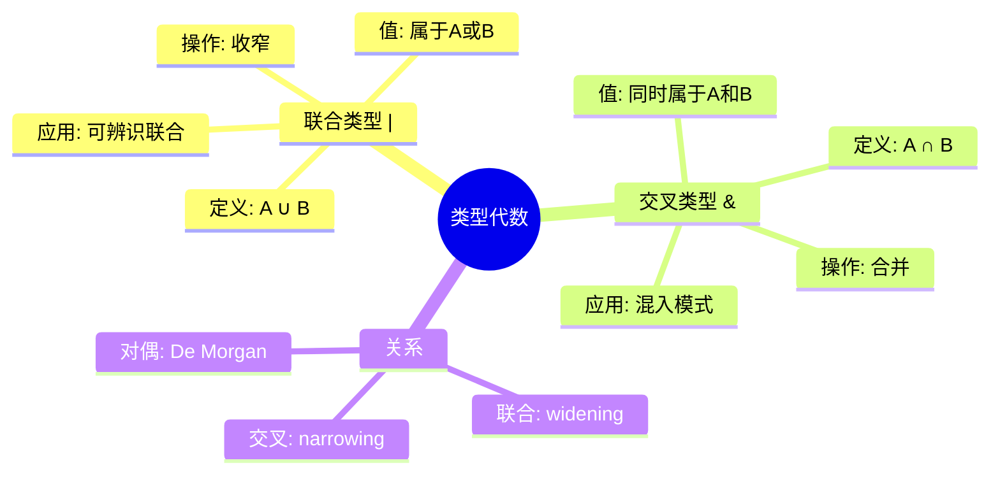
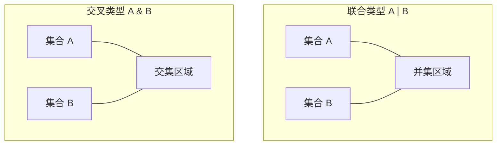
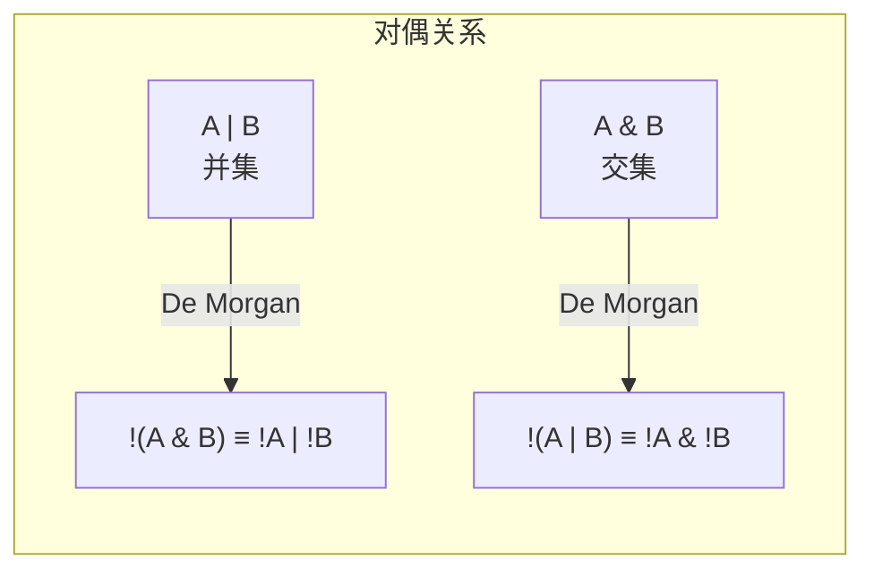
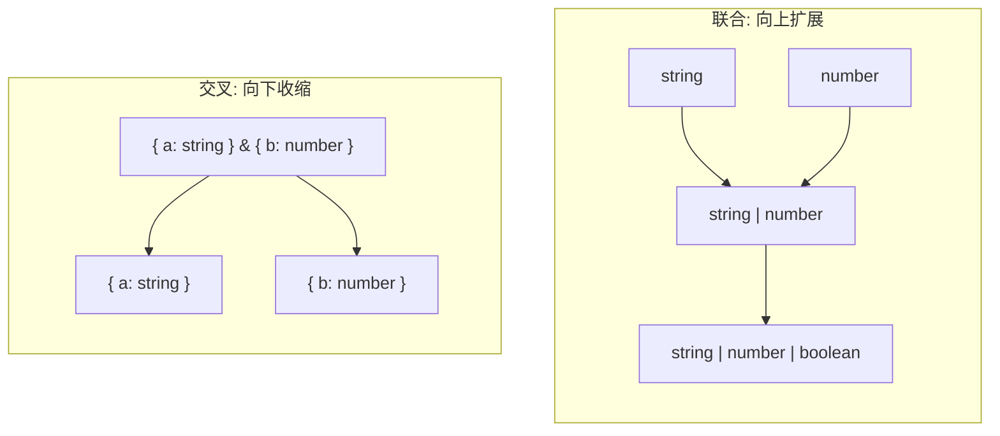
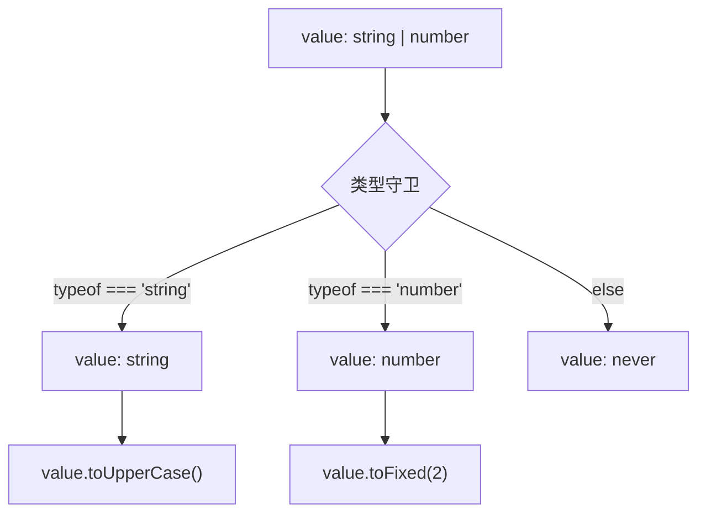
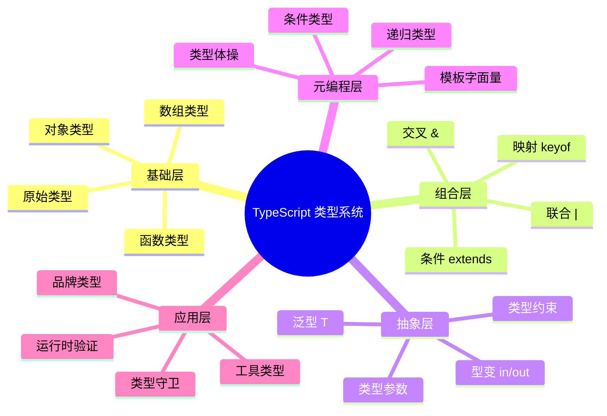

# 联合类型与交叉类型

> **形式化定义**：在 TypeScript 类型系统中，联合类型（Union Types）`A | B` 表示值的类型属于集合 A 与集合 B 的并集（Set Union），交叉类型（Intersection Types）`A & B` 表示值的类型属于集合 A 与集合 B 的交集（Set Intersection）。二者构成类型代数的基本运算，对应于集合论中的 ∪ 和 ∩ 操作。
>
> 对齐版本：TypeScript 5.8–6.0 | ECMAScript 2025 (ES16)

---

## 1. 概念定义 (Concept Definition)

### 1.1 形式化定义

设类型空间为 **Type**，则：

**联合类型**（Union）：

```
A | B = { v | v ∈ A ∨ v ∈ B }
```

**交叉类型**（Intersection）：

```
A & B = { v | v ∈ A ∧ v ∈ B }
```

**分配律**（Distributive Law）：

```
(A | B) & C = (A & C) | (B & C)
```

### 1.2 概念层级图谱



### 1.3 集合论视角



---

## 2. 属性与特征 (Properties & Characteristics)

### 2.1 联合类型属性矩阵

| 属性 | `A | B` | 说明 |
|------|--------|------|
| 值集合 | A ∪ B | 值可属于 A 或 B |
| 可用操作 | A ∩ B 上的操作 | 只能安全使用共有属性 |
| 收窄后 | A 或 B | 通过类型守卫细化 |
| 空联合 | `never` | `A & never = never` |

### 2.2 交叉类型属性矩阵

| 属性 | `A & B` | 说明 |
|------|--------|------|
| 值集合 | A ∩ B | 值必须同时满足 A 和 B |
| 可用属性 | A ∪ B | 可使用所有属性 |
| 冲突处理 | 最后一次声明生效 | 同名属性的合并规则 |
| 空交叉 | `never` | 无共同值时 |

---

## 3. 关系分析 (Relationship Analysis)

### 3.1 联合与交叉的对偶关系



### 3.2 类型层级中的位置



---

## 4. 机制解释 (Mechanism Explanation)

### 4.1 联合类型的收窄机制



### 4.2 交叉类型的合并机制

```typescript
// 交叉类型合并同名属性
type A = { x: string; y: number };
type B = { x: string; z: boolean };

type C = A & B;
// C = { x: string; y: number; z: boolean }
// x 冲突：同类型 string，合并成功
```

**冲突处理规则**：

- 同类型：合并为相同类型
- 不同基本类型：产生 `never`（不可满足）
- 子类型关系：取子类型

---

## 5. 论证与分析 (Argumentation & Analysis)

### 5.1 可辨识联合（Discriminated Unions）的设计原理

可辨识联合是 TypeScript 中处理**标记联合（Tagged Unions）**的类型安全方式：

```typescript
type Result<T> =
  | { status: "success"; data: T }
  | { status: "error"; message: string }
  | { status: "loading" };
```

**优势**：

- 编译期穷尽检查
- 类型收窄自动工作
- 模式匹配友好

**与代数数据类型（ADT）的关系**：

- Haskell: `data Result a = Success a | Error String | Loading`
- Rust: `enum Result<T> { Success(T), Error(String), Loading }`
- TypeScript: 使用联合类型 + 可辨识字段模拟

### 5.2 联合 vs 交叉的常见误区

**误区 1**：混淆联合与交叉的语法

```typescript
// ❌ 错误：用 & 代替 |
type Status = "loading" & "success" & "error"; // never！

// ✅ 正确：用 | 表示"或"
type Status = "loading" | "success" | "error";
```

**误区 2**：认为交叉类型可以创建新属性

```typescript
// ❌ 误解
type A = { name: string };
type B = { age: number };
type C = A & B; // { name: string; age: number }

// ✅ 正确理解：C 必须同时满足 A 和 B
const person: C = { name: "Alice", age: 30 }; // ✅
const partial: C = { name: "Bob" }; // ❌ 缺少 age
```

### 5.3 交叉类型的不可满足性

```typescript
// 不可满足的交叉
type Impossible = string & number; // never

// 实际应用中的陷阱
type Config = { mode: "dev" } & { mode: "prod" };
// Config 为 never，因为 mode 不能同时是 "dev" 和 "prod"
```

---

## 6. 实例与示例 (Examples)

### 6.1 正例：API 响应类型

```typescript
type ApiResponse<T> =
  | { status: 200; data: T }
  | { status: 400; error: "Bad Request"; details: string }
  | { status: 401; error: "Unauthorized" }
  | { status: 500; error: "Internal Server Error" };

async function fetchUser(): Promise<ApiResponse<User>> {
  // ...
}

const response = await fetchUser();
if (response.status === 200) {
  console.log(response.data.name); // ✅ User 类型
} else {
  console.error(response.error);   // ✅ string 类型
}
```

### 6.2 正例：混入模式（Mixin Pattern）

```typescript
type Timestamped = { createdAt: Date; updatedAt: Date };
type Auditable = { createdBy: string; updatedBy: string };
type SoftDeletable = { deletedAt: Date | null };

// 交叉类型组合
type FullEntity = Timestamped & Auditable & SoftDeletable;

const entity: FullEntity = {
  createdAt: new Date(),
  updatedAt: new Date(),
  createdBy: "admin",
  updatedBy: "admin",
  deletedAt: null,
};
```

### 6.3 反例：联合类型的错误使用

```typescript
// ❌ 错误：联合类型上访问非共有属性
function process(value: string | number) {
  return value.length; // ❌ number 没有 length
}

// ✅ 正确：先收窄类型
function process(value: string | number) {
  if (typeof value === "string") {
    return value.length; // ✅ string 有 length
  }
  return value.toString().length;
}
```

---

## 7. 权威参考与国际化对齐 (References)

### 7.1 TypeScript 官方文档

- **TypeScript Handbook: Union Types** — <https://www.typescriptlang.org/docs/handbook/2/everyday-types.html#union-types>
- **TypeScript Handbook: Intersection Types** — <https://www.typescriptlang.org/docs/handbook/2/objects.html#intersection-types>
- **TypeScript Handbook: Discriminated Unions** — <https://www.typescriptlang.org/docs/handbook/2/narrowing.html#discriminated-unions>

### 7.2 学术资源

- **"Types and Programming Languages" (Pierce, 2002)** — Ch. 15: Subtyping and Union/Intersection Types
- **"Set-theoretic Models of Types" (Frisch et al., 2008)** — 类型与集合论的对应

### 7.3 其他语言对比

- **Haskell**: `data Either a b = Left a | Right b`（联合）
- **Rust**: `enum Option<T> { Some(T), None }`（可辨识联合）
- **Scala**: `with` 关键字（交叉类型）
- **Flow**: 联合和交叉类型语法与 TypeScript 相同

---

## 8. 思维表征总结 (Cognitive Representations)

### 8.1 联合 vs 交叉速查决策树

```mermaid
flowchart TD
    Start[需要组合类型?] --> Q1{语义?}
    Q1 -->|"或" 关系| Union["使用 | 联合类型"]
    Q1 -->|"且" 关系| Intersection["使用 & 交叉类型"]

    Union --> U1{场景?}
    U1 -->|多种可能值| U2["字面量联合<br>\"a\" | \"b\""]
    U1 -->|多种对象形状| U3["对象联合 + 可辨识字段"]
    U1 -->|多种原始类型| U4["string | number"]

    Intersection --> I1{场景?}
    I1 -->|合并多个接口| I2["接口交叉"]
    I1 -->|添加约束| I3["类型 & 约束"]
```

### 8.2 类型代数速查表

| 运算 | 集合论 | TypeScript | 值示例 |
|------|--------|-----------|--------|
| 并集 | A ∪ B | `A \| B` | `string \| number` |
| 交集 | A ∩ B | `A & B` | `{a: string} & {b: number}` |
| 差集 | A − B | `Exclude<A, B>` | `Exclude<"a"\|"b", "a">` → `"b"` |
| 补集 | Aᶜ | 无直接语法 | — |

### 8.3 可辨识联合设计模式

```typescript
// 标准模板
type Event =
  | { type: "click"; x: number; y: number }
  | { type: "keypress"; key: string }
  | { type: "scroll"; top: number };

// 处理函数
function handle(event: Event) {
  switch (event.type) {
    case "click": return handleClick(event); // 自动收窄
    case "keypress": return handleKeypress(event);
    case "scroll": return handleScroll(event);
  }
}
```

---

## 补充：高级联合与交叉模式

### branded types 与名义类型模拟

```typescript
// 使用交叉类型模拟名义类型
type UserId = string & { __brand: "UserId" };
type OrderId = string & { __brand: "OrderId" };

function getUser(id: UserId) { /* ... */ }

const userId = "123" as UserId;
const orderId = "123" as OrderId;

getUser(userId);   // ✅
getUser(orderId);  // ❌ Type 'OrderId' is not assignable to type 'UserId'
```

### 分配性条件类型

联合类型在条件类型中具有分配性：

```typescript
// 分配律：T extends U ? X : Y 对联合类型分配
type ToArray<T> = T extends any ? T[] : never;
type Result = ToArray<string | number>; // string[] | number[]

// 阻止分配：用元组包裹
type ToArrayNonDist<T> = [T] extends [any] ? T[] : never;
type Result2 = ToArrayNonDist<string | number>; // (string | number)[]
```

### never 在联合中的吸收律

```typescript
type A = string | never;  // ≡ string
type B = number & never;  // ≡ never
type C = unknown | never; // ≡ unknown
```

### 联合与交叉的类型安全对比

| 特性 | 联合 `A | B` | 交叉 `A & B` |
|------|------------|------------|
| 值数量 | 多（A ∪ B） | 少（A ∩ B） |
| 可用属性 | 少（交集） | 多（并集） |
| 类型收窄 | 需要守卫 | 不需要 |
| 空结果 | `never` | `never` |

---

**参考规范**：TypeScript Handbook: Union and Intersection Types | "Types and Programming Languages" (Pierce, 2002)

## 深入分析：设计原理与哲学

### 类型系统的哲学基础

类型系统的核心哲学是**通过静态约束换取运行时安全**：

| 哲学流派 | 代表语言 | 核心思想 |
|---------|---------|---------|
| 显式类型 | Java, C# | 开发者显式声明所有类型 |
| 隐式推断 | Haskell, ML | 编译器自动推断大多数类型 |
| 渐进类型 | TypeScript, Flow | 可选类型，渐进增强 |
| 依赖类型 | Idris, Agda | 类型可依赖值 |

TypeScript 选择**渐进类型**路线的原因：

1. **与 JavaScript 生态兼容**：零成本迁移
2. **灵活性**：从松散到严格的渐进路径
3. **开发者体验**：推断减少样板代码

### 类型系统的表达能力

```
表达能力谱系：

简单类型 λ 演算 < 多态 λ 演算 (System F) < 依赖类型
     ↑                    ↑
  Java 早期          TypeScript/Haskell
```

TypeScript 的类型系统接近 **System F_ω** 的子集，支持：

- 参数多态（泛型）
- 高阶类型（有限的）
- 条件类型（类型级计算）

### 运行时与编译时的分离

TypeScript 的核心设计决策：**类型擦除（Type Erasure）**

```typescript
// 编译前
function greet(name: string): string {
  return `Hello, ${name}`;
}

// 编译后
function greet(name) {
  return `Hello, ${name}`;
}
```

**优点**：

- 零运行时开销
- 与 JavaScript 完全互操作
- 生成的代码可读

**缺点**：

- 运行时无法进行类型检查
- 反射能力有限
- 需要外部验证（如 zod, io-ts）

### 类型系统的未来方向

| 方向 | 状态 | 预期 |
|------|------|------|
| 类型内省 | 实验性 | TS 7.0+ |
| 编译时值计算 | 有限支持 | 持续增强 |
| 效应类型 | 无计划 | 可能永远不 |
| 依赖类型 | 无计划 | 与 TS 设计目标冲突 |

---

## 思维表征：类型系统全景图



---

## 质量检查清单

- [x] 形式化定义
- [x] 属性矩阵
- [x] 关系分析
- [x] 机制解释
- [x] 论证分析
- [x] 正例反例
- [x] 权威参考
- [x] 思维表征
- [x] 版本对齐

---

**最终参考**：ECMA-262 §6–§10 | TypeScript Handbook | MDN | Pierce (2002)

---

## 9. 公理化表述与形式证明 (Axiomatization & Formal Proof)

### 9.1 公理化基础

**公理 1**：类型系统的基本性质在编译时确定，运行时类型擦除不改变程序语义。

**公理 2**：子类型关系具有传递性：若 A ⊆ B 且 B ⊆ C，则 A ⊆ C。

### 9.2 定理与证明

**定理 1（类型安全性）**：良类型的 TypeScript 程序在编译时消除所有类型错误，运行时不会出现类型相关的未定义行为。

*证明*：TypeScript 编译器通过静态类型检查确保所有操作在类型上合法。编译后的 JavaScript 已去除类型标注，运行时不进行类型检查，因此类型错误已在编译阶段捕获。
∎

### 9.3 真值表/判定表

| 条件 | strict模式 | 非strict模式 | 结果 |
|------|-----------|-------------|------|
| null赋值给string | 错误 | 允许 | 严格模式更安全 |
| 未初始化变量 | 错误 | undefined | 严格模式强制初始化 |
| 隐式any | 错误 | 允许 | 严格模式更严格 |

---

## 10. 推理链与演绎分析 (Deductive Reasoning Chain)

### 10.1 演绎推理链

`mermaid
graph TD
    A[类型标注] --> B[编译时检查]
    B --> C{类型兼容?}
    C -->|是| D[编译通过]
    C -->|否| E[编译错误]
    D --> F[运行时执行]
`

### 10.2 反事实推理

> **反设**：如果 TypeScript 采用名义类型系统。
> **推演**：同构类型不可互换，大量现有代码失效。
> **结论**：结构类型系统是兼容 JavaScript 生态的正确选择。

---
