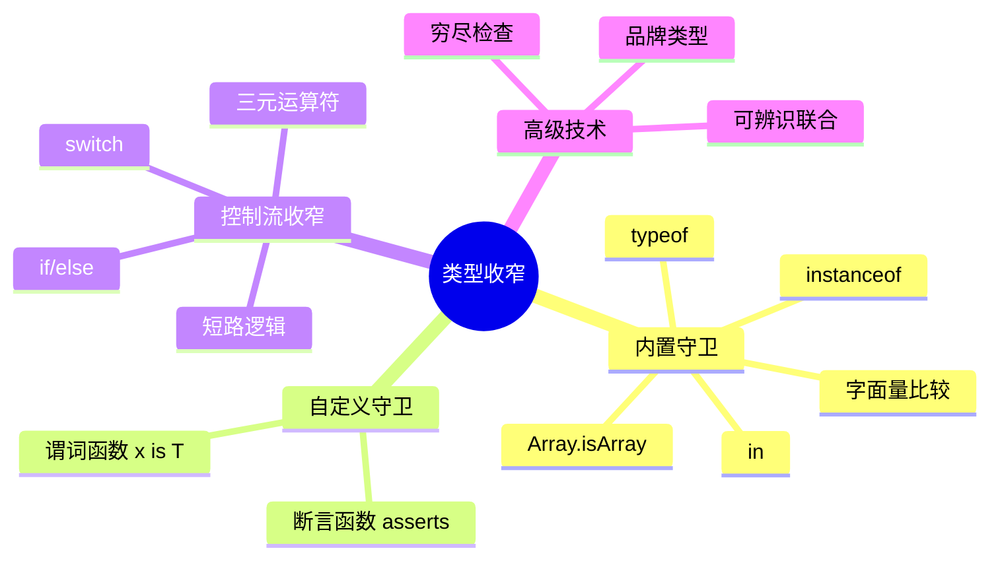
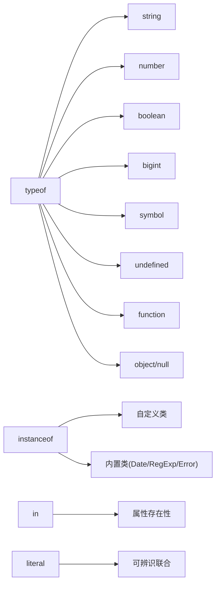
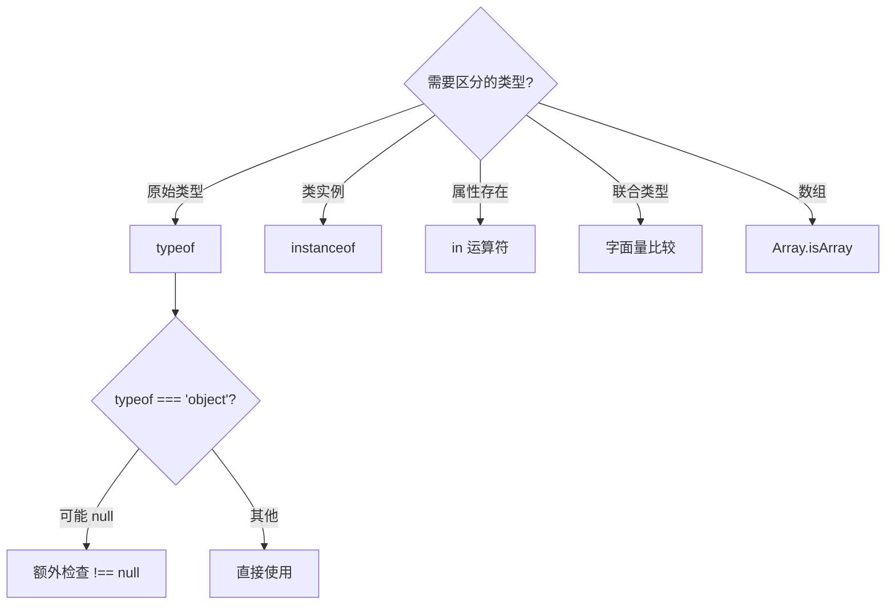
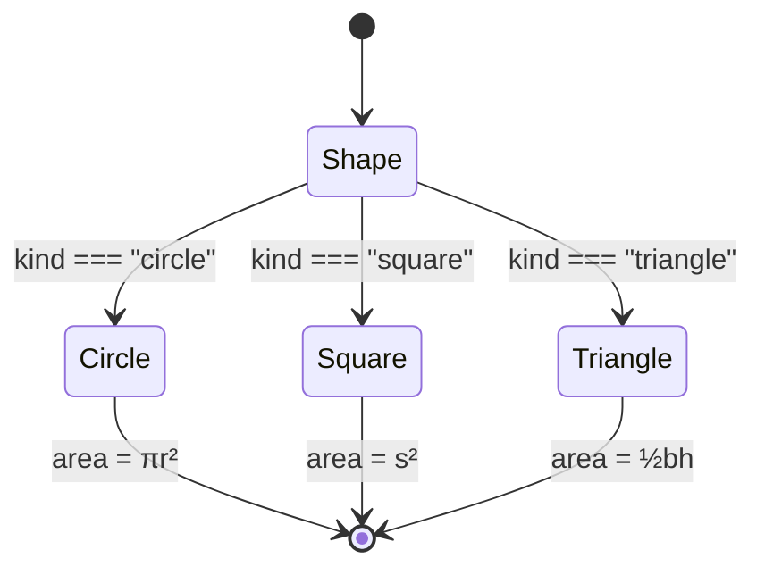
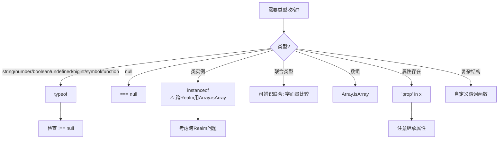

# 类型收窄与类型守卫

> **形式化定义**：类型收窄（Type Narrowing）是 TypeScript 类型系统中从超类型向子类型的推导过程，通过**类型守卫（Type Guards）**在控制流中建立可判定的类型谓词（Type Predicates），使得在特定代码区域内变量的静态类型被细化为更精确的子集。
>
> 对齐版本：ECMAScript 2025 (ES16) | TypeScript 5.8–6.0

---

## 1. 概念定义 (Concept Definition)

### 1.1 形式化定义

设类型环境 Γ 下变量 x 的类型为 T，若存在谓词 P(x) 使得当 P(x) 为真时，x 的类型可细化为 T' ⊆ T，则称 P 为**类型守卫**，该细化为**类型收窄**。

```
Γ ⊢ x : T
Γ, P(x) ⊢ x : T'    where T' ⊆ T
```

### 1.2 概念层级图谱



### 1.3 类型守卫的本质

类型守卫是**编译期的类型谓词**，在运行时执行值检查，在编译期细化类型：

```
运行时：值检查 → 布尔结果
编译期：类型谓词 → 类型环境更新
```

---

## 2. 属性与特征 (Properties & Characteristics)

### 2.1 内置守卫属性矩阵

| 守卫 | 可识别类型 | 运行时成本 | 编译期可靠性 | 适用场景 |
|------|-----------|-----------|-------------|---------|
| `typeof` | string/number/boolean/bigint/symbol/undefined/function | 极低 | ⚠️ 对 object/null 不准确 | 原始类型区分 |
| `instanceof` | 构造函数实例 | 原型链遍历 | ✅ 可靠（自定义类） | 类层次结构 |
| `in` | 对象属性存在性 | 属性查找 | ⚠️ 包含继承属性 | 属性检测 |
| `Array.isArray` | 数组 | 内部标志检查 | ✅ 可靠 | 数组 vs 类数组 |
| 字面量比较 | 字面量联合 | 值比较 | ✅ 可靠 | 可辨识联合 |

### 2.2 typeof 的边界条件

```typescript
typeof null === "object";     // ⚠️ 历史 bug（ES 保留兼容性）
typeof [] === "object";       // ✅ 数组是对象
typeof {} === "object";       // ✅
typeof (() => {}) === "function"; // ✅
```

**ECMA-262 §13.5.3** 明确说明：`typeof null` 返回 `"object"` 是早期实现的历史遗留，保持兼容性的同时已被广泛认知为设计缺陷。

---

## 3. 关系分析 (Relationship Analysis)

### 3.1 守卫与类型的对应关系



### 3.2 守卫选择决策树



---

## 4. 机制解释 (Mechanism Explanation)

### 4.1 控制流分析（Control Flow Analysis）

TypeScript 编译器在分析控制流时，维护一个**类型环境映射**，根据条件分支更新变量的类型：

```typescript
function process(value: string | number) {
  // value: string | number

  if (typeof value === "string") {
    // value: string（收窄）
    return value.toUpperCase();
  }

  // value: number（排除 string）
  return value.toFixed(2);
}
```

### 4.2 可辨识联合（Discriminated Unions）



```typescript
type Shape =
  | { kind: "circle"; radius: number }
  | { kind: "square"; side: number }
  | { kind: "triangle"; base: number; height: number };

function area(shape: Shape): number {
  switch (shape.kind) {
    case "circle": return Math.PI * shape.radius ** 2;
    case "square": return shape.side ** 2;
    case "triangle": return 0.5 * shape.base * shape.height;
  }
}
```

### 4.3 自定义类型守卫

```typescript
// 谓词函数：返回值类型为类型谓词
function isStringArray(value: unknown): value is string[] {
  return Array.isArray(value) && value.every(v => typeof v === "string");
}

// 断言函数：失败时抛出错误
function assertIsDefined<T>(value: T): asserts value is NonNullable<T> {
  if (value === null || value === undefined) {
    throw new Error("Value must be defined");
  }
}
```

---

## 5. 论证与分析 (Argumentation & Analysis)

### 5.1 类型守卫的可靠性矩阵

| 守卫 | 编译期可靠性 | 运行时可靠性 | 综合推荐度 |
|------|------------|------------|----------|
| `typeof x === 'string'` | ✅ 高 | ✅ 高 | ⭐⭐⭐⭐⭐ |
| `x instanceof Date` | ✅ 高 | ⚠️ 跨 Realm 失效 | ⭐⭐⭐⭐ |
| `'prop' in x` | ⚠️ 包含继承属性 | ✅ 高 | ⭐⭐⭐ |
| `x === 'literal'` | ✅ 高 | ✅ 高 | ⭐⭐⭐⭐⭐ |
| `Array.isArray(x)` | ✅ 高 | ✅ 高 | ⭐⭐⭐⭐⭐ |
| 自定义谓词 `x is T` | ✅ 高（需正确实现） | ⚠️ 依赖实现 | ⭐⭐⭐⭐ |

### 5.2 穷尽检查（Exhaustiveness Checking）

穷尽检查确保 switch 语句覆盖所有联合类型的分支：

```typescript
type Direction = "north" | "south" | "east" | "west";

function move(direction: Direction): void {
  switch (direction) {
    case "north": return console.log("向上");
    case "south": return console.log("向下");
    case "east": return console.log("向右");
    case "west": return console.log("向左");
    default:
      // direction 的类型为 never
      const _exhaustive: never = direction;
      throw new Error(`Unhandled direction: ${_exhaustive}`);
  }
}
```

**原理**：若新增联合成员而忘记更新 switch，default 分支中的赋值将产生编译错误。

### 5.3 常见误区与反例

**误区 1**：typeof 可以区分 null 和 object

```typescript
// ❌ 错误代码
function process(value: unknown) {
  if (typeof value === "object") {
    console.log(value.toString()); // 运行时崩溃：null
  }
}

// ✅ 正确代码
function process(value: unknown) {
  if (typeof value === "object" && value !== null) {
    console.log(value.toString());
  }
}
```

**误区 2**：instanceof 跨 Realm 不可靠

```typescript
// ❌ 跨 iframe/Worker 时可能失效
const arr = iframe.contentWindow.Array(1, 2, 3);
console.log(arr instanceof Array); // false！

// ✅ 使用 Array.isArray
console.log(Array.isArray(arr)); // true
```

**误区 3**：自定义守卫不做运行时检查

```typescript
// ❌ 虚假守卫
function isUser(value: unknown): value is User {
  return true; // 编译通过，但完全不可靠！
}

// ✅ 完整的运行时验证
function isUser(value: unknown): value is User {
  return (
    typeof value === "object" &&
    value !== null &&
    "id" in value &&
    "name" in value
  );
}
```

---

## 6. 实例与示例 (Examples)

### 6.1 正例：API 响应的类型安全解析

```typescript
interface ApiResponse<T> {
  success: boolean;
  data?: T;
  error?: string;
}

function handleResponse<T>(
  response: ApiResponse<T>,
  isData: (value: unknown) => value is T
): T {
  if (!response.success) {
    throw new Error(response.error ?? "Unknown error");
  }

  if (response.data === undefined) {
    throw new Error("Missing data");
  }

  if (!isData(response.data)) {
    throw new Error("Invalid data format");
  }

  return response.data;
}

// 使用
interface User {
  id: number;
  name: string;
}

function isUser(value: unknown): value is User {
  return (
    typeof value === "object" &&
    value !== null &&
    "id" in value &&
    typeof (value as Record<string, unknown>).id === "number" &&
    "name" in value &&
    typeof (value as Record<string, unknown>).name === "string"
  );
}

const response = await fetchUser();
const user = handleResponse(response, isUser); // user: User
```

### 6.2 反例：守卫不完整导致的类型漏洞

```typescript
// ❌ 不完整的守卫
interface Cat { meow: () => void; }
interface Dog { bark: () => void; }

function isCat(animal: Cat | Dog): animal is Cat {
  return "meow" in animal; // 问题：Dog 也可能有 meow 属性！
}

// ✅ 更可靠的守卫
function isCat(animal: Cat | Dog): animal is Cat {
  return "meow" in animal && !("bark" in animal);
}
```

### 6.3 边缘案例：联合类型的穷尽性

```typescript
// 边缘案例：开放联合类型
type Status = "loading" | "success" | "error";

// 若将来新增 "idle" 状态，以下代码不会报错
function getMessage(status: Status): string {
  switch (status) {
    case "loading": return "加载中...";
    case "success": return "完成！";
    case "error": return "出错了";
  }
}

// ✅ 使用穷尽检查确保未来安全
function getMessageSafe(status: Status): string {
  switch (status) {
    case "loading": return "加载中...";
    case "success": return "完成！";
    case "error": return "出错了";
    default:
      const _exhaustive: never = status;
      return _exhaustive;
  }
}
```

---

## 7. 权威参考与国际化对齐 (References)

### 7.1 TypeScript 官方文档

- **TypeScript Handbook: Narrowing** — <https://www.typescriptlang.org/docs/handbook/2/narrowing.html>
- **TypeScript Handbook: Discriminated Unions** — <https://www.typescriptlang.org/docs/handbook/2/narrowing.html#discriminated-unions>
- **TypeScript Handbook: Type Predicates** — <https://www.typescriptlang.org/docs/handbook/2/narrowing.html#using-type-predicates>

### 7.2 ECMA-262 规范

- **§13.5.3 typeof Operator** — 原始类型检测的语义
- **§13.10.2 instanceof Operator** — 原型链检查的语义
- **§13.10.1 in Operator** — 属性存在性检查的语义

### 7.3 MDN Web Docs

- **MDN: typeof** — <https://developer.mozilla.org/en-US/docs/Web/JavaScript/Reference/Operators/typeof>
- **MDN: instanceof** — <https://developer.mozilla.org/en-US/docs/Web/JavaScript/Reference/Operators/instanceof>
- **MDN: in** — <https://developer.mozilla.org/en-US/docs/Web/JavaScript/Reference/Operators/in>

### 7.4 学术资源

- **"Advanced Types in TypeScript" (Microsoft, 2023)** — 类型收窄的编译器实现
- **"Flow-sensitive Typing" (Flow Team, 2014)** — 控制流分析的理论基础

---

## 8. 思维表征总结 (Cognitive Representations)

### 8.1 守卫选择速查决策树



### 8.2 类型守卫可靠性矩阵

| 场景 | 推荐守卫 | 备选方案 | 不推荐 |
|------|---------|---------|--------|
| 原始类型 | `typeof` | — | `instanceof` |
| 数组 | `Array.isArray` | — | `instanceof Array` |
| 类实例 | `instanceof` | 品牌类型 | `typeof` |
| 联合类型 | 字面量比较 | `in` 运算符 | `typeof` |
| 属性存在 | `'prop' in x` | `x.prop !== undefined` | — |
| 复杂对象 | 自定义谓词 | 类型断言 | `as` |

### 8.3 穷尽检查模板

```typescript
function exhaustiveCheck(value: never): never {
  throw new Error(`Unhandled case: ${value}`);
}

// 使用方式
switch (value.kind) {
  case "a": return ...;
  case "b": return ...;
  default: return exhaustiveCheck(value);
}
```

---

**参考规范**：TypeScript Handbook: Narrowing | ECMA-262 §13.5.3 | MDN: typeof

---

## 9. 公理化表述与形式证明 (Axiomatization & Formal Proof)

### 9.1 公理化基础

**公理 1**：类型系统的基本性质在编译时确定，运行时类型擦除不改变程序语义。

**公理 2**：子类型关系具有传递性：若 A ⊆ B 且 B ⊆ C，则 A ⊆ C。

### 9.2 定理与证明

**定理 1（类型安全性）**：良类型的 TypeScript 程序在编译时消除所有类型错误，运行时不会出现类型相关的未定义行为。

*证明*：TypeScript 编译器通过静态类型检查确保所有操作在类型上合法。编译后的 JavaScript 已去除类型标注，运行时不进行类型检查，因此类型错误已在编译阶段捕获。
∎

### 9.3 真值表/判定表

| 条件 | strict模式 | 非strict模式 | 结果 |
|------|-----------|-------------|------|
| null赋值给string | 错误 | 允许 | 严格模式更安全 |
| 未初始化变量 | 错误 | undefined | 严格模式强制初始化 |
| 隐式any | 错误 | 允许 | 严格模式更严格 |

---

## 10. 推理链与演绎分析 (Deductive Reasoning Chain)

### 10.1 演绎推理链

`mermaid
graph TD
    A[类型标注] --> B[编译时检查]
    B --> C{类型兼容?}
    C -->|是| D[编译通过]
    C -->|否| E[编译错误]
    D --> F[运行时执行]
`

### 10.2 反事实推理

> **反设**：如果 TypeScript 采用名义类型系统。
> **推演**：同构类型不可互换，大量现有代码失效。
> **结论**：结构类型系统是兼容 JavaScript 生态的正确选择。

---
