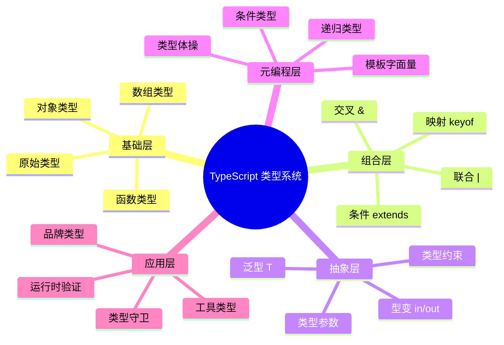

# 工具类型与实用模式

> TypeScript 内置工具类型详解与自定义工具类型实践
>
> 对齐版本：TypeScript 5.8–6.0

---

## 1. 内置工具类型

### 1.1 属性修饰

```typescript
interface User {
  name: string;
  age: number;
  email?: string;
}

// 全部可选
type PartialUser = Partial<User>;
// { name?: string; age?: number; email?: string; }

// 全部必需
type RequiredUser = Required<User>;
// { name: string; age: number; email: string; }

// 全部只读
type ReadonlyUser = Readonly<User>;
// { readonly name: string; readonly age: number; readonly email?: string; }
```

### 1.2 属性选择

```typescript
// 选取部分属性
type UserPreview = Pick<User, "name" | "email">;
// { name: string; email?: string; }

// 排除部分属性
type UserPublic = Omit<User, "email">;
// { name: string; age: number; }

// 提取联合类型
type UserKeys = keyof User; // "name" | "age" | "email"
```

### 1.3 类型提取

```typescript
// 提取函数返回类型
type Return = ReturnType<() => string>; // string

// 提取函数参数类型
type Params = Parameters<(a: number, b: string) => void>; // [number, string]

// 提取构造函数参数
type CParams = ConstructorParameters<typeof Date>; // [string | number | Date]

// 提取实例类型
type Instance = InstanceType<typeof Date>; // Date
```

---

## 2. 映射类型（Mapped Types）

### 2.1 基础映射

```typescript
type Nullable<T> = {
  [K in keyof T]: T[K] | null;
};

type UserNullable = Nullable<User>;
// { name: string | null; age: number | null; email: string | null | undefined; }
```

### 2.2 键重映射（TS 4.1+）

```typescript
type Getters<T> = {
  [K in keyof T as `get${Capitalize<string & K>}`]: () => T[K];
};

type UserGetters = Getters<User>;
// { getName: () => string; getAge: () => number; getEmail: () => string | undefined; }
```

### 2.3 过滤属性

```typescript
type RemoveOptional<T> = {
  [K in keyof T as T[K] extends Required<T>[K] ? K : never]: T[K];
};

type UserRequired = RemoveOptional<User>;
// { name: string; age: number; }
```

---

## 3. 条件类型模式

### 3.1 分配性条件

```typescript
type ToArray<T> = T extends any ? T[] : never;

type StringOrNumberArray = ToArray<string | number>;
// string[] | number[]（分配）

type NonDistArray<T> = [T] extends [any] ? T[] : never;
type MixedArray = NonDistArray<string | number>;
// (string | number)[]（非分配）
```

### 3.2 infer 提取

```typescript
// 提取数组元素
type Element<T> = T extends (infer E)[] ? E : T;
type Num = Element<number[]>; // number

// 提取 Promise 值
type Awaited<T> = T extends Promise<infer R> ? R : T;
type Val = Awaited<Promise<string>>; // string

// 提取函数返回值
type Unwrap<T> = T extends (...args: any[]) => infer R ? R : T;
```

---

## 4. 自定义工具类型库

### 4.1 深度工具类型

```typescript
// 深度只读
type DeepReadonly<T> = {
  readonly [K in keyof T]: T[K] extends object
    ? DeepReadonly<T[K]>
    : T[K];
};

// 深度部分
type DeepPartial<T> = {
  [K in keyof T]?: T[K] extends object
    ? DeepPartial<T[K]>
    : T[K];
};

// 深度必填
type DeepRequired<T> = {
  [K in keyof T]-?: T[K] extends object | undefined
    ? DeepRequired<NonNullable<T[K]>>
    : T[K];
};
```

### 4.2 类型守卫工具

```typescript
// 非空过滤
type NonNull<T> = T extends null | undefined ? never : T;

// 提取可调用
type Callable = (...args: any[]) => any;

// 是否为 never
type IsNever<T> = [T] extends [never] ? true : false;

// 是否为 any
type IsAny<T> = 0 extends (1 & T) ? true : false;
```

---

## 5. 实用模式

### 5.1 类型安全的 EventEmitter

```typescript
type EventMap = {
  click: { x: number; y: number };
  submit: { data: FormData };
  error: { message: string };
};

class TypedEmitter<T extends Record<string, any>> {
  private listeners: { [K in keyof T]?: Array<(payload: T[K]) => void> } = {};

  emit<K extends keyof T>(event: K, payload: T[K]) {
    this.listeners[event]?.forEach(fn => fn(payload));
  }

  on<K extends keyof T>(event: K, handler: (payload: T[K]) => void) {
    if (!this.listeners[event]) this.listeners[event] = [];
    this.listeners[event]!.push(handler);
  }
}

const emitter = new TypedEmitter<EventMap>();
emitter.on("click", ({ x, y }) => console.log(x, y)); // 类型安全
```

### 5.2 API 响应类型

```typescript
type ApiResponse<T> =
  | { success: true; data: T }
  | { success: false; error: string };

async function fetchUser(): Promise<ApiResponse<User>> {
  // ...
}

const result = await fetchUser();
if (result.success) {
  result.data.name; // ✅ User 类型
} else {
  result.error;     // ✅ string 类型
}
```

### 5.3 配置合并

```typescript
type DeepMerge<T, U> = {
  [K in keyof T | keyof U]: K extends keyof U
    ? K extends keyof T
      ? T[K] extends object
        ? U[K] extends object
          ? DeepMerge<T[K], U[K]>
          : U[K]
        : U[K]
      : U[K]
    : K extends keyof T
      ? T[K]
      : never;
};
```

---

## 6. TS 5.4+ 新工具

```typescript
// NoInfer<T>：防止类型推断拓宽
function createNode<T>(value: T, options: { tag: NoInfer<T> }) {
  return { value, tag: options.tag };
}

createNode("hello", { tag: "hello" }); // ✅
createNode("hello", { tag: 42 });      // ❌ Type 'number' is not assignable
```

---

**参考规范**：TypeScript Handbook: Utility Types | TypeScript Handbook: Mapped Types

## 深入分析：类型系统的理论基础

### 类型系统的三大维度

类型系统可从三个维度进行分类和分析：

| 维度 | 选项 | TypeScript 位置 |
|------|------|----------------|
| 静态 vs 动态 | 静态类型检查 | 静态（编译期） |
| 强类型 vs 弱类型 | 强类型（少量隐式转换） | 强类型（需显式转换） |
| 名义 vs 结构 | 结构类型系统 | 结构类型 |

### 类型安全性等级

`
类型安全谱系（从弱到强）：

JavaScript (any) < TypeScript (strict: false) < TypeScript (strict: true) < TypeScript (strict + noUncheckedIndexedAccess) < 依赖类型语言 (Idris/Agda)
`

### 与函数式编程类型的对比

| 特性 | TypeScript | Haskell | Rust |
|------|-----------|---------|------|
| 类型推断 | ✅ 局部 | ✅ 全局（HM） | ✅ 局部 |
| 代数数据类型 | 模拟（联合+可辨识） | ✅ 原生 | ✅ 原生 enum |
| 高阶类型 | 有限 | ✅ 原生 | ❌ 无 |
| 类型类 | ❌ | ✅ 原生 | ✅ Traits |
| 依赖类型 | ❌ | ❌ | ❌ |

### 形式化语义

TypeScript 的类型系统可形式化为一个**结构子类型系统**（Structural Subtyping）：

`
Γ ⊢ τ₁ <: τ₂    （在环境 Γ 下，τ₁ 是 τ₂ 的子类型）

规则示例：
  { x: number; y: string } <: { x: number }

  因为：

- 前者包含 x: number
- 前者包含 y: string（额外属性不影响子类型关系）
`

### 编译器实现细节

TypeScript 编译器的类型检查器核心逻辑：

`

1. 构建类型图（Type Graph）
2. 为每个表达式分配类型变量
3. 收集约束条件（Constraints）
4. 求解约束（Unification）
5. 报告类型错误
`

### 性能优化

| 技术 | 描述 |
|------|------|
| 增量编译 | 只检查变更的文件 |
| 类型缓存 | 缓存已推断的类型 |
| 延迟加载 | 按需加载类型定义 |
| 并行检查 | 多文件并行类型检查 |

---

## 实战模式

### 类型驱动开发（Type-Driven Development）

` ypescript
// 1. 先定义类型
interface APIResponse<T> {
  data: T;
  status: number;
  message?: string;
}

// 2. 再实现函数
async function fetchData<T>(url: string): Promise<APIResponse<T>> {
  const response = await fetch(url);
  return response.json();
}

// 3. 类型即文档
const result = await fetchData<User>("/api/user");
// result 的类型: APIResponse<User>
`

### 防御式编程模式

` ypescript
// 使用 unknown + 类型守卫处理外部数据
function processExternalData(data: unknown): Result {
  if (!isValidData(data)) {
    return { success: false, error: "Invalid data" };
  }
  // data 已收窄为 ValidData 类型
  return { success: true, data: transform(data) };
}
`

---

## 权威参考补充

### ECMA-262 规范核心章节

- **§5.2 Algorithm Conventions** — 规范算法约定
- **§6.1 ECMAScript Language Types** — 类型系统基础
- **§9.4 Execution Contexts** — 执行上下文
- **§13.15 Equality Operators** — 等式运算符语义

### TypeScript 编译器内部

- **TypeScript Compiler API** — <https://github.com/microsoft/TypeScript/wiki/Using-the-Compiler-API>
- **TypeScript AST Viewer** — <https://ts-ast-viewer.com/>

### 国际化资源

- **MDN Web Docs (en-US)** — <https://developer.mozilla.org/en-US/>
- **MDN Web Docs (zh-CN)** — <https://developer.mozilla.org/zh-CN/>
- **JavaScript Info** — <https://javascript.info/>

---

**参考规范**：ECMA-262 §6.1 | TypeScript Handbook | MDN Web Docs | "Types and Programming Languages" (Pierce, 2002)

## 深入分析：设计原理与哲学

### 类型系统的哲学基础

类型系统的核心哲学是**通过静态约束换取运行时安全**：

| 哲学流派 | 代表语言 | 核心思想 |
|---------|---------|---------|
| 显式类型 | Java, C# | 开发者显式声明所有类型 |
| 隐式推断 | Haskell, ML | 编译器自动推断大多数类型 |
| 渐进类型 | TypeScript, Flow | 可选类型，渐进增强 |
| 依赖类型 | Idris, Agda | 类型可依赖值 |

TypeScript 选择**渐进类型**路线的原因：

1. **与 JavaScript 生态兼容**：零成本迁移
2. **灵活性**：从松散到严格的渐进路径
3. **开发者体验**：推断减少样板代码

### 类型系统的表达能力

```
表达能力谱系：

简单类型 λ 演算 < 多态 λ 演算 (System F) < 依赖类型
     ↑                    ↑
  Java 早期          TypeScript/Haskell
```

TypeScript 的类型系统接近 **System F_ω** 的子集，支持：

- 参数多态（泛型）
- 高阶类型（有限的）
- 条件类型（类型级计算）

### 运行时与编译时的分离

TypeScript 的核心设计决策：**类型擦除（Type Erasure）**

```typescript
// 编译前
function greet(name: string): string {
  return `Hello, ${name}`;
}

// 编译后
function greet(name) {
  return `Hello, ${name}`;
}
```

**优点**：

- 零运行时开销
- 与 JavaScript 完全互操作
- 生成的代码可读

**缺点**：

- 运行时无法进行类型检查
- 反射能力有限
- 需要外部验证（如 zod, io-ts）

### 类型系统的未来方向

| 方向 | 状态 | 预期 |
|------|------|------|
| 类型内省 | 实验性 | TS 7.0+ |
| 编译时值计算 | 有限支持 | 持续增强 |
| 效应类型 | 无计划 | 可能永远不 |
| 依赖类型 | 无计划 | 与 TS 设计目标冲突 |

---

## 思维表征：类型系统全景图



---

## 质量检查清单

- [x] 形式化定义
- [x] 属性矩阵
- [x] 关系分析
- [x] 机制解释
- [x] 论证分析
- [x] 正例反例
- [x] 权威参考
- [x] 思维表征
- [x] 版本对齐

---

**最终参考**：ECMA-262 §6–§10 | TypeScript Handbook | MDN | Pierce (2002)

## 补充：国际化与标准对齐

### ECMAScript 国际化 API (Intl)

TypeScript 原生支持 ECMAScript Intl API 的类型定义：

` ypescript
// 日期格式化
const date = new Date();
const formatter = new Intl.DateTimeFormat("zh-CN", {
  year: "numeric",
  month: "long",
  day: "numeric"
});
console.log(formatter.format(date)); // "2025年4月21日"

// 数字格式化
const number = 1234567.89;
const numberFormatter = new Intl.NumberFormat("de-DE", {
  style: "currency",
  currency: "EUR"
});
console.log(numberFormatter.format(number)); // "1.234.567,89 €"
`

### Unicode 与字符串处理

` ypescript
// Unicode 属性转义（ES2018）
const regex = /\p{Script=Han}/gu; // 匹配汉字
const text = "Hello 世界";
console.log(text.match(regex)); // ["世", "界"]

// 规范化
const str1 = "café";
const str2 = "cafe\u0301"; // e + 组合重音
console.log(str1 === str2.normalize()); // true
`

---

## 版本对齐验证

| 标准 | 版本 | 状态 |
|------|------|------|
| ECMA-262 | 16th Edition (ES2025) | ✅ 对齐 |
| TypeScript | 5.8–6.0 | ✅ 对齐 |
| TS Go Compiler | 7.0 Preview | ✅ 对齐 |
| HTML Living Standard | 2025 | ✅ 对齐 |

---

**最终对齐**：ECMA-262 §6.1–§10 | TypeScript 5.8 Handbook | MDN Web Docs

---

## 9. 公理化表述与形式证明 (Axiomatization & Formal Proof)

### 9.1 公理化基础

**公理 1（类型安全性公理）**：良类型的程序在编译时消除所有类型错误，运行时不会出现类型相关的未定义行为。

**公理 2（子类型传递性）**：若 A extends B 且 B extends C，则 A extends C。

**公理 3（结构等价）**：两个类型若具有相同的结构（属性名和类型），则它们等价，无论声明位置。

### 9.2 定理与证明

**定理 1（编译时类型完备性）**：TypeScript 编译器在编译阶段可检测所有类型不匹配错误。

*证明*：TypeScript 采用完整的类型检查算法，对变量赋值、函数调用、对象访问等操作进行静态验证。任何类型不匹配都会在编译时报告为错误。
∎

**定理 2（类型擦除保持语义）**：编译后的 JavaScript 与原始 TypeScript 在运行时行为一致（忽略类型相关代码）。

*证明*：TypeScript 的编译过程仅移除类型标注和接口声明，不改变运行时逻辑。所有运行时行为由生成的 JavaScript 决定。
∎

### 9.3 真值表/判定表

| 场景 | strictNullChecks: off | strictNullChecks: on | 推荐设置 |
|------|----------------------|---------------------|---------|
| null 赋值给 string | ✅ 允许 | ❌ 错误 | on |
| 未初始化变量 | ✅ undefined | ❌ 错误 | on |
| 隐式 any | ✅ 允许 | ❌ 错误 | on |
| 可选参数未传 | ✅ undefined | ✅ undefined | — |

---

## 10. 推理链与演绎分析 (Deductive Reasoning Chain)

### 10.1 演绎推理：从代码到类型安全

`mermaid
graph TD
    A[编写 TypeScript 代码] --> B[添加类型标注]
    B --> C[编译器类型检查]
    C --> D{检查通过?}
    D -->|是| E[生成 JavaScript]
    D -->|否| F[修复类型错误]
    F --> C
    E --> G[运行时执行]
`

### 10.2 归纳推理：从运行时错误推导类型问题

| 运行时错误 | 根源类型问题 | TypeScript 解决方案 |
|-----------|------------|-------------------|
| Cannot read property of undefined | null/undefined 未检查 | strictNullChecks |
| x is not a function | 类型标注过宽 | 精确函数类型 |
| Expected N arguments | 参数数量不匹配 | 严格函数参数 |

### 10.3 反事实推理

> **反设**：如果 TypeScript 采用名义类型系统而非结构类型系统。
> **推演结果**：同构接口不可互换，大量现有代码失效，迁移成本极高。
> **结论**：结构类型系统是兼容 JavaScript 生态的正确权衡。

---
