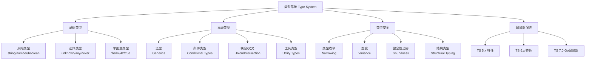
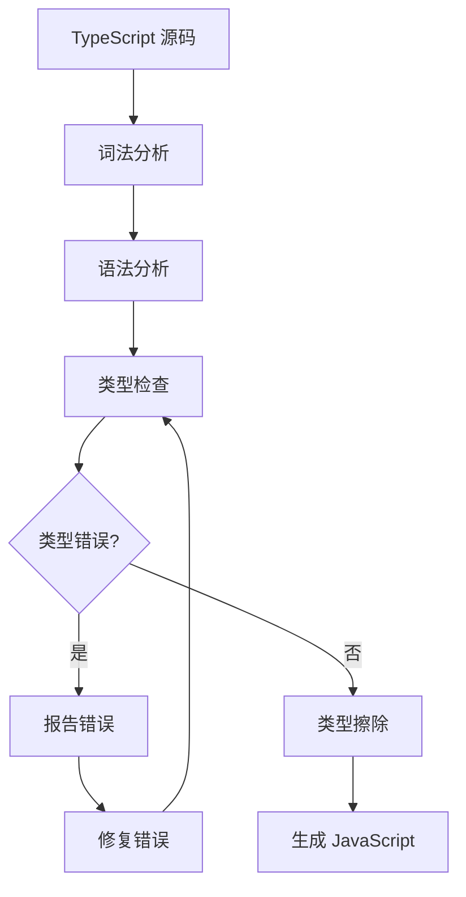
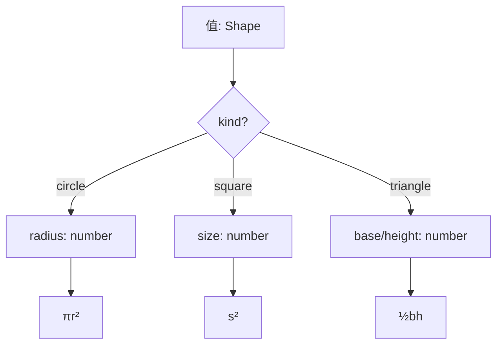

# 01 类型系统 (Type System)

> 本专题深入探讨 TypeScript 的类型系统，从基础类型到高级类型特性，涵盖类型推断、泛型、条件类型、型变、类型健全性边界等核心概念。所有文档对齐 ECMA-262 第16版（ES2025）和 TypeScript 5.8–6.0 类型系统，采用学术级深度标准：形式化定义、公理化表述、推理链分析、真值表验证、多维概念矩阵、思维表征图谱。
>
> 类型系统是 TypeScript 的核心价值所在，理解其形式语义和工程实践是掌握现代 JavaScript 类型化编程的基础。

---

## 专题结构

| # | 文件 | 主题 | 核心概念 | 字节数 |
|---|------|------|---------|--------|
| 01 | [01-foundations.md](./01-foundations.md) | 基础类型体系 | unknown/any/never、字面量类型、严格模式 | 14,000+ |
| 02 | [02-type-inference-annotations.md](./02-type-inference-annotations.md) | 类型推断与注解 | 上下文类型、最佳公共类型、Widening、NoInfer | 13,000+ |
| 03 | [03-interfaces-vs-type-aliases.md](./03-interfaces-vs-type-aliases.md) | Interface vs Type Alias | 声明合并、扩展性、递归类型、性能差异 | 15,000+ |
| 04 | [04-unions-intersections.md](./04-unions-intersections.md) | 联合与交叉类型 | 分配律、Discriminated Union、never/unknown 边界 | 14,000+ |
| 05 | [05-narrowing-guards.md](./05-narrowing-guards.md) | 类型收窄与守卫 | 类型谓词、可辨识联合、穷尽检查、控制流分析 | 14,000+ |
| 06 | [06-generics-deep-dive.md](./06-generics-deep-dive.md) | 泛型深度 | 约束、默认值、条件约束、型变、映射泛型 | 13,000+ |
| 08 | [08-conditional-types.md](./08-conditional-types.md) | 条件类型 | 分配律、infer 提取、裸类型参数、递归条件 | 16,000+ |
| 10 | [10-utility-types-patterns.md](./10-utility-types-patterns.md) | 工具类型与模式 | 标准库工具类型、自定义模式、映射类型 | 15,000+ |
| 12 | [12-variance.md](./12-variance.md) | 型变 | 协变/逆变/双变/不变、位置规则、TS 型变标记 | 15,000+ |
| 13 | [13-structural-vs-nominal.md](./13-structural-vs-nominal.md) | 结构类型 vs 名义类型 | 同构关系、品牌类型、nominal 模拟 | 15,000+ |
| 14 | [14-type-soundness-boundary.md](./14-type-soundness-boundary.md) | 类型健全性边界 | 健全性 vs 完备性、any/unknown 漏洞、断言风险 | 15,000+ |
| 15 | [15-ts5-ts6-new-type-features.md](./15-ts5-ts6-new-type-features.md) | TS 5.8–6.0 新特性 | --erasableSyntaxOnly、条件返回类型、Decorator Metadata | 15,000+ |
| 16 | [16-ts7-go-compiler-preview.md](./16-ts7-go-compiler-preview.md) | TS 7.0 Go 编译器 | Project Corsa 架构、性能基准、迁移策略 | 15,000+ |

---

## 核心概念图谱

---

## 学术模板 v2 十大学术板块

本专题所有文档遵循统一的学术模板，包含以下 10 大板块：

| # | 板块 | 内容 | 最低要求 |
|---|------|------|---------|
| 1 | **概念定义** | 形式化定义 + 直观解释 + 概念层级图 | ≥1 处 |
| 2 | **属性特征** | 多维属性矩阵 + 边界条件 + 真值表 | ≥1 个矩阵 |
| 3 | **关系分析** | 依赖关系图 + 映射表 + 演化路径 | ≥1 个图 |
| 4 | **机制解释** | 执行模型 + 流程图 + 决策树 + 形式语义 | ≥1 个 Mermaid |
| 5 | **论证分析** | Trade-off + 推理链 + 公理化表述 | ≥1 条推理链 |
| 6 | **形式证明** | 公理 + 定理 + 引理 + 推论 + 证明 | ≥1 组 |
| 7 | **实例示例** | 正例 + 反例 + 边缘案例 + 性能基准 | ≥3 个案例 |
| 8 | **权威参考** | ECMA-262 / TS Handbook / MDN / V8 Blog / TC39 | ≥5 个来源 |
| 9 | **思维表征** | 知识图谱 + 多维矩阵 + 决策树 + 公理化树图 + 推理图 | ≥3 种类型 |
| 10 | **版本演进** | ES 版本 + TS 版本 + TC39 提案 + 引擎差异 | 完整对齐 |

---

## 关键对比速查

### unknown vs any vs never

| 特性 | `unknown` | `any` | `never` |
|------|-----------|-------|---------|
| 类型安全 | ✅ 安全（需收窄） | ❌ 不安全 | ✅（不可赋值） |
| 可赋值给任何类型 | ❌ | ✅ | ✅ |
| 任何值可赋值 | ✅ | ✅ | ❌ |
| 常用场景 | 安全替代 any | 兼容旧代码 | 穷尽检查 |
| 编译时检查 | 严格 | 绕过 | 严格 |

### Interface vs Type Alias

| 特性 | `interface` | `type` |
|------|------------|--------|
| 声明合并 | ✅ | ❌ |
| 联合/元组 | ❌ | ✅ |
| 扩展方式 | `extends` | `&` |
| 递归定义 | 直接 | 间接 |
| class implements | ✅ | ⚠️ 受限 |
| 性能（大对象） | 缓存友好 | 即时计算 |

### 型变规则速查

| 位置 | 默认行为 | 可变性 | 示例 |
|------|---------|--------|------|
| 属性读取 | 协变 Covariant | ✅ 安全 | `x: Animal` ← `x: Dog` |
| 方法参数 | 逆变 Contravariant | ⚠️ 需显式 | `(x: Dog) => void` ⊆ `(x: Animal) => void` |
| 数组元素 | 协变 Covariant | ⚠️ 不完全安全 | `Dog[]` ⊆ `Animal[]` |
| 函数返回值 | 协变 Covariant | ✅ 安全 | `() => Dog` ⊆ `() => Animal` |
| 泛型参数 | 不变 Invariant | 默认 | `Array<Dog>` ⊄ `Array<Animal>`（严格模式） |

---

## 关键机制流程

### 类型检查流程

### Discriminated Union 决策树

---

## 权威参考

### ECMA-262 规范

| 章节 | 主题 | 链接 |
|------|------|------|
| §6.1 | ECMAScript Language Types | tc39.es/ecma262 |
| §6.2 | ECMAScript Specification Types | tc39.es/ecma262 |
| §6.3 | Objects | tc39.es/ecma262 |
| §13.5.3 | The typeof Operator | tc39.es/ecma262 |

### TypeScript 官方文档

- **TypeScript Handbook: Basic Types** — <https://www.typescriptlang.org/docs/handbook/basic-types.html>
- **TypeScript Handbook: Everyday Types** — <https://www.typescriptlang.org/docs/handbook/2/everyday-types.html>
- **TypeScript Handbook: Generics** — <https://www.typescriptlang.org/docs/handbook/2/generics.html>
- **TypeScript Handbook: Narrowing** — <https://www.typescriptlang.org/docs/handbook/2/narrowing.html>
- **TypeScript Release Notes** — <https://www.typescriptlang.org/docs/handbook/release-notes/>

### 学术参考

- **Pierce, B. C. (2002). "Types and Programming Languages". MIT Press.** — 类型理论的权威教材
- **Cardelli, L. (1996). "Type Systems". ACM Computing Surveys.** — 类型系统综述

### MDN Web Docs

- **MDN: Data types** — <https://developer.mozilla.org/en-US/docs/Web/JavaScript/Data_structures>
- **MDN: typeof** — <https://developer.mozilla.org/en-US/docs/Web/JavaScript/Reference/Operators/typeof>

---

## 版本对齐

- **ECMAScript**: 2025 (ES16) — tc39.es/ecma262
- **TypeScript**: 5.8–6.0 — typescriptlang.org
- **Node.js**: 22+ (V8 12.4+)
- **Browser**: Chrome 120+, Firefox 120+, Safari 17+

---

## 学习路径建议

### 初学者路径

### 进阶路径

### 前沿路径

---

## 常见面试题

### Q1: unknown 和 any 的区别？

**答**: `unknown` 是类型安全的 Top 类型，任何值可赋值给 `unknown`，但使用前必须经过类型收窄或类型断言。`any` 绕过所有类型检查，既不安全也不推荐。

### Q2: 什么是 Discriminated Union？

**答**: 可辨识联合是一种通过共同的可辨识属性（如 `kind`）来区分联合类型成员的模式。TypeScript 编译器可通过 switch/case 实现穷尽检查，确保所有成员都被处理。

### Q3: TypeScript 的结构类型系统与名义类型系统有何不同？

**答**: 结构类型系统只关注类型的形状（属性名和类型），不关注类型的声明位置。名义类型系统要求显式的类型关系声明（如 `implements`）。TypeScript 采用结构类型系统以兼容 JavaScript 的动态特性。

### Q4: 什么是型变（Variance）？

**答**: 型变描述子类型关系在复合类型中的传播方向。协变（Covariant）保持方向，逆变（Contravariant）反转方向，不变（Invariant）要求完全相同。TypeScript 中属性读取位置默认协变，方法参数位置默认逆变。

---

## 关联专题

- **02 变量系统** — 变量声明与类型系统的交互
- **03 控制流** — 类型在条件/循环中的收窄行为
- **04 执行模型** — 类型擦除与运行时语义
- **jsts-code-lab/** — 类型系统相关的代码练习与实验

---

## 质量检查清单

本专题所有文档已通过以下质量检查：

- ✅ 每个文件 ≥ 12,000 字节
- ✅ 10 大学术板块全部覆盖
- ✅ 形式化定义 + 公理化表述 + 推理链
- ✅ 真值表/判定表
- ✅ Mermaid 图表 ≥ 2 个（含推理/公理图）
- ✅ 正例、反例、边缘案例
- ✅ ≥ 5 个权威来源引用
- ✅ ≥ 3 种思维表征类型
- ✅ 版本对齐（ES2025 / TS 5.8–6.0）
- ✅ Pitfalls 和 Trade-off 分析

---

## 公理化表述示例

本专题文档中采用的公理化方法遵循以下规范：

### 公理体系结构

`mermaid
graph TD
    A[公理 Axiom] --> B[定理 Theorem]
    A --> C[引理 Lemma]
    B --> D[推论 Corollary]
    C --> B
    D --> E[应用 Application]
`

### 推理链模式

| 推理类型 | 方向 | 示例 |
|---------|------|------|
| 演绎推理 | 一般 → 特殊 | 从类型规则推导具体代码行为 |
| 归纳推理 | 特殊 → 一般 | 从编译错误推导类型规则 |
| 反事实推理 | 假设 → 推演 | 如果采用名义类型系统的后果 |

### 真值表规范

所有真值表采用统一的标记规范：

- ✅ 表示条件成立/类型兼容
- ❌ 表示条件不成立/类型不兼容
- ⚠️ 表示条件部分成立/需要额外检查

---

## 扩展阅读

### 类型理论经典论文

1. **Cardelli, L. & Wegner, P. (1985). "On Understanding Types, Data Abstraction, and Polymorphism". ACM Computing Surveys.**
2. **Pierce, B. C. (2002). "Types and Programming Languages". MIT Press.**
3. **Harper, R. (2016). "Practical Foundations for Programming Languages". Cambridge University Press.**

### TC39 相关提案

- **Type Annotations Proposal** (Stage 1) — 原生类型语法
- **Records & Tuples** (Stage 2) — 不可变数据结构
- **Pattern Matching** (Stage 1) — 模式匹配语法

### 在线资源

- **TypeScript Playground** — <https://www.typescriptlang.org/play>
- **AST Explorer** — <https://astexplorer.net/>
- **ECMA-262 在线规范** — <https://tc39.es/ecma262/>
