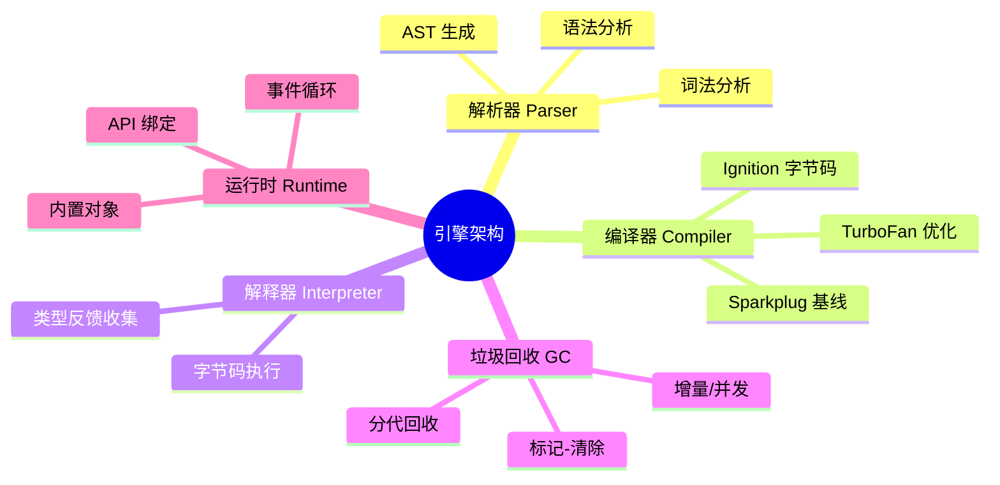
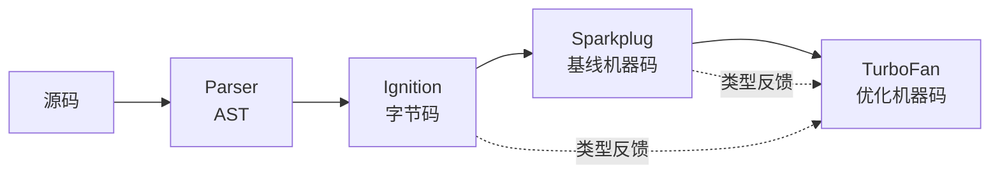
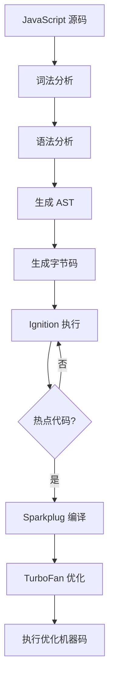
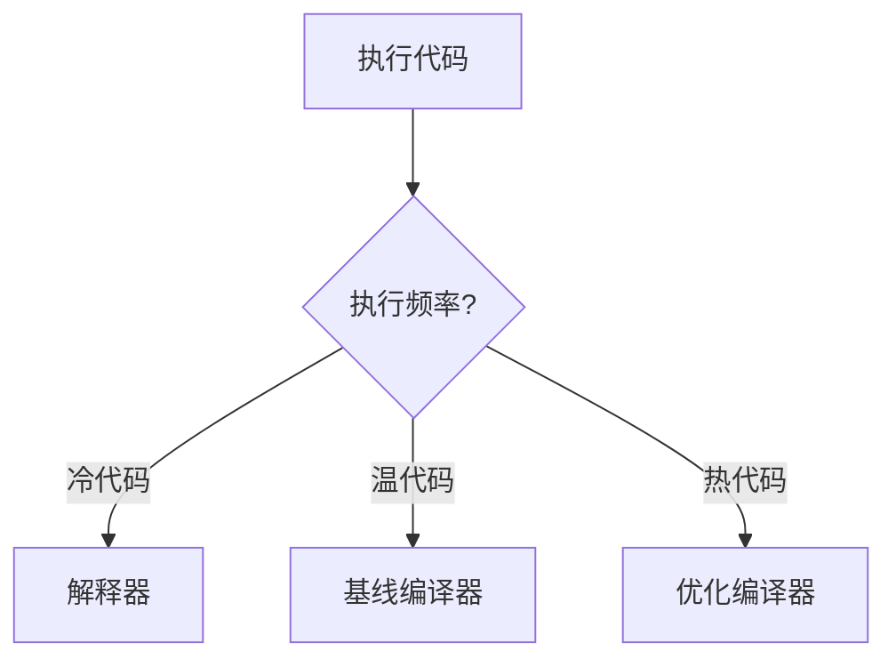

# 引擎架构（Engine Architecture）

> **形式化定义**：JavaScript 引擎是执行 ECMAScript 代码的运行时系统，核心组件包括**解析器（Parser）**、**编译器（Compiler）**、**解释器（Interpreter）**、**垃圾回收器（GC）**和**运行时库（Runtime）**。现代引擎（V8、SpiderMonkey、JavaScriptCore）采用**分层编译（Tiered Compilation）**策略，将源代码逐步优化为机器码。V8 引擎的具体实现包括 Ignition 解释器、Sparkplug 基线编译器和 TurboFan 优化编译器。
>
> 对齐版本：ECMAScript 2025 (ES16) | V8 12.4+ | TypeScript 5.8–6.0

---

## 1. 概念定义 (Concept Definition)

### 1.1 形式化定义

JavaScript 引擎可形式化为一个**抽象机器（Abstract Machine）**：

```
Engine = (Parser, Compiler, Interpreter, GC, Runtime)
Input: ECMAScript Source Code
Output: Machine Code / Bytecode Execution
```

### 1.2 概念层级图谱



---

## 2. 属性与特征 (Properties & Characteristics)

### 2.1 主流引擎对比矩阵

| 特性 | V8 (Chrome/Node) | SpiderMonkey (Firefox) | JavaScriptCore (Safari) |
|------|-----------------|----------------------|------------------------|
| 解释器 | Ignition | C++ Interpreter | LLInt |
| 基线编译 | Sparkplug | Baseline | Baseline JIT |
| 优化编译 | TurboFan | IonMonkey | DFG/FTE |
| GC 策略 | 分代 + 并发 | 分代 + 增量 | 分代 + 并发 |
| 内联缓存 | 多态/单态 | 多态/单态 | 多态/单态 |

---

## 3. 关系分析 (Relationship Analysis)

### 3.1 编译流水线



---

## 4. 机制解释 (Mechanism Explanation)

### 4.1 V8 编译流水线



### 4.2 类型反馈与去优化

```javascript
function add(x, y) {
  return x + y;
}

// 第一阶段：Ignition 收集类型反馈
add(1, 2);    // feedback: number + number
add(3, 4);    // feedback: number + number

// 第二阶段：TurboFan 假设类型优化
// 假设 x, y 总是 number

// 第三阶段：类型假设被打破 → 去优化
add("a", "b"); // Deoptimization! 回退到字节码
```

---

## 5. 论证与分析 (Argumentation & Analysis)

### 5.1 解释 vs 编译的性能权衡

| 阶段 | 启动延迟 | 峰值性能 | 内存占用 | 适用场景 |
|------|---------|---------|---------|---------|
| 解释器 | 低 | 低 | 低 | 冷代码、短期运行 |
| 基线编译 | 中 | 中 | 中 | 温代码 |
| 优化编译 | 高 | 高 | 高 | 热代码、长期运行 |

---

## 6. 实例与示例 (Examples)

### 6.1 正例：避免去优化

```javascript
// ✅ 保持类型稳定
function sumNumbers(arr) {
  let sum = 0;  // 始终为 number
  for (let i = 0; i < arr.length; i++) {
    sum += arr[i];  // 始终为 number
  }
  return sum;
}

// ❌ 类型不稳定导致去优化
function sumMixed(arr) {
  let sum = 0;
  for (let i = 0; i < arr.length; i++) {
    sum += arr[i];  // 有时是 number，有时是 string
  }
  return sum;
}
```

---

## 7. 权威参考与国际化对齐 (References)

- **V8 Blog** — <https://v8.dev/blog>
- **MDN: JavaScript engines** — <https://developer.mozilla.org/en-US/docs/Web/JavaScript/JavaScript_technologies_overview>
- **SpiderMonkey Documentation** — <https://firefox-source-docs.mozilla.org/js/index.html>

---

## 8. 思维表征总结 (Cognitive Representations)

### 8.1 引擎组件决策树



---

---

## 深化补充：引擎诊断与权威参考

### Node.js 字节码检查

```bash
# 打印函数的字节码
node --print-bytecode --code-comments app.js

# 生成 Ignition 字节码可视化（过滤特定函数）
node --print-bytecode --print-bytecode-filter="*add*" app.js
```

```javascript
// 在代码中触发优化状态查询（需 --allow-natives-syntax）
function add(x, y) { return x + y; }

// %GetOptimizationStatus(add) 返回优化状态码
// 1 = 优化中, 2 = 已优化, 3 = 已优化并内联, 4 = 去优化中, 6 = 去优化后待优化
```

### 隐藏类优化演示

```javascript
// ✅ 保持隐藏类稳定（Monomorphic）
function Point(x, y) {
  this.x = x;
  this.y = y;
}
const p1 = new Point(1, 2);
const p2 = new Point(3, 4);
// p1 和 p2 共享同一个隐藏类（Map）

// ❌ 破坏隐藏类（Transition to Dictionary）
function BadPoint(x, y) {
  this.x = x;
  this.y = y;
  if (x > 10) {
    this.z = 0; // 条件属性导致隐藏类分支 / 字典模式
  }
}
```

### 内联缓存（Inline Cache）观察

```javascript
// Monomorphic IC — 最优（单一形状）
function getX(obj) { return obj.x; }
getX({ x: 1 });
getX({ x: 2 }); // 相同形状，IC 单态命中

// Polymorphic IC — 尚可（2-4 种形状）
getX({ x: 1 });
getX({ y: 2, x: 1 }); // 不同形状，IC 变为多态

// Megamorphic IC — 性能下降（>4 种形状）
for (let i = 0; i < 100; i++) {
  getX({ ['prop' + i]: i }); // 每次都不同形状，IC 变为巨态
}
```

### 内存分析实战

```bash
# 生成堆快照
node --heapsnapshot-near-heap-limit=3 app.js

# Chrome DevTools Memory 面板加载 *.heapsnapshot 进行分析
```

```javascript
// 使用 WeakMap 避免内存泄漏
const cache = new WeakMap();

function process(obj) {
  if (!cache.has(obj)) {
    cache.set(obj, heavyCompute(obj));
  }
  return cache.get(obj);
}
// 当 obj 不再被引用时，WeakMap 中的条目自动被 GC 回收
```

### V8 内存布局与指针压缩

```javascript
// V8 使用指针压缩（Pointer Compression）在 64 位系统上将堆指针压缩为 32 位
// 要求所有 V8 对象位于 4GB 的指针压缩区域内
// Node.js 标志：--pointer-compression
// 可通过 --max-old-space-size 控制老生代大小

const v8 = require('v8');
console.log(v8.getHeapStatistics().heap_size_limit / 1024 / 1024 + ' MB');
```

### Sea of Nodes vs. Control Flow Graph

```javascript
// TurboFan 使用 Sea of Nodes IR（基于 Cliff Click 的论文）
// 与基于基本块的传统 CFG 不同，Sea of Nodes 将数据流与控制流解耦

// 以下代码在 TurboFan 中会被优化为消除冗余检查：
function clamp(x, min, max) {
  if (x < min) return min;
  if (x > max) return max;
  return x;
}

// 若调用点反馈显示 x 始终为 Smi（小整数），TurboFan 可内联并消除类型检查
```

### 垃圾回收实战：Incremental Marking

```javascript
// V8 使用增量标记 + 并发清理减少主线程暂停时间
// Node.js 可监控 GC 事件

const v8 = require('v8');

// 启动参数：--trace-gc
// 输出示例：
// [ mark ]  10000 ms: Mark-sweep 120.0 (150.0) -> 110.0 (150.0) MB, 5.2 / 0.0 ms

// 强制 GC（仅调试）
// if (global.gc) global.gc();
```

### 权威外部链接索引

| 来源 | 链接 | 说明 |
|------|------|------|
| V8 Blog | <https://v8.dev/blog> | V8 引擎官方博客 |
| V8 — Understanding V8 Bytecode | <https://v8.dev/blog/understanding-v8-bytecode> | 字节码解读 |
| V8 — TurboFan JIT | <https://v8.dev/blog/turbofan-jit> | 优化编译器介绍 |
| V8 — Maglev | <https://v8.dev/blog/maglev> | Maglev 编译器 |
| V8 — Sparkplug | <https://v8.dev/blog/sparkplug> | Sparkplug 基线编译器 |
| MDN — JavaScript Engines | <https://developer.mozilla.org/en-US/docs/Web/JavaScript/JavaScript_technologies_overview> | JS 引擎概览 |
| SpiderMonkey Documentation | <https://firefox-source-docs.mozilla.org/js/index.html> | Firefox JS 引擎文档 |
| SpiderMonkey Blog | <https://spidermonkey.dev/blog/> | SpiderMonkey 博客 |
| JavaScriptCore Blog | <https://webkit.org/blog/category/javascript/> | WebKit JS 引擎博客 |
| Node.js — Performance | <https://nodejs.org/en/learn/getting-started/profiling> | Node.js 性能分析指南 |
| Chrome DevTools — Performance | <https://developer.chrome.com/docs/devtools/performance> | Chrome 性能分析 |
| WebKit Blog | <https://webkit.org/blog/> | WebKit 博客 |
| 2ality — V8 Internals | <https://2ality.com/archive.html#v8> | Dr. Axel Rauschmayer V8 文章 |
| Cliff Click — Sea of Nodes | <https://www.oracle.com/technetwork/java/javase/tech/c2-ir95-150110.pdf> | Sea of Nodes 论文 |

---

## 深化补充二：引擎诊断与低层优化实战

### 使用 performance.now() 测量 JIT 预热

```javascript
function add(a, b) { return a + b; }

// 冷启动测量
const startCold = performance.now();
add(1, 2);
const coldTime = performance.now() - startCold;

// 预热（触发优化编译）
for (let i = 0; i < 100000; i++) {
  add(i, i + 1);
}

// 热路径测量
const startHot = performance.now();
add(1, 2);
const hotTime = performance.now() - startHot;

console.log(`Cold: ${coldTime.toFixed(4)}ms, Hot: ${hotTime.toFixed(4)}ms`);
// 通常 hotTime 远小于 coldTime
```

### WeakRef 与 FinalizationRegistry 的 GC 交互

```javascript
// WeakRef 允许观察对象是否已被 GC（不阻止回收）
let target = { data: 'sensitive' };
const ref = new WeakRef(target);

// 移除强引用
target = null;

// 强制 GC（仅 Node.js 调试模式：--expose-gc）
if (global.gc) global.gc();

// 检查是否存活（结果不确定，取决于 GC 状态）
console.log(ref.deref()); // 可能返回对象或 undefined

// FinalizationRegistry 在对象被回收时触发回调
const registry = new FinalizationRegistry((heldValue) => {
  console.log(`Object ${heldValue} was garbage collected`);
});

let obj = { id: 42 };
registry.register(obj, 'resource-42');
obj = null;
// 未来某个时刻可能输出: "Object resource-42 was garbage collected"
```

### SharedArrayBuffer 与 Atomics 的多线程内存模型

```javascript
// 创建共享内存
const shared = new SharedArrayBuffer(4);
const view = new Int32Array(shared);

// Worker 线程中通过 Atomics 实现无锁同步
// 主线程
Atomics.store(view, 0, 100);

const worker = new Worker('./worker.js');
worker.postMessage(shared);

// worker.js
self.onmessage = (e) => {
  const view = new Int32Array(e.data);
  const value = Atomics.load(view, 0); // 原子读取
  Atomics.add(view, 0, 1); // 原子递增
};
```

### ArrayBuffer 的转移与结构化克隆

```javascript
const buffer = new ArrayBuffer(1024);
const view = new Uint8Array(buffer);
view[0] = 42;

// postMessage 转移 ArrayBuffer（原上下文失去访问权）
worker.postMessage(buffer, [buffer]);

console.log(buffer.byteLength); // 0（已转移）

// structuredClone 深拷贝（不转移）
const cloned = structuredClone({ nested: { buf: new ArrayBuffer(8) } });
```

---

## 更多权威参考

- **V8 Blog** — <https://v8.dev/blog>
- **V8: Maglev** — <https://v8.dev/blog/maglev>
- **MDN: WeakRef** — <https://developer.mozilla.org/en-US/docs/Web/JavaScript/Reference/Global_Objects/WeakRef>
- **MDN: FinalizationRegistry** — <https://developer.mozilla.org/en-US/docs/Web/JavaScript/Reference/Global_Objects/FinalizationRegistry>
- **MDN: SharedArrayBuffer** — <https://developer.mozilla.org/en-US/docs/Web/JavaScript/Reference/Global_Objects/SharedArrayBuffer>
- **MDN: Atomics** — <https://developer.mozilla.org/en-US/docs/Web/JavaScript/Reference/Global_Objects/Atomics>
- **ECMA-262 §24.2** — SharedArrayBuffer Objects: <https://tc39.es/ecma262/#sec-sharedarraybuffer-objects>
- **Node.js: worker_threads** — <https://nodejs.org/api/worker_threads.html>
- **SpiderMonkey Blog** — <https://spidermonkey.dev/blog/>
- **WebKit Blog: JavaScriptCore** — <https://webkit.org/blog/category/javascript/>

---

## 深化补充三：引擎性能测量与运行时诊断

### 性能标记测量 JIT 编译开销

```javascript
function measureJITOverhead(fn, iterations = 100000) {
  performance.mark('warmup-start');

  // 预热阶段：触发 JIT 编译
  for (let i = 0; i < iterations; i++) {
    fn(i, i + 1);
  }

  performance.mark('warmup-end');
  performance.measure('jit-warmup', 'warmup-start', 'warmup-end');

  const measure = performance.getEntriesByName('jit-warmup')[0];
  console.log(`JIT warmup (${iterations} iterations): ${measure.duration.toFixed(2)}ms`);

  // 清理
  performance.clearMarks();
  performance.clearMeasures();
}

measureJITOverhead((a, b) => a + b);
```

### console.time 与内存分析

```javascript
// 测量函数执行时间和内存变化
function profile(fn, ...args) {
  const before = performance.memory?.usedJSHeapSize || 0;

  console.time('execution');
  const result = fn(...args);
  console.timeEnd('execution');

  if (performance.memory) {
    const after = performance.memory.usedJSHeapSize;
    console.log(`Heap delta: ${((after - before) / 1024 / 1024).toFixed(2)} MB`);
  }

  return result;
}

profile(() => {
  return Array.from({ length: 1000000 }, (_, i) => i * 2);
});
```

### 堆快照分析实战

```javascript
// Node.js 生成堆快照分析内存泄漏
const v8 = require('v8');
const fs = require('fs');

function takeHeapSnapshot(filename) {
  const snapshot = v8.writeHeapSnapshot(filename);
  console.log(`Heap snapshot written to: ${snapshot}`);
  return snapshot;
}

// 分析重复字符串或对象
// 使用 Chrome DevTools Memory 面板加载 .heapsnapshot 文件
// 或 node --inspect 连接 DevTools 进行实时分析
```

---

## 更多权威外部链接

- **V8 Blog: Maglev** — <https://v8.dev/blog/maglev>
- **V8 Blog: Sparkplug** — <https://v8.dev/blog/sparkplug>
- **V8 Blog: TurboFan** — <https://v8.dev/blog/turbofan-jit>
- **SpiderMonkey Blog** — <https://spidermonkey.dev/blog/>
- **WebKit Blog: JavaScriptCore** — <https://webkit.org/blog/category/javascript/>
- **Node.js: Performance Hooks** — <https://nodejs.org/api/perf_hooks.html>
- **Node.js: V8 Module** — <https://nodejs.org/api/v8.html>
- **MDN: performance** — <https://developer.mozilla.org/en-US/docs/Web/API/Performance>
- **MDN: console.time** — <https://developer.mozilla.org/en-US/docs/Web/API/console/time>
- **Chrome DevTools: Memory** — <https://developer.chrome.com/docs/devtools/memory>
