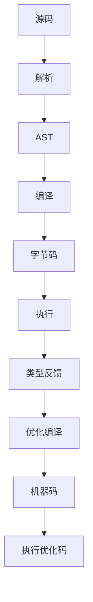
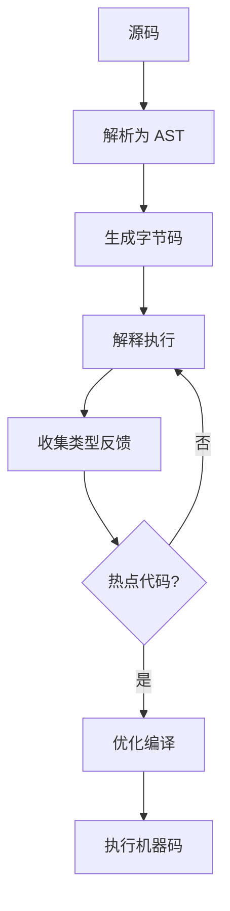
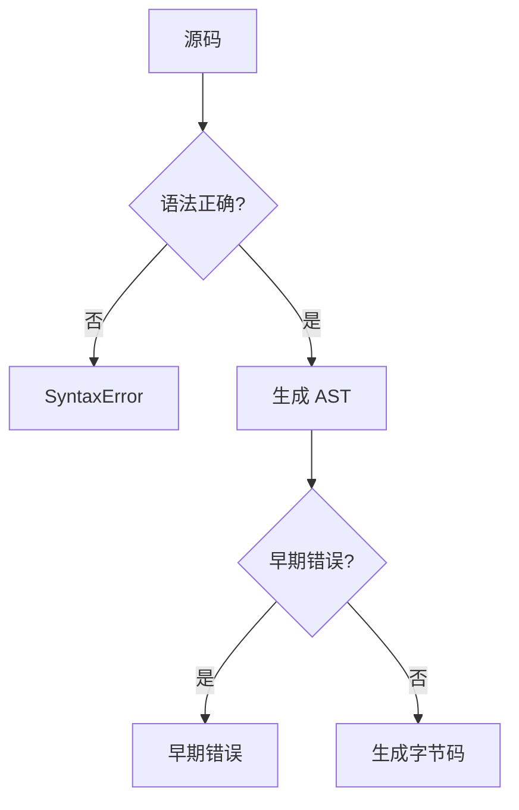

# 编译与执行（Compilation vs Execution）

> **形式化定义**：JavaScript 的编译与执行是分离的两个阶段。编译阶段（Parsing + Compilation）将源码转换为抽象语法树（AST）和字节码/机器码；执行阶段（Execution）在运行时环境中求值代码。ECMA-262 §5.2 定义了算法约定，§9 定义了执行上下文。现代引擎采用**即时编译（JIT）**策略，在运行时根据类型反馈动态优化代码。
>
> 对齐版本：ECMAScript 2025 (ES16) §5.2, §9 | V8 12.4+

---

## 1. 概念定义 (Concept Definition)

### 1.1 形式化定义

ECMA-262 §5.2 定义了算法的执行语义：

> *"Algorithms in this specification are typically expressed using ECMAScript syntax."*

编译与执行的分离模型：

```
Compilation: Source Code → AST → Bytecode → Machine Code
Execution:  Machine Code + Runtime Environment → Side Effects
```

---

## 2. 属性与特征 (Properties & Characteristics)

### 2.1 编译阶段属性矩阵

| 阶段 | 输入 | 输出 | 时间开销 | 空间开销 |
|------|------|------|---------|---------|
| 词法分析 | 源码字符串 | Token 流 | O(n) | O(n) |
| 语法分析 | Token 流 | AST | O(n) | O(n) |
| 字节码生成 | AST | 字节码 | O(n) | O(n) |
| 优化编译 | 字节码 + 反馈 | 机器码 | O(n²) 最坏 | O(n) |

---

## 3. 关系分析 (Relationship Analysis)

### 3.1 编译与执行的关系



---

## 4. 机制解释 (Mechanism Explanation)

### 4.1 JIT 编译流程



---

## 5. 论证与分析 (Argumentation & Analysis)

### 5.1 编译时 vs 运行时错误

| 错误类型 | 检测时机 | 示例 |
|---------|---------|------|
| 语法错误 | 编译时 | `const x =` |
| 早期错误 | 编译时 | 重复参数名 |
| 引用错误 | 运行时 | `undefinedVar` |
| 类型错误 | 运行时 | `null.prop` |
| 范围错误 | 运行时 | `Array(-1)` |

---

## 6. 实例与示例 (Examples)

### 6.1 正例：编译时错误捕获

```javascript
// ❌ 语法错误（编译时）
function() {}  // SyntaxError: Function statements require a function name

// ❌ 早期错误（编译时）
function f(a, a) {}  // SyntaxError: Duplicate parameter name

// ✅ 运行时错误
try {
  undefinedVar;
} catch (e) {
  console.log(e); // ReferenceError
}
```

### 6.2 正例：变量提升的编译时行为

```javascript
// 源码在编译阶段扫描 var 声明，运行时才会赋值
console.log(hoistedVar); // undefined（编译时创建绑定，运行时初始化为 undefined）
var hoistedVar = 42;

// let/const 同样在编译时创建绑定，但初始化前处于 TDZ
console.log(tdzLet); // ❌ ReferenceError: Cannot access 'tdzLet' before initialization
let tdzLet = 42;
```

### 6.3 正例：V8 引擎的隐藏类优化与类型反馈

```javascript
// V8 在运行时收集类型反馈，为热点代码生成优化机器码
function Point(x, y) {
  this.x = x;
  this.y = y;
}

// 前几次执行：解释器（Ignition）执行，收集反馈
// 多次执行后：优化编译器（TurboFan）生成类型特化的机器码
function distance(p1, p2) {
  const dx = p1.x - p2.x;
  const dy = p1.y - p2.y;
  return Math.sqrt(dx * dx + dy * dy);
}

// 预热（warming up）— 触发 JIT 优化
const a = new Point(0, 0);
const b = new Point(3, 4);
for (let i = 0; i < 100000; i++) {
  distance(a, b); // V8 识别 p1/p2 总是具有相同形状（Shape/HiddenClass）
}

// ⚠️ 反优化（Deoptimization）：如果后续传入不同形状的对象
const c = { x: 0, y: 0, z: 0 }; // 不同隐藏类
distance(c, b); // V8 可能回退到解释执行
```

### 6.4 正例：Node.js 查看编译阶段行为

```javascript
// 使用 --print-ast 查看抽象语法树（需 d8 或 Node.js 调试构建）
// node --print-ast script.js

// 使用 --print-bytecode 查看生成的字节码
// node --print-bytecode script.js

// 示例：查看简单函数的字节码
function add(a, b) {
  return a + b;
}
add(1, 2);

// 在 Node.js 中可通过 v8 模块获取一些编译信息
const v8 = require('v8');
console.log('Heap statistics:', v8.getHeapStatistics());

// 强制 GC（需 --expose-gc 启动参数）
// if (global.gc) global.gc();
```

### 6.5 正例：早期错误（Early Errors）的完整清单

```javascript
// 以下错误在编译阶段（解析时）抛出，无法被 try/catch 捕获

// 1. 非法重复参数（严格模式）
'use strict';
function dup(a, a) {} // SyntaxError

// 2. 非法赋值目标
// 1 = 2; // SyntaxError: Invalid left-hand side in assignment

// 3. 非法 return
// return; // SyntaxError: Illegal return statement（全局作用域）

// 4. 重复的属性键（严格模式对象字面量）
// { a: 1, a: 2 } // SyntaxError in strict mode (ES2015+)

// 5. 使用保留字作为标识符（严格模式）
// function implements() {} // SyntaxError

// 6. Super 关键字的不合法使用
// super(); // SyntaxError: 'super' keyword unexpected here
```

### 6.6 正例：SpiderMonkey Warp 编译器与 IonMonkey

```javascript
// SpiderMonkey (Firefox) 使用 Warp 编译器基于 Baseline Interpreter 的反馈
// 生成优化的 IonMonkey IR（MIR/LIR）
// 可通过 about:config 中 javascript.options.warp 控制

// 类型稳定代码更易被 Warp 优化
function calculateTax(amount, rate) {
  return amount * rate; // Warp 假设 number * number
}

// 预热
for (let i = 0; i < 10000; i++) {
  calculateTax(100, 0.08);
}
```

### 6.7 正例：JavaScriptCore 的 FTL（Faster Than Light）编译

```javascript
// JSC (Safari) 使用四级流水线：LLInt → Baseline JIT → DFG → FTL (B3)
// FTL 将 JavaScript 编译为 LLVM IR，然后生成高度优化的机器码

// 数组访问的类型推断是 DFG/FTL 的关键优化点
function sumArray(arr) {
  let sum = 0;
  for (let i = 0; i < arr.length; i++) {
    sum += arr[i];
  }
  return sum;
}

// 若 arr 始终为 Int32Array，FTL 会消除边界检查并展开循环
const ints = new Int32Array(1000).fill(1);
for (let i = 0; i < 100000; i++) sumArray(ints);
```

### 6.8 正例：使用 V8 原生语法观察编译状态

```javascript
// 需 Node.js 启动参数：--allow-natives-syntax
function optimizedAdd(x, y) {
  return x + y;
}

// 预热
optimizedAdd(1, 2);
optimizedAdd(3, 4);

// %GetOptimizationStatus 返回位掩码：
// 1 = 优化中, 2 = 已优化, 4 = 去优化中, 6 = 去优化后, 7 = 优化并内联
// console.log(%GetOptimizationStatus(optimizedAdd));
```

### 6.9 正例：Source Phase Imports（Stage 3）与编译时加载

```javascript
// TC39 Stage 3 提案：source phase imports 在编译阶段加载模块源对象
// 使得 Wasm/JS 模块可在编译时获取，而非运行时实例化
// import source mod from "./module.wasm";
// 当前需使用实验性标志启用
```

---

## 7. 权威参考与国际化对齐 (References)

- **ECMA-262 §5.2** — Algorithm Conventions: <https://tc39.es/ecma262/#sec-algorithm-conventions>
- **ECMA-262 §9** — Execution Contexts: <https://tc39.es/ecma262/#sec-execution-contexts>
- **V8 Blog: Ignition** — V8 解释器架构: <https://v8.dev/blog/ignition-interpreter>
- **V8 Blog: Sparkplug** — 非优化编译器: <https://v8.dev/blog/sparkplug>
- **V8 Blog: Maglev** — 快速优化编译器: <https://v8.dev/blog/maglev>
- **V8 Blog: TurboFan** — 优化编译器内幕: <https://v8.dev/blog/turbofan-jit>
- **V8 Blog: Understanding V8 Bytecode** — 字节码解读: <https://v8.dev/blog/understanding-v8-bytecode>
- **MDN: JavaScript Execution** — 执行上下文详解: <https://developer.mozilla.org/en-US/docs/Web/JavaScript/Reference/Execution_context>
- **MDN: Strict mode** — 严格模式与早期错误: <https://developer.mozilla.org/en-US/docs/Web/JavaScript/Reference/Strict_mode>
- **JavaScript Engine Fundamentals** — Mathias Bynens: <https://mathiasbynens.be/notes/shapes-ics>
- **V8: Shape Explanations** — 隐藏类与内联缓存: <https://v8.dev/blog/fast-properties>
- **Node.js V8 Options** — 运行时编译标志: <https://nodejs.org/api/v8.html>
- **SpiderMonkey Documentation** — Firefox JS 引擎文档: <https://firefox-source-docs.mozilla.org/js/index.html>
- **SpiderMonkey Blog** — Warp 编译器: <https://spidermonkey.dev/blog/>
- **WebKit Blog — JavaScriptCore** — JSC 引擎: <https://webkit.org/blog/category/javascript/>
- **TC39: Source Phase Imports** — Stage 3 提案: <https://github.com/tc39/proposal-source-phase-imports>
- **2ality — V8 Internals** — Dr. Axel Rauschmayer: <https://2ality.com/archive.html#v8>

---

## 8. 思维表征总结 (Cognitive Representations)

### 8.1 编译阶段决策树



---

---

## 9. 深化实例：编译时与运行时边界案例

### 9.1 正例：Function 构造器与动态编译

```javascript
// Function 构造器在全局作用域编译，无法访问局部变量
function outer() {
  const local = 'secret';

  // 编译时无法解析 local，因为 Function 在全局词法环境编译
  const fn = new Function('return typeof local');
  console.log(fn()); // "undefined"

  // eval 在当前词法环境编译和执行
  const val = eval('local'); // "secret"
}

outer();
```

### 9.2 正例：import() 的动态编译与执行分离

```javascript
// 静态 import 在编译阶段加载和链接
import { utils } from './utils.js'; // 编译时确定

// 动态 import() 在运行时编译和执行
async function loadPlugin(name) {
  // 编译和执行都推迟到运行时
  const module = await import(`./plugins/${name}.js`);
  return module.default;
}

// import.meta 在编译阶段确定当前模块 URL
console.log(import.meta.url); // 当前模块的绝对路径
```

### 9.3 正例：eval 的编译上下文切换

```javascript
const x = 'global';

function strictEval() {
  'use strict';
  const x = 'local';

  // 非严格模式 eval：在当前环境编译
  eval('var leaked = 1; console.log(x)'); // "local"
  console.log(leaked); // 1（泄漏到函数环境）

  // 严格模式 eval：创建独立词法环境
  eval('"use strict"; var isolated = 2; console.log(x)'); // "local"
  // console.log(isolated); // ReferenceError（不泄漏）
}

strictEval();
```

### 9.4 正例：JSON.parse 与结构化克隆的编译差异

```javascript
// JSON.parse 在运行时解析字符串为对象（无编译阶段）
const obj = JSON.parse('{"key": "value"}');

// 结构化克隆支持更多类型（Date, Map, Set, TypedArray 等）
const original = {
  date: new Date(),
  map: new Map([['a', 1]]),
  buffer: new ArrayBuffer(8)
};

const cloned = structuredClone(original);
console.log(cloned.date instanceof Date); // true
```

---

## 10. 更多权威参考

- **ECMA-262 §5.2** — Algorithm Conventions: <https://tc39.es/ecma262/#sec-algorithm-conventions>
- **ECMA-262 §19.2.1.1** — Function Constructor: <https://tc39.es/ecma262/#sec-function-p1-p2-p3-p4-p5-p6-p7-p8-p9-p10-p11-p12-p13-p14-p15-body>
- **MDN: Function** — <https://developer.mozilla.org/en-US/docs/Web/JavaScript/Reference/Global_Objects/Function>
- **MDN: import()** — <https://developer.mozilla.org/en-US/docs/Web/JavaScript/Reference/Operators/import>
- **MDN: import.meta** — <https://developer.mozilla.org/en-US/docs/Web/JavaScript/Reference/Operators/import.meta>
- **MDN: structuredClone** — <https://developer.mozilla.org/en-US/docs/Web/API/structuredClone>
- **V8 Blog: Ignition Interpreter** — <https://v8.dev/blog/ignition-interpreter>
- **V8 Blog: Maglev** — <https://v8.dev/blog/maglev>
- **Node.js: VM Module** — <https://nodejs.org/api/vm.html>
- **TC39: Source Phase Imports (Stage 3)** — <https://github.com/tc39/proposal-source-phase-imports>

---

---

## 深化补充三：编译边界与模块加载

### import() 的动态编译与预加载

```javascript
// 静态 import 在编译阶段解析依赖图
import { utils } from './utils.js'; // 编译时确定

// 动态 import() 在运行时编译和执行
async function loadLocale(locale) {
  // 编译和执行都推迟到运行时
  const module = await import(`./locales/${locale}.js`);
  return module.default;
}

// import.meta 在编译阶段确定
console.log(import.meta.url); // 当前模块的绝对路径

// 模块预加载提示（编译时优化）
// <link rel="modulepreload" href="./critical-module.js">
```

### Function 构造器与 eval 的编译差异

```javascript
const local = 'secret';

// Function 构造器在全局词法环境编译
const globalFn = new Function('return typeof local');
console.log(globalFn()); // "undefined" — 无法访问局部变量

// eval 在当前词法环境编译和执行
const localEval = eval('typeof local'); // "string"

// 间接 eval 在全局环境编译
const indirect = eval;
console.log(indirect('typeof local')); // "undefined"（浏览器）或报错（ESM）
```

### Script 元素的编译与执行

```javascript
// 内联脚本的编译与执行
// <script> 中的代码在解析时编译，遇到时执行

// async 脚本：下载后立即编译执行（不阻塞解析）
// <script src="async.js" async></script>

// defer 脚本：下载后延迟到 HTML 解析完成再执行
// <script src="defer.js" defer></script>

// type="module"：自动 defer，严格模式，独立作用域
// <script type="module" src="module.js"></script>
```

---

## 更多权威外部链接

- **HTML Standard: Script Execution** — <https://html.spec.whatwg.org/multipage/scripting.html>
- **MDN: import()** — <https://developer.mozilla.org/en-US/docs/Web/JavaScript/Reference/Operators/import>
- **MDN: import.meta** — <https://developer.mozilla.org/en-US/docs/Web/JavaScript/Reference/Operators/import.meta>
- **MDN: Function** — <https://developer.mozilla.org/en-US/docs/Web/JavaScript/Reference/Global_Objects/Function>
- **MDN: eval** — <https://developer.mozilla.org/en-US/docs/Web/JavaScript/Reference/Global_Objects/eval>
- **MDN: script element** — <https://developer.mozilla.org/en-US/docs/Web/HTML/Element/script>
- **V8 Blog: Code Caching** — <https://v8.dev/blog/code-caching>
- **V8 Blog: Improved Code Caching** — <https://v8.dev/blog/improved-code-caching>
- **Node.js: VM Module** — <https://nodejs.org/api/vm.html>
- **WebPack: Module Federation** — <https://webpack.js.org/concepts/module-federation/>

**参考规范**：ECMA-262 §5.2, §9 | V8 Blog | MDN | HTML Standard
