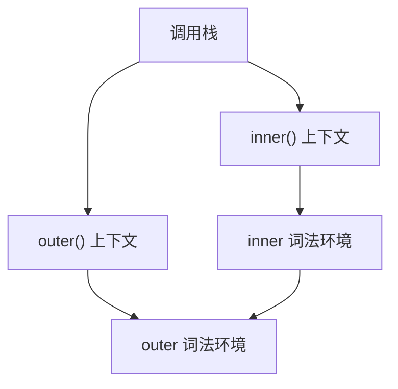
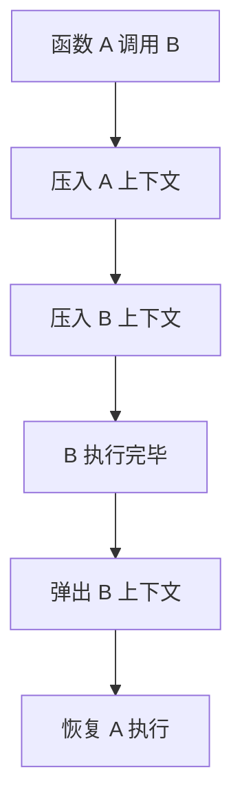

# 调用栈（Call Stack）

> **形式化定义**：调用栈（Call Stack）是 JavaScript 引擎管理函数调用的数据结构，遵循**后进先出（LIFO）**原则。每次函数调用时，引擎创建新的**执行上下文**并压入栈顶；函数返回时，弹出该上下文。ECMA-262 §9.4 定义了执行上下文栈的语义。调用栈深度有限制，超出限制抛出 `RangeError: Maximum call stack size exceeded`。
>
> 对齐版本：ECMAScript 2025 (ES16) §9.4 | TypeScript 5.8–6.0

---

## 1. 概念定义 (Concept Definition)

### 1.1 形式化定义

ECMA-262 §9.4 定义了执行上下文栈：

> *"The execution context stack is used to track execution contexts."*

调用栈的抽象数据类型：

```
CallStack = Stack<ExecutionContext>
Operations:
  push(context)  — 函数调用
  pop() → context — 函数返回
  peek() → context — 当前上下文
```

---

## 2. 属性与特征 (Properties & Characteristics)

### 2.1 调用栈属性矩阵

| 特性 | 说明 |
|------|------|
| 数据结构 | 栈（LIFO） |
| 存储内容 | 执行上下文 |
| 深度限制 | 引擎相关（通常 ~10,000–50,000） |
| 溢出错误 | RangeError |
| 调试信息 | 错误堆栈追踪 |

---

## 3. 关系分析 (Relationship Analysis)

### 3.1 调用栈与作用域链



---

## 4. 机制解释 (Mechanism Explanation)

### 4.1 调用栈的压入弹出

```mermaid
flowchart TD
    A[调用函数 f()] --> B[创建执行上下文]
    B --> C[压入调用栈]
    C --> D[执行函数体]
    D --> E[return]
    E --> F[弹出调用栈]
    F --> G[返回调用者]
```

---

## 5. 论证与分析 (Argumentation & Analysis)

### 5.1 栈溢出与递归

```javascript
// ❌ 无限递归导致栈溢出
function infinite() {
  infinite();
}
// RangeError: Maximum call stack size exceeded

// ✅ 尾递归优化（引擎依赖）
function factorial(n, acc = 1) {
  if (n <= 1) return acc;
  return factorial(n - 1, n * acc); // 尾调用
}
```

---

## 6. 实例与示例 (Examples)

### 6.1 正例：调用栈可视化

```javascript
function first() {
  second();
}

function second() {
  third();
}

function third() {
  console.log(new Error().stack);
}

first();

// 输出:
// Error
//   at third (file.js:10)
//   at second (file.js:6)
//   at first (file.js:2)
```

---

## 7. 权威参考与国际化对齐 (References)

- **ECMA-262 §9.4** — Execution Contexts
- **MDN: Call stack** — <https://developer.mozilla.org/en-US/docs/Glossary/Call_stack>

---

## 8. 思维表征总结 (Cognitive Representations)

### 8.1 调用栈可视化

```
┌─────────────────┐ ← 栈顶
│  third()        │
├─────────────────┤
│  second()       │
├─────────────────┤
│  first()        │
├─────────────────┤
│  全局上下文      │
└─────────────────┘ ← 栈底
```

---

## 9. 公理化表述与形式证明 (Axiomatization & Formal Proof)

### 9.1 公理化基础

**公理 1（LIFO 原则）**：
> 最后压入调用栈的执行上下文最先弹出。

**公理 2（深度限制）**：
> 调用栈深度受引擎内存限制，超出限制抛出 RangeError。

### 9.2 定理与证明

**定理 1（递归的终止条件必要性）**：
> 没有终止条件的递归函数必然导致栈溢出。

*证明*：
> 每次递归调用压入新执行上下文。无终止条件意味着无限递归，调用栈无限增长，最终超出深度限制。
> ∎

---

## 10. 推理链与演绎分析 (Deductive Reasoning Chain)

### 10.1 演绎推理



### 10.2 反事实推理

> **反设**：调用栈无限深。
> **推演结果**：无限递归不会溢出，但会耗尽系统内存，导致程序崩溃。
> **结论**：调用栈深度限制是防止无限递归导致系统资源耗尽的必要保护机制。

---

**参考规范**：ECMA-262 §9.4 | MDN: Call stack

---

## 11. 更多调用栈实例 (Advanced Examples)

### 11.1 正例：异步调用栈追踪

```javascript
async function a() { await b(); }
async function b() { await c(); }
async function c() { throw new Error('async error'); }

a().catch(e => console.log(e.stack));
// Error: async error
//   at c (file.js:3)
//   at async b (file.js:2)
//   at async a (file.js:1)
```

### 11.2 正例：Error.captureStackTrace 自定义堆栈

```javascript
class ValidationError extends Error {
  constructor(message, field) {
    super(message);
    this.field = field;
    // 移除构造器自身，从调用构造器的位置开始
    Error.captureStackTrace(this, ValidationError);
  }
}

function validate(user) {
  if (!user.name) throw new ValidationError('Name required', 'name');
}

validate({});
// ValidationError: Name required
//   at validate (file.js:11) — 从调用点追踪
```

### 11.3 正例：使用 debugger 语句观察实时调用栈

```javascript
function factorial(n) {
  if (n <= 1) {
    debugger; // Chrome DevTools 会在此处暂停，可在 Call Stack 面板查看
    return 1;
  }
  return n * factorial(n - 1);
}

factorial(5);
// DevTools Call Stack:
// factorial (n = 1)
// factorial (n = 2)
// factorial (n = 3)
// factorial (n = 4)
// factorial (n = 5)
// (anonymous)
```

### 11.4 正例：RangeError 与最大栈深度

```javascript
// 测量当前引擎的近似最大栈深度
function measureStackDepth(depth = 0) {
  try {
    return measureStackDepth(depth + 1);
  } catch (e) {
    return depth;
  }
}

console.log('Max stack depth:', measureStackDepth());
// Node.js ~10k–50k，浏览器 ~10k–20k（因引擎和平台而异）
```

---

## 12. 权威参考与国际化对齐 (References)

- **ECMA-262 §9.4** — Execution Contexts: <https://tc39.es/ecma262/#sec-execution-contexts>
- **MDN: Call stack** — <https://developer.mozilla.org/en-US/docs/Glossary/Call_stack>
- **MDN: RangeError** — <https://developer.mozilla.org/en-US/docs/Web/JavaScript/Reference/Global_Objects/RangeError>
- **MDN: Error.captureStackTrace** — <https://developer.mozilla.org/en-US/docs/Web/JavaScript/Reference/Global_Objects/Error/captureStackTrace>
- **V8 Docs: Stack Trace API** — <https://v8.dev/docs/stack-trace-api>
- **Chrome DevTools: JavaScript** — <https://developer.chrome.com/docs/devtools/javascript>
- **Node.js — Async Stack Traces** — <https://nodejs.org/en/learn/asynchronous-work/discover-javascript-async-stack-traces>
- **TC39: Error Stack Trace Proposal** — <https://github.com/tc39/proposal-error-stacks>
- **MDN: debugger** — <https://developer.mozilla.org/en-US/docs/Web/JavaScript/Reference/Statements/debugger>

---

**参考规范**：ECMA-262 §9.4 | MDN | V8 | Node.js Docs
