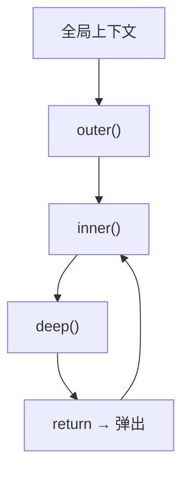
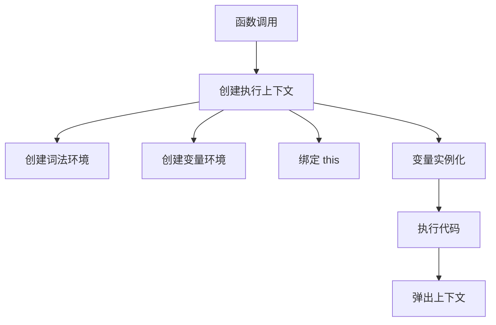
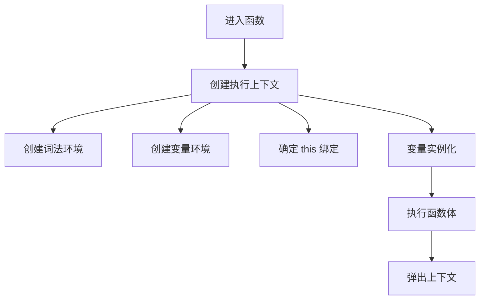

# 执行上下文（Execution Context）

> **形式化定义**：执行上下文（Execution Context）是 ECMAScript 规范中代码执行的环境抽象，由 ECMA-262 §9.4 定义。每次函数调用或全局代码执行时创建，包含**词法环境（Lexical Environment）**、**变量环境（Variable Environment）**和**this 绑定**。执行上下文栈（Execution Context Stack，即调用栈）管理活跃上下文的 LIFO 顺序。
>
> 对齐版本：ECMAScript 2025 (ES16) §9.4 | TypeScript 5.8–6.0

---

## 1. 概念定义 (Concept Definition)

### 1.1 形式化定义

ECMA-262 §9.4 定义了执行上下文：

> *"An execution context is a specification device that is used to track the runtime evaluation of code by an ECMAScript implementation."*

执行上下文的字段：

| 字段 | 说明 |
|------|------|
| `[[LexicalEnvironment]]` | 词法环境，用于标识符解析 |
| `[[VariableEnvironment]]` | 变量环境，用于 var 声明 |
| `[[ThisBinding]]` | this 值 |
| `[[Function]]` | 当前函数对象（函数代码） |

---

## 2. 属性与特征 (Properties & Characteristics)

### 2.1 执行上下文类型矩阵

| 类型 | 创建时机 | LexicalEnvironment | this 绑定 |
|------|---------|-------------------|----------|
| 全局 | 脚本开始 | 全局环境 | globalThis |
| 函数 | 函数调用 | 函数环境 | 调用方式决定 |
| 模块 | 模块加载 | 模块环境 | undefined |
| eval | eval 调用 | 调用者环境 | 调用者 this |

---

## 3. 关系分析 (Relationship Analysis)

### 3.1 执行上下文栈



---

## 4. 机制解释 (Mechanism Explanation)

### 4.1 执行上下文的创建流程



---

## 5. 论证与分析 (Argumentation & Analysis)

### 5.1 执行上下文 vs 调用栈

| 概念 | 作用 | 生命周期 |
|------|------|---------|
| 执行上下文 | 代码执行环境 | 函数执行期间 |
| 调用栈 | 上下文管理 | 程序运行期间 |
| 词法环境 | 变量存储 | 取决于闭包引用 |

---

## 6. 实例与示例 (Examples)

### 6.1 正例：执行上下文可视化

```javascript
const x = "global";

function outer() {
  const y = "outer";

  function inner() {
    const z = "inner";
    console.log(x, y, z); // 通过作用域链访问所有变量
  }

  inner();
}

outer();

// 执行上下文栈：
// 1. 全局上下文: x = "global"
// 2. outer 上下文: y = "outer"
// 3. inner 上下文: z = "inner"
```

### 6.2 正例：模块执行上下文的 this

```javascript
// ES 模块的顶层 this 是 undefined（严格模式默认）
// CommonJS 模块的顶层 this 指向 module.exports

// module.mjs
console.log(this); // undefined

// module.cjs
console.log(this === module.exports); // true
```

### 6.3 正例：eval 的执行上下文继承

```javascript
const x = 'global';

function outer() {
  const x = 'outer';
  eval('console.log(x)'); // "outer" — 继承调用者的词法环境

  // 间接 eval（如 (0, eval)('...')）使用全局环境
  const indirect = eval;
  indirect('console.log(x)'); // "global"（在浏览器中）或 ReferenceError（Node.js ESM）
}

outer();
```

### 6.4 正例：Realm 与 iframe 的执行上下文隔离

```javascript
// 不同 Realm 具有独立的 globalThis 和内置对象
const iframe = document.createElement('iframe');
document.body.appendChild(iframe);

const iframeWindow = iframe.contentWindow;
console.log(iframeWindow.Array === Array); // false（不同 Realm）

// 跨 Realm 的 instanceof 检查会失败
const arr = new iframeWindow.Array();
console.log(arr instanceof Array); // false
console.log(Array.isArray(arr));   // true（推荐方式）
```

### 6.5 正例：AsyncContext (Stage 2) 的异步上下文传播

```javascript
// TC39 Async Context 提案（Stage 2）用于在异步调用中保持上下文
// 类似 AsyncLocalStorage 的规范级版本
// https://github.com/tc39/proposal-async-context

// Node.js AsyncLocalStorage（当前可用的实现）
import { AsyncLocalStorage } from 'node:async_hooks';

const storage = new AsyncLocalStorage();

storage.run({ userId: 42 }, () => {
  setTimeout(() => {
    console.log(storage.getStore()); // { userId: 42 }
  }, 0);
});
```

### 6.6 正例：Node.js vm 模块与独立上下文

```javascript
import { createContext, runInContext } from 'node:vm';

// 创建独立的执行上下文（新的全局环境）
const context = createContext({
  console,
  require,
  module: { exports: {} },
  global: {},
  customVar: 100
});

const code = `
  exports.result = customVar + 1;
  typeof Array; // 与宿主 Array 不同原型链
`;

runInContext(code, context);
console.log(context.module.exports.result); // 101
```

### 6.7 正例：类静态块与执行上下文层级

```javascript
class Config {
  static #instance;

  // 类静态块拥有自己的词法环境，可访问私有字段
  static {
    const env = process.env.NODE_ENV || 'development';
    this.#instance = new this(env); // 静态块中的 this 指向类本身
  }

  constructor(env) {
    this.env = env;
  }
}

// 等价于在类评估时创建一个特殊的执行上下文
// 该上下文可访问类的私有名称绑定
console.log(Config.env); // 'development'
```

### 6.8 正例：Top-level await 的模块执行上下文

```javascript
// module.mjs
const response = await fetch('https://api.example.com/config');
// 顶层 await 会暂停模块的执行上下文创建
// 但不会影响其他模块的加载

export const config = await response.json();
// 其他 import 本模块的代码会等待该上下文完成
```

### 6.9 正例：直接 eval 与间接 eval 的上下文差异

```javascript
const x = 'global';

function demo() {
  const x = 'local';

  // 直接 eval：继承当前执行上下文的词法环境
  eval('console.log(x)'); // "local"

  // 间接 eval：使用全局执行上下文
  const indirect = eval;
  indirect('console.log(typeof x)'); // "undefined"（独立上下文）

  // 严格模式下的直接 eval 创建独立词法环境
  'use strict';
  eval('var inner = 1');
  console.log(typeof inner); // "undefined"（不泄漏）
}

demo();
```

### 6.10 正例：Error 对象的执行上下文快照

```javascript
function layerA() {
  function layerB() {
    function layerC() {
      const err = new Error('context snapshot');
      return err.stack;
    }
    return layerC();
  }
  return layerB();
}

// 堆栈追踪记录了调用链上每个执行上下文的快照
console.log(layerA());
// Error: context snapshot
//   at layerC (file.js:4)
//   at layerB (file.js:6)
//   at layerA (file.js:8)
```

### 6.11 正例：Class 字段初始化器的执行上下文

```javascript
class ContextDemo {
  // 类字段初始化器在独立的词法环境中求值
  // this 指向正在构造的实例
  field = this.initField();

  initField() {
    // 此方法调用的执行上下文的 [[ThisBinding]] 为实例
    return 42;
  }

  // 箭头函数字段继承类体的 this
  arrow = () => this.field;
}

const demo = new ContextDemo();
const arrow = demo.arrow;
console.log(arrow()); // 42 — 即使作为独立函数调用
```

### 6.12 正例：WeakRef FinalizationRegistry 的执行上下文隔离

```javascript
// FinalizationRegistry 的回调在独立执行上下文中运行
// 不继承创建时的词法环境
const registry = new FinalizationRegistry((heldValue) => {
  // 此回调的执行上下文是全新的，无法访问外部变量
  console.log('Cleaned up:', heldValue);
});

let target = { data: 'sensitive' };
registry.register(target, 'resource-1');

target = null; // 取消引用
// 未来某个 GC 周期后，回调在新上下文中执行
```

### 6.13 正例：性能标记中的执行上下文切换

```javascript
// 使用 performance.mark 记录执行上下文切换
function measureContextSwitch() {
  performance.mark('context-start');

  function inner() {
    performance.mark('context-inner');
    performance.measure('outer-to-inner', 'context-start', 'context-inner');
    return performance.getEntriesByType('measure').pop();
  }

  return inner();
}

const measure = measureContextSwitch();
console.log(`Context switch took ${measure.duration.toFixed(3)} ms`);
```

---

## 7. 权威参考与国际化对齐 (References)

- **ECMA-262 §9.4** — Execution Contexts: <https://tc39.es/ecma262/#sec-execution-contexts>
- **ECMA-262 §9.2** — ECMAScript Code Execution Contexts: <https://tc39.es/ecma262/#sec-execution-contexts>
- **ECMA-262 §9.3** — Realms: <https://tc39.es/ecma262/#sec-realms>
- **MDN: Execution context** — <https://developer.mozilla.org/en-US/docs/Web/JavaScript/Reference/Execution_context>
- **MDN: Realm** — <https://developer.mozilla.org/en-US/docs/Web/JavaScript/Reference/Global_Objects/Realm>
- **MDN: strict mode** — <https://developer.mozilla.org/en-US/docs/Web/JavaScript/Reference/Strict_mode>
- **MDN: eval** — <https://developer.mozilla.org/en-US/docs/Web/JavaScript/Reference/Global_Objects/eval>
- **MDN: this** — <https://developer.mozilla.org/en-US/docs/Web/JavaScript/Reference/Operators/this>
- **MDN: WeakRef** — <https://developer.mozilla.org/en-US/docs/Web/JavaScript/Reference/Global_Objects/WeakRef>
- **MDN: FinalizationRegistry** — <https://developer.mozilla.org/en-US/docs/Web/JavaScript/Reference/Global_Objects/FinalizationRegistry>
- **Node.js: vm module** — <https://nodejs.org/api/vm.html>
- **Node.js: AsyncLocalStorage** — <https://nodejs.org/api/async_context.html>
- **TC39: Async Context Proposal** — <https://github.com/tc39/proposal-async-context>
- **TC39: ShadowRealm** — <https://github.com/tc39/proposal-shadowrealm>
- **V8 Blog: Understanding V8 Bytecode** — <https://v8.dev/blog/understanding-v8-bytecode>
- **V8 Blog: Execution Context Internals** — <https://v8.dev/blog/execution-context>
- **SpiderMonkey Docs: Execution Contexts** — <https://firefox-source-docs.mozilla.org/js/index.html>
- **HTML Living Standard §8.1.4.2** — Event loops: <https://html.spec.whatwg.org/multipage/webappapis.html#event-loops>
- **HTML Living Standard §8.1.3.5** — Realms and their counterparts: <https://html.spec.whatwg.org/multipage/webappapis.html#realms-and-their-counterparts>
- **W3C: Performance Timeline** — <https://www.w3.org/TR/performance-timeline/>

---

## 8. 思维表征总结 (Cognitive Representations)

### 8.1 执行上下文创建流程



---

**参考规范**：ECMA-262 §9 | MDN | TC39 Proposals | Node.js Docs | V8 Blog | SpiderMonkey Docs
