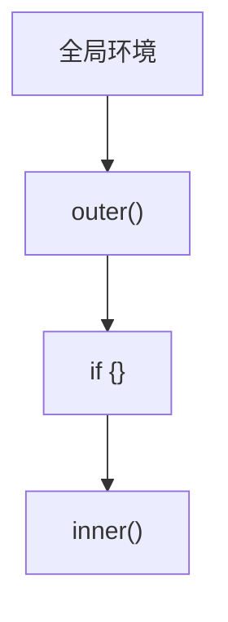
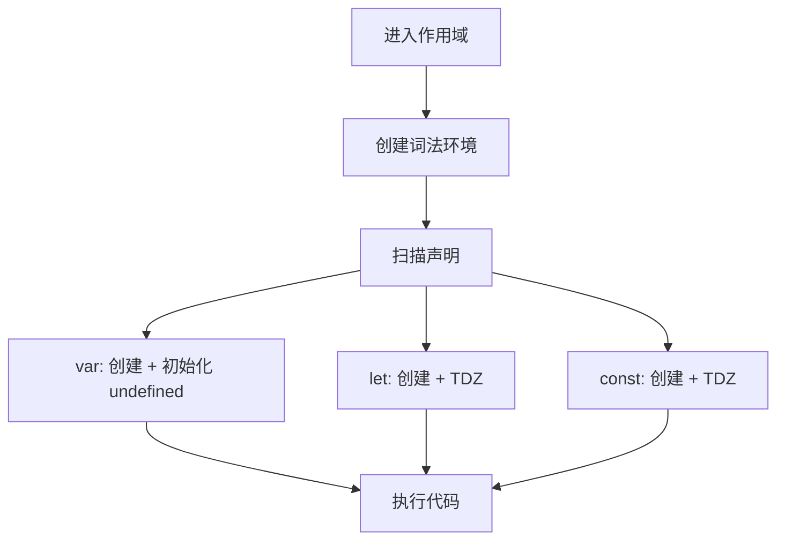
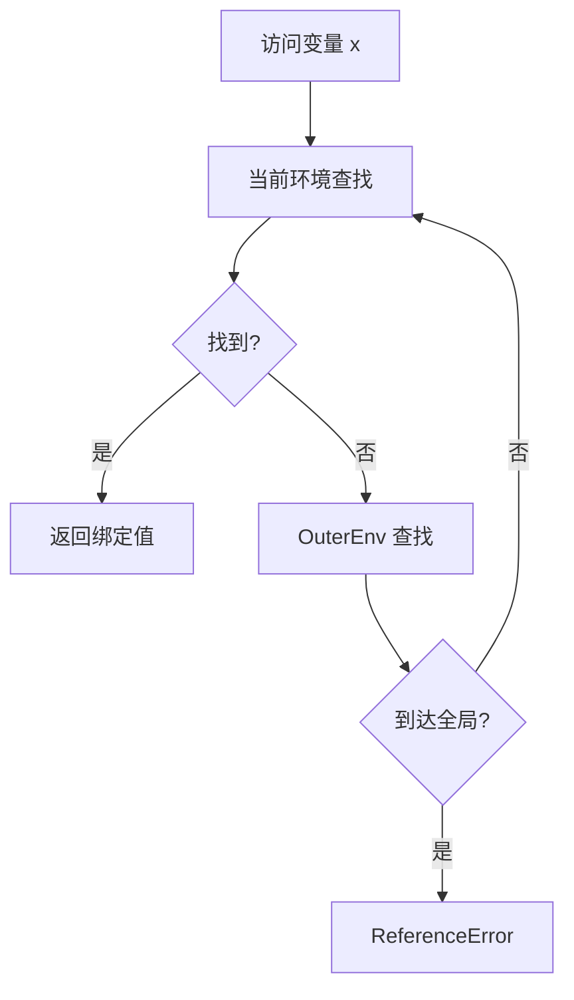

# 词法环境与变量（Lexical Environment & Variables）

> **形式化定义**：词法环境（Lexical Environment）是 ECMAScript 规范中存储变量绑定的核心数据结构，由**环境记录（Environment Record）**和**外部引用（OuterEnv）**组成。变量声明（var/let/const）在词法环境中创建绑定，通过作用域链进行解析。ECMA-262 §8.1 定义了词法环境的完整语义，§8.1.1 定义了环境记录的分类和操作。
>
> 对齐版本：ECMAScript 2025 (ES16) §8.1 | TypeScript 5.8–6.0

---

## 1. 概念定义 (Concept Definition)

### 1.1 形式化定义

ECMA-262 §8.1 定义了词法环境：

> *"A Lexical Environment is a specification type used to define the association of Identifiers to specific variables and functions."*

词法环境的数学表示：

```
LexicalEnvironment = (EnvironmentRecord, OuterEnv)
```

---

## 2. 属性与特征 (Properties & Characteristics)

### 2.1 环境记录类型矩阵

| 类型 | 用途 | 存储方式 |
|------|------|---------|
| 声明式 | let/const/function | 内部哈希表 |
| 对象式 | var/with | 绑定到对象属性 |
| 函数式 | 函数参数/局部变量 | 声明式 + 参数映射 |
| 模块式 | 模块导出/导入 | 声明式 + 模块记录 |

---

## 3. 关系分析 (Relationship Analysis)

### 3.1 词法环境链



---

## 4. 机制解释 (Mechanism Explanation)

### 4.1 变量创建流程



---

## 5. 论证与分析 (Argumentation & Analysis)

### 5.1 var vs let vs const 的环境记录

| 声明 | 环境记录类型 | 初始化时机 |
|------|------------|-----------|
| `var` | 对象式 | 创建时（undefined） |
| `let` | 声明式 | 执行到声明时 |
| `const` | 声明式 | 执行到声明时（必须） |

---

## 6. 实例与示例 (Examples)

### 6.1 正例：环境记录的可视化

```javascript
// 全局环境
const globalVar = 1;

function example() {
  // 函数环境记录: { param: undefined }
  const localVar = 2;

  if (true) {
    // 块级环境记录: { blockVar: TDZ }
    const blockVar = 3;
  }
}
```

---

## 7. 权威参考与国际化对齐 (References)

- **ECMA-262 §8.1** — Lexical Environments
- **MDN: Lexical Environment** — <https://developer.mozilla.org/en-US/docs/Web/JavaScript/Closures#lexical_scoping>

---

## 8. 思维表征总结 (Cognitive Representations)

### 8.1 词法环境结构

```
┌─────────────────────────────────────┐
│      词法环境                         │
├─────────────────────────────────────┤
│  环境记录                            │
│  ├─ 绑定1: 值1                        │
│  └─ 绑定2: 值2                        │
├─────────────────────────────────────┤
│  OuterEnv → 父级词法环境               │
└─────────────────────────────────────┘
```

---

## 9. 公理化表述与形式证明 (Axiomatization & Formal Proof)

### 9.1 公理化基础

**公理 1（变量解析的确定性）**：
> 标识符解析从当前词法环境开始，沿 OuterEnv 链向上查找，直到找到或到达全局环境。

**公理 2（TDZ 的不可访问性）**：
> let/const 声明的变量在初始化前不可访问，访问抛出 ReferenceError。

### 9.2 定理与证明

**定理 1（闭包的变量保持）**：
> 函数对象持有其创建时词法环境的引用，该环境在函数存活期间保持。

*证明*：
> 函数对象的 `[[Environment]]` 内部槽指向创建时的词法环境。只要函数对象存在，该环境就不会被垃圾回收。
> ∎

---

## 10. 推理链与演绎分析 (Deductive Reasoning Chain)

### 10.1 演绎推理



### 10.2 反事实推理

> **反设**：没有词法环境链，所有变量存储在单一全局表中。
> **推演结果**：命名冲突频繁，模块化不可能实现，内存管理混乱。
> **结论**：词法环境链是作用域隔离和模块化编程的基础。

---

**参考规范**：ECMA-262 §8.1 | MDN: Lexical Environment

---

## 11. 更多词法环境实例 (Advanced Examples)

### 11.1 正例：`with` 语句的词法环境（遗留模式）

```javascript
// with 语句创建对象式环境记录（不推荐在新代码中使用）
const obj = { a: 1, b: 2 };

with (obj) {
  console.log(a); // 1 — 从 obj 的属性解析
  a = 10;         // 修改 obj.a
  const c = 3;    // c 绑定到 with 语句的块级环境
}

console.log(obj.a); // 10
// console.log(c);  // ReferenceError: c is not defined
```

### 11.2 正例：`globalThis` 与全局词法环境

```javascript
// 不同环境中的全局对象名称统一为 globalThis
console.log(globalThis === window);       // true（浏览器）
// console.log(globalThis === global);    // true（Node.js < 12）
// console.log(globalThis === self);      // true（Web Workers）

// 全局 let/const 创建在全局词法环境，不会成为 globalThis 的属性
let globalLet = 1;
const globalConst = 2;
console.log('globalLet' in globalThis);   // false

// 全局 var/function 会绑定到全局对象
var globalVar = 3;
console.log('globalVar' in globalThis);   // true
```

### 11.3 正例：模块命名空间对象的词法环境

```javascript
// module.mjs
export const foo = 1;
export function bar() { return 2; }

// main.mjs
import * as ns from './module.mjs';
console.log(ns.foo); // 1
// ns.foo = 2;       // TypeError: Cannot assign to read only property

// 模块命名空间对象的属性是绑定而非值拷贝
// 若导出模块修改 foo，ns.foo 也会更新
```

### 11.4 正例：`eval` 的词法环境泄漏与严格模式隔离

```javascript
function sloppy() {
  eval('var leaked = 1'); // 非严格模式 eval 泄漏到函数环境
  console.log(leaked);    // 1
}

function strict() {
  'use strict';
  eval('var isolated = 1'); // 严格模式 eval 创建独立词法环境
  // console.log(isolated); // ReferenceError
}

sloppy();
strict();
```

### 11.5 正例：Temporal Dead Zone（TDZ）陷阱

```javascript
// TDZ 在作用域链解析时即生效
function tdzDemo() {
  // 从编译阶段开始，console 就处于 TDZ
  console.log(value); // ReferenceError: Cannot access 'value' before initialization
  const value = 42;
}

// typeof 在 TDZ 中同样会抛出 ReferenceError（与未声明变量不同）
function tdzTypeof() {
  console.log(typeof undeclared); // "undefined"（安全）
  // console.log(typeof tdzVar);  // ReferenceError（TDZ 中不安全）
  let tdzVar = 1;
}
```

---

## 12. 权威参考与国际化对齐 (References)

- **ECMA-262 §8.1** — Lexical Environments: <https://tc39.es/ecma262/#sec-lexical-environments>
- **ECMA-262 §8.1.1** — Environment Records: <https://tc39.es/ecma262/#sec-environment-records>
- **MDN: Closures** — <https://developer.mozilla.org/en-US/docs/Web/JavaScript/Closures>
- **MDN: Scope** — <https://developer.mozilla.org/en-US/docs/Glossary/Scope>
- **MDN: var** — <https://developer.mozilla.org/en-US/docs/Web/JavaScript/Reference/Statements/var>
- **MDN: let** — <https://developer.mozilla.org/en-US/docs/Web/JavaScript/Reference/Statements/let>
- **MDN: const** — <https://developer.mozilla.org/en-US/docs/Web/JavaScript/Reference/Statements/const>
- **MDN: globalThis** — <https://developer.mozilla.org/en-US/docs/Web/JavaScript/Reference/Global_Objects/globalThis>
- **MDN: import** — <https://developer.mozilla.org/en-US/docs/Web/JavaScript/Reference/Statements/import>
- **MDN: with** — <https://developer.mozilla.org/en-US/docs/Web/JavaScript/Reference/Statements/with>
- **2ality — Variables and scoping** — <https://2ality.com/2015/02/es6-scoping.html>
- **V8 Blog: Fast Properties** — <https://v8.dev/blog/fast-properties>
- **TC39: Module Harmony** — <https://github.com/tc39/proposal-modules-exports>

---

**参考规范**：ECMA-262 §8.1 | MDN | 2ality | V8 Blog
