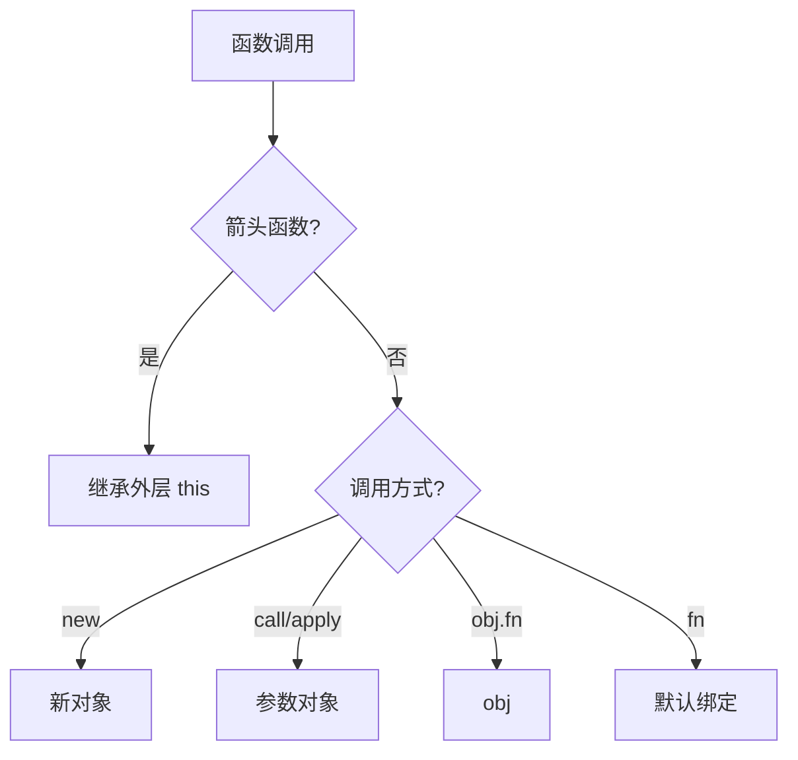

# this 绑定（This Binding）

> **形式化定义**：`this` 绑定是 ECMAScript 中函数调用时隐式传入的上下文对象，其值由**调用方式**决定而非函数定义位置。ECMA-262 §10.2.1 定义了 `[[Call]]` 内部方法的 this 绑定规则，包括默认绑定、隐式绑定、显式绑定（call/apply/bind）和 new 绑定。箭头函数没有自己的 this，继承外层词法环境的 this 值。
>
> 对齐版本：ECMAScript 2025 (ES16) §10.2.1 | TypeScript 5.8–6.0

---

## 1. 概念定义 (Concept Definition)

### 1.1 形式化定义

ECMA-262 §10.2.1 定义了 this 绑定：

> *"The this value is a mutable binding that is the value of the ThisBinding of the current execution context."*

this 绑定的四种规则：

| 规则 | 调用方式 | this 值 |
|------|---------|--------|
| 默认绑定 | `fn()` | globalThis / undefined（严格模式） |
| 隐式绑定 | `obj.fn()` | obj |
| 显式绑定 | `fn.call(obj)` | 第一个参数 |
| new 绑定 | `new Fn()` | 新创建的对象 |
| 箭头函数 | — | 外层词法 this |

---

## 2. 属性与特征 (Properties & Characteristics)

### 2.1 this 绑定优先级

```
优先级从高到低：
1. new 绑定
2. 显式绑定（call/apply/bind）
3. 隐式绑定（obj.method()）
4. 默认绑定（fn()）
5. 箭头函数（继承外层）
```

---

## 3. 关系分析 (Relationship Analysis)

### 3.1 this 与作用域链的对比

| 特性 | this | 作用域链 |
|------|------|---------|
| 确定性 | 动态（调用时） | 静态（定义时） |
| 修改方式 | call/apply/bind | 不可修改 |
| 箭头函数 | 继承外层 | 正常词法环境 |

---

## 4. 机制解释 (Mechanism Explanation)

### 4.1 this 绑定的确定流程

```mermaid
flowchart TD
    A[函数调用] --> B{箭头函数?}
    B -->|是| C[继承外层 this]
    B -->|否| D{new 调用?}
    D -->|是| E[this = 新对象]
    D -->|否| F{call/apply/bind?}
    F -->|是| G[this = 指定对象]
    F -->|否| H{obj.method()?}
    H -->|是| I[this = obj]
    H -->|否| J[默认绑定]
    J --> K{严格模式?}
    K -->|是| L[this = undefined]
    K -->|否| M[this = globalThis]
```

---

## 5. 论证与分析 (Argumentation & Analysis)

### 5.1 this 绑定常见陷阱

```javascript
const obj = {
  name: "Alice",
  greet() {
    console.log(`Hello, ${this.name}`);
  }
};

obj.greet(); // "Hello, Alice" ✅

const fn = obj.greet;
fn(); // "Hello, undefined" ❌（默认绑定）

setTimeout(obj.greet, 0); // "Hello, undefined" ❌

// ✅ 修复：绑定 this
setTimeout(obj.greet.bind(obj), 0);
// 或
setTimeout(() => obj.greet(), 0);
```

---

## 6. 实例与示例 (Examples)

### 6.1 正例：显式绑定

```javascript
function greet(greeting) {
  console.log(`${greeting}, ${this.name}`);
}

const person = { name: "Alice" };

// call: 立即调用，传入参数列表
greet.call(person, "Hello"); // "Hello, Alice"

// apply: 立即调用，传入参数数组
greet.apply(person, ["Hi"]); // "Hi, Alice"

// bind: 返回绑定 this 的新函数
const boundGreet = greet.bind(person);
boundGreet("Hey"); // "Hey, Alice"
```

---

## 7. 权威参考与国际化对齐 (References)

- **ECMA-262 §10.2.1** — [[Call]]
- **MDN: this** — <https://developer.mozilla.org/en-US/docs/Web/JavaScript/Reference/Operators/this>

---

## 8. 思维表征总结 (Cognitive Representations)

### 8.1 this 绑定规则速查

| 调用方式 | this 值 | 示例 |
|---------|--------|------|
| `fn()` | globalThis / undefined | 默认绑定 |
| `obj.fn()` | obj | 隐式绑定 |
| `fn.call(obj)` | obj | 显式绑定 |
| `new Fn()` | 新对象 | new 绑定 |
| `() => {}` | 外层 this | 箭头函数 |

---

## 9. 公理化表述与形式证明 (Axiomatization & Formal Proof)

### 9.1 公理化基础

**公理 1（this 的动态性）**：
> `this` 的值在函数调用时确定，与函数定义位置无关。

**公理 2（箭头函数的静态性）**：
> 箭头函数没有自己的 this，其 this 值继承自外层词法环境。

### 9.2 定理与证明

**定理 1（bind 的幂等性）**：
> `fn.bind(obj).bind(other)` 的 this 绑定为 `obj`，第二次 bind 无效。

*证明*：
> `bind` 返回的绑定函数具有 `[[BoundThis]]` 内部槽。再次 `bind` 时，新函数绑定到 `other`，但调用时优先使用原始绑定函数的 `[[BoundThis]]`。
> ∎

---

## 10. 推理链与演绎分析 (Deductive Reasoning Chain)

### 10.1 演绎推理



### 10.2 反事实推理

> **反设**：JavaScript 的 this 像 Java 一样是静态绑定的。
> **推演结果**：`obj.method()` 无法灵活提取方法，`call/apply/bind` 不再需要，回调函数的上下文传递简化。
> **结论**：动态 this 提供了灵活性但增加了复杂性，箭头函数提供了静态 this 的替代方案。

---

**参考规范**：ECMA-262 §10.2.1 | MDN: this

---

## 11. 更多 this 绑定实例 (Advanced Examples)

### 11.1 正例：类构造函数中的 this 绑定

```javascript
class Person {
  constructor(name) {
    this.name = name;
    // 类体和构造函数始终处于严格模式
    // 内部函数不会自动继承 this
  }

  greet() {
    console.log(`Hello, ${this.name}`);
  }
}

const person = new Person('Alice');
const greet = person.greet;
// greet(); // TypeError: Cannot read properties of undefined
```

### 11.2 正例：DOM 事件处理程序中的 this

```javascript
const button = document.querySelector('button');

// 传统事件监听：this 指向触发元素
button.addEventListener('click', function (e) {
  console.log(this === e.currentTarget); // true
});

// 箭头函数：this 继承外层词法环境
button.addEventListener('click', (e) => {
  console.log(this === window); // true（若外层为全局）
});

// HTML 内联事件：this 指向元素
// <button onclick="console.log(this.tagName)">Click</button> // "BUTTON"
```

### 11.3 正例：`Reflect.apply` 与显式 this

```javascript
function sum(a, b) {
  return this.base + a + b;
}

// Reflect.apply 等价于 Function.prototype.apply 但更易读
const result = Reflect.apply(sum, { base: 10 }, [1, 2]);
console.log(result); // 13

// 与 call/apply 的行为一致性
console.log(sum.apply({ base: 10 }, [1, 2])); // 13
console.log(sum.call({ base: 10 }, 1, 2));    // 13
```

### 11.4 正例：可选链与 this 丢失

```javascript
const api = {
  prefix: '/api',
  fetch(id) {
    return fetch(`${this.prefix}/users/${id}`);
  }
};

// ❌ this 丢失
const badFetch = api?.fetch;
// badFetch(1); // this.prefix === undefined

// ✅ 使用 bind 或箭头函数保持上下文
const goodFetch = api.fetch.bind(api);
// 或
const boundApi = {
  prefix: '/api',
  fetch: (id) => {
    // 注意：箭头函数无法通过 bind/call/apply 改变 this
    return fetch(`${this.prefix}/users/${id}`); // 继承外层 this！
  }
};
```

### 11.5 正例：super 关键字与 this 绑定

```javascript
class Base {
  name = 'Base';
  log() {
    console.log(this.name);
  }
}

class Derived extends Base {
  name = 'Derived';
  log() {
    super.log(); // super.log() 的 this 仍指向 Derived 实例
  }
}

new Derived().log(); // "Derived"
```

---

## 12. 权威参考与国际化对齐 (References)

- **ECMA-262 §10.2.1** — [[Call]]: <https://tc39.es/ecma262/#sec-ecmascript-function-objects-call-thisargument-argumentslist>
- **ECMA-262 §10.2.2** — [[Construct]]: <https://tc39.es/ecma262/#sec-ecmascript-function-objects-construct-argumentslist-newtarget>
- **MDN: this** — <https://developer.mozilla.org/en-US/docs/Web/JavaScript/Reference/Operators/this>
- **MDN: Function.prototype.call** — <https://developer.mozilla.org/en-US/docs/Web/JavaScript/Reference/Global_Objects/Function/call>
- **MDN: Function.prototype.apply** — <https://developer.mozilla.org/en-US/docs/Web/JavaScript/Reference/Global_Objects/Function/apply>
- **MDN: Function.prototype.bind** — <https://developer.mozilla.org/en-US/docs/Web/JavaScript/Reference/Global_Objects/Function/bind>
- **MDN: Reflect.apply** — <https://developer.mozilla.org/en-US/docs/Web/JavaScript/Reference/Global_Objects/Reflect/apply>
- **MDN: Arrow functions** — <https://developer.mozilla.org/en-US/docs/Web/JavaScript/Reference/Functions/Arrow_functions>
- **MDN: class** — <https://developer.mozilla.org/en-US/docs/Web/JavaScript/Reference/Classes>
- **2ality — this in JavaScript** — <https://2ality.com/2014/05/this.html>
- **MDN: super** — <https://developer.mozilla.org/en-US/docs/Web/JavaScript/Reference/Operators/super>

---

---

## 13. 深化实例：this 绑定边界与高级模式

### 13.1 正例：显式绑定到原始值

```javascript
function showThis() {
  console.log(typeof this, this.valueOf());
}

// 原始值会被装箱为对应包装对象
showThis.call(42);        // "number", 42
showThis.call('hello');   // "string", "hello"
showThis.call(true);      // "boolean", true
showThis.call(123n);      // "bigint", 123n

// null/undefined 在严格模式下保持原样
function strictShow() {
  'use strict';
  console.log(this);
}
strictShow.call(null);    // null
strictShow.call(undefined); // undefined
```

### 13.2 正例：Proxy 拦截中的 this 绑定

```javascript
const target = {
  value: 10,
  getValue() { return this.value; }
};

const proxy = new Proxy(target, {
  get(target, prop, receiver) {
    // receiver 是最终的 this 绑定目标
    console.log('get:', prop, 'receiver === proxy?', receiver === proxy);
    return Reflect.get(target, prop, receiver);
  }
});

console.log(proxy.getValue()); // receiver === proxy, 返回 10

// 陷阱：若未正确传递 receiver，this 绑定会丢失
const brokenProxy = new Proxy(target, {
  get(target, prop) {
    return target[prop]; // ❌ 未传递 receiver
  }
});
console.log(brokenProxy.getValue()); // 10（侥幸），但复杂场景会失败
```

### 13.3 正例：类私有字段与 this 的严格绑定

```javascript
class Counter {
  #count = 0;

  increment() {
    this.#count++;
    return this.#count;
  }

  // 私有字段访问会检查 this 是否为 Counter 实例
  static tryIncrement(instance) {
    // 借用方法
    return Counter.prototype.increment.call(instance);
  }
}

const c = new Counter();
Counter.tryIncrement(c); // 1

// 若传入非实例对象：
const fake = {};
try {
  Counter.prototype.increment.call(fake);
} catch (e) {
  console.log(e instanceof TypeError); // true（私有字段访问失败）
}
```

### 13.4 正例：回调函数中的 this 绑定模式

```javascript
class EventEmitter {
  #listeners = new Map();

  on(event, handler) {
    if (!this.#listeners.has(event)) {
      this.#listeners.set(event, new Set());
    }
    this.#listeners.get(event).add(handler);
  }

  emit(event, data) {
    const handlers = this.#listeners.get(event) || [];
    for (const handler of handlers) {
      handler.call(this, data); // 显式绑定 emitter 实例
    }
  }
}

// 使用
const emitter = new EventEmitter();
emitter.on('data', function (d) {
  console.log(this === emitter); // true
  console.log(d);
});
emitter.emit('data', { msg: 'hello' });
```

---

## 14. 更多权威参考

- **ECMA-262 §10.2.1** — [[Call]]: <https://tc39.es/ecma262/#sec-ecmascript-function-objects-call-thisargument-argumentslist>
- **MDN: this** — <https://developer.mozilla.org/en-US/docs/Web/JavaScript/Reference/Operators/this>
- **MDN: Proxy** — <https://developer.mozilla.org/en-US/docs/Web/JavaScript/Reference/Global_Objects/Proxy>
- **MDN: Private class features** — <https://developer.mozilla.org/en-US/docs/Web/JavaScript/Reference/Classes/Private_class_fields>
- **2ality: this in JavaScript** — <https://2ality.com/2014/05/this.html>
- **MDN: Reflect.get** — <https://developer.mozilla.org/en-US/docs/Web/JavaScript/Reference/Global_Objects/Reflect/get>
- **MDN: Function.prototype.bind** — <https://developer.mozilla.org/en-US/docs/Web/JavaScript/Reference/Global_Objects/Function/bind>
- **MDN: class** — <https://developer.mozilla.org/en-US/docs/Web/JavaScript/Reference/Classes>

---

---

## 深化补充三：this 绑定边界场景

### 标记模板字符串中的 this

```javascript
function tagged(strings, ...values) {
  // 标记函数中的 this 由调用方式决定
  console.log(this);
  return strings.reduce((acc, str, i) => acc + str + (values[i] || ''), '');
}

const obj = { method: tagged };
obj.method`hello ${'world'}`; // this === obj

const detached = tagged;
detached`hello`; // 默认绑定：globalThis 或 undefined（严格模式）
```

### Generator 函数中的 this 绑定

```javascript
function* gen() {
  // 生成器函数中的 this 遵循普通函数的绑定规则
  console.log('generator this:', this);
  yield 1;
  yield 2;
}

const obj = { method: gen };
const iterator = obj.method(); // this === obj
iterator.next();

// 使用 GeneratorFunction 构造器（全局环境编译）
const dynamicGen = new GeneratorFunction('yield 1;');
// dynamicGen 的 this 始终为默认绑定
```

### with 语句中的 this 绑定（遗留模式）

```javascript
const context = { name: 'context' };

function showThis() {
  console.log(this.name);
}

with (context) {
  // with 语句不会改变函数调用的 this 绑定
  showThis(); // undefined（默认绑定）或 globalThis.name

  // 但可以通过对象方法调用改变
  context.show = showThis;
  context.show(); // "context"
}
```

---

## 更多权威外部链接

- **MDN: Tagged Templates** — <https://developer.mozilla.org/en-US/docs/Web/JavaScript/Reference/Template_literals#tagged_templates>
- **MDN: GeneratorFunction** — <https://developer.mozilla.org/en-US/docs/Web/JavaScript/Reference/Global_Objects/GeneratorFunction>
- **MDN: Generators** — <https://developer.mozilla.org/en-US/docs/Web/JavaScript/Reference/Global_Objects/Generator>
- **MDN: with** — <https://developer.mozilla.org/en-US/docs/Web/JavaScript/Reference/Statements/with>
- **ECMA-262 §10.2.1** — [[Call]]: <https://tc39.es/ecma262/#sec-ecmascript-function-objects-call-thisargument-argumentslist>
- **ECMA-262 §27.3** — Generator Objects: <https://tc39.es/ecma262/#sec-generator-objects>
- **2ality: this in JavaScript** — <https://2ality.com/2014/05/this.html>

**参考规范**：ECMA-262 §10.2 | MDN | 2ality | Tagged Templates | Generators
