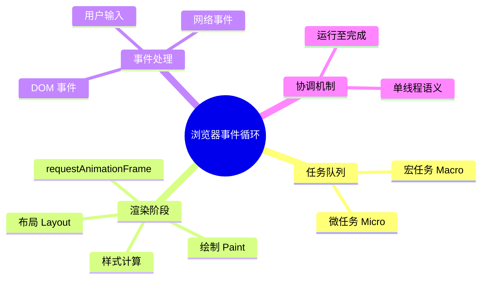
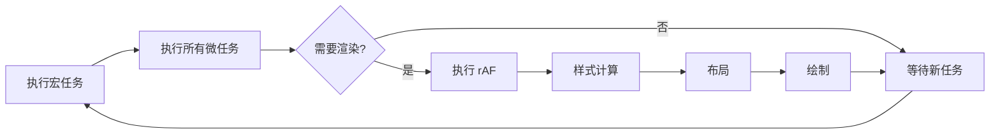
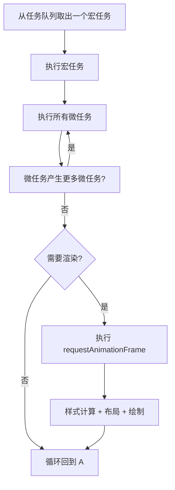
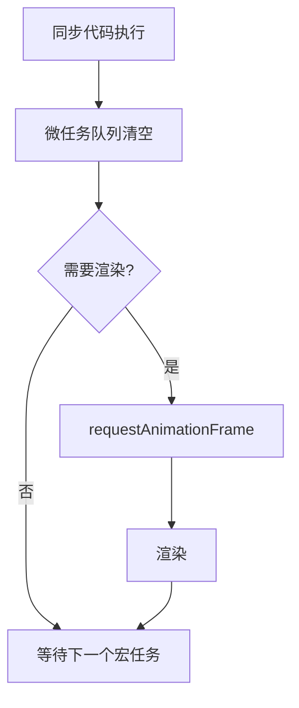

# 浏览器事件循环（Event Loop - Browser）

> **形式化定义**：事件循环（Event Loop）是浏览器环境中协调 JavaScript 执行、渲染和事件处理的并发模型，由 HTML Living Standard §8.1.4.2 定义。事件循环维护多个**任务队列（Task Queues）**和**微任务队列（Microtask Queue）**，按照**运行-至-完成（Run-to-Completion）**语义执行回调。浏览器事件循环还需协调**渲染（Rendering）**时机，确保 60fps 的流畅体验。
>
> 对齐版本：HTML Living Standard §8.1.4.2 | ECMAScript 2025 (ES16) | TypeScript 5.8–6.0

---

## 1. 概念定义 (Concept Definition)

### 1.1 形式化定义

HTML Living Standard 定义了事件循环：

> *"An event loop has one or more task queues."*

事件循环的核心组件：

| 组件 | 说明 |
|------|------|
| 任务队列（Task Queue） | setTimeout、DOM 事件、I/O 回调 |
| 微任务队列（Microtask Queue） | Promise.then、queueMicrotask |
| 渲染时机（Rendering） | requestAnimationFrame、样式计算、布局、绘制 |

### 1.2 概念层级图谱



---

## 2. 属性与特征 (Properties & Characteristics)

### 2.1 浏览器事件循环周期



### 2.2 任务类型矩阵

| 任务来源 | 队列类型 | 优先级 | 示例 |
|---------|---------|--------|------|
| setTimeout/setInterval | 宏任务 | 低 | 定时器回调 |
| DOM 事件 | 宏任务 | 中 | click、keydown |
| Promise.then | 微任务 | 高 | 异步回调 |
| queueMicrotask | 微任务 | 高 | 显式微任务 |
| requestAnimationFrame | 渲染 | 中 | 动画帧 |

---

## 3. 关系分析 (Relationship Analysis)

### 3.1 微任务与宏任务的关系

```javascript
console.log("1");

setTimeout(() => console.log("2"), 0);

Promise.resolve().then(() => console.log("3"));

queueMicrotask(() => console.log("4"));

console.log("5");

// 输出: 1, 5, 3, 4, 2
// 1, 5: 同步代码
// 3, 4: 微任务（在当前宏任务后、下一个宏任务前执行）
// 2: 宏任务（setTimeout）
```

---

## 4. 机制解释 (Mechanism Explanation)

### 4.1 事件循环的完整周期



---

## 5. 论证与分析 (Argumentation & Analysis)

### 5.1 渲染阻塞问题

| 问题 | 原因 | 解决方案 |
|------|------|---------|
| 长时间任务阻塞渲染 | 主线程被 JS 占用 | 分解任务、使用 Web Workers |
| 微任务饿死渲染 | 微任务无限产生 | 限制微任务数量 |
| 强制同步布局 | 读写交错 DOM | 批量读写、使用 RAF |

---

## 6. 实例与示例 (Examples)

### 6.1 正例：避免渲染阻塞

```javascript
// ❌ 阻塞渲染的长时间任务
function heavyComputation() {
  for (let i = 0; i < 1e9; i++) { /* 耗时计算 */ }
}

// ✅ 分解为多个任务
async function chunkedComputation() {
  for (let i = 0; i < 10; i++) {
    await new Promise(resolve => setTimeout(resolve, 0));
    // 执行一小部分计算
  }
}
```

---

## 7. 权威参考与国际化对齐 (References)

- **HTML Living Standard §8.1.4.2** — Event loops
- **MDN: Event Loop** — <https://developer.mozilla.org/en-US/docs/Web/JavaScript/Event_loop>
- **MDN: requestAnimationFrame** — <https://developer.mozilla.org/en-US/docs/Web/API/window/requestAnimationFrame>

---

## 8. 思维表征总结 (Cognitive Representations)

### 8.1 事件循环周期可视化

```
┌─────────────────────────────────────┐
│          事件循环周期                 │
│                                     │
│  1. 执行一个宏任务                    │
│  2. 执行所有微任务（包括新产生的）      │
│  3. 检查是否需要渲染                   │
│  4. 执行 requestAnimationFrame        │
│  5. 样式计算 → 布局 → 绘制            │
│  6. 回到步骤 1                       │
│                                     │
└─────────────────────────────────────┘
```

---

## 9. 公理化表述与形式证明 (Axiomatization & Formal Proof)

### 9.1 公理化基础

**公理 1（运行至完成）**：
> 当前执行的 JavaScript 代码（宏任务或微任务）不会被打断，直到完成。

**公理 2（微任务优先性）**：
> 微任务在当前宏任务完成后、下一个宏任务开始前全部执行。

### 9.2 定理与证明

**定理 1（Promise.then 的异步性）**：
> `Promise.resolve().then(cb)` 中的 `cb` 在当前同步代码执行完毕后、下一个宏任务之前执行。

*证明*：
> `then` 回调被放入微任务队列。根据事件循环规则，微任务在当前宏任务完成后立即执行。
> ∎

---

## 10. 推理链与演绎分析 (Deductive Reasoning Chain)

### 10.1 演绎推理



### 10.2 反事实推理

> **反设**：浏览器没有事件循环，所有代码同步执行。
> **推演结果**：网络请求阻塞 UI、用户输入无响应、动画卡顿。
> **结论**：事件循环是浏览器实现非阻塞 I/O 和流畅用户体验的核心机制。

---

**参考规范**：HTML Living Standard §8.1.4.2 | MDN: Event Loop

---

## 11. 更多浏览器事件循环实例 (Advanced Examples)

### 11.1 正例：`postMessage` 与 `MessageChannel` 的调度时机

```javascript
// MessageChannel 常用于比 setTimeout(fn, 0) 更快的宏任务调度
const { port1, port2 } = new MessageChannel();

port1.onmessage = () => console.log('MessageChannel');
setTimeout(() => console.log('setTimeout'), 0);
Promise.resolve().then(() => console.log('Promise'));

// 输出:
// Promise
// MessageChannel
// setTimeout
```

### 11.2 正例：`scheduler.yield()`（Stage 3 提案）

```javascript
// scheduler.yield() 将控制权交还给主线程，并在同优先级继续执行
// https://github.com/WICG/scheduling-apis/blob/main/explainers/yield-and-continuation.md

async function processChunks(items) {
  for (const item of items) {
    processItem(item);
    // 每处理一项后让出主线程，保持响应性
    if (scheduler.yield) {
      await scheduler.yield();
    } else {
      await new Promise(r => setTimeout(r, 0));
    }
  }
}
```

### 11.3 正例：Long Animation Frames API（LoAF）

```javascript
// LoAF 用于检测长动画帧（>50ms），替代 Long Tasks API
// https://developer.mozilla.org/en-US/docs/Web/API/PerformanceObserver/Long-animation-frames

const observer = new PerformanceObserver((list) => {
  for (const entry of list.getEntries()) {
    if (entry.duration > 50) {
      console.warn('Long animation frame:', entry.duration, 'ms');
      console.log('Blocking script:', entry.scripts?.[0]?.sourceURL);
    }
  }
});

observer.observe({ type: 'long-animation-frame', buffered: true });
```

### 11.4 正例：事件合并（Event Coalescing）与 `getCoalescedEvents`

```javascript
// 高频率事件（如 pointermove）在事件循环中可能被合并
const canvas = document.querySelector('canvas');

canvas.addEventListener('pointermove', (e) => {
  // e.getCoalescedEvents() 返回合并期间的所有原始事件
  for (const event of e.getCoalescedEvents()) {
    drawStroke(event.offsetX, event.offsetY);
  }
});
```

### 11.5 正例：requestAnimationFrame 与渲染节流

```javascript
// rAF 在渲染阶段执行，适合动画和 DOM 读写批处理
let scheduled = false;

function onDataUpdate() {
  if (scheduled) return;
  scheduled = true;

  requestAnimationFrame(() => {
    scheduled = false;
    // 批量更新 DOM，避免强制同步布局
    updateDOM();
  });
}
```

---

## 12. 权威参考与国际化对齐 (References)

- **HTML Living Standard §8.1.4.2** — Event loops: <https://html.spec.whatwg.org/multipage/webappapis.html#event-loops>
- **MDN: Event Loop** — <https://developer.mozilla.org/en-US/docs/Web/JavaScript/Event_loop>
- **MDN: requestAnimationFrame** — <https://developer.mozilla.org/en-US/docs/Web/API/window/requestAnimationFrame>
- **MDN: queueMicrotask** — <https://developer.mozilla.org/en-US/docs/Web/API/queueMicrotask>
- **MDN: MessageChannel** — <https://developer.mozilla.org/en-US/docs/Web/API/MessageChannel>
- **MDN: scheduler.yield** — <https://developer.mozilla.org/en-US/docs/Web/API/Scheduler/yield>
- **MDN: Long Animation Frames** — <https://developer.mozilla.org/en-US/docs/Web/API/PerformanceObserver/Long-animation-frames>
- **WICG: Scheduling APIs** — <https://github.com/WICG/scheduling-apis>
- **Chrome Developers: Inside look at modern web browser** — <https://developer.chrome.com/blog/inside-browser-part3>
- **Web Performance Working Group** — <https://www.w3.org/webperf/>
- **MDN: getCoalescedEvents** — <https://developer.mozilla.org/en-US/docs/Web/API/PointerEvent/getCoalescedEvents>

---

---

## 13. 深化实例：浏览器调度与渲染实战

### 13.1 正例：requestIdleCallback 与后台任务

```javascript
// requestIdleCallback 在浏览器空闲时执行低优先级任务
function scheduleBackgroundWork(deadline: IdleDeadline) {
  while (deadline.timeRemaining() > 0 && tasks.length > 0) {
    const task = tasks.shift();
    task();
  }

  // 若未执行完，重新注册
  if (tasks.length > 0) {
    requestIdleCallback(scheduleBackgroundWork);
  }
}

requestIdleCallback(scheduleBackgroundWork, { timeout: 2000 });
// timeout 确保即使浏览器一直忙碌，也会在 2 秒内强制执行
```

### 13.2 正例：IntersectionObserver 与事件循环

```javascript
// IntersectionObserver 回调作为宏任务调度
const observer = new IntersectionObserver((entries) => {
  for (const entry of entries) {
    if (entry.isIntersecting) {
      // 懒加载图片
      const img = entry.target as HTMLImageElement;
      img.src = img.dataset.src!;
      observer.unobserve(img);
    }
  }
}, { rootMargin: '50px' });

// 观察所有懒加载图片
document.querySelectorAll('img[data-src]').forEach(img => observer.observe(img));

// 注意：IntersectionObserver 回调在事件循环中的调度时机
// 类似于 requestAnimationFrame，但独立于渲染周期
```

### 13.3 正例：ResizeObserver 与微任务调度

```javascript
// ResizeObserver 回调在布局计算后、绘制前执行
// 属于观察器回调，通常在当前事件循环周期内执行
const ro = new ResizeObserver((entries) => {
  for (const entry of entries) {
    const { width, height } = entry.contentRect;
    console.log(`Resized to ${width}x${height}`);

    // 避免在 ResizeObserver 中同步修改导致无限循环
    // requestAnimationFrame 将 DOM 修改推迟到下一帧
    requestAnimationFrame(() => {
      entry.target.style.setProperty('--width', `${width}px`);
    });
  }
});

ro.observe(document.querySelector('.resizable')!);
```

### 13.4 正例：setTimeout 的 4ms 截断与嵌套限制

```javascript
// HTML 规范要求 setTimeout 嵌套 5 层以上时最小延迟为 4ms
let depth = 0;
function nestedTimeout() {
  depth++;
  const start = performance.now();
  setTimeout(() => {
    const actual = performance.now() - start;
    console.log(`Depth ${depth}, actual delay: ${actual.toFixed(2)}ms`);
    if (depth < 10) nestedTimeout();
  }, 0);
}

nestedTimeout();
// Depth 1-4: ~0-1ms
// Depth 5+: ~4ms（规范强制）
```

---

## 14. 更多权威参考

- **HTML Living Standard §8.1.4.2** — Event loops: <https://html.spec.whatwg.org/multipage/webappapis.html#event-loops>
- **MDN: requestIdleCallback** — <https://developer.mozilla.org/en-US/docs/Web/API/Window/requestIdleCallback>
- **MDN: IntersectionObserver** — <https://developer.mozilla.org/en-US/docs/Web/API/IntersectionObserver>
- **MDN: ResizeObserver** — <https://developer.mozilla.org/en-US/docs/Web/API/ResizeObserver>
- **MDN: setTimeout** — <https://developer.mozilla.org/en-US/docs/Web/API/setTimeout>
- **W3C: Intersection Observer** — <https://w3c.github.io/IntersectionObserver/>
- **W3C: Resize Observer** — <https://w3c.github.io/ResizeObserver/>
- **Chrome Developers: Inside look at modern web browser** — <https://developer.chrome.com/blog/inside-browser-part3>
- **Jake Archibald: Tasks, microtasks, queues and schedules** — <https://jakearchibald.com/2015/tasks-microtasks-queues-and-schedules/>

---

---

## 深化补充三：浏览器调度与优先级任务

### scheduler.postTask 优先级调度

```javascript
// 使用优先级任务调度 API
// 'user-blocking' > 'user-visible' > 'background'

scheduler.postTask(() => {
  console.log('Background task');
}, { priority: 'background' });

scheduler.postTask(() => {
  console.log('User-visible task');
}, { priority: 'user-visible' });

scheduler.postTask(() => {
  console.log('User-blocking task');
}, { priority: 'user-blocking' });

// 带 delay 的调度
scheduler.postTask(() => {
  console.log('Delayed task');
}, { delay: 1000, priority: 'user-visible' });
```

### isInputPending API 协作式调度

```javascript
// 检测是否有待处理的输入事件
function processItems(items) {
  for (const item of items) {
    processItem(item);

    // 如果有用户输入待处理，让出主线程
    if (navigator.scheduling?.isInputPending?.()) {
      // 使用 scheduler.yield 或 setTimeout 让出
      return scheduler.yield?.().then(() => processItems(items.slice(items.indexOf(item) + 1)));
    }
  }
}

// 保持 UI 响应的同时处理大量数据
processItems(Array.from({ length: 10000 }, (_, i) => i));
```

### Cooperative Scheduling with scheduler.yield

```javascript
async function cooperativeWork(tasks) {
  for (const task of tasks) {
    performWork(task);

    // 每完成一个任务后让出主线程
    if (scheduler.yield) {
      await scheduler.yield();
    } else {
      // 降级方案
      await new Promise(resolve => setTimeout(resolve, 0));
    }
  }
}

// 结合优先级
async function prioritizedWork(tasks) {
  for (const task of tasks) {
    performWork(task);
    await scheduler.yield({ priority: 'user-visible' });
  }
}
```

---

## 更多权威外部链接

- **MDN: scheduler.postTask** — <https://developer.mozilla.org/en-US/docs/Web/API/Scheduler/postTask>
- **MDN: scheduler.yield** — <https://developer.mozilla.org/en-US/docs/Web/API/Scheduler/yield>
- **MDN: isInputPending** — <https://developer.mozilla.org/en-US/docs/Web/API/Scheduling/isInputPending>
- **WICG: Prioritized Task Scheduling** — <https://github.com/WICG/scheduling-apis>
- **WICG: isInputPending** — <https://github.com/WICG/is-input-pending>
- **Chrome Developers: Optimize long tasks** — <https://developer.chrome.com/docs/devtools/performance/long-tasks>
- **HTML Living Standard §8.1.4.2** — Event loops: <https://html.spec.whatwg.org/multipage/webappapis.html#event-loops>
- **Web Performance Working Group** — <https://www.w3.org/webperf/>

**参考规范**：HTML Living Standard §8.1.4.2 | MDN | WICG | Chrome Developers | W3C WebPerf
