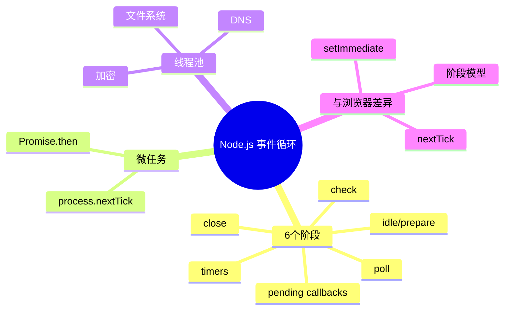
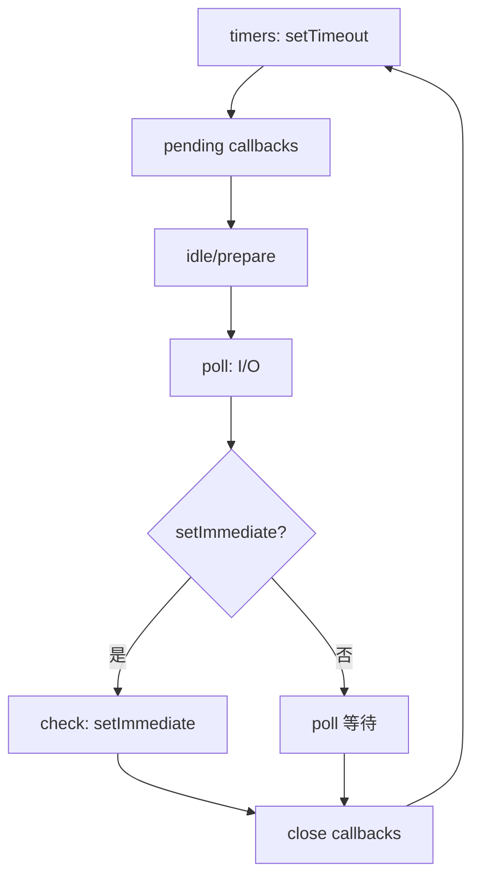

# Node.js 事件循环（Event Loop - Node.js）

> **形式化定义**：Node.js 事件循环基于 libuv 库实现，与浏览器事件循环有显著差异。Node.js 事件循环分为 6 个阶段（phases）：timers、pending callbacks、idle/prepare、poll、check、close callbacks。每个阶段维护一个 FIFO 队列，执行该阶段的回调。在阶段之间，Node.js 执行微任务队列（nextTickQueue 和 microtaskQueue）。libuv 还管理线程池（Thread Pool）处理阻塞 I/O 操作。
>
> 对齐版本：Node.js 22+ | libuv | ECMAScript 2025 (ES16)

---

## 1. 概念定义 (Concept Definition)

### 1.1 形式化定义

Node.js 事件循环的 6 个阶段：

| 阶段 | 说明 |
|------|------|
| **timers** | setTimeout/setInterval 回调 |
| **pending callbacks** | 系统操作的延迟回调 |
| **idle, prepare** | 内部使用 |
| **poll** | I/O 回调、新连接 |
| **check** | setImmediate 回调 |
| **close callbacks** | close 事件回调 |

### 1.2 概念层级图谱



---

## 2. 属性与特征 (Properties & Characteristics)

### 2.1 Node.js vs 浏览器事件循环

| 特性 | Node.js | 浏览器 |
|------|---------|--------|
| 阶段数 | 6 | 3（任务/微任务/渲染） |
| setImmediate | 有 | 无 |
| nextTick | 有（微任务前） | 无 |
| 线程池 | 有（libuv） | 无（Web Workers 分离） |
| I/O 模型 | 非阻塞 + 线程池 | 非阻塞（Web API） |

---

## 3. 关系分析 (Relationship Analysis)

### 3.1 阶段执行顺序

```
┌─────────┐    ┌─────────┐    ┌─────────┐    ┌─────────┐    ┌─────────┐    ┌─────────┐
│ timers  │───→│ pending │───→│  idle   │───→│  poll   │───→│  check  │───→│  close  │──┐
│         │    │callbacks│    │prepare  │    │         │    │         │    │callbacks│  │
└─────────┘    └─────────┘    └─────────┘    └─────────┘    └─────────┘    └─────────┘  │
     ↑─────────────────────────────────────────────────────────────────────────────────────┘
```

---

## 4. 机制解释 (Mechanism Explanation)

### 4.1 Node.js 事件循环周期



---

## 5. 论证与分析 (Argumentation & Analysis)

### 5.1 setTimeout vs setImmediate

```javascript
setTimeout(() => console.log("timeout"), 0);
setImmediate(() => console.log("immediate"));

// 输出顺序不确定！
// 如果主模块中：可能 timeout 先（取决于系统时钟精度）
// 如果 I/O 回调中：immediate 先（poll 阶段后执行 check）
```

### 5.2 process.nextTick 的优先级

```javascript
setTimeout(() => console.log("timeout"), 0);
setImmediate(() => console.log("immediate"));
Promise.resolve().then(() => console.log("promise"));
process.nextTick(() => console.log("nextTick"));

// 输出: nextTick, promise, timeout, immediate
// nextTick 优先级最高，在阶段之间执行
```

---

## 6. 实例与示例 (Examples)

### 6.1 正例：I/O 回调中的 setImmediate

```javascript
const fs = require("fs");

fs.readFile(__filename, () => {
  setTimeout(() => console.log("timeout"), 0);
  setImmediate(() => console.log("immediate"));
  // 输出: immediate, timeout
  // 因为在 poll 阶段后进入 check 阶段
});
```

### 6.2 正例：nextTick 与 queueMicrotask 的区别

```javascript
// nextTick 在微任务之前执行，可能饥饿事件循环
Promise.resolve().then(() => console.log('microtask 1'));
process.nextTick(() => {
  console.log('nextTick 1');
  process.nextTick(() => console.log('nextTick 2'));
});
Promise.resolve().then(() => console.log('microtask 2'));

// 输出: nextTick 1 → nextTick 2 → microtask 1 → microtask 2
// nextTick 队列在阶段之间完全排空后才执行其他微任务
```

### 6.3 正例：UV_THREADPOOL_SIZE 与线程池调度

```javascript
// libuv 线程池默认 4 个线程
// 可通过 UV_THREADPOOL_SIZE 环境变量调整（最大 1024）

import { readFile } from 'node:fs';

// 文件系统操作在线程池中执行
const start = Date.now();
for (let i = 0; i < 5; i++) {
  readFile(__filename, () => {
    console.log(`File ${i} done at ${Date.now() - start}ms`);
  });
}
// 前 4 个几乎同时完成，第 5 个等待线程释放
```

### 6.4 正例：事件循环延迟监控

```javascript
import { monitorEventLoopDelay } from 'node:perf_hooks';

const histogram = monitorEventLoopDelay({ resolution: 10 });
histogram.enable();

// 模拟阻塞操作
setTimeout(() => {
  const start = Date.now();
  while (Date.now() - start < 100) {} // 阻塞 100ms
}, 100);

setTimeout(() => {
  histogram.disable();
  console.log({
    min: histogram.min,
    max: histogram.max,
    mean: histogram.mean,
    stddev: histogram.stddev,
    percentiles: histogram.percentiles,
  });
}, 300);
```

### 6.5 正例：setImmediate vs setTimeout(0) 的确定性顺序

```javascript
const fs = require('fs');

// 在 I/O 回调内部，setImmediate 总是先于 setTimeout(0)
fs.readFile(__filename, () => {
  setTimeout(() => console.log('timeout'), 0);
  setImmediate(() => console.log('immediate'));
  process.nextTick(() => console.log('nextTick'));
  Promise.resolve().then(() => console.log('promise'));
});

// 输出顺序：
// nextTick
// promise
// immediate
// timeout
```

### 6.6 正例：使用 setImmediate 分解 CPU 密集型任务

```javascript
function processInChunks(items, chunkSize = 100, processItem) {
  let i = 0;

  function next() {
    const end = Math.min(i + chunkSize, items.length);
    for (; i < end; i++) {
      processItem(items[i]);
    }
    if (i < items.length) {
      setImmediate(next); // 让出事件循环，处理 I/O
    }
  }

  next();
}

// 处理 10000 个条目，每 100 个让出一次
const data = Array.from({ length: 10000 }, (_, i) => i);
processInChunks(data, 100, (n) => {
  // 处理单个条目
});
```

### 6.7 正例：Promise 微任务在 Node.js 中的排空行为

```javascript
// 验证微任务队列在单个阶段之间完全排空
let count = 0;

function scheduleMicrotasks() {
  Promise.resolve().then(() => {
    count++;
    console.log('microtask', count);
    if (count < 5) {
      Promise.resolve().then(scheduleMicrotasks); // 级联微任务
    }
  });
}

scheduleMicrotasks();
setTimeout(() => console.log('timer'), 0);

// 输出：microtask 1..5 → timer
// 所有级联微任务在 timer 之前执行
```

### 6.8 正例：EventEmitter 与事件循环的交互

```javascript
import { EventEmitter } from 'node:events';

const emitter = new EventEmitter();

// 同步发射
emitter.on('event', () => console.log('handler 1'));
emitter.on('event', () => console.log('handler 2'));
emitter.emit('event');
// 输出：handler 1 → handler 2（同步执行）

// 异步发射（nextTick）
emitter.on('async-event', () => console.log('async handler'));
process.nextTick(() => emitter.emit('async-event'));
console.log('after nextTick schedule');
// 输出：after nextTick schedule → async handler
```

---

## 7. 权威参考与国际化对齐 (References)

- **Node.js Docs: Event Loop** — <https://nodejs.org/en/docs/guides/event-loop-timers-and-nexttick/>
- **Node.js Docs: Event Loop Phases** — <https://nodejs.org/en/learn/asynchronous-work/event-loop-timers-and-nexttick>
- **libuv Design** — <https://docs.libuv.org/en/v1.x/design.html>
- **libuv API Docs** — <https://docs.libuv.org/en/v1.x/api.html>
- **Node.js: perf_hooks eventLoopDelay** — <https://nodejs.org/api/perf_hooks.html#perf_hooksmonitoreventloopdelayoptions>
- **Node.js: process.nextTick** — <https://nodejs.org/api/process.html#processnexttickcallback-args>
- **Node.js: setImmediate** — <https://nodejs.org/api/timers.html#setimmediatecallback-args>
- **MDN: Event Loop** — <https://developer.mozilla.org/en-US/docs/Web/JavaScript/Event_loop>
- **MDN: queueMicrotask** — <https://developer.mozilla.org/en-US/docs/Web/API/queueMicrotask>
- **V8 Blog: The Node.js Event Loop** — <https://v8.dev/blog/event-loop>
- **Node.js: UV_THREADPOOL_SIZE** — <https://nodejs.org/api/cli.html#uv_threadpool_sizesize>
- **libuv Thread Pool** — <https://docs.libuv.org/en/v1.x/threadpool.html>
- **Node.js: Worker Threads** — <https://nodejs.org/api/worker_threads.html>
- **Node.js: Cluster Module** — <https://nodejs.org/api/cluster.html>
- **James Snell: Node.js Event Loop** — <https://www.youtube.com/watch?v=PNa9OMajw9w>
- **Node.js Design Patterns Book** — <https://www.nodejsdesignpatterns.com/>

---

## 8. 思维表征总结 (Cognitive Representations)

### 8.1 Node.js 事件循环阶段

```
┌─────────────────────────────────────────────────────────┐
│                   Node.js 事件循环                       │
├─────────────────────────────────────────────────────────┤
│  1. timers (setTimeout/setInterval)                     │
│  2. pending callbacks (系统回调)                         │
│  3. idle, prepare (内部)                                │
│  4. poll (I/O 回调)                                     │
│     └─ 检查 setImmediate?                               │
│  5. check (setImmediate)                                │
│  6. close callbacks (close 事件)                         │
│                                                         │
│  阶段之间: process.nextTick → Promise.then              │
└─────────────────────────────────────────────────────────┘
```

---

## 9. 公理化表述与形式证明 (Axiomatization & Formal Proof)

### 9.1 公理化基础

**公理 1（阶段顺序的确定性）**：
> Node.js 事件循环的阶段按固定顺序执行，timers → pending → idle → poll → check → close。

**公理 2（nextTick 的优先性）**：
> `process.nextTick` 回调在当前操作完成后、进入下一个阶段前执行。

### 9.2 定理与证明

**定理 1（setImmediate 在 I/O 中的优先性）**：
> 在 I/O 回调中，`setImmediate` 先于 `setTimeout(0)` 执行。

*证明*：
> I/O 回调在 poll 阶段执行。poll 阶段结束后进入 check 阶段（执行 setImmediate），然后才进入 timers 阶段（执行 setTimeout）。
> ∎

---

## 10. 推理链与演绎分析 (Deductive Reasoning Chain)

### 10.1 演绎推理

```mermaid
graph TD
    A[setTimeout(fn, 0)] --> B[timers 队列]
    A2[setImmediate(fn)] --> C[check 队列]
    A3[I/O 完成] --> D[poll 阶段]
    D --> E[执行 I/O 回调]
    E --> F[进入 check 阶段]
    F --> G[执行 setImmediate]
    G --> H[进入 timers 阶段]
    H --> I[执行 setTimeout]
```

### 10.2 反事实推理

> **反设**：Node.js 使用浏览器的事件循环模型。
> **推演结果**：没有 setImmediate、没有 nextTick、I/O 回调与定时器混合调度，服务器端性能下降。
> **结论**：Node.js 的阶段模型更适合服务器端 I/O 密集型场景。

---

**参考规范**：Node.js Docs: Event Loop | libuv Design
