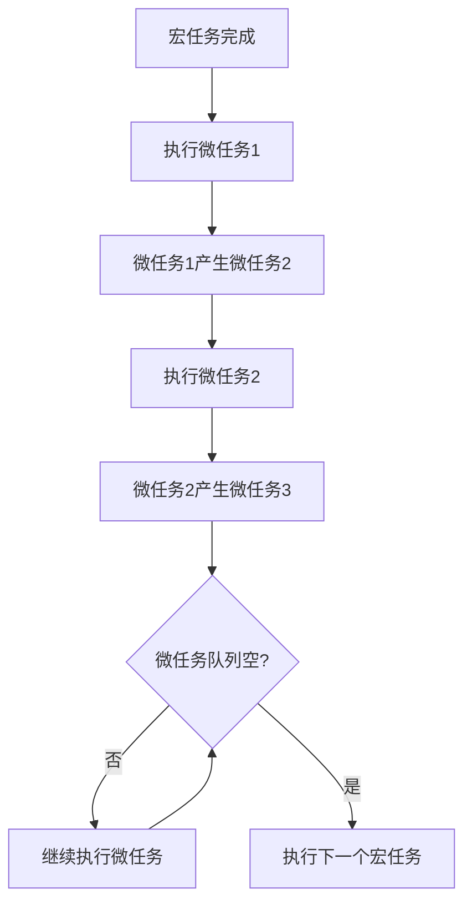

# 任务队列与微任务队列（Task & Microtask Queues）

> **形式化定义**：任务队列（Task Queue）和微任务队列（Microtask Queue）是事件循环中管理回调执行顺序的数据结构。任务队列（又称宏任务队列 Macrotask Queue）存放 setTimeout、DOM 事件、I/O 回调等；微任务队列存放 Promise.then、MutationObserver 和 queueMicrotask 回调。HTML Living Standard §8.1.4.2 定义了事件循环的队列处理算法，ECMA-262 §27.2 定义了 Promise 的调度语义。
>
> 对齐版本：HTML Living Standard §8.1.4.2 | ECMAScript 2025 (ES16) §27.2 | TypeScript 5.8–6.0

---

## 1. 概念定义 (Concept Definition)

### 1.1 形式化定义

HTML Living Standard 定义了队列处理算法：

> *"A task is a structural unit of work."*

队列的形式化表示：

```
EventLoop = (TaskQueues[], MicrotaskQueue, RenderingQueue)
ProcessingAlgorithm:
  1. 从 TaskQueues 中选择一个非空队列
  2. 取出该队列最老的任务并执行
  3. 执行 MicrotaskQueue 中所有任务
  4. 可选：执行 RenderingQueue
  5. 重复步骤 1
```

### 1.2 概念层级图谱

```mermaid
mindmap
  root((任务队列))
    宏任务 Macro
      setTimeout/setInterval
      DOM 事件
      I/O 回调
      XMLHttpRequest
    微任务 Micro
      Promise.then/catch
      queueMicrotask
      MutationObserver
    渲染任务
      requestAnimationFrame
      IntersectionObserver
    执行顺序
      宏任务 → 微任务(全部) → 渲染
```

---

## 2. 属性与特征 (Properties & Characteristics)

### 2.1 队列属性矩阵

| 特性 | 宏任务 | 微任务 | 渲染任务 |
|------|--------|--------|---------|
| 来源 | setTimeout、事件、I/O | Promise、queueMicrotask | rAF、Observer |
| 执行时机 | 每个事件循环周期一次 | 每个宏任务后全部 | 每帧一次 |
| 优先级 | 低 | 高 | 中 |
| 可产生新任务 | 是（放入队列末尾） | 是（当前周期执行） | 否 |

---

## 3. 关系分析 (Relationship Analysis)

### 3.1 队列间的执行顺序

```javascript
console.log("script start");

setTimeout(() => console.log("timeout 1"), 0);
setTimeout(() => console.log("timeout 2"), 0);

Promise.resolve().then(() => {
  console.log("promise 1");
  Promise.resolve().then(() => console.log("promise 2"));
});

queueMicrotask(() => console.log("microtask 1"));

console.log("script end");

// 输出:
// script start
// script end
// promise 1
// microtask 1
// promise 2
// timeout 1
// timeout 2
```

---

## 4. 机制解释 (Mechanism Explanation)

### 4.1 微任务的级联执行



---

## 5. 论证与分析 (Argumentation & Analysis)

### 5.1 微任务饿死问题

```javascript
// ❌ 微任务饿死宏任务
function loop() {
  Promise.resolve().then(loop);
}
loop();
// 宏任务（setTimeout、事件）永远无法执行！

// ✅ 使用 setTimeout 让出主线程
function loop2() {
  setTimeout(loop2, 0);
}
loop2();
```

---

## 6. 实例与示例 (Examples)

### 6.1 正例：Promise 链的调度

```javascript
Promise.resolve()
  .then(() => console.log("then 1"))
  .then(() => console.log("then 2"));

// 两个 then 回调都在同一个微任务周期执行
```

### 6.2 正例：queueMicrotask 的使用

```javascript
// ✅ 在当前任务后立即执行
function saveData(data) {
  // 同步验证
  validate(data);

  // 异步保存（但比 setTimeout 更快）
  queueMicrotask(() => {
    database.write(data);
  });
}
```

---

## 7. 权威参考与国际化对齐 (References)

- **HTML Living Standard §8.1.4.2** — Event loops
- **ECMA-262 §27.2** — Promise Jobs
- **MDN: Microtasks** — <https://developer.mozilla.org/en-US/docs/Web/API/HTML_DOM_API/Microtask_guide>

---

## 8. 思维表征总结 (Cognitive Representations)

### 8.1 队列优先级

```
优先级：微任务 > 渲染 > 宏任务

同一事件循环周期内：
  1. 一个宏任务
  2. 所有微任务（包括级联产生的）
  3. 渲染（如果需要）
  4. 下一个宏任务
```

---

## 9. 公理化表述与形式证明 (Axiomatization & Formal Proof)

### 9.1 公理化基础

**公理 1（微任务的饥饿性）**：
> 若微任务队列无限产生新微任务，宏任务队列将被饿死。

**公理 2（宏任务的公平性）**：
> 每个事件循环周期最多执行一个宏任务，确保各任务源公平调度。

### 9.2 定理与证明

**定理 1（Promise.then 的时序保证）**：
> `Promise.resolve().then(f)` 中的 `f` 在当前调用栈清空后执行。

*证明*：
> `then` 将回调放入微任务队列。微任务在当前宏任务完成后、下一个宏任务前执行。
> ∎

---

## 10. 推理链与演绎分析 (Deductive Reasoning Chain)

### 10.1 演绎推理

```mermaid
graph TD
    A[setTimeout(fn, 0)] --> B[fn 进入宏任务队列]
    B --> C[当前宏任务完成]
    C --> D[执行所有微任务]
    D --> E[从宏任务队列取出 fn]
    E --> F[执行 fn]
```

### 10.2 反事实推理

> **反设**：没有微任务队列，所有异步回调都是宏任务。
> **推演结果**：Promise 回调将与 setTimeout 同等优先级，延迟增加，性能下降。
> **结论**：微任务队列为高优先级异步操作提供了低延迟执行机制。

---

**参考规范**：HTML Living Standard §8.1.4.2 | ECMA-262 §27.2 | MDN: Microtasks

---

## 11. 更多队列调度实例 (Advanced Examples)

### 11.1 正例：`MutationObserver` 作为微任务

```javascript
// MutationObserver 回调使用微任务队列调度
const observer = new MutationObserver(() => {
  console.log('MutationObserver microtask');
});

observer.observe(document.body, { childList: true });
document.body.appendChild(document.createElement('div'));

Promise.resolve().then(() => console.log('Promise microtask'));
// 输出:
// Promise microtask
// MutationObserver microtask
// （两者在同一微任务周期，顺序取决于注册时机）
```

### 11.2 正例：`scheduler.postTask`（优先级任务调度）

```javascript
// scheduler.postTask 允许显式指定任务优先级
// https://developer.mozilla.org/en-US/docs/Web/API/Scheduler/postTask

// 'user-blocking' > 'user-visible' > 'background'
scheduler.postTask(() => console.log('background'), { priority: 'background' });
scheduler.postTask(() => console.log('user-visible'), { priority: 'user-visible' });
scheduler.postTask(() => console.log('user-blocking'), { priority: 'user-blocking' });

// 输出:
// user-blocking
// user-visible
// background
```

### 11.3 正例：async/await 的微任务调度细节

```javascript
// async 函数体在 await 之前的代码同步执行
// await 之后的代码作为微任务调度

async function demo() {
  console.log('A');
  await Promise.resolve();
  console.log('B');
  await Promise.resolve();
  console.log('C');
}

demo();
console.log('D');
Promise.resolve().then(() => console.log('E'));

// 输出:
// A
// D
// B
// E
// C
// （每个 await 将其后续代码转换为独立的微任务）
```

### 11.4 正例：Node.js `process.nextTick` 与微任务队列

```javascript
// Node.js 中 process.nextTick 优先级高于 Promise 微任务
// 注意：nextTick 技术上不属于 ECMAScript 规范，而是 Node.js 实现

Promise.resolve().then(() => console.log('Promise'));
process.nextTick(() => console.log('nextTick'));
queueMicrotask(() => console.log('queueMicrotask'));

// Node.js 输出:
// nextTick
// queueMicrotask
// Promise

// 浏览器（无 nextTick）:
// queueMicrotask
// Promise
```

### 11.5 正例：复杂时序谜题解析

```javascript
console.log('1');

setTimeout(() => console.log('2'), 0);

new Promise(resolve => {
  console.log('3');
  resolve();
  console.log('4');
}).then(() => {
  console.log('5');
  queueMicrotask(() => console.log('6'));
});

console.log('7');

// 解析：
// 同步: 1, 3, 4, 7
// 微任务（Promise then）: 5
// 微任务（queueMicrotask）: 6
// 宏任务（setTimeout）: 2
// 最终输出: 1, 3, 4, 7, 5, 6, 2
```

---

## 12. 权威参考与国际化对齐 (References)

- **HTML Living Standard §8.1.4.2** — Event loops: <https://html.spec.whatwg.org/multipage/webappapis.html#event-loops>
- **ECMA-262 §27.2** — Promise Jobs: <https://tc39.es/ecma262/#sec-promise-jobs>
- **ECMA-262 §9.5** — Jobs and Job Queues: <https://tc39.es/ecma262/#sec-jobs-and-job-queues>
- **MDN: Microtasks** — <https://developer.mozilla.org/en-US/docs/Web/API/HTML_DOM_API/Microtask_guide>
- **MDN: queueMicrotask** — <https://developer.mozilla.org/en-US/docs/Web/API/queueMicrotask>
- **MDN: MutationObserver** — <https://developer.mozilla.org/en-US/docs/Web/API/MutationObserver>
- **MDN: scheduler.postTask** — <https://developer.mozilla.org/en-US/docs/Web/API/Scheduler/postTask>
- **Node.js: process.nextTick** — <https://nodejs.org/api/process.html#processnexttickcallback-args>
- **Node.js: queueMicrotask** — <https://nodejs.org/api/globals.html#queuemicrotaskcallback>
- **WICG: Prioritized Task Scheduling** — <https://github.com/WICG/scheduling-apis>
- **Jake Archibald: Tasks, microtasks, queues and schedules** — <https://jakearchibald.com/2015/tasks-microtasks-queues-and-schedules/>

---

**参考规范**：HTML Living Standard §8.1.4.2 | ECMA-262 §27.2 | MDN | Node.js Docs
