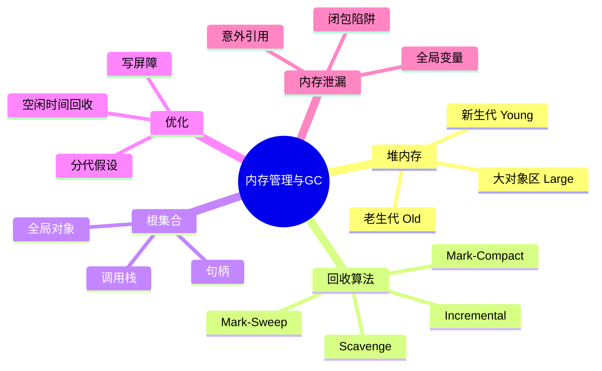
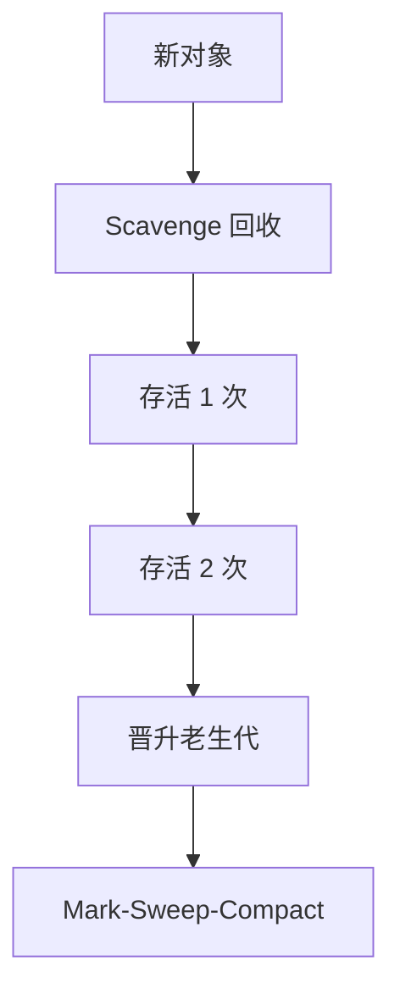
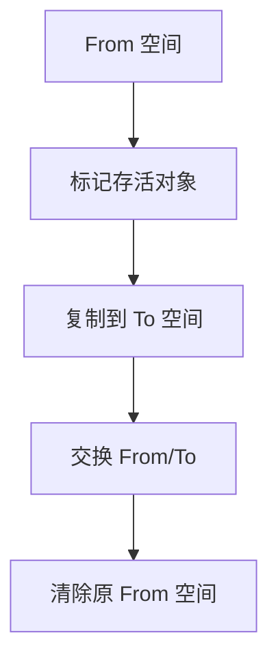
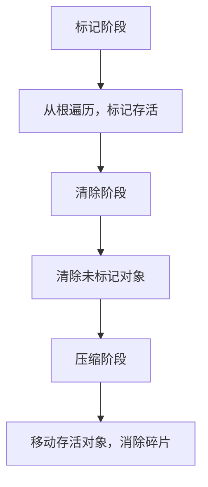
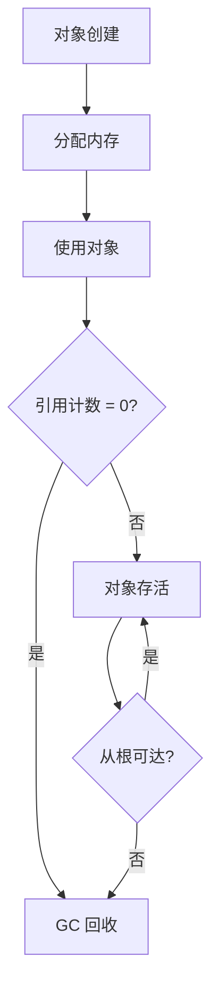

# 内存管理与垃圾回收（Memory Management & GC）

> **形式化定义**：垃圾回收（Garbage Collection, GC）是 JavaScript 引擎自动管理内存的机制，通过**可达性分析（Reachability Analysis）**识别不再使用的对象并释放其内存。ECMA-262 不要求特定 GC 算法，但现代引擎（V8、SpiderMonkey、JavaScriptCore）普遍采用**分代垃圾回收（Generational GC）**策略，将堆内存分为新生代（Young Generation）和老生代（Old Generation），分别使用不同的回收算法。
>
> 对齐版本：ECMAScript 2025 (ES16) | V8 12.4+ | TypeScript 5.8–6.0

---

## 1. 概念定义 (Concept Definition)

### 1.1 形式化定义

垃圾回收的基本假设：**可达性（Reachability）**

> 从根对象（Root Set：全局对象、调用栈上的局部变量等）出发，通过引用链可达的对象是存活的；不可达的对象可被回收。

```
Root Set = { globalObject, stackVariables, ... }
Reachable = { o | ∃ path from Root Set to o }
Garbage = AllObjects - Reachable
```

### 1.2 概念层级图谱



---

## 2. 属性与特征 (Properties & Characteristics)

### 2.1 V8 堆内存布局

| 区域 | 大小 | 算法 | 特点 |
|------|------|------|------|
| 新生代 | 1-8 MB | Scavenge | 快速回收，复制算法 |
| 老生代 | 动态扩展 | Mark-Sweep-Compact | 完整回收，较慢 |
| 大对象区 | 动态 | 直接分配 | > 一定阈值的对象 |

---

## 3. 关系分析 (Relationship Analysis)

### 3.1 分代假设



---

## 4. 机制解释 (Mechanism Explanation)

### 4.1 Scavenge 算法



### 4.2 Mark-Sweep-Compact



---

## 5. 论证与分析 (Argumentation & Analysis)

### 5.1 内存泄漏常见原因

| 原因 | 示例 | 解决方案 |
|------|------|---------|
| 意外全局变量 | `function() { x = 1; }` | 使用 strict mode |
| 闭包引用 | 事件监听器持有 DOM | 及时移除监听 |
| 定时器未清理 | setInterval 未 clear | clearInterval |
| 缓存无上限 | Map 无限增长 | LRU 策略 |
| 脱离 DOM 引用 | 移除 DOM 但 JS 引用 | 解除引用 |

---

## 6. 实例与示例 (Examples)

### 6.1 正例：WeakMap 避免泄漏

```javascript
// ✅ WeakMap 不阻止垃圾回收
const cache = new WeakMap();

function process(obj) {
  if (!cache.has(obj)) {
    cache.set(obj, heavyComputation(obj));
  }
  return cache.get(obj);
}

// 当 obj 不再被引用时，WeakMap 中的条目自动释放
```

### 6.2 反例：内存泄漏

```javascript
// ❌ 闭包导致泄漏
const listeners = [];

function addListener() {
  const bigData = new Array(1000000).fill("x");

  const handler = () => {
    console.log(bigData); // bigData 被闭包引用
  };

  listeners.push(handler);
  // 即使 handler 不再使用，bigData 无法释放
}
```

### 6.3 WeakRef 与 FinalizationRegistry（ES2021）

```javascript
// ✅ WeakRef：不阻止垃圾回收的弱引用
class ExpensiveResource {
  constructor(id) { this.id = id; this.data = new Array(1e6).fill(id); }
}

const registry = new FinalizationRegistry((heldValue) => {
  console.log(`Resource ${heldValue} has been garbage collected`);
});

function createTrackedResource(id) {
  const res = new ExpensiveResource(id);
  const ref = new WeakRef(res);
  registry.register(res, id); // 当 res 被回收时，回调触发
  return ref;
}

const ref = createTrackedResource(42);
// ... 稍后检查对象是否仍然存活
const obj = ref.deref();
if (obj) {
  console.log(obj.id); // 对象仍存活
} else {
  console.log('Object was collected'); // 对象已被回收
}
```

### 6.4 运行时内存监控 API

```javascript
// Chrome 中通过 performance.memory 获取堆内存快照（非标准但广泛支持）
if (performance.memory) {
  console.log({
    usedJSHeapSize: (performance.memory.usedJSHeapSize / 1048576).toFixed(2) + ' MB',
    totalJSHeapSize: (performance.memory.totalJSHeapSize / 1048576).toFixed(2) + ' MB',
    jsHeapSizeLimit: (performance.memory.jsHeapSizeLimit / 1048576).toFixed(2) + ' MB',
  });
}

// Node.js 进程内存使用
import process from 'node:process';
const usage = process.memoryUsage();
console.log({
  rss: `${(usage.rss / 1048576).toFixed(2)} MB`,       // 常驻集大小
  heapTotal: `${(usage.heapTotal / 1048576).toFixed(2)} MB`, // V8 总堆内存
  heapUsed: `${(usage.heapUsed / 1048576).toFixed(2)} MB`,   // V8 已用堆内存
  external: `${(usage.external / 1048576).toFixed(2)} MB`,   // C++ 对象内存
});

// Node.js 堆快照（用于 DevTools 分析）
import v8 from 'node:v8';
// v8.writeHeapSnapshot('./heap.heapsnapshot');
```

### 6.5 使用 FinalizationRegistry 实现对象池

```javascript
// 结合 WeakRef 与 FinalizationRegistry 实现自适应对象池
class ObjectPool {
  #factory;
  #reset;
  #pool = [];
  #active = new Map(); // id -> WeakRef
  #registry = new FinalizationRegistry((id) => {
    this.#active.delete(id);
    console.log(`Object ${id} collected; pool size ${this.#pool.length}`);
  });
  #id = 0;

  constructor(factory, resetFn) {
    this.#factory = factory;
    this.#reset = resetFn;
  }

  acquire() {
    const obj = this.#pool.pop() ?? this.#factory();
    const id = ++this.#id;
    this.#active.set(id, new WeakRef(obj));
    this.#registry.register(obj, id);
    return obj;
  }

  release(obj) {
    this.#reset(obj);
    this.#pool.push(obj);
  }
}

// 使用示例
const bufferPool = new ObjectPool(
  () => new Uint8Array(4096),
  (buf) => buf.fill(0)
);
```

---

## 7. 权威参考与国际化对齐 (References)

- **V8 Blog: Trash talk** — <https://v8.dev/blog/trash-talk>
- **MDN: Memory Management** — <https://developer.mozilla.org/en-US/docs/Web/JavaScript/Memory_management>
- **V8 Blog: Orinoco — Generational GC** — <https://v8.dev/blog/orinoco>
- **V8 Blog: Oilpan — C++ GC for Blink** — <https://v8.dev/blog/oilpan-library>
- **Chrome DevTools: Memory Profiling** — <https://developer.chrome.com/docs/devtools/memory>
- **Node.js: Memory Usage** — <https://nodejs.org/api/process.html#processmemoryusage>
- **Node.js: V8 Heap Snapshot** — <https://nodejs.org/api/v8.html#v8writeheapsnapshotfilename>
- **ECMA-262 §9.10** — Garbage Collection (Clear Kept Objects) — <https://tc39.es/ecma262/#sec-clear-kept-objects>
- **MDN: WeakRef** — <https://developer.mozilla.org/en-US/docs/Web/JavaScript/Reference/Global_Objects/WeakRef>
- **MDN: FinalizationRegistry** — <https://developer.mozilla.org/en-US/docs/Web/JavaScript/Reference/Global_Objects/FinalizationRegistry>
- **V8 Design: Memory Layout** — <https://v8.dev/docs/memory-layout>
- **WebKit Blog: JSC GC** — <https://webkit.org/blog/12967/understanding-gc-in-jsc-from-scratch/>
- **SpiderMonkey: GC Internals** — <https://firefox-source-docs.mozilla.org/js/gc/index.html>
- **Node.js: --max-old-space-size** CLI Flag — <https://nodejs.org/api/cli.html#--max-old-space-sizesize-in-megabytes>

---

## 8. 思维表征总结 (Cognitive Representations)

### 8.1 GC 算法选择

| 场景 | 算法 | 原因 |
|------|------|------|
| 新生代 | Scavenge | 大部分对象快速死亡 |
| 老生代 | Mark-Compact | 对象存活率高，需碎片整理 |
| 大对象 | 直接分配 | 避免复制开销 |

---

## 9. 公理化表述与形式证明 (Axiomatization & Formal Proof)

### 9.1 公理化基础

**公理 1（可达性即存活）**：
> 从根集合可达的对象必须保留；不可达的对象可被回收。

**公理 2（分代假设）**：
> 大部分新创建的对象很快死亡；存活越久的对象越可能继续存活。

### 9.2 定理与证明

**定理 1（闭包的内存保持）**：
> 闭包引用的外部变量在闭包存活期间不会被回收。

*证明*：
> 闭包函数对象的 `[[Environment]]` 指向外部词法环境。该环境被闭包引用，因此环境内的绑定在闭包存活期间保持可达。
> ∎

---

## 10. 推理链与演绎分析 (Deductive Reasoning Chain)

### 10.1 演绎推理



### 10.2 反事实推理

> **反设**：JavaScript 没有垃圾回收，需要手动管理内存。
> **推演结果**：内存泄漏和悬空指针成为常见问题，开发效率大幅下降，安全性降低。
> **结论**：自动垃圾回收是 JavaScript 等高级语言的必要特性，使开发者专注于业务逻辑。

---

## 11. 性能与最佳实践

### 11.1 性能考量

| 操作 | 时间复杂度 | 空间复杂度 | 优化建议 |
|------|-----------|-----------|---------|
| 函数调用 | O(1) | O(1) | 避免深层递归 |
| 属性访问 | O(1) 平均 | O(1) | 使用局部变量缓存 |
| 闭包创建 | O(1) | O(环境大小) | 只引用需要的变量 |
| 事件监听 | O(1) | O(1) | 及时移除不需要的监听 |
| Promise 创建 | O(1) | O(1) | 避免不必要的包装 |

### 11.2 最佳实践总结

```javascript
// ✅ 避免深层递归，使用迭代
function factorial(n) {
  let result = 1;
  for (let i = 2; i <= n; i++) result *= i;
  return result;
}

// ✅ 缓存频繁访问的属性
function process(obj) {
  const data = obj.data; // 缓存
  for (let i = 0; i < 1000; i++) {
    use(data[i]);
  }
}

// ✅ 及时移除事件监听
const handler = () => { /* ... */ };
element.addEventListener("click", handler);
// ...
element.removeEventListener("click", handler);

// ✅ 使用 WeakMap 避免内存泄漏
const cache = new WeakMap();
function compute(obj) {
  if (!cache.has(obj)) {
    cache.set(obj, heavyCompute(obj));
  }
  return cache.get(obj);
}

// ✅ Node.js 中限制堆内存（容器环境常用）
// node --max-old-space-size=4096 app.js
// 或在 package.json 的 scripts 中设置 NODE_OPTIONS
// "start": "NODE_OPTIONS='--max-old-space-size=2048' node app.js"
```

---

## 12. 调试工具链

| 工具 | 用途 | 场景 |
|------|------|------|
| Chrome DevTools Performance | 性能分析 | 长任务、渲染阻塞 |
| Chrome DevTools Memory | 内存分析 | 内存泄漏检测 |
| Node.js --prof | CPU 分析 | 热点函数识别 |
| Node.js --heapsnapshot | 堆快照 | 内存占用分析 |
| Clinic.js Doctor | 诊断 Node.js 性能 | 内存与事件循环诊断 |

---

## 13. 权威参考完整索引

| 来源 | 链接 | 相关章节 |
|------|------|---------|
| ECMA-262 | tc39.es/ecma262 | §8.1, §9, §10, §27 |
| HTML Living Standard | html.spec.whatwg.org | §8.1.4.2 |
| V8 Blog | v8.dev/blog | Ignition, TurboFan, GC |
| Node.js Docs | nodejs.org | Event Loop, libuv |
| MDN | developer.mozilla.org | Execution context, Event loop |

---

**参考规范**：ECMA-262 §8-10 | HTML Living Standard | V8 Blog | Node.js Docs
