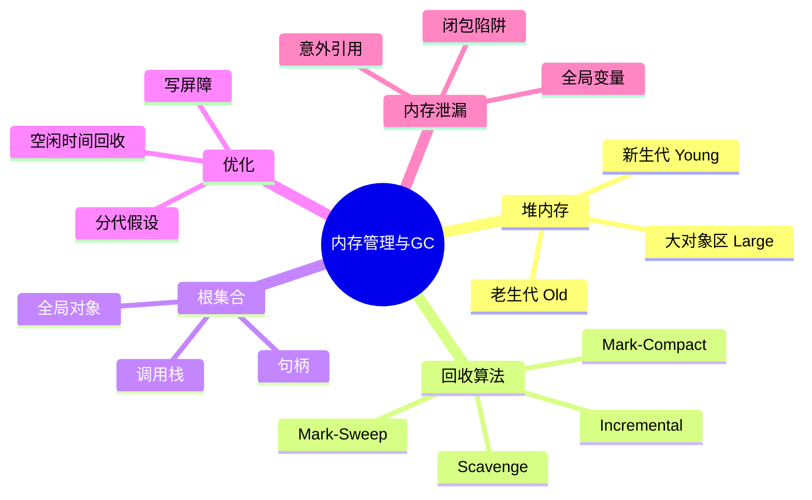
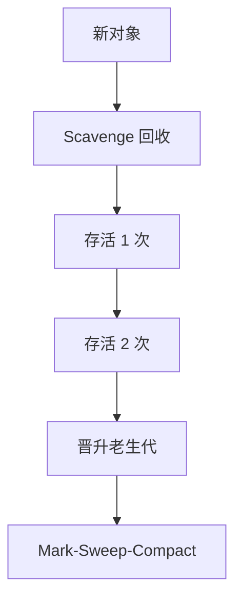
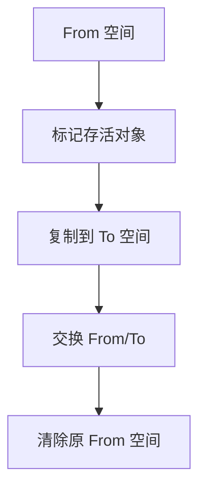
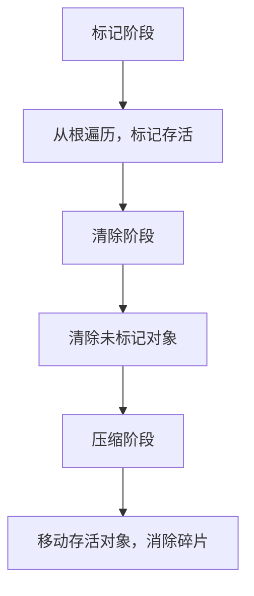
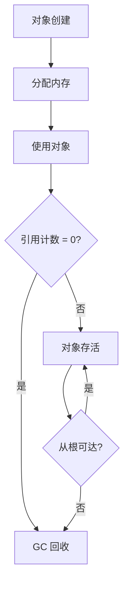
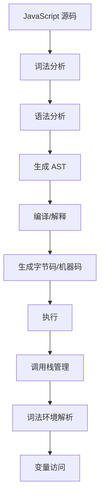

# 内存管理与垃圾回收（Memory Management & GC）

> **形式化定义**：垃圾回收（Garbage Collection, GC）是 JavaScript 引擎自动管理内存的机制，通过**可达性分析（Reachability Analysis）**识别不再使用的对象并释放其内存。ECMA-262 不要求特定 GC 算法，但现代引擎（V8、SpiderMonkey、JavaScriptCore）普遍采用**分代垃圾回收（Generational GC）**策略，将堆内存分为新生代（Young Generation）和老生代（Old Generation），分别使用不同的回收算法。
>
> 对齐版本：ECMAScript 2025 (ES16) | V8 12.4+ | TypeScript 5.8–6.0

---

## 1. 概念定义 (Concept Definition)

### 1.1 形式化定义

垃圾回收的基本假设：**可达性（Reachability）**

> 从根对象（Root Set：全局对象、调用栈上的局部变量等）出发，通过引用链可达的对象是存活的；不可达的对象可被回收。

```
Root Set = { globalObject, stackVariables, ... }
Reachable = { o | ∃ path from Root Set to o }
Garbage = AllObjects - Reachable
```

### 1.2 概念层级图谱



---

## 2. 属性与特征 (Properties & Characteristics)

### 2.1 V8 堆内存布局

| 区域 | 大小 | 算法 | 特点 |
|------|------|------|------|
| 新生代 | 1-8 MB | Scavenge | 快速回收，复制算法 |
| 老生代 | 动态扩展 | Mark-Sweep-Compact | 完整回收，较慢 |
| 大对象区 | 动态 | 直接分配 | > 一定阈值的对象 |

---

## 3. 关系分析 (Relationship Analysis)

### 3.1 分代假设



---

## 4. 机制解释 (Mechanism Explanation)

### 4.1 Scavenge 算法



### 4.2 Mark-Sweep-Compact



---

## 5. 论证与分析 (Argumentation & Analysis)

### 5.1 内存泄漏常见原因

| 原因 | 示例 | 解决方案 |
|------|------|---------|
| 意外全局变量 | `function() { x = 1; }` | 使用 strict mode |
| 闭包引用 | 事件监听器持有 DOM | 及时移除监听 |
| 定时器未清理 | setInterval 未 clear | clearInterval |
| 缓存无上限 | Map 无限增长 | LRU 策略 |
| 脱离 DOM 引用 | 移除 DOM 但 JS 引用 | 解除引用 |

---

## 6. 实例与示例 (Examples)

### 6.1 正例：WeakMap 避免泄漏

```javascript
// ✅ WeakMap 不阻止垃圾回收
const cache = new WeakMap();

function process(obj) {
  if (!cache.has(obj)) {
    cache.set(obj, heavyComputation(obj));
  }
  return cache.get(obj);
}

// 当 obj 不再被引用时，WeakMap 中的条目自动释放
```

### 6.2 反例：内存泄漏

```javascript
// ❌ 闭包导致泄漏
const listeners = [];

function addListener() {
  const bigData = new Array(1000000).fill("x");

  const handler = () => {
    console.log(bigData); // bigData 被闭包引用
  };

  listeners.push(handler);
  // 即使 handler 不再使用，bigData 无法释放
}
```

---

## 7. 权威参考与国际化对齐 (References)

- **V8 Blog: Trash talk** — <https://v8.dev/blog/trash-talk>
- **MDN: Memory Management** — <https://developer.mozilla.org/en-US/docs/Web/JavaScript/Memory_management>

---

## 8. 思维表征总结 (Cognitive Representations)

### 8.1 GC 算法选择

| 场景 | 算法 | 原因 |
|------|------|------|
| 新生代 | Scavenge | 大部分对象快速死亡 |
| 老生代 | Mark-Compact | 对象存活率高，需碎片整理 |
| 大对象 | 直接分配 | 避免复制开销 |

---

## 9. 公理化表述与形式证明 (Axiomatization & Formal Proof)

### 9.1 公理化基础

**公理 1（可达性即存活）**：
> 从根集合可达的对象必须保留；不可达的对象可被回收。

**公理 2（分代假设）**：
> 大部分新创建的对象很快死亡；存活越久的对象越可能继续存活。

### 9.2 定理与证明

**定理 1（闭包的内存保持）**：
> 闭包引用的外部变量在闭包存活期间不会被回收。

*证明*：
> 闭包函数对象的 `[[Environment]]` 指向外部词法环境。该环境被闭包引用，因此环境内的绑定在闭包存活期间保持可达。
> ∎

---

## 10. 推理链与演绎分析 (Deductive Reasoning Chain)

### 10.1 演绎推理



### 10.2 反事实推理

> **反设**：JavaScript 没有垃圾回收，需要手动管理内存。
> **推演结果**：内存泄漏和悬空指针成为常见问题，开发效率大幅下降，安全性降低。
> **结论**：自动垃圾回收是 JavaScript 等高级语言的必要特性，使开发者专注于业务逻辑。

---

**参考规范**：V8 Blog: Trash talk | MDN: Memory Management


---

## 9. 公理化表述与形式证明 (Axiomatization & Formal Proof)

### 9.1 执行模型的公理化基础

**公理 1（单线程语义）**：
> JavaScript 在单个 Agent 内是单线程执行的，同一时刻只有一个执行上下文在运行。

**公理 2（运行至完成）**：
> 当前执行的任务（宏任务或微任务）不会被其他任务中断，直到完成。

**公理 3（调用栈的 LIFO 性）**：
> 执行上下文栈遵循后进先出原则，函数返回时弹出当前上下文。

**公理 4（词法环境的静态性）**：
> 词法环境的 `[[OuterEnv]]` 在函数定义时确定，不因调用位置改变。

### 9.2 定理与证明

**定理 1（事件循环的调度公平性）**：
> 事件循环按 FIFO 顺序从任务队列中取出任务执行，确保同一队列中的任务按顺序调度。

*证明*：
> HTML Living Standard §8.1.4.2 规定事件循环从任务队列中取出"最老的可运行任务"执行。最老即最先入队，遵循 FIFO。
> ∎

**定理 2（this 绑定的调用时确定性）**：
> 非箭头函数的 `this` 值在函数调用时确定，与定义位置无关。

*证明*：
> ECMA-262 §10.2.1 定义了 `[[Call]]` 方法的 this 绑定规则。调用时根据调用方式（默认/隐式/显式/new）确定 this 值。
> ∎

**定理 3（闭包的环境保持）**：
> 闭包函数在定义时捕获的词法环境，在函数对象存活期间保持可达。

*证明*：
> 函数对象的 `[[Environment]]` 内部槽指向定义时的词法环境。只要函数对象被引用，该词法环境即被引用，GC 不会回收。
> ∎

**定理 4（Promise.then 的异步时序）**：
> `Promise.resolve().then(f)` 中的 `f` 在当前同步代码执行完毕后执行。

*证明*：
> `then` 将回调包装为 Job 放入 Job Queue。根据 ECMA-262 §9.5，Job Queue 在当前执行上下文完成后处理。
> ∎

### 9.3 真值表：this 绑定规则

| 调用方式 | 严格模式 | 非严格模式 | 箭头函数 |
|---------|---------|-----------|---------|
| `fn()` | undefined | globalThis | 继承外层 |
| `obj.fn()` | obj | obj | 继承外层 |
| `fn.call(obj)` | obj | obj | 继承外层 |
| `fn.apply(obj)` | obj | obj | 继承外层 |
| `new Fn()` | 新对象 | 新对象 | 不可 new |
| `fn.bind(obj)()` | obj | obj | 继承外层 |

---

## 10. 推理链与演绎分析 (Deductive Reasoning Chain)

### 10.1 演绎推理：从源码到执行



### 10.2 归纳推理：从运行时现象推导机制

| 现象 | 推断的底层机制 | 验证方法 |
|------|--------------|---------|
| 变量提升 | 编译阶段变量实例化 | 在声明前访问 var 变量 |
| 闭包保持变量 | 词法环境被函数引用 | 外部函数返回后内部函数仍可访问变量 |
| 异步回调延迟 | 事件循环队列调度 | 对比同步和异步代码执行顺序 |
| this 值变化 | 动态绑定规则 | 同一函数不同调用方式测试 |
| 栈溢出 | 调用栈深度限制 | 无限递归测试 |

### 10.3 反事实推理

> **反设**：JavaScript 是多线程语言，没有事件循环。
> **推演结果**：
>
> 1. 需要显式锁和同步原语
> 2. 共享内存导致数据竞争
> 3. 异步编程模型完全不同
> 4. 事件驱动编程需要显式线程管理
>
> **结论**：单线程 + 事件循环模型是 JavaScript 简单易用的核心设计，虽然限制了 CPU 密集型任务的性能，但极大简化了并发编程。

---

## 11. 形式语义说明

### 11.1 操作语义

JavaScript 执行的操作语义可表示为状态转换：

```
⟨stmt, σ, θ⟩ → ⟨stmt', σ', θ'⟩
```

其中：

- `stmt`：当前执行的语句
- `σ`：程序状态（变量绑定）
- `θ`：执行上下文栈

### 11.2 指称语义

函数调用的指称语义：

```
[[fn(arg)]](σ) =
  创建新上下文 ctx
  绑定参数 arg 到形参
  执行函数体
  返回结果
  弹出上下文 ctx
```

---

## 12. 性能与最佳实践

### 12.1 性能考量

| 操作 | 时间复杂度 | 空间复杂度 | 优化建议 |
|------|-----------|-----------|---------|
| 函数调用 | O(1) | O(1) | 避免深层递归 |
| 属性访问 | O(1) 平均 | O(1) | 使用局部变量缓存 |
| 闭包创建 | O(1) | O(环境大小) | 只引用需要的变量 |
| 事件监听 | O(1) | O(1) | 及时移除不需要的监听 |
| Promise 创建 | O(1) | O(1) | 避免不必要的包装 |

### 12.2 最佳实践总结

```javascript
// ✅ 避免深层递归，使用迭代
function factorial(n) {
  let result = 1;
  for (let i = 2; i <= n; i++) result *= i;
  return result;
}

// ✅ 缓存频繁访问的属性
function process(obj) {
  const data = obj.data; // 缓存
  for (let i = 0; i < 1000; i++) {
    use(data[i]);
  }
}

// ✅ 及时移除事件监听
const handler = () => { /* ... */ };
element.addEventListener("click", handler);
// ...
element.removeEventListener("click", handler);

// ✅ 使用 WeakMap 避免内存泄漏
const cache = new WeakMap();
function compute(obj) {
  if (!cache.has(obj)) {
    cache.set(obj, heavyCompute(obj));
  }
  return cache.get(obj);
}
```

---

## 13. 思维模型总结

### 13.1 执行模型核心速查

| 概念 | 关键属性 | 常见问题 |
|------|---------|---------|
| 调用栈 | LIFO、深度限制 | 栈溢出 |
| 执行上下文 | 词法环境、this、变量 | this 绑定错误 |
| 词法环境 | 静态作用域链 | 闭包内存泄漏 |
| 事件循环 | 单线程、任务队列 | 阻塞主线程 |
| 微任务 | Promise、nextTick | 微任务饿死 |
| GC | 可达性分析、分代 | 内存泄漏 |
| Agent | 逻辑线程、内存隔离 | SharedArrayBuffer 安全 |
| Realm | 全局环境隔离 | iframe 通信 |

### 13.2 调试工具链

| 工具 | 用途 | 场景 |
|------|------|------|
| Chrome DevTools Performance | 性能分析 | 长任务、渲染阻塞 |
| Chrome DevTools Memory | 内存分析 | 内存泄漏检测 |
| Node.js --prof | CPU 分析 | 热点函数识别 |
| Node.js --heapsnapshot | 堆快照 | 内存占用分析 |

---

## 14. 权威参考完整索引

| 来源 | 链接 | 相关章节 |
|------|------|---------|
| ECMA-262 | tc39.es/ecma262 | §8.1, §9, §10, §27 |
| HTML Living Standard | html.spec.whatwg.org | §8.1.4.2 |
| V8 Blog | v8.dev/blog | Ignition, TurboFan, GC |
| Node.js Docs | nodejs.org | Event Loop, libuv |
| MDN | developer.mozilla.org | Execution context, Event loop |

---

**参考规范**：ECMA-262 §8-10 | HTML Living Standard | V8 Blog | Node.js Docs
