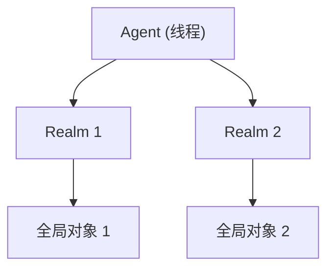
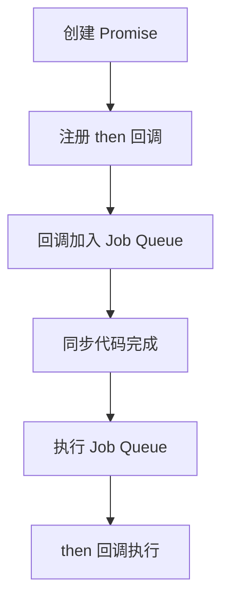
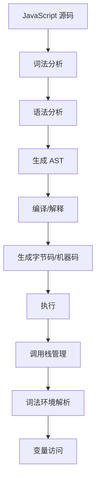

# Agent、Realm 与 Job 队列（Agent, Realm & Job Queue）

> **形式化定义**：Agent、Realm 和 Job Queue 是 ECMAScript 规范中处理并发和隔离的核心抽象。Agent 代表一个**逻辑线程**，拥有自己的事件循环和内存；Realm 是**全局环境**的容器，包含全局对象和内置对象；Job Queue 是**微任务队列**的规范抽象，用于调度 Promise 回调和清理操作。ECMA-262 §9.7 定义了 Agent，§9.3 定义了 Realm，§9.5 定义了 Job。
>
> 对齐版本：ECMAScript 2025 (ES16) §9.3, §9.5, §9.7 | TypeScript 5.8–6.0

---

## 1. 概念定义 (Concept Definition)

### 1.1 形式化定义

ECMA-262 定义了三个核心概念：

**Realm** (§9.3):
> *"A realm consists of a set of intrinsic objects, an ECMAScript global environment, and other associated state."*

**Agent** (§9.7):
> *"An agent is a set of ECMAScript execution contexts, an execution context stack, a running execution context, and an Agent Record."*

**Job** (§9.5):
> *"A Job is an abstract closure with no parameters that initiates an ECMAScript computation."*

---

## 2. 属性与特征 (Properties & Characteristics)

### 2.1 Agent、Realm、Execution Context 对比

| 概念 | 范围 | 数量 | 对应运行时实体 |
|------|------|------|--------------|
| Agent | 逻辑线程 | 多个 | Web Worker、主线程 |
| Realm | 全局环境 | 多个 | iframe、jsdom |
| Execution Context | 函数调用 | 动态 | 调用栈帧 |
| Job | 调度单元 | 动态 | 微任务 |

---

## 3. 关系分析 (Relationship Analysis)

### 3.1 Agent 与 Realm 的关系



---

## 4. 机制解释 (Mechanism Explanation)

### 4.1 Promise Job 的调度

```mermaid
flowchart TD
    A[Promise.resolve()] --> B[创建 Promise]
    B --> C[then(cb)]
    C --> D[将 cb 加入 Job Queue]
    D --> E[当前脚本完成]
    E --> F[执行 Job Queue 中的 cb]
```

---

## 5. 论证与分析 (Argumentation & Analysis)

### 5.1 Agent Cluster 与 SharedArrayBuffer

| 特性 | 同站 Agent | 跨站 Agent |
|------|-----------|-----------|
| SharedArrayBuffer | ✅（COOP/COEP） | ❌ |
| Atomics | ✅ | ❌ |
| postMessage | ✅ | ✅ |

---

## 6. 实例与示例 (Examples)

### 6.1 正例：Realm 的使用

```javascript
// 创建新 Realm（非标准 API，概念示例）
const newRealm = new ShadowRealm();

// 在新 Realm 中执行代码
newRealm.evaluate(`
  globalThis.x = 1;
`);

// x 在当前 Realm 中不可访问
console.log(typeof x); // "undefined"
```

### 6.2 ShadowRealm 的错误隔离与值传递

```javascript
// ShadowRealm 通过 evaluate/wrap 实现跨 Realm 调用
const realm = new ShadowRealm();

// 在 Realm 内定义一个纯函数
realm.evaluate(`
  globalThis.compute = function(n) {
    if (n < 0) throw new Error('Negative input');
    return n * 2;
  };
`);

// 将 Realm 内的函数包装为可调用对象
const wrappedCompute = realm.wrap('compute');

try {
  console.log(wrappedCompute(21)); // 42
  console.log(wrappedCompute(-1)); // 抛出 Error，但发生在 Realm 内部
} catch (err) {
  // 跨 Realm 错误需要显式传递；部分实现中 err 为 string
  console.error('Realm error:', err);
}

// ⚠️ ShadowRealm 处于 TC39 Stage 3，Node.js 22+ / Deno 实验性支持
```

### 6.3 SharedArrayBuffer + Atomics 的 Agent 间同步

```javascript
// main.js — 主线程创建共享内存并派生 Worker
const { Worker } = require('node:worker_threads');

const shared = new SharedArrayBuffer(4);
const int32 = new Int32Array(shared);

const worker = new Worker('./worker.js', { workerData: shared });

// 等待 Worker 完成写入后通知
Atomics.wait(int32, 0, 0); // 阻塞直到 int32[0] !== 0
console.log('Result from Worker:', int32[0]); // 42

// worker.js
const { workerData, parentPort } = require('node:worker_threads');
const int32 = new Int32Array(workerData);

// 模拟计算
int32[0] = 42;
Atomics.notify(int32, 0, 1); // 通知等待的 Agent
```

### 6.4 AsyncContext 的跨异步边界传播（Stage 2 提案模拟）

```typescript
// AsyncContext 提案旨在替代 AsyncLocalStorage，提供语言级标准
// 以下为概念演示（目前需 Babel 插件或实验性运行时支持）

import { AsyncContext } from 'node:async_hooks'; // Node.js 实验性 API

const requestContext = new AsyncContext.Variable<string>();

function handleRequest(requestId: string) {
  requestContext.run(requestId, () => {
    log('Request started');
    setTimeout(() => {
      log('After timeout'); // requestId 自动传播
      Promise.resolve().then(() => {
        log('In microtask'); // requestId 依然可访问
      });
    }, 10);
  });
}

function log(message: string) {
  const reqId = requestContext.get() ?? 'unknown';
  console.log(`[${reqId}] ${message}`);
}

handleRequest('req-001');
// [req-001] Request started
// [req-001] After timeout
// [req-001] In microtask
```

### 6.5 手动 Job Queue 模拟器（理解微任务调度）

```typescript
type Job = () => void;

class SimpleJobQueue {
  private queue: Job[] = [];

  enqueue(job: Job) {
    this.queue.push(job);
  }

  flush() {
    while (this.queue.length > 0) {
      const job = this.queue.shift()!;
      job();
      // 注意：真实引擎在 job 执行期间新入队的 job 也会在当前 flush 中处理
      // 这就是 "微任务饿死" 风险的来源
    }
  }
}

// 演示：Promise.resolve 的 then 回调被包装为 Job
const jobs = new SimpleJobQueue();

function mockPromiseThen(onFulfilled: (value: unknown) => void) {
  jobs.enqueue(() => onFulfilled('mock-value'));
}

mockPromiseThen((v) => console.log('Job executed with:', v));
jobs.flush(); // Job executed with: mock-value
```

---

## 7. 权威参考与国际化对齐 (References)

- **ECMA-262 §9.3** — Realms: <https://tc39.es/ecma262/#sec-realms>
- **ECMA-262 §9.5** — Jobs and Host Operations: <https://tc39.es/ecma262/#sec-jobs-and-job-queues>
- **ECMA-262 §9.7** — Agents: <https://tc39.es/ecma262/#sec-agents>
- **HTML Living Standard — Event Loops** — <https://html.spec.whatwg.org/multipage/webappapis.html#event-loops>
- **V8 Blog — ShadowRealm** — <https://v8.dev/features/shadowrealm>
- **MDN — ShadowRealm** — <https://developer.mozilla.org/en-US/docs/Web/JavaScript/Reference/Global_Objects/ShadowRealm>
- **MDN — SharedArrayBuffer** — <https://developer.mozilla.org/en-US/docs/Web/JavaScript/Reference/Global_Objects/SharedArrayBuffer>
- **MDN — Atomics** — <https://developer.mozilla.org/en-US/docs/Web/JavaScript/Reference/Global_Objects/Atomics>
- **Node.js — Worker Threads** — <https://nodejs.org/api/worker_threads.html>
- **Node.js — Async Hooks** — <https://nodejs.org/api/async_hooks.html>
- **TC39 — ShadowRealm Proposal** — <https://github.com/tc39/proposal-shadowrealm>
- **TC39 — Async Context Proposal** — <https://github.com/tc39/proposal-async-context>
- **TC39 — Explicit Resource Management** — <https://github.com/tc39/proposal-explicit-resource-management>

---

## 8. 思维表征总结 (Cognitive Representations)

### 8.1 概念层次

```
Agent (线程)
  └── Realm (全局环境)
        ├── 全局对象
        ├── 内置对象
        └── 执行上下文栈
              └── 执行上下文
                    └── 词法环境
```

---

## 9. 公理化表述与形式证明 (Axiomatization & Formal Proof)

### 9.1 公理化基础

**公理 1（Agent 的内存隔离）**：
> 不同 Agent 不共享内存（除非使用 SharedArrayBuffer 且在同一 Agent Cluster 中）。

**公理 2（Job 的FIFO性）**：
> 同一 Job Queue 中的 Job 按先进先出顺序执行。

### 9.2 定理与证明

**定理 1（Promise 的异步保证）**：
> Promise.then 的回调在当前同步代码执行完毕后才执行。

*证明*：
> then 回调被包装为 Job 放入 Job Queue。Job Queue 在当前执行上下文完成后处理。
> ∎

---

## 10. 推理链与演绎分析 (Deductive Reasoning Chain)

### 10.1 演绎推理



### 10.2 反事实推理

> **反设**：没有 Realm 隔离，所有代码共享同一全局环境。
> **推演结果**：iframe、库代码之间的命名冲突频繁，安全问题严重。
> **结论**：Realm 提供了全局环境的隔离，是模块化和安全性的基础。

---

**参考规范**：ECMA-262 §9.3, §9.5, §9.7


---

## 9. 公理化表述与形式证明 (Axiomatization & Formal Proof)

### 9.1 执行模型的公理化基础

**公理 1（单线程语义）**：
> JavaScript 在单个 Agent 内是单线程执行的，同一时刻只有一个执行上下文在运行。

**公理 2（运行至完成）**：
> 当前执行的任务（宏任务或微任务）不会被其他任务中断，直到完成。

**公理 3（调用栈的 LIFO 性）**：
> 执行上下文栈遵循后进先出原则，函数返回时弹出当前上下文。

**公理 4（词法环境的静态性）**：
> 词法环境的 `[[OuterEnv]]` 在函数定义时确定，不因调用位置改变。

### 9.2 定理与证明

**定理 1（事件循环的调度公平性）**：
> 事件循环按 FIFO 顺序从任务队列中取出任务执行，确保同一队列中的任务按顺序调度。

*证明*：
> HTML Living Standard §8.1.4.2 规定事件循环从任务队列中取出"最老的可运行任务"执行。最老即最先入队，遵循 FIFO。
> ∎

**定理 2（this 绑定的调用时确定性）**：
> 非箭头函数的 `this` 值在函数调用时确定，与定义位置无关。

*证明*：
> ECMA-262 §10.2.1 定义了 `[[Call]]` 方法的 this 绑定规则。调用时根据调用方式（默认/隐式/显式/new）确定 this 值。
> ∎

**定理 3（闭包的环境保持）**：
> 闭包函数在定义时捕获的词法环境，在函数对象存活期间保持可达。

*证明*：
> 函数对象的 `[[Environment]]` 内部槽指向定义时的词法环境。只要函数对象被引用，该词法环境即被引用，GC 不会回收。
> ∎

**定理 4（Promise.then 的异步时序）**：
> `Promise.resolve().then(f)` 中的 `f` 在当前同步代码执行完毕后执行。

*证明*：
> `then` 将回调包装为 Job 放入 Job Queue。根据 ECMA-262 §9.5，Job Queue 在当前执行上下文完成后处理。
> ∎

### 9.3 真值表：this 绑定规则

| 调用方式 | 严格模式 | 非严格模式 | 箭头函数 |
|---------|---------|-----------|---------|
| `fn()` | undefined | globalThis | 继承外层 |
| `obj.fn()` | obj | obj | 继承外层 |
| `fn.call(obj)` | obj | obj | 继承外层 |
| `fn.apply(obj)` | obj | obj | 继承外层 |
| `new Fn()` | 新对象 | 新对象 | 不可 new |
| `fn.bind(obj)()` | obj | obj | 继承外层 |

---

## 10. 推理链与演绎分析 (Deductive Reasoning Chain)

### 10.1 演绎推理：从源码到执行



### 10.2 归纳推理：从运行时现象推导机制

| 现象 | 推断的底层机制 | 验证方法 |
|------|--------------|---------|
| 变量提升 | 编译阶段变量实例化 | 在声明前访问 var 变量 |
| 闭包保持变量 | 词法环境被函数引用 | 外部函数返回后内部函数仍可访问变量 |
| 异步回调延迟 | 事件循环队列调度 | 对比同步和异步代码执行顺序 |
| this 值变化 | 动态绑定规则 | 同一函数不同调用方式测试 |
| 栈溢出 | 调用栈深度限制 | 无限递归测试 |

### 10.3 反事实推理

> **反设**：JavaScript 是多线程语言，没有事件循环。
> **推演结果**：
>
> 1. 需要显式锁和同步原语
> 2. 共享内存导致数据竞争
> 3. 异步编程模型完全不同
> 4. 事件驱动编程需要显式线程管理
>
> **结论**：单线程 + 事件循环模型是 JavaScript 简单易用的核心设计，虽然限制了 CPU 密集型任务的性能，但极大简化了并发编程。

---

## 11. 形式语义说明

### 11.1 操作语义

JavaScript 执行的操作语义可表示为状态转换：

```
⟨stmt, σ, θ⟩ → ⟨stmt', σ', θ'⟩
```

其中：

- `stmt`：当前执行的语句
- `σ`：程序状态（变量绑定）
- `θ`：执行上下文栈

### 11.2 指称语义

函数调用的指称语义：

```
[[fn(arg)]](σ) =
  创建新上下文 ctx
  绑定参数 arg 到形参
  执行函数体
  返回结果
  弹出上下文 ctx
```

---

## 12. 性能与最佳实践

### 12.1 性能考量

| 操作 | 时间复杂度 | 空间复杂度 | 优化建议 |
|------|-----------|-----------|---------|
| 函数调用 | O(1) | O(1) | 避免深层递归 |
| 属性访问 | O(1) 平均 | O(1) | 使用局部变量缓存 |
| 闭包创建 | O(1) | O(环境大小) | 只引用需要的变量 |
| 事件监听 | O(1) | O(1) | 及时移除不需要的监听 |
| Promise 创建 | O(1) | O(1) | 避免不必要的包装 |

### 12.2 最佳实践总结

```javascript
// ✅ 避免深层递归，使用迭代
function factorial(n) {
  let result = 1;
  for (let i = 2; i <= n; i++) result *= i;
  return result;
}

// ✅ 缓存频繁访问的属性
function process(obj) {
  const data = obj.data; // 缓存
  for (let i = 0; i < 1000; i++) {
    use(data[i]);
  }
}

// ✅ 及时移除事件监听
const handler = () => { /* ... */ };
element.addEventListener("click", handler);
// ...
element.removeEventListener("click", handler);

// ✅ 使用 WeakMap 避免内存泄漏
const cache = new WeakMap();
function compute(obj) {
  if (!cache.has(obj)) {
    cache.set(obj, heavyCompute(obj));
  }
  return cache.get(obj);
}
```

---

## 13. 思维模型总结

### 13.1 执行模型核心速查

| 概念 | 关键属性 | 常见问题 |
|------|---------|---------|
| 调用栈 | LIFO、深度限制 | 栈溢出 |
| 执行上下文 | 词法环境、this、变量 | this 绑定错误 |
| 词法环境 | 静态作用域链 | 闭包内存泄漏 |
| 事件循环 | 单线程、任务队列 | 阻塞主线程 |
| 微任务 | Promise、nextTick | 微任务饿死 |
| GC | 可达性分析、分代 | 内存泄漏 |
| Agent | 逻辑线程、内存隔离 | SharedArrayBuffer 安全 |
| Realm | 全局环境隔离 | iframe 通信 |

### 13.2 调试工具链

| 工具 | 用途 | 场景 |
|------|------|------|
| Chrome DevTools Performance | 性能分析 | 长任务、渲染阻塞 |
| Chrome DevTools Memory | 内存分析 | 内存泄漏检测 |
| Node.js --prof | CPU 分析 | 热点函数识别 |
| Node.js --heapsnapshot | 堆快照 | 内存占用分析 |

---

## 14. 权威参考完整索引

| 来源 | 链接 | 相关章节 |
|------|------|---------|
| ECMA-262 | <https://tc39.es/ecma262> | §8.1, §9, §10, §27 |
| HTML Living Standard | <https://html.spec.whatwg.org> | §8.1.4.2 |
| V8 Blog | <https://v8.dev/blog> | Ignition, TurboFan, GC |
| Node.js Docs | <https://nodejs.org> | Event Loop, libuv |
| MDN | <https://developer.mozilla.org> | Execution context, Event loop |

---

**参考规范**：ECMA-262 §8-10 | HTML Living Standard | V8 Blog | Node.js Docs

---

## 15. 高级主题与前沿发展

### 15.1 TC39 相关提案

| 提案 | 阶段 | 说明 |
|------|------|------|
| ShadowRealm | Stage 3 | 多 Realm 隔离 |
| Async Context | Stage 2 | 异步上下文传播 |
| Explicit Resource Management | Stage 4 | using 声明 |

### 15.2 与其他语言的对比

| 特性 | JavaScript | Java | Go | Rust |
|------|-----------|------|-----|------|
| 内存管理 | GC | GC | GC | 所有权 |
| 并发模型 | 事件循环 | 线程池 | Goroutine | 异步/线程 |
| this/self | 动态绑定 | 静态 | 方法接收者 | self 参数 |
| 异常处理 | try/catch | try/catch | error 返回值 | Result<T,E> |

---

**参考规范**：ECMA-262 §8-10 | TC39 Proposals
