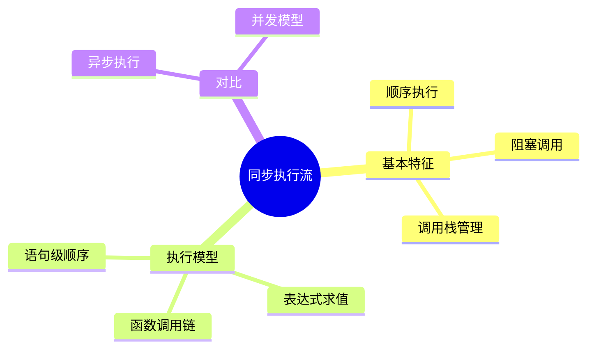
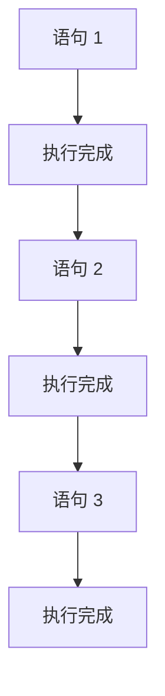
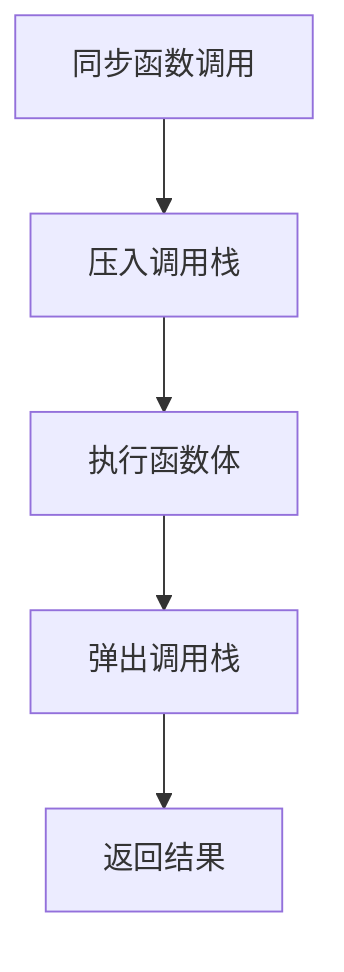

# 同步执行流（Synchronous Flow）

> **形式化定义**：同步执行流是 JavaScript 最基本的执行模式，代码按照书写顺序**逐行执行**，每条语句完成后才执行下一条。在同步模式下，调用栈（Call Stack）依次压入和弹出执行上下文，形成严格的**后进先出（LIFO）**执行顺序。ECMA-262 §9.4 定义了执行上下文栈的管理规则。
>
> 对齐版本：ECMAScript 2025 (ES16) §9.4 | TypeScript 5.8-6.0

---

## 1. 概念定义 (Concept Definition)

### 1.1 形式化定义

同步执行的数学表示：

```
同步执行: stmt_1; stmt_2; ...; stmt_n
语义: eval(stmt_1) -> eval(stmt_2) -> ... -> eval(stmt_n)
```

### 1.2 概念层级图谱



---

## 2. 属性与特征 (Properties & Characteristics)

### 2.1 同步 vs 异步对比矩阵

| 特性 | 同步 | 异步 |
|------|------|------|
| 执行顺序 | 严格顺序 | 回调/事件驱动 |
| 阻塞性 | 阻塞 | 非阻塞 |
| 错误处理 | try/catch | .catch() / 回调错误参数 |
| 代码可读性 | 线性 | 回调嵌套或 async/await |
| 适用场景 | CPU 计算 | I/O 操作 |

---

## 3. 关系分析 (Relationship Analysis)

### 3.1 同步调用链

```mermaid
graph TD
    A[main()] --> B[fn1()]
    B --> C[fn2()]
    C --> D[fn3()]
    D --> E[return]
    E --> F[return fn2]
    F --> G[return fn1]
    G --> H[return main]
```

---

## 4. 机制解释 (Mechanism Explanation)

### 4.1 同步执行流程



---

## 5. 论证与分析 (Argumentation & Analysis)

### 5.1 同步执行的优缺点

| 优点 | 缺点 |
|------|------|
| 代码直观、易调试 | I/O 操作阻塞主线程 |
| 错误处理简单 | 无法并发处理多个任务 |
| 状态一致性好 | 用户体验差（UI 卡顿） |

---

## 6. 实例与示例 (Examples)

### 6.1 正例：同步计算

```javascript
function calculate() {
  const a = 1 + 2;      // 3
  const b = a * 3;      // 9
  const c = b - 4;      // 5
  return c;
}

console.log(calculate()); // 5
```

### 6.2 调用栈可视化

```javascript
function first() {
  second();
}
function second() {
  third();
}
function third() {
  // 在错误对象中捕获当前调用栈
  const stack = new Error('trace').stack;
  console.log(stack);
}

first();
// 输出（简化）：
// Error: trace
//     at third (<anonymous>:9:17)
//     at second (<anonymous>:6:3)
//     at first (<anonymous>:3:3)
//     at <anonymous>:13:1
```

### 6.3 同步 I/O 阻塞演示（Node.js）

```javascript
const fs = require('node:fs');

console.time('sync-read');
// 同步读取阻塞事件循环直到文件读取完成
try {
  const data = fs.readFileSync('/tmp/large-file.txt', 'utf-8');
  console.log(`Read ${data.length} bytes`);
} catch (err) {
  console.error('Read failed:', err.message);
}
console.timeEnd('sync-read');
// 在文件读取期间，事件循环中的其他回调（如定时器、I/O 事件）均被阻塞
```

### 6.4 CPU 密集型同步任务的性能陷阱

```javascript
// 同步长时间计算会阻塞主线程
function heavyComputation(n) {
  let sum = 0;
  for (let i = 0; i < n; i++) {
    sum += Math.sqrt(i);
  }
  return sum;
}

// 在浏览器中这将导致 UI 冻结
// 在 Node.js 中将阻塞所有并发请求处理
console.time('heavy');
const result = heavyComputation(1e8);
console.timeEnd('heavy');
console.log('Result:', result);

// 改进方案：使用 setImmediate / MessageChannel / Worker 将计算拆分为异步块
```

### 6.5 调用栈深度限制与尾调用优化

```javascript
// 浏览器和 Node.js 的调用栈深度通常在 10,000 ~ 50,000 之间
function measureStackDepth() {
  let depth = 0;
  function recurse() {
    depth++;
    recurse();
  }
  try {
    recurse();
  } catch (e) {
    console.log('Max stack depth:', depth);
    // 典型值：Node.js ~12,500；Chrome ~13,000
  }
}

// 尾调用优化（TCO）在严格模式下理论上支持，但 V8 已放弃实现
// 实际工程中应始终将递归改写为迭代
'use strict';
function tcoFactorial(n, acc = 1n) {
  if (n <= 1) return acc;
  return tcoFactorial(n - 1, acc * BigInt(n)); // 尾调用位置
}
```

### 6.6 同步结构化克隆（Structured Clone）示例

```javascript
// structuredClone 是同步 API，内部执行结构化克隆算法
const original = {
  date: new Date(),
  map: new Map([['key', 'value']]),
  set: new Set([1, 2, 3]),
  nested: { a: 1 },
};

const cloned = structuredClone(original);
console.log(cloned.date !== original.date); // true（不同引用）
console.log(cloned.nested !== original.nested); // true（深拷贝）

// 注意：包含函数的的对象无法被结构化克隆
// structuredClone({ fn: () => {} }); // throws DataCloneError
```

### 6.7 同步生成器与迭代器控制

```javascript
// 同步生成器实现斐波那契数列
function* fibonacci(max) {
  let [a, b] = [0, 1];
  while (a <= max) {
    yield a;
    [a, b] = [b, a + b];
  }
}

// for...of 消费
for (const n of fibonacci(100)) {
  console.log(n); // 0, 1, 1, 2, 3, 5, 8, 13, 21, 34, 55, 89
}

// 手动控制迭代（展示同步流的逐步执行）
const iter = fibonacci(10);
console.log(iter.next()); // { value: 0, done: false }
console.log(iter.next()); // { value: 1, done: false }
console.log(iter.return()); // { value: undefined, done: true } — 提前终止
```

### 6.8 高精度同步计时

```javascript
// performance.now() 提供微秒级精度（相对时间）
const start = performance.now();

// 同步计算密集型任务
let sum = 0;
for (let i = 0; i < 1e7; i++) {
  sum += i;
}

const duration = performance.now() - start;
console.log(`Elapsed: ${duration.toFixed(3)}ms`);

// Node.js: process.hrtime.bigint() 提供纳秒级精度
import { hrtime } from 'node:process';
const t0 = hrtime.bigint();
// ... sync work ...
const t1 = hrtime.bigint();
console.log(`Nanoseconds: ${t1 - t0}`);
```

### 6.9 同步模块加载与循环依赖分析

```javascript
// a.js
const b = require('./b');
console.log('a.js loaded, b.value =', b.value);
module.exports = { value: 'A' };

// b.js
const a = require('./a');
console.log('b.js loaded, a.value =', a.value);
module.exports = { value: 'B' };

// main.js
// Node.js 同步模块加载处理循环依赖：
// 1. 加载 a.js -> 执行到 require('./b') -> 暂停 a.js，开始加载 b.js
// 2. 加载 b.js -> 执行到 require('./a') -> a.js 正在加载中，返回已解析的部分 exports（此时为空对象 {}）
// 3. b.js 完成 -> a.js 继续 -> 两者都完成
// 输出顺序：
// b.js loaded, a.value = undefined  （a.js 尚未完成）
// a.js loaded, b.value = B
```

### 6.10 同步队列与栈数据结构的实现

```javascript
// 同步栈（LIFO — 同调用栈语义）
class SyncStack {
  #items = [];
  push(item) { this.#items.push(item); }
  pop() { return this.#items.pop(); }
  peek() { return this.#items.at(-1); }
  get size() { return this.#items.length; }
}

// 同步队列（FIFO）
class SyncQueue {
  #items = [];
  enqueue(item) { this.#items.push(item); }
  dequeue() { return this.#items.shift(); }
  peek() { return this.#items[0]; }
  get size() { return this.#items.length; }
}

// 用例：深度优先遍历（栈）vs 广度优先遍历（队列）
function dfsSync(tree) {
  const stack = new SyncStack();
  stack.push(tree);
  while (stack.size > 0) {
    const node = stack.pop();
    console.log(node.value);
    // 子节点逆序压栈以保持遍历顺序
    for (let i = node.children.length - 1; i >= 0; i--) {
      stack.push(node.children[i]);
    }
  }
}

function bfsSync(tree) {
  const queue = new SyncQueue();
  queue.enqueue(tree);
  while (queue.size > 0) {
    const node = queue.dequeue();
    console.log(node.value);
    for (const child of node.children) {
      queue.enqueue(child);
    }
  }
}
```

### 6.11 同步错误边界与防御性编程

```javascript
// 同步代码中的错误边界模式
function safeDivide(a, b) {
  if (typeof a !== 'number' || typeof b !== 'number') {
    throw new TypeError('Arguments must be numbers');
  }
  if (b === 0) {
    throw new RangeError('Division by zero');
  }
  return a / b;
}

// 使用 Result 类型避免异常（函数式风格）
function divideResult(a, b) {
  if (typeof a !== 'number' || typeof b !== 'number') {
    return { ok: false, error: new TypeError('Arguments must be numbers') };
  }
  if (b === 0) {
    return { ok: false, error: new RangeError('Division by zero') };
  }
  return { ok: true, value: a / b };
}

const result = divideResult(10, 0);
if (result.ok) {
  console.log('Result:', result.value);
} else {
  console.error('Error:', result.error.message);
}
```

---

## 7. 权威参考与国际化对齐 (References)

- **ECMA-262 §9.4** — Execution Contexts: <https://tc39.es/ecma262/#sec-execution-contexts>
- **MDN: Event Loop** — <https://developer.mozilla.org/en-US/docs/Web/JavaScript/Event_loop>
- **MDN: Call Stack** — <https://developer.mozilla.org/en-US/docs/Glossary/Call_stack>
- **V8 Blog — Stack Traces** — <https://v8.dev/docs/stack-trace-api>
- **Node.js Docs — Event Loop** — <https://nodejs.org/en/learn/asynchronous-work/event-loop-its-role>
- **JavaScript.Info — Event Loop** — <https://javascript.info/event-loop>
- **Philip Roberts: What the heck is the event loop?** — <https://www.youtube.com/watch?v=8aGhZQkoFbQ> (JSConf 2014)
- **MDN — structuredClone** — <https://developer.mozilla.org/en-US/docs/Web/API/Window/structuredClone>
- **V8 Blog — Understanding V8 Bytecode** — <https://v8.dev/blog/understanding-v8-bytecode>
- **HTML Living Standard — Scripting** — <https://html.spec.whatwg.org/multipage/webappapis.html>
- **ECMA-262 §27.5** — Generator Functions: <https://tc39.es/ecma262/#sec-generator-functions>
- **MDN: Generator** — <https://developer.mozilla.org/en-US/docs/Web/JavaScript/Reference/Global_Objects/Generator>
- **MDN: performance.now()** — <https://developer.mozilla.org/en-US/docs/Web/API/Performance/now>
- **Node.js: process.hrtime** — <https://nodejs.org/api/process.html#processhrtimebigint>
- **V8 Blog — TurboFan** — <https://v8.dev/blog/turbofan-jit>
- **What the heck is the event loop?** — Philip Roberts JSConf 2014: <https://www.youtube.com/watch?v=8aGhZQkoFbQ>
- **Node.js Modules — Cycles** — <https://nodejs.org/api/modules.html#cycles> — 循环依赖处理机制
- **MDN — Error** — <https://developer.mozilla.org/en-US/docs/Web/JavaScript/Reference/Global_Objects/Error> — Error 构造函数规范
- **MDN — throw** — <https://developer.mozilla.org/en-US/docs/Web/JavaScript/Reference/Statements/throw> — 异常抛出语句
- **MDN — try...catch** — <https://developer.mozilla.org/en-US/docs/Web/JavaScript/Reference/Statements/try...catch> — 异常捕获
- **V8 Blog — Ignition + TurboFan** — <https://v8.dev/blog/ignition-interpreter> — V8 执行管道解析
- **JavaScript Engine Fundamentals** — <https://mathiasbynens.be/notes/shapes-ics> — 隐藏类与内联缓存
- **ECMA-262 §13.3** — Destructuring Binding Patterns: <https://tc39.es/ecma262/#sec-destructuring-binding-patterns>
- **ECMA-262 §9.3** — Execution Contexts Stack: <https://tc39.es/ecma262/#sec-execution-contexts-stack>
- **Node.js Docs — Blocking vs Non-Blocking** — <https://nodejs.org/en/learn/asynchronous-work/overview-of-blocking-vs-non-blocking>
- **Chrome DevTools — Call Stack** — <https://developer.chrome.com/docs/devtools/javascript/reference#call-stack>
- **WebKit Blog — JSCallFrame** — <<https://webkit.org/blog/> JavaScript 调用栈实现>

---

## 8. 思维表征总结 (Cognitive Representations)

### 8.1 同步执行模型

```
同步执行: A -> B -> C -> D
每个步骤完成后才执行下一步
```

---

## 9. 公理化表述与形式证明 (Axiomatization & Formal Proof)

### 9.1 公理化基础

**公理 1（顺序执行）**：
> 同步代码按书写顺序执行，前一条语句完成后才执行后一条。

### 9.2 定理与证明

**定理 1（同步执行的可预测性）**：
> 给定相同的输入，同步代码总是产生相同的输出和副作用顺序。

*证明*：
> 同步代码没有并发竞争条件，执行顺序完全由代码结构决定。
> QED

---

## 10. 推理链与演绎分析 (Deductive Reasoning Chain)

### 10.1 演绎推理



### 10.2 反事实推理

> **反设**：JavaScript 没有同步执行模式。
> **推演结果**：所有操作都需异步回调，最简单的计算也变得复杂。
> **结论**：同步执行是编程语言的基础，异步是对同步的扩展。

---

**参考规范**：ECMA-262 §9.4 | MDN: Event Loop
