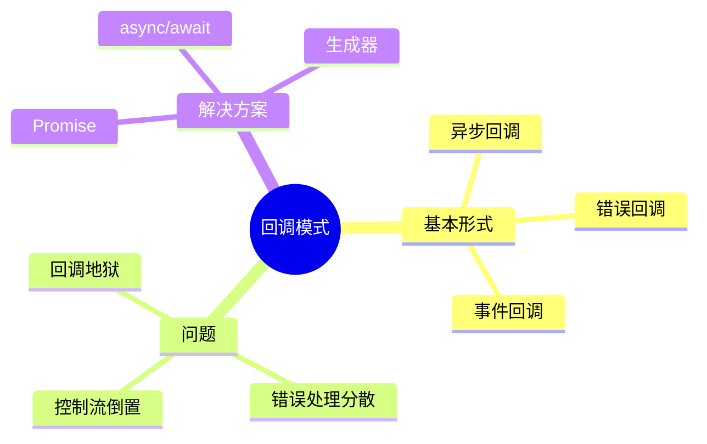
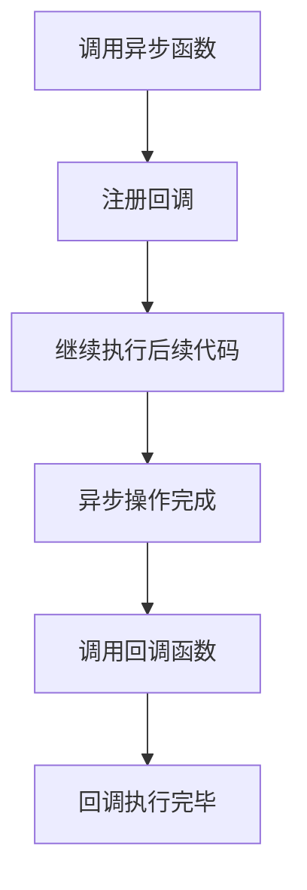
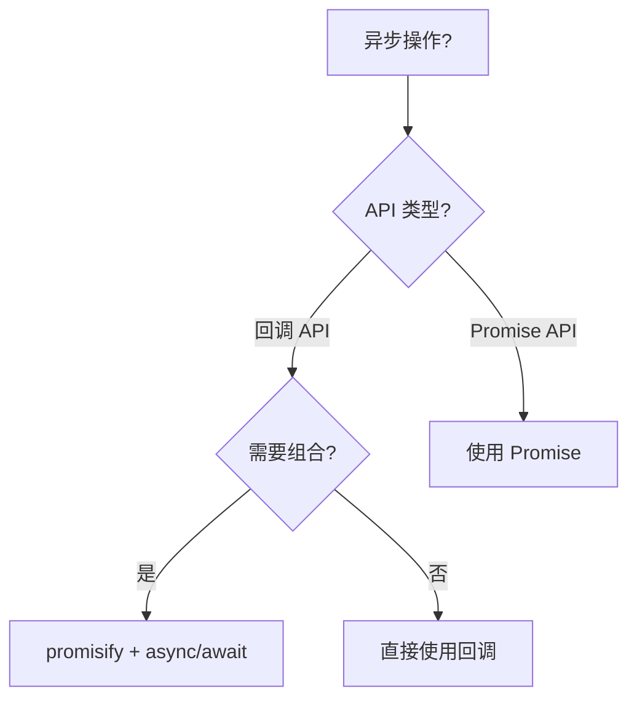
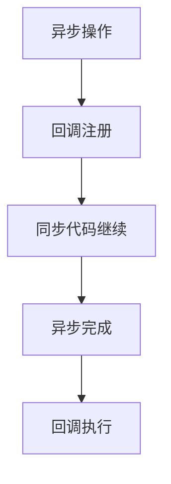

# 回调模式（Callback Pattern）

> **形式化定义**：回调模式是 JavaScript 中处理异步操作的传统方式，将函数作为参数传递给另一个函数，在操作完成后调用。回调模式是**延续传递风格（Continuation-Passing Style, CPS）**的具体实现，但也导致了著名的**回调地狱（Callback Hell）**问题。ECMA-262 §6.2.6 定义了函数对象的 `[[Call]]` 内部方法。
>
> 对齐版本：ECMAScript 2025 (ES16) §6.2.6 | TypeScript 5.8–6.0

---

## 1. 概念定义 (Concept Definition)

### 1.1 形式化定义

回调的数学表示：

```
asyncOperation(args, callback) ≡
  启动异步操作
  操作完成后调用 callback(result)
```

### 1.2 概念层级图谱



---

## 2. 属性与特征 (Properties & Characteristics)

### 2.1 回调模式属性矩阵

| 特性 | 回调 | Promise | async/await |
|------|------|---------|-------------|
| 组合性 | ❌ | ✅ | ✅ |
| 错误处理 | 分散 | 集中 | try/catch |
| 可读性 | 差 | 中 | 好 |
| 调试 | 困难 | 中等 | 简单 |

---

## 3. 关系分析 (Relationship Analysis)

### 3.1 回调地狱

```javascript
// ❌ 回调地狱
getData(function(a) {
  getMoreData(a, function(b) {
    getMoreData(b, function(c) {
      getMoreData(c, function(d) {
        console.log(d);
      });
    });
  });
});
```

---

## 4. 机制解释 (Mechanism Explanation)

### 4.1 回调的执行流程



---

## 5. 论证与分析 (Argumentation & Analysis)

### 5.1 回调 vs Promise

| 场景 | 推荐 | 原因 |
|------|------|------|
| 单次异步操作 | Promise | 避免嵌套 |
| 多个并行操作 | Promise.all | 组合性 |
| 错误传播 | Promise.catch | 集中处理 |
| 遗留 API | 回调 + promisify | 兼容性 |

---

## 6. 实例与示例 (Examples)

### 6.1 正例：Node.js 回调约定

```javascript
const fs = require("fs");

// ✅ Node.js 错误优先回调
fs.readFile("file.txt", (err, data) => {
  if (err) {
    console.error("Error:", err);
    return;
  }
  console.log(data);
});
```

### 6.2 正例：promisify

```javascript
const util = require("util");
const fs = require("fs");

const readFile = util.promisify(fs.readFile);

// ✅ 现在可以使用 async/await
async function main() {
  const data = await readFile("file.txt");
  console.log(data);
}
```

---

## 7. 权威参考与国际化对齐 (References)

- **ECMA-262 §6.2.6** — [[Call]]
- **MDN: Callback function** — <https://developer.mozilla.org/en-US/docs/Glossary/Callback_function>

---

## 8. 思维表征总结 (Cognitive Representations)

### 8.1 回调模式选择



---

## 9. 公理化表述与形式证明 (Axiomatization & Formal Proof)

### 9.1 公理化基础

**公理 1（回调的异步性）**：
> 回调函数在当前同步代码执行完毕后调用。

### 9.2 定理与证明

**定理 1（回调地狱的必然性）**：
> 多个依赖异步操作必须使用嵌套回调或替代方案（Promise/async）。

*证明*：
> 每个异步操作完成后才能启动下一个。若不使用嵌套，则无法保证执行顺序。
> ∎

---

## 10. 推理链与演绎分析 (Deductive Reasoning Chain)

### 10.1 演绎推理



### 10.2 反事实推理

> **反设**：JavaScript 从一开始就有 Promise。
> **推演结果**：回调模式不会出现，异步编程从一开始就简洁。
> **结论**：回调模式是历史遗留，Promise 和 async/await 是更现代的解决方案。

---

**参考规范**：ECMA-262 §6.2.6 | MDN: Callback function
