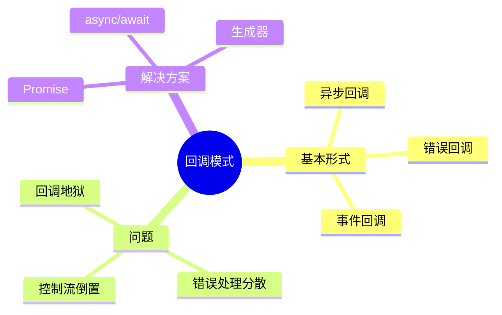
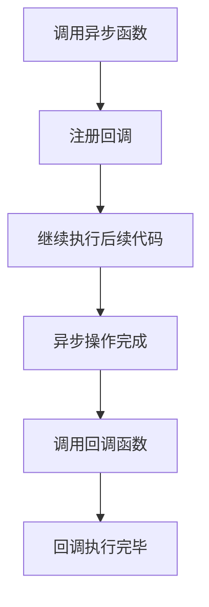
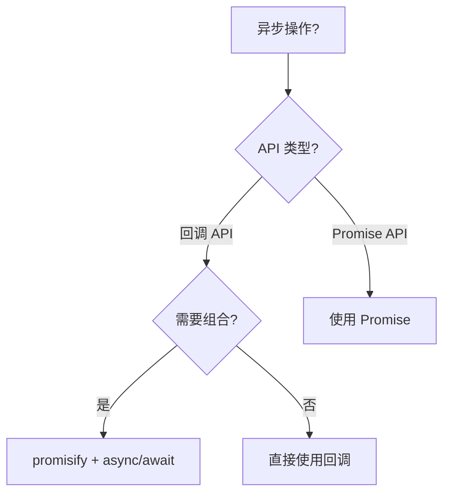
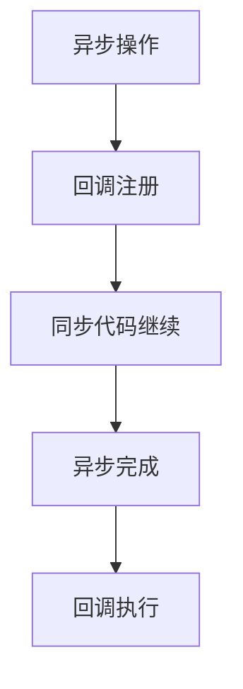

# 回调模式（Callback Pattern）

> **形式化定义**：回调模式是 JavaScript 中处理异步操作的传统方式，将函数作为参数传递给另一个函数，在操作完成后调用。回调模式是**延续传递风格（Continuation-Passing Style, CPS）**的具体实现，但也导致了著名的**回调地狱（Callback Hell）**问题。ECMA-262 §6.2.6 定义了函数对象的 `[[Call]]` 内部方法。
>
> 对齐版本：ECMAScript 2025 (ES16) §6.2.6 | TypeScript 5.8–6.0

---

## 1. 概念定义 (Concept Definition)

### 1.1 形式化定义

回调的数学表示：

```
asyncOperation(args, callback) ≡
  启动异步操作
  操作完成后调用 callback(result)
```

### 1.2 概念层级图谱



---

## 2. 属性与特征 (Properties & Characteristics)

### 2.1 回调模式属性矩阵

| 特性 | 回调 | Promise | async/await |
|------|------|---------|-------------|
| 组合性 | ❌ | ✅ | ✅ |
| 错误处理 | 分散 | 集中 | try/catch |
| 可读性 | 差 | 中 | 好 |
| 调试 | 困难 | 中等 | 简单 |

---

## 3. 关系分析 (Relationship Analysis)

### 3.1 回调地狱

```javascript
// ❌ 回调地狱
getData(function(a) {
  getMoreData(a, function(b) {
    getMoreData(b, function(c) {
      getMoreData(c, function(d) {
        console.log(d);
      });
    });
  });
});
```

**使用 async/await 重构**：

```typescript
// ✅ 现代异步写法
async function fetchDataChain() {
  const a = await getData();
  const b = await getMoreData(a);
  const c = await getMoreData(b);
  const d = await getMoreData(c);
  return d;
}
```

---

## 4. 机制解释 (Mechanism Explanation)

### 4.1 回调的执行流程



---

## 5. 论证与分析 (Argumentation & Analysis)

### 5.1 回调 vs Promise

| 场景 | 推荐 | 原因 |
|------|------|------|
| 单次异步操作 | Promise | 避免嵌套 |
| 多个并行操作 | Promise.all | 组合性 |
| 错误传播 | Promise.catch | 集中处理 |
| 遗留 API | 回调 + promisify | 兼容性 |

---

## 6. 实例与示例 (Examples)

### 6.1 正例：Node.js 回调约定

```javascript
const fs = require("fs");

// ✅ Node.js 错误优先回调
fs.readFile("file.txt", (err, data) => {
  if (err) {
    console.error("Error:", err);
    return;
  }
  console.log(data);
});
```

### 6.2 正例：promisify

```javascript
const util = require("util");
const fs = require("fs");

const readFile = util.promisify(fs.readFile);

// ✅ 现在可以使用 async/await
async function main() {
  const data = await readFile("file.txt");
  console.log(data);
}
```

### 6.3 自定义回调 API 设计

```typescript
// 设计良好的回调 API：错误优先 + 类型安全
interface AsyncTask<T> {
  (callback: (error: Error | null, result?: T) => void): void;
}

function createDelayedTask<T>(value: T, delayMs: number): AsyncTask<T> {
  return (callback) => {
    setTimeout(() => {
      callback(null, value);
    }, delayMs);
  };
}

// 使用
const task = createDelayedTask('Hello', 100);
task((err, result) => {
  if (err) {
    console.error('Failed:', err);
    return;
  }
  console.log('Result:', result); // 'Hello'
});
```

### 6.4 手动 promisify 实现

```typescript
// 手动实现 promisify — 理解底层机制
function promisify<TArgs extends unknown[], TResult>(
  fn: (...args: [...TArgs, (err: Error | null, result?: TResult) => void]) => void
): (...args: TArgs) => Promise<TResult> {
  return (...args: TArgs) => {
    return new Promise<TResult>((resolve, reject) => {
      fn(...args, (err, result) => {
        if (err) reject(err);
        else resolve(result!);
      });
    });
  };
}

// 使用自定义 promisify
import { readFile as readFileCallback } from 'node:fs';
const readFileAsync = promisify(readFileCallback);

async function demo() {
  const data = await readFileAsync('package.json', 'utf-8');
  console.log(JSON.parse(data).name);
}
```

### 6.5 回调组合：串行与并行

```typescript
// 使用回调实现串行执行
function series<T>(tasks: Array<(cb: (err: Error | null, result?: T) => void) => void>,
  finalCallback: (err: Error | null, results?: T[]) => void
): void {
  const results: T[] = [];
  let index = 0;

  function next(err: Error | null, result?: T): void {
    if (err) {
      finalCallback(err);
      return;
    }
    if (result !== undefined) results.push(result);

    if (index >= tasks.length) {
      finalCallback(null, results);
      return;
    }

    const task = tasks[index++];
    task(next);
  }

  next(null);
}

// 使用回调实现并行执行
function parallel<T>(tasks: Array<(cb: (err: Error | null, result?: T) => void) => void>,
  finalCallback: (err: Error | null, results?: T[]) => void
): void {
  const results: T[] = new Array(tasks.length);
  let completed = 0;
  let hasError = false;

  tasks.forEach((task, i) => {
    task((err, result) => {
      if (hasError) return;
      if (err) {
        hasError = true;
        finalCallback(err);
        return;
      }
      results[i] = result!;
      completed++;
      if (completed === tasks.length) {
        finalCallback(null, results);
      }
    });
  });
}

// 使用示例
series([
  (cb) => setTimeout(() => cb(null, 'step 1'), 100),
  (cb) => setTimeout(() => cb(null, 'step 2'), 100),
], (err, results) => {
  console.log('Series:', results); // ['step 1', 'step 2']
});

parallel([
  (cb) => setTimeout(() => cb(null, 'a'), 200),
  (cb) => setTimeout(() => cb(null, 'b'), 100),
], (err, results) => {
  console.log('Parallel:', results); // ['a', 'b']
});
```

---

### 6.6 带超时与取消的回调封装

```typescript
// 为传统回调 API 增加 AbortController 支持
function fetchWithCallback(
  url: string,
  callback: (err: Error | null, data?: string) => void,
  options?: { timeout?: number; signal?: AbortSignal }
): void {
  const controller = new AbortController();
  const signal = options?.signal;
  const timeout = options?.timeout ?? 5000;

  // 外部取消与内部超时统一
  const onAbort = () => controller.abort();
  signal?.addEventListener('abort', onAbort);

  const timer = setTimeout(() => {
    controller.abort(new Error(`Request timeout after ${timeout}ms`));
  }, timeout);

  fetch(url, { signal: controller.signal })
    .then(res => res.text())
    .then(data => {
      clearTimeout(timer);
      signal?.removeEventListener('abort', onAbort);
      callback(null, data);
    })
    .catch(err => {
      clearTimeout(timer);
      signal?.removeEventListener('abort', onAbort);
      callback(err instanceof Error ? err : new Error(String(err)));
    });
}

// 使用
const controller = new AbortController();
fetchWithCallback('https://api.example.com/data', (err, data) => {
  if (err) {
    console.error('Failed:', err.message);
    return;
  }
  console.log('Data:', data?.slice(0, 100));
}, { timeout: 3000, signal: controller.signal });

// 3 秒后主动取消
setTimeout(() => controller.abort(), 3000);
```

### 6.7 回调转 EventEmitter 模式

```typescript
import { EventEmitter } from 'node:events';

// 将多次回调转换为基于事件的流式接口
class ProgressDownloader extends EventEmitter {
  download(url: string): void {
    const chunks: Buffer[] = [];
    let received = 0;

    fetch(url).then(response => {
      const reader = response.body?.getReader();
      if (!reader) {
        this.emit('error', new Error('No readable body'));
        return;
      }

      const pump = (): Promise<void> => reader.read().then(({ done, value }) => {
        if (done) {
          this.emit('finish', Buffer.concat(chunks));
          return;
        }
        chunks.push(value);
        received += value.length;
        this.emit('progress', { received, total: response.headers.get('content-length') });
        return pump();
      });

      pump().catch(err => this.emit('error', err));
    }).catch(err => this.emit('error', err));
  }
}

// 使用
const downloader = new ProgressDownloader();
downloader.on('progress', (info) => console.log(`Progress: ${info.received} bytes`));
downloader.on('finish', (buffer) => console.log('Complete:', buffer.length));
downloader.on('error', (err) => console.error('Error:', err));
downloader.download('https://example.com/large-file.bin');
```

---

## 7. 权威参考与国际化对齐 (References)

- **ECMA-262 §6.2.6** — [[Call]]
- **MDN: Callback function** — <https://developer.mozilla.org/en-US/docs/Glossary/Callback_function>
- **Node.js Error-First Callbacks** — <https://nodejs.org/api/errors.html#error-first-callbacks>
- **Node.js util.promisify** — <https://nodejs.org/api/util.html#utilpromisifyoriginal>
- **Promise A+ Specification** — <https://promisesaplus.com/> — Promise 行为标准规范
- **MDN: Promise** — <https://developer.mozilla.org/en-US/docs/Web/JavaScript/Reference/Global_Objects/Promise>
- **V8 Blog: Understanding Promises** — <https://v8.dev/blog/fast-async>
- **JavaScript.info: Callbacks** — <https://javascript.info/callbacks>
- **Refactoring Guru: Callback Pattern** — <https://refactoring.guru/design-patterns/chain-of-responsibility>
- **TC39 ECMA-262 Spec** — <https://tc39.es/ecma262/> — 官方 ECMAScript 规范
- **Node.js Events — EventEmitter** — <https://nodejs.org/api/events.html#class-eventemitter>
- **MDN: AbortController** — <https://developer.mozilla.org/en-US/docs/Web/API/AbortController>
- **WHATWG Streams Standard** — <https://streams.spec.whatwg.org/> — Web Streams 规范
- **Node.js util.callbackify** — <https://nodejs.org/api/util.html#utilcallbackifyoriginal>
- **Bluebird.promisify API** — <http://bluebirdjs.com/docs/api/promise.promisify.html>
- **JavaScript.info: Event Loop** — <https://javascript.info/event-loop>
- **MDN: Fetch API** — <https://developer.mozilla.org/en-US/docs/Web/API/Fetch_API>

---

## 8. 思维表征总结 (Cognitive Representations)

### 8.1 回调模式选择



---

## 9. 公理化表述与形式证明 (Axiomatization & Formal Proof)

### 9.1 公理化基础

**公理 1（回调的异步性）**：
> 回调函数在当前同步代码执行完毕后调用。

### 9.2 定理与证明

**定理 1（回调地狱的必然性）**：
> 多个依赖异步操作必须使用嵌套回调或替代方案（Promise/async）。

*证明*：
> 每个异步操作完成后才能启动下一个。若不使用嵌套，则无法保证执行顺序。
> ∎

---

## 10. 推理链与演绎分析 (Deductive Reasoning Chain)

### 10.1 演绎推理



### 10.2 反事实推理

> **反设**：JavaScript 从一开始就有 Promise。
> **推演结果**：回调模式不会出现，异步编程从一开始就简洁。
> **结论**：回调模式是历史遗留，Promise 和 async/await 是更现代的解决方案。

---

**参考规范**：ECMA-262 §6.2.6 | MDN: Callback function

---

## 进阶代码示例

### Thunk 模式与懒执行

```typescript
// Thunk：将计算延迟到需要时执行
function createThunk<T>(fn: () => T): () => T {
  let executed = false;
  let result: T;
  return () => {
    if (!executed) {
      result = fn();
      executed = true;
    }
    return result;
  };
}

const expensiveThunk = createThunk(() => {
  console.log('Computing...');
  return 42;
});

console.log(expensiveThunk()); // Computing... 42
console.log(expensiveThunk()); // 42（缓存）
```

### `util.promisify` 与 `child_process.exec`

```typescript
import { exec } from 'node:child_process';
import { promisify } from 'node:util';

const execAsync = promisify(exec);

async function getGitCommit(): Promise<string> {
  const { stdout } = await execAsync('git rev-parse --short HEAD');
  return stdout.trim();
}

getGitCommit().then((hash) => console.log('Current commit:', hash));
```

### 类型安全的错误优先回调工厂

```typescript
type Callback<T> = (err: Error | null, result?: T) => void;

function createAsyncTask<T>(executor: (resolve: (value: T) => void, reject: (reason: Error) => void) => void): Callback<T> {
  return (callback) => {
    executor(
      (value) => callback(null, value),
      (reason) => callback(reason)
    );
  };
}

const readConfig = createAsyncTask<string>((resolve, reject) => {
  try {
    const data = require('fs').readFileSync('config.json', 'utf-8');
    resolve(data);
  } catch (e) {
    reject(e instanceof Error ? e : new Error(String(e)));
  }
});

readConfig((err, data) => {
  if (err) {
    console.error('Failed:', err.message);
    return;
  }
  console.log('Config:', data?.slice(0, 100));
});
```

### 基于 `queueMicrotask` 的回调调度

```typescript
function scheduleMicrotaskCallback<T>(task: (done: Callback<T>) => void): Callback<T> {
  return (callback) => {
    queueMicrotask(() => {
      task(callback);
    });
  };
}

scheduleMicrotaskCallback<number>((done) => {
  done(null, Math.random());
})((err, result) => {
  console.log('Microtask result:', result);
});
```

---

## 扩展参考链接

- [Node.js util.promisify](https://nodejs.org/api/util.html#utilpromisifyoriginal) — 官方 promisify 文档
- [Node.js util.callbackify](https://nodejs.org/api/util.html#utilcallbackifyoriginal) — 官方 callbackify 文档
- [MDN — Callback function](https://developer.mozilla.org/en-US/docs/Glossary/Callback_function) — 回调函数概念
- [MDN — queueMicrotask](https://developer.mozilla.org/en-US/docs/Web/API/queueMicrotask) — 微任务队列 API
- [Promise A+ Specification](https://promisesaplus.com/) — Promise 行为标准规范
- [ECMA-262 Specification](https://tc39.es/ecma262/) — 官方 ECMAScript 规范
- [Node.js Events — EventEmitter](https://nodejs.org/api/events.html#class-eventemitter) — 事件驱动编程指南
- [MDN — AbortController](https://developer.mozilla.org/en-US/docs/Web/API/AbortController) — 取消异步操作标准 API
- [WHATWG Streams Standard](https://streams.spec.whatwg.org/) — Web Streams 规范
- [Bluebird.promisify API](http://bluebirdjs.com/docs/api/promise.promisify.html) — Bluebird promisify 参考
- [JavaScript.info — Callbacks](https://javascript.info/callbacks) — 回调模式深度教程
- [Refactoring Guru — Chain of Responsibility](https://refactoring.guru/design-patterns/chain-of-responsibility) — 责任链设计模式
