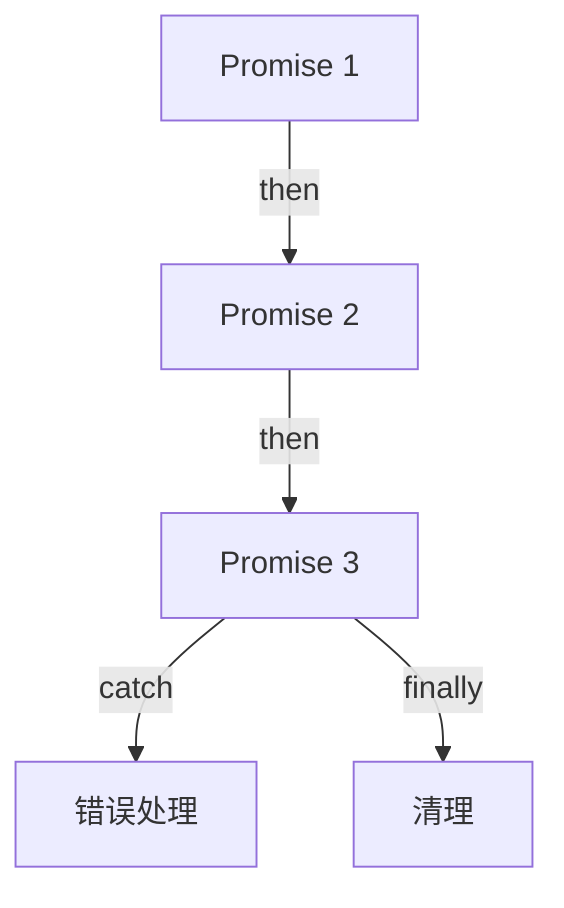
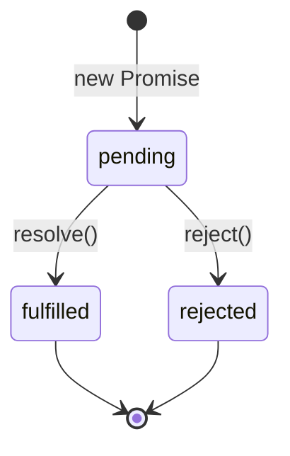

# Promise 执行流（Promise Execution Flow）

> **形式化定义**：Promise 是 ECMAScript 2015（ES6）引入的异步编程抽象，表示一个可能尚未完成但预期将来会完成的操作。Promise 具有三种状态：pending（待定）、fulfilled（已完成）、rejected（已拒绝），状态一旦改变不可再次修改。ECMA-262 §27.2 定义了 Promise 的完整语义，包括 `then`、`catch`、`finally` 方法和静态方法（`all`、`race`、`allSettled`、`any`）。
>
> 对齐版本：ECMAScript 2025 (ES16) §27.2 | TypeScript 5.8–6.0

---

## 1. 概念定义 (Concept Definition)

### 1.1 形式化定义

ECMA-262 §27.2 定义了 Promise：

> *"A Promise is an object that is used as a placeholder for the eventual results of a deferred (and possibly asynchronous) computation."*

Promise 状态机：

```
States: { pending, fulfilled, rejected }
Transitions:
  pending --resolve(v)--> fulfilled(v)
  pending --reject(e)--> rejected(e)
  fulfilled --(no transition)--
  rejected --(no transition)--
```

---

## 2. 属性与特征 (Properties & Characteristics)

### 2.1 Promise 状态属性矩阵

| 状态 | 转换来源 | 可转换到 | 说明 |
|------|---------|---------|------|
| pending | 初始状态 | fulfilled / rejected | 唯一可变状态 |
| fulfilled | pending | — | 成功完成，有值 |
| rejected | pending | — | 失败，有原因 |

### 2.2 Promise 链式调用

| 方法 | 输入 | 输出 | 用途 |
|------|------|------|------|
| `then(onFulfilled, onRejected)` | Promise | 新 Promise | 处理成功/失败 |
| `catch(onRejected)` | Promise | 新 Promise | 仅处理失败 |
| `finally(onFinally)` | Promise | 新 Promise | 无论结果都执行 |

---

## 3. 关系分析 (Relationship Analysis)

### 3.1 Promise 链的执行流



---

## 4. 机制解释 (Mechanism Explanation)

### 4.1 Promise 的调度机制

```mermaid
flowchart TD
    A[Promise.resolve(v)] --> B[状态变为 fulfilled]
    B --> C[then 回调加入微任务队列]
    C --> D[当前同步代码完成]
    D --> E[执行微任务队列]
    E --> F[then 回调执行]
```

### 4.2 微任务 vs 宏任务

Promise 回调通过 **微任务（microtask）** 调度，优先级高于宏任务（macrotask，如 `setTimeout`）。这保证了 Promise 链在同一次事件循环迭代内尽可能早地执行。

```javascript
console.log('1. 同步开始');

setTimeout(() => console.log('2. setTimeout（宏任务）'), 0);

Promise.resolve().then(() => console.log('3. Promise then（微任务）'));

console.log('4. 同步结束');

// 输出顺序：1 → 4 → 3 → 2
```

#### 代码示例：微任务级联排空（Microtask Queue Draining）

```javascript
console.log('A');

Promise.resolve().then(() => {
  console.log('B');
  Promise.resolve().then(() => {
    console.log('C');
  });
});

Promise.resolve().then(() => {
  console.log('D');
});

console.log('E');

// 输出：A → E → B → D → C
// 解析：微任务队列在单个宏任务周期内会排空所有级联产生的微任务，
// 但新的微任务追加到队列末尾，因此 C 在 D 之后。
```

#### 代码示例：Promise 构造函数同步性验证

```javascript
console.log('1');

const p = new Promise((resolve) => {
  console.log('2');        // Promise 执行器（executor）立即同步执行
  resolve('3');
});

p.then(console.log);

console.log('4');

// 输出：1 → 2 → 4 → 3
// 关键点：resolve('3') 不会立即触发 then 回调；它仅将 Promise 状态改为 fulfilled，
// then 回调在下一个微任务 tick 执行。
```

---

## 5. 论证与分析 (Argumentation & Analysis)

### 5.1 Promise 静态方法对比

| 方法 | 成功条件 | 失败条件 | 返回值 |
|------|---------|---------|--------|
| `Promise.all` | 全部 fulfilled | 首个 rejected | 结果数组 |
| `Promise.race` | 首个 settled | 首个 rejected | 首个结果 |
| `Promise.allSettled` | 全部 settled | 永不 reject | 状态数组 |
| `Promise.any` | 首个 fulfilled | 全部 rejected | 首个结果 |

### 5.2 `Promise.withResolvers`（ES2024）

ES2024 新增了 `Promise.withResolvers`，将 `resolve` 和 `reject` 暴露给外部调用者，解决了"先创建 Promise、后决定其命运"的常见模式：

```javascript
function createDelayedTask(ms) {
  const { promise, resolve, reject } = Promise.withResolvers();

  setTimeout(() => {
    if (ms > 5000) reject(new Error('Timeout too long'));
    else resolve(`Done after ${ms}ms`);
  }, ms);

  return promise;
}

createDelayedTask(100)
  .then(console.log)   // "Done after 100ms"
  .catch(console.error);
```

---

## 6. 实例与示例 (Examples)

### 6.1 正例：Promise 链

```javascript
fetch("/api/user")
  .then(response => response.json())
  .then(user => fetch(`/api/posts/${user.id}`))
  .then(response => response.json())
  .then(posts => console.log(posts))
  .catch(error => console.error(error))
  .finally(() => console.log("Done"));
```

### 6.2 正例：Promise.all 并行

```javascript
const [users, posts] = await Promise.all([
  fetch("/api/users").then(r => r.json()),
  fetch("/api/posts").then(r => r.json())
]);
```

### 6.3 正例：`Promise.allSettled` 安全聚合

```javascript
const results = await Promise.allSettled([
  fetch('/api/a'),
  fetch('/api/b'),
  fetch('/api/c')
]);

const ok = results
  .filter(r => r.status === 'fulfilled')
  .map(r => r.value);

const failed = results
  .filter(r => r.status === 'rejected')
  .map(r => r.reason);

console.log('成功:', ok.length, '失败:', failed.length);
```

### 6.4 正例：带 AbortController 的取消模式

```javascript
const controller = new AbortController();
const { signal } = controller;

// 5 秒后自动取消
setTimeout(() => controller.abort(), 5000);

try {
  const response = await fetch('/api/slow-endpoint', { signal });
  const data = await response.json();
} catch (err) {
  if (err.name === 'AbortError') {
    console.log('请求已被取消');
  }
}
```

### 6.5 正例：`Promise.any` 与降级策略

```javascript
const cdn1 = fetch('https://cdn-a.example.com/lib.js');
const cdn2 = fetch('https://cdn-b.example.com/lib.js');
const fallback = fetch('https://origin.example.com/lib.js');

try {
  const fastest = await Promise.any([cdn1, cdn2, fallback]);
  console.log('首个可用 CDN:', fastest.url);
} catch (error) {
  // AggregateError: 所有源均失败
  console.error('所有 CDN 不可用:', error.errors);
}
```

### 6.6 正例：异步迭代器 (`for await...of`)

```javascript
async function* paginatedUsers(pageSize = 10) {
  let page = 1;
  while (true) {
    const res = await fetch(`/api/users?page=${page}&size=${pageSize}`);
    const data = await res.json();
    if (data.length === 0) break;
    yield* data;
    page++;
  }
}

// 消费
for await (const user of paginatedUsers()) {
  console.log(user.name);
}
```

### 6.7 正例：Promise.race + 超时包装器

```typescript
function withTimeout(promise, ms) {
  const timeout = new Promise((_, reject) => {
    const id = setTimeout(() => {
      clearTimeout(id);
      reject(new Error(`Operation timed out after ${ms}ms`));
    }, ms);
  });
  return Promise.race([promise, timeout]);
}

// 使用：为任何 Promise 附加超时限制
const data = await withTimeout(fetch('/api/data').then(r => r.json()), 3000);
```

### 6.8 正例：手动 Promise 与 Deferred 模式

```typescript
// 在 Promise.withResolvers 不可用时（ES2024 之前）的手动实现
function createDeferred() {
  let resolve;
  let reject;

  const promise = new Promise((res, rej) => {
    resolve = res;
    reject = rej;
  });

  return { promise, resolve, reject };
}

// 用例：将基于回调的 API 包装为 Promise
function readFilePromise(path) {
  const { promise, resolve, reject } = createDeferred();
  require('fs').readFile(path, 'utf8', (err, data) => {
    err ? reject(err) : resolve(data);
  });
  return promise;
}
```

### 6.9 正例：Promise.resolve 的展开行为

```javascript
// Promise.resolve 会展开 thenable 对象
const thenable = {
  then(resolve, reject) {
    resolve(42);
  }
};

Promise.resolve(thenable).then(value => {
  console.log(value); // 42
});

// 但 Promise.resolve 不会展开 Promise 实例
const p = Promise.resolve(100);
Promise.resolve(p).then(value => {
  console.log(value); // 100（同一个 Promise 实例）
});
```

### 6.10 正例：未处理的 Promise 拒绝监控

```javascript
// Node.js: 监听未处理的 Promise 拒绝
process.on('unhandledRejection', (reason, promise) => {
  console.error('Unhandled Rejection at:', promise);
  console.error('Reason:', reason);
});

// 浏览器: 监听 unhandledrejection 事件
window.addEventListener('unhandledrejection', (event) => {
  console.error('Unhandled rejection:', event.reason);
  event.preventDefault(); // 阻止控制台错误输出
});

// ✅ 最佳实践：始终处理 Promise 拒绝
const p = fetch('/api/data');
p.then(data => console.log(data));
p.catch(err => console.error(err)); // 显式处理错误

// 或在 async 函数中使用 try/catch
async function safeFetch() {
  try {
    return await fetch('/api/data');
  } catch (err) {
    console.error('Fetch failed:', err);
    return null;
  }
}
```

### 6.11 正例：Promise 链中的错误恢复

```javascript
fetch('/api/user')
  .then(res => res.json())
  .catch(err => {
    console.error('Primary API failed, using cache', err);
    return getUserFromCache(); // 返回 fallback 值，链继续
  })
  .then(user => {
    console.log('User:', user); // 可能是 API 或缓存数据
  })
  .catch(err => {
    console.error('Completely failed:', err); // 最终兜底
  });
```

### 6.12 正例：`Promise.all` 的并发控制

```javascript
// 限制并发数，避免同时发起过多请求
async function batchProcess(items, batchSize, processor) {
  const results = [];
  for (let i = 0; i < items.length; i += batchSize) {
    const batch = items.slice(i, i + batchSize);
    const batchResults = await Promise.all(batch.map(processor));
    results.push(...batchResults);
  }
  return results;
}

// 使用：每次最多并发 5 个请求
const urls = Array.from({ length: 20 }, (_, i) => `/api/item/${i}`);
const responses = await batchProcess(urls, 5, url => fetch(url));
```

---

## 7. 权威参考与国际化对齐 (References)

- **ECMA-262 §27.2** — Promise Objects: <https://tc39.es/ecma262/#sec-promise-objects>
- **MDN: Promise** — <https://developer.mozilla.org/en-US/docs/Web/JavaScript/Reference/Global_Objects/Promise>
- **MDN: async function** — <https://developer.mozilla.org/en-US/docs/Web/JavaScript/Reference/Statements/async_function>
- **V8 Blog — JavaScript Promises** — <https://v8.dev/blog/fast-async>
- **Jake Archibald: Tasks, microtasks, queues and schedules** — <https://jakearchibald.com/2015/tasks-microtasks-queues-and-schedules/>
- **Node.js — Event Loop, Timers, and `process.nextTick()`** — <https://nodejs.org/en/learn/asynchronous-work/event-loop-timers-and-nexttick>
- **WhatWG — DOM Standard: AbortSignal** — <https://dom.spec.whatwg.org/#abortsignal>
- **TC39 Proposal — `Promise.withResolvers`** — <https://github.com/tc39/proposal-promise-with-resolvers>
- **HTML Living Standard — Event Loops** — <https://html.spec.whatwg.org/multipage/webappapis.html#event-loops>
- **V8 Blog: Promise Internals** — <https://v8.dev/blog/fast-async>
- **JavaScript.info: Promise API** — <https://javascript.info/promise-api>
- **MDN: AbortController** — <https://developer.mozilla.org/en-US/docs/Web/API/AbortController>
- **WhatWG Streams Standard** — <https://streams.spec.whatwg.org/>
- **Web.dev: Cancelable Requests** — <https://web.dev/articles/abortable-fetch>
- **MDN: unhandledrejection** — <https://developer.mozilla.org/en-US/docs/Web/API/Window/unhandledrejection_event>
- **Node.js: unhandledRejection** — <https://nodejs.org/api/process.html#event-unhandledrejection>
- **MDN: Promise.all** — <https://developer.mozilla.org/en-US/docs/Web/JavaScript/Reference/Global_Objects/Promise/all>
- **MDN: Promise.race** — <https://developer.mozilla.org/en-US/docs/Web/JavaScript/Reference/Global_Objects/Promise/race>
- **MDN: Promise.allSettled** — <https://developer.mozilla.org/en-US/docs/Web/JavaScript/Reference/Global_Objects/Promise/allSettled>
- **MDN: Promise.any** — <https://developer.mozilla.org/en-US/docs/Web/JavaScript/Reference/Global_Objects/Promise/any>

---

## 8. 思维表征总结 (Cognitive Representations)

### 8.1 Promise 状态转换图



---

## 9. 公理化表述与形式证明 (Axiomatization & Formal Proof)

### 9.1 公理化基础

**公理 1（Promise 的不可变性）**：
> Promise 一旦 settled（fulfilled 或 rejected），状态不可再次改变。

**公理 2（then 的链式性）**：
> `then` 总是返回新的 Promise，支持链式调用。

### 9.2 定理与证明

**定理 1（Promise.all 的短路性）**：
> `Promise.all` 在首个 Promise reject 时立即 reject。

*证明*：
> ECMA-262 §27.2.4.1.1 规定，若任一 Promise 变为 rejected，Promise.all 返回的 Promise 立即变为 rejected。
> ∎

---

## 10. 推理链与演绎分析 (Deductive Reasoning Chain)

### 10.1 演绎推理

```mermaid
graph TD
    A[创建 Promise] --> B[执行异步操作]
    B --> C{结果?}
    C -->|成功| D[resolve(value)]
    C -->|失败| E[reject(error)]
    D --> F[then 回调执行]
    E --> G[catch 回调执行]
```

### 10.2 反事实推理

> **反设**：ES6 没有引入 Promise。
> **推演结果**：异步编程仍依赖回调地狱，async/await 无法实现，现代 Web 开发效率大幅下降。
> **结论**：Promise 是 JavaScript 异步编程现代化的基石。

---

**参考规范**：ECMA-262 §27.2 | MDN: Promise
