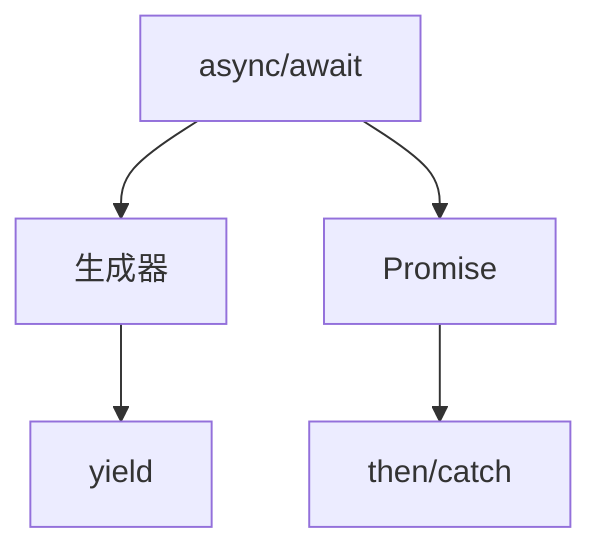
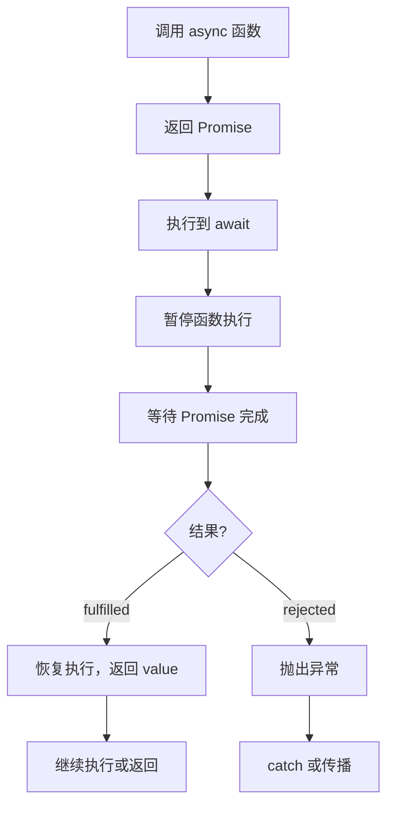
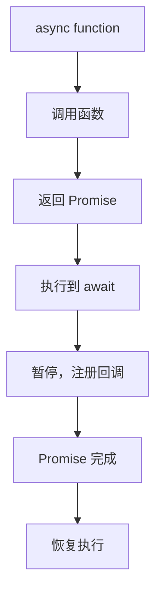

# async/await 转换（Async/Await Transformation）

> **形式化定义**：async/await 是 ECMAScript 2017（ES8）引入的语法糖，将基于 Promise 的异步代码转换为看似同步的写法。`async function` 隐式返回 Promise，`await` 表达式暂停 async 函数执行并等待 Promise 完成。ECMA-262 §15.8 定义了 async 函数的语义，其底层实现依赖于生成器（Generator）和 Promise 的组合。
>
> 对齐版本：ECMAScript 2025 (ES16) §15.8 | TypeScript 5.8–6.0

---

## 1. 概念定义 (Concept Definition)

### 1.1 形式化定义

async/await 的语法转换：

```
async function f() {
  const a = await p1;
  const b = await p2;
  return a + b;
}

// 等效于：
function f() {
  return new Promise((resolve, reject) => {
    p1.then(a => {
      p2.then(b => {
        resolve(a + b);
      }).catch(reject);
    }).catch(reject);
  });
}
```

---

## 2. 属性与特征 (Properties & Characteristics)

### 2.1 async/await 属性矩阵

| 特性 | async/await | Promise.then | 回调 |
|------|------------|--------------|------|
| 可读性 | ⭐⭐⭐⭐⭐ | ⭐⭐⭐ | ⭐⭐ |
| 错误处理 | try/catch | .catch() | 回调参数 |
| 调试友好 | ⭐⭐⭐⭐⭐ | ⭐⭐⭐ | ⭐⭐ |
| 性能 | 相同（语法糖） | 相同 | 略好 |
| 浏览器支持 | 现代浏览器 | 更广泛 | 全部 |

---

## 3. 关系分析 (Relationship Analysis)

### 3.1 async/await 与 Promise 的关系



---

## 4. 机制解释 (Mechanism Explanation)

### 4.1 async/await 的执行流程



### 4.2 await 对 thenable 的处理

`await` 不仅可以等待真正的 Promise，也可以等待任何**thenable**对象（具有 `.then()` 方法的对象）：

```javascript
// 自定义 thenable
const thenable = {
  then(onFulfilled, onRejected) {
    setTimeout(() => onFulfilled(42), 100);
  }
};

async function test() {
  const value = await thenable; // 等同于 await Promise.resolve(thenable)
  console.log(value); // 42
}
test();
```

#### 代码示例：await 对非 Promise 原始值的包装

```javascript
async function primitiveAwait() {
  const a = await 42;       // 等同于 await Promise.resolve(42)
  const b = await 'hello';  // 等同于 await Promise.resolve('hello')
  const c = await null;     // 等同于 await Promise.resolve(null)
  console.log(a, b, c);     // 42 'hello' null
}
primitiveAwait();
```

---

## 5. 论证与分析 (Argumentation & Analysis)

### 5.1 async/await 常见陷阱

| 陷阱 | 示例 | 修复 |
|------|------|------|
| 忘记 await | `const x = asyncFn()` | `const x = await asyncFn()` |
| 串行执行可并行 | `await a(); await b()` | `await Promise.all([a(), b()])` |
| 顶级 await | 模块中直接使用 | ES2022 支持 |
| try/catch 范围过大 | 包裹过多代码 | 精细化错误处理 |

#### 代码示例：在循环中误用 await 导致串行化

```javascript
// ❌ 错误：串行执行，总耗时 = sum(每个请求耗时)
async function fetchSerial(urls) {
  const results = [];
  for (const url of urls) {
    const res = await fetch(url); // 每次等待前一个完成
    results.push(await res.json());
  }
  return results;
}

// ✅ 正确：并行执行，总耗时 ≈ 最慢请求
async function fetchParallel(urls) {
  const promises = urls.map(async (url) => {
    const res = await fetch(url);
    return res.json();
  });
  return Promise.all(promises);
}

// ✅ 正确：需要限流时的并发控制（p-limit 模式）
async function fetchWithConcurrency(urls, concurrency = 5) {
  const results = [];
  const executing = [];

  for (const [index, url] of urls.entries()) {
    const promise = fetch(url)
      .then(r => r.json())
      .then(data => { results[index] = data; });

    executing.push(promise);

    if (executing.length >= concurrency) {
      await Promise.race(executing);
      executing.splice(executing.findIndex(p => p === promise), 1);
    }
  }

  await Promise.all(executing);
  return results;
}
```

---

## 6. 实例与示例 (Examples)

### 6.1 正例：顺序执行

```javascript
async function getUserData(userId) {
  const user = await fetchUser(userId);
  const posts = await fetchPosts(user.id);
  const comments = await fetchComments(posts[0].id);
  return { user, posts, comments };
}
```

### 6.2 正例：并行执行

```javascript
async function getDashboard() {
  const [user, posts, notifications] = await Promise.all([
    fetchUser(),
    fetchPosts(),
    fetchNotifications()
  ]);
  return { user, posts, notifications };
}
```

### 6.3 正例：精细化错误处理

```typescript
interface User {
  id: string;
  name: string;
}

interface Post {
  id: string;
  title: string;
}

async function fetchUserWithFallback(userId: string): Promise<User> {
  try {
    const res = await fetch(`/api/users/${userId}`);
    if (!res.ok) throw new Error(`HTTP ${res.status}`);
    return await res.json();
  } catch (err) {
    console.warn('Primary fetch failed, using cache:', err);
    // 回退到缓存
    const cached = await getUserFromCache(userId);
    if (cached) return cached;
    throw new Error(`Failed to fetch user ${userId}`);
  }
}

async function getUserFromCache(userId: string): Promise<User | null> {
  // 缓存实现
  return null;
}

// 多个独立操作，各自处理错误
async function loadDashboard() {
  const [userResult, postsResult] = await Promise.allSettled([
    fetchUserWithFallback('123'),
    fetch('/api/posts').then((r) => r.json() as Promise<Post[]>),
  ]);

  const user = userResult.status === 'fulfilled' ? userResult.value : null;
  const posts = postsResult.status === 'fulfilled' ? postsResult.value : [];

  if (!user) {
    return { error: 'Failed to load user', posts };
  }

  return { user, posts };
}
```

### 6.4 正例：带超时的 Promise

```typescript
function withTimeout<T>(promise: Promise<T>, ms: number, label = 'Operation'): Promise<T> {
  const timeout = new Promise<never>((_, reject) => {
    setTimeout(() => reject(new Error(`${label} timed out after ${ms}ms`)), ms);
  });
  return Promise.race([promise, timeout]);
}

async function fetchWithTimeout() {
  const data = await withTimeout(
    fetch('/api/slow').then((r) => r.json()),
    5000,
    'API fetch'
  );
  return data;
}
```

### 6.5 正例：异步迭代器

```typescript
// 处理流式数据
async function* fetchPaginatedUsers(pageSize = 10): AsyncGenerator<User[], void, unknown> {
  let page = 1;
  let hasMore = true;

  while (hasMore) {
    const res = await fetch(`/api/users?page=${page}&size=${pageSize}`);
    const data = (await res.json()) as { users: User[]; hasMore: boolean };

    yield data.users;
    hasMore = data.hasMore;
    page++;

    // 节流：请求间延迟
    if (hasMore) await new Promise((r) => setTimeout(r, 100));
  }
}

// 消费异步迭代器
async function processAllUsers() {
  for await (const users of fetchPaginatedUsers(50)) {
    for (const user of users) {
      await processUser(user);
    }
  }
}
```

### 6.6 正例：Top-Level Await (ES2022)

```typescript
// config.ts — 模块顶层 await
const configResponse = await fetch('/api/config');
export const config = await configResponse.json();

// db.ts — 异步初始化
export const db = await createDatabaseConnection({
  url: config.databaseUrl,
});

// main.ts — 直接导入已初始化的模块
import { db } from './db';
await db.query('SELECT 1');
```

### 6.7 正例：async/await 错误堆栈保留

```typescript
// async 函数的错误堆栈比 Promise.then 链更清晰
async function level3() {
  throw new Error('Something went wrong');
}

async function level2() {
  return await level3(); // await 保留完整的异步堆栈
}

async function level1() {
  try {
    await level2();
  } catch (err) {
    // 在 V8 中，err.stack 包含 level1 → level2 → level3 的完整路径
    console.error(err.stack);
  }
}

// 对比：Promise.then 链的堆栈在旧引擎中可能丢失上下文
function badLevel3() {
  return Promise.reject(new Error('Lost context'));
}
function badLevel2() {
  return badLevel3().then(x => x); // 堆栈可能仅显示 badLevel3
}
```

---

## 7. 权威参考与国际化对齐 (References)

- **ECMA-262 §15.8** — Async Function Definitions
- **MDN: async function** — <https://developer.mozilla.org/en-US/docs/Web/JavaScript/Reference/Statements/async_function>
- **MDN: await** — <https://developer.mozilla.org/en-US/docs/Web/JavaScript/Reference/Operators/await>
- **MDN: Promise.allSettled** — <https://developer.mozilla.org/en-US/docs/Web/JavaScript/Reference/Global_Objects/Promise/allSettled>
- **MDN: Async iteration** — <https://developer.mozilla.org/en-US/docs/Web/JavaScript/Reference/Statements/for-await...of>
- **V8 Blog: Fast async/await** — <https://v8.dev/blog/fast-async> — V8 引擎 async/await 实现优化
- **V8 Blog: Understanding async/await** — <https://v8.dev/blog/fast-async>
- **Promise A+ Specification** — <https://promisesaplus.com/> — Promise 标准规范
- **JavaScript.info: Async/Await** — <https://javascript.info/async-await>
- **Node.js Timers & Event Loop** — <https://nodejs.org/en/docs/guides/event-loop-timers-and-nexttick/>
- **TC39 ECMA-262 Spec** — <https://tc39.es/ecma262/multipage/ecmascript-language-functions-and-classes.html#sec-async-function-definitions> — 官方 async 函数规范
- **Node.js async_hooks** — <https://nodejs.org/api/async_hooks.html> — 异步资源追踪
- **TypeScript Handbook: Async/Await** — <https://www.typescriptlang.org/docs/handbook/release-notes/typescript-1-7.html>
- **MDN: Top-level await** — <https://developer.mozilla.org/en-US/docs/Web/JavaScript/Operators/await>
- **V8 Blog: Zero-cost async stack traces** — <https://v8.dev/blog/fast-async>
- **JavaScript.info: Generators** — <https://javascript.info/generators>

---

## 8. 思维表征总结 (Cognitive Representations)

### 8.1 async/await 转换规则

| 语法 | 转换结果 |
|------|---------|
| `async function` | 返回 Promise 的函数 |
| `await x` | `yield x` + 恢复 |
| `return v` | `return Promise.resolve(v)` |
| `throw e` | `return Promise.reject(e)` |
| `try/catch` | `.then().catch()` |

---

## 9. 公理化表述与形式证明 (Axiomatization & Formal Proof)

### 9.1 公理化基础

**公理 1（async 函数的 Promise 返回）**：
> 所有 async 函数隐式返回 Promise，无论是否有显式 return。

**公理 2（await 的暂停语义）**：
> `await` 暂停 async 函数执行，等待右侧 Promise 完成后恢复。

### 9.2 定理与证明

**定理 1（await 的链式等价性）**：
> `const v = await p` 语义等价于 `p.then(v => /* 后续代码 */)`。

*证明*：
> ECMA-262 §15.8 规定 async 函数在遇到 await 时暂停，将后续代码注册为 Promise 的 then 回调。
> ∎

---

## 10. 推理链与演绎分析 (Deductive Reasoning Chain)

### 10.1 演绎推理



### 10.2 反事实推理

> **反设**：ES2017 没有引入 async/await。
> **推演结果**：异步代码必须使用 Promise.then 链，深层嵌套可读性差。
> **结论**：async/await 是 JavaScript 异步编程的语法革命。

---

**参考规范**：ECMA-262 §15.8 | MDN: async function
