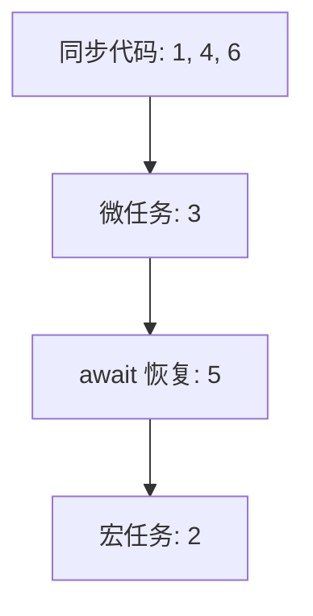
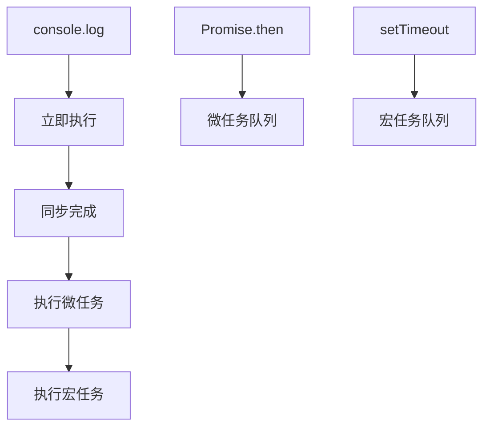

# 事件循环模式与面试题（Event Loop Patterns & Quizzes）

> **形式化定义**：事件循环模式是 JavaScript 开发者必须掌握的核心概念，涉及宏任务（Macrotask）、微任务（Microtask）、渲染时机和执行顺序的精确理解。本专题通过经典面试题和模式分析，深入探讨事件循环的**时序保证**和**常见陷阱**。理解这些模式是编写正确异步代码和避免竞态条件的基础。
>
> 对齐版本：ECMAScript 2025 (ES16) | HTML Living Standard §8.1.4.2 | TypeScript 5.8–6.0

---

## 1. 概念定义 (Concept Definition)

### 1.1 形式化定义

事件循环的执行顺序规则：

```
1. 从宏任务队列取出一个任务执行
2. 执行所有微任务（包括级联产生的）
3. 可选：执行渲染
4. 重复步骤 1
```

---

## 2. 属性与特征 (Properties & Characteristics)

### 2.1 常见面试题类型

| 类型 | 考点 | 难度 |
|------|------|------|
| setTimeout vs Promise | 宏任务 vs 微任务 | ⭐⭐ |
| async/await 时序 | async 函数执行顺序 | ⭐⭐⭐ |
| 微任务级联 | 微任务产生微任务 | ⭐⭐⭐⭐ |
| Node.js 阶段 | timers/check/poll | ⭐⭐⭐⭐ |

---

## 3. 关系分析 (Relationship Analysis)

### 3.1 经典面试题

```javascript
console.log("1");

setTimeout(() => console.log("2"), 0);

Promise.resolve().then(() => console.log("3"));

async function asyncFn() {
  console.log("4");
  await Promise.resolve();
  console.log("5");
}

asyncFn();

console.log("6");

// 输出: 1, 4, 6, 3, 5, 2
```

---

## 4. 机制解释 (Mechanism Explanation)

### 4.1 执行顺序分析



---

## 5. 论证与分析 (Argumentation & Analysis)

### 5.1 常见陷阱

| 陷阱 | 示例 | 正确理解 |
|------|------|---------|
| setTimeout(0) 立即执行 | 不是立即！ | 进入宏任务队列，至少 4ms 延迟 |
| await 阻塞线程 | 不阻塞！ | 暂停 async 函数，主线程继续 |
| Promise 回调同步 | 异步！ | 放入微任务队列，当前代码后执行 |

---

## 6. 实例与示例 (Examples)

### 6.1 正例：微任务级联

```javascript
Promise.resolve().then(() => {
  console.log("1");
  return Promise.resolve().then(() => {
    console.log("2");
  });
}).then(() => {
  console.log("3");
});

// 输出: 1, 2, 3
// then 回调返回 Promise，链式等待
```

---

## 7. 权威参考与国际化对齐 (References)

- **MDN: Event Loop** — <https://developer.mozilla.org/en-US/docs/Web/JavaScript/Event_loop>
- **JavaScript Visualizer** — <https://www.jsv9000.app/>

---

## 8. 思维表征总结 (Cognitive Representations)

### 8.1 事件循环速记口诀

```
同步代码最先走
微任务跟在后头
宏任务排队守候
渲染时机看需求
```

---

## 9. 公理化表述与形式证明 (Axiomatization & Formal Proof)

### 9.1 公理化基础

**公理 1（微任务优先性）**：
> 微任务在当前宏任务完成后、下一个宏任务开始前全部执行。

### 9.2 定理与证明

**定理 1（await 的异步性）**：
> `await` 之后的代码在当前同步代码和微任务完成后执行。

*证明*：
> `await` 将后续代码包装为微任务。微任务在当前同步代码完成后执行。
> ∎

---

## 10. 推理链与演绎分析 (Deductive Reasoning Chain)

### 10.1 演绎推理



---

**参考规范**：MDN: Event Loop | JavaScript Visualizer
