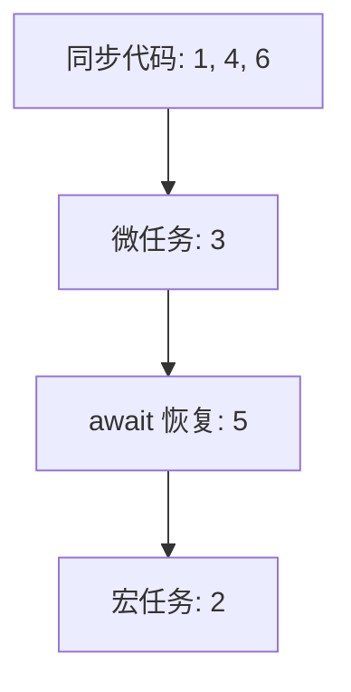
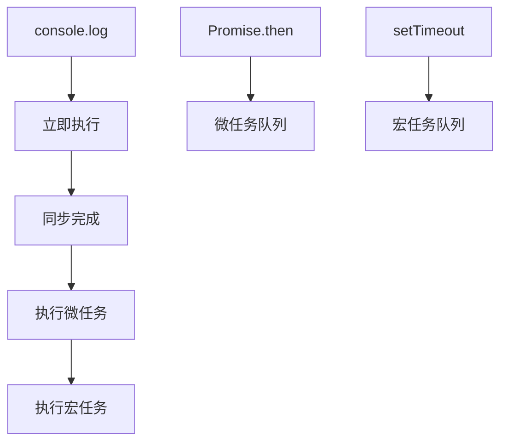

# 事件循环模式与面试题（Event Loop Patterns & Quizzes）

> **形式化定义**：事件循环模式是 JavaScript 开发者必须掌握的核心概念，涉及宏任务（Macrotask）、微任务（Microtask）、渲染时机和执行顺序的精确理解。本专题通过经典面试题和模式分析，深入探讨事件循环的**时序保证**和**常见陷阱**。理解这些模式是编写正确异步代码和避免竞态条件的基础。
>
> 对齐版本：ECMAScript 2025 (ES16) | HTML Living Standard §8.1.4.2 | TypeScript 5.8–6.0

---

## 1. 概念定义 (Concept Definition)

### 1.1 形式化定义

事件循环的执行顺序规则：

```
1. 从宏任务队列取出一个任务执行
2. 执行所有微任务（包括级联产生的）
3. 可选：执行渲染
4. 重复步骤 1
```

#### 代码示例：微任务与宏任务的显式演示

```javascript
// 宏任务（Macrotask）来源：setTimeout、setInterval、setImmediate(Node)、I/O、UI rendering
// 微任务（Microtask）来源：Promise.then/catch/finally、MutationObserver、queueMicrotask

console.log("script start");          // 1. 同步

setTimeout(() => {
  console.log("timeout 1");           // 5. 宏任务队列
}, 0);

queueMicrotask(() => {
  console.log("microtask 1");         // 3. 微任务队列
});

Promise.resolve().then(() => {
  console.log("promise 1");           // 4. 微任务队列（Promise.then 与 queueMicrotask 同级）
});

console.log("script end");            // 2. 同步

// 输出：script start → script end → microtask 1 → promise 1 → timeout 1
```

---

## 2. 属性与特征 (Properties & Characteristics)

### 2.1 常见面试题类型

| 类型 | 考点 | 难度 |
|------|------|------|
| setTimeout vs Promise | 宏任务 vs 微任务 | ⭐⭐ |
| async/await 时序 | async 函数执行顺序 | ⭐⭐⭐ |
| 微任务级联 | 微任务产生微任务 | ⭐⭐⭐⭐ |
| Node.js 阶段 | timers/check/poll | ⭐⭐⭐⭐ |
| Promise 构造函数同步性 | 执行器立即执行 | ⭐⭐⭐ |

---

## 3. 关系分析 (Relationship Analysis)

### 3.1 经典面试题

```javascript
console.log("1");

setTimeout(() => console.log("2"), 0);

Promise.resolve().then(() => console.log("3"));

async function asyncFn() {
  console.log("4");
  await Promise.resolve();
  console.log("5");
}

asyncFn();

console.log("6");

// 输出: 1, 4, 6, 3, 5, 2
```

### 3.2 进阶面试题：微任务级联与 async/await 深层解析

```javascript
// 题目 2：async/await + Promise 混合
console.log("A");

setTimeout(() => console.log("B"), 0);

Promise.resolve().then(() => {
  console.log("C");
  return Promise.resolve("D");
}).then((val) => {
  console.log(val);
});

(async () => {
  console.log("E");
  await Promise.resolve();
  console.log("F");
  await new Promise((r) => setTimeout(r, 0));
  console.log("G");
})();

console.log("H");

// 输出: A → E → H → C → F → D → B → G
// 解析：
// - await Promise.resolve() 产生微任务，在当前微任务批次后执行
// - await new Promise(setTimeout) 将剩余代码挂起，等待宏任务完成
```

### 3.3 陷阱题：Promise 构造器同步执行

```javascript
// 题目 3：Promise 构造函数是同步的！
console.log("1");

const p = new Promise((resolve) => {
  console.log("2");       // Promise 执行器立即同步执行
  resolve("3");
});

p.then(console.log);

console.log("4");

// 输出: 1 → 2 → 4 → 3
// 常见错误：以为 new Promise 内部是异步的
```

---

## 4. 机制解释 (Mechanism Explanation)

### 4.1 执行顺序分析



### 4.2 async/await 的编译等价形式

```javascript
// 源码
async function foo() {
  const result = await bar();
  console.log(result);
}

// 大致等价于（简化版）
function foo() {
  return new Promise((resolve) => {
    Promise.resolve(bar()).then((result) => {
      console.log(result);
      resolve(undefined);
    });
  });
}
```

---

## 5. 论证与分析 (Argumentation & Analysis)

### 5.1 常见陷阱

| 陷阱 | 示例 | 正确理解 |
|------|------|---------|
| setTimeout(0) 立即执行 | 不是立即！ | 进入宏任务队列，至少 4ms 延迟 |
| await 阻塞线程 | 不阻塞！ | 暂停 async 函数，主线程继续 |
| Promise 回调同步 | 异步！ | 放入微任务队列，当前代码后执行 |
| 微任务饿死主线程 | while 循环中不断 queueMicrotask | 微任务可级联，阻塞渲染 |

#### 代码示例：微任务饿死（Starvation）

```javascript
// 危险：微任务级联可阻塞渲染和 I/O
let count = 0;

function starve() {
  count++;
  if (count < 1000) {
    queueMicrotask(starve);  // 不断将自身加入微任务队列
  }
}

starve();
// 这 1000 个微任务会在单个宏任务周期内全部执行完毕
// 期间浏览器无法渲染、无法响应用户输入
```

---

## 6. 实例与示例 (Examples)

### 6.1 正例：微任务级联

```javascript
Promise.resolve().then(() => {
  console.log("1");
  return Promise.resolve().then(() => {
    console.log("2");
  });
}).then(() => {
  console.log("3");
});

// 输出: 1, 2, 3
// then 回调返回 Promise，链式等待
```

### 6.2 Node.js 事件循环阶段详解

```javascript
// Node.js 事件循环阶段（与浏览器不同！）
// ┌───────────────────────────┐
// ┌─>│           timers          │  setTimeout/setInterval
// │  └─────────────┬─────────────┘
// │  ┌─────────────┴─────────────┐
// │  │     pending callbacks     │  系统级 I/O 回调
// │  └─────────────┬─────────────┘
// │  ┌─────────────┴─────────────┐
// │  │       idle, prepare       │  内部使用
// │  └─────────────┬─────────────┘
// │  ┌─────────────┴─────────────┐
// │  │           poll            │  检索新的 I/O 事件
// │  └─────────────┬─────────────┘
// │  ┌─────────────┴─────────────┐
// │  │           check           │  setImmediate
// │  └─────────────┬─────────────┘
// │  ┌─────────────┴─────────────┐
// │  │      close callbacks      │  socket.on('close', ...)
// │  └───────────────────────────┘

const fs = require("fs");

fs.readFile(__filename, () => {
  console.log("I/O callback");      // 3. poll 阶段

  setImmediate(() => {
    console.log("setImmediate");    // 4. check 阶段
  });

  setTimeout(() => {
    console.log("setTimeout");      // 5. 下一轮 timers 阶段
  }, 0);
});

Promise.resolve().then(() => {
  console.log("microtask");         // 2. 当前操作后的微任务
});

console.log("sync");                // 1. 同步

// 典型输出：sync → microtask → I/O callback → setImmediate → setTimeout
// 注意：setImmediate 在 I/O 后优先于 setTimeout(0)
```

### 6.3 requestAnimationFrame 与事件循环

```javascript
// 浏览器中：rAF 在渲染阶段执行，介于微任务和宏任务之间
console.log("script");

requestAnimationFrame(() => {
  console.log("rAF");  // 在渲染前执行
});

setTimeout(() => {
  console.log("timeout");
}, 0);

Promise.resolve().then(() => {
  console.log("microtask");
});

// 典型输出：script → microtask → rAF → timeout
// rAF 在渲染 pipeline 中，通常在微任务之后、下一个宏任务之前
```

---

## 7. 权威参考与国际化对齐 (References)

- **MDN: Event Loop** — <https://developer.mozilla.org/en-US/docs/Web/JavaScript/Event_loop>
- **JavaScript Visualizer** — <https://www.jsv9000.app/>
- **HTML Living Standard — Event Loops** — <https://html.spec.whatwg.org/multipage/webappapis.html#event-loops>
- **ECMA-262 — Jobs and Job Queues** — <https://tc39.es/ecma262/#sec-jobs-and-job-queues>
- **Node.js Event Loop Guide** — <https://nodejs.org/en/learn/asynchronous-work/event-loop-timers-and-nexttick>
- **Jake Archibald: Tasks, Microtasks, Queues** — <https://jakearchibald.com/2015/tasks-microtasks-queues-and-schedules/>
- **V8 Blog — JavaScript Execution** — <https://v8.dev/blog/fast-async>

---

## 8. 思维表征总结 (Cognitive Representations)

### 8.1 事件循环速记口诀

```
同步代码最先走
微任务跟在后头
宏任务排队守候
渲染时机看需求
```

---

## 9. 公理化表述与形式证明 (Axiomatization & Formal Proof)

### 9.1 公理化基础

**公理 1（微任务优先性）**：
> 微任务在当前宏任务完成后、下一个宏任务开始前全部执行。

**公理 2（await 异步分裂）**：
> `await expr` 将 async 函数的剩余体转换为微任务，在当前表达式求值后挂起。

### 9.2 定理与证明

**定理 1（await 的异步性）**：
> `await` 之后的代码在当前同步代码和微任务完成后执行。

*证明*：
> `await` 将后续代码包装为微任务。微任务在当前同步代码完成后执行。
> ∎

**定理 2（Promise.then 的时序保证）**：
> 对于已 fulfilled 的 Promise p，`p.then(f)` 中的 f 总是在当前同步代码完成后执行。

*证明*：
> Promise 状态变更时，then 回调被排入微任务队列。微任务队列在同步代码执行完毕后清空。
> ∎

---

## 10. 推理链与演绎分析 (Deductive Reasoning Chain)

### 10.1 演绎推理



---

**参考规范**：MDN: Event Loop | HTML Living Standard §8.1.4.2 | JavaScript Visualizer
