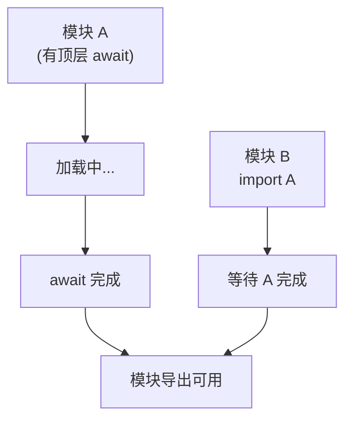
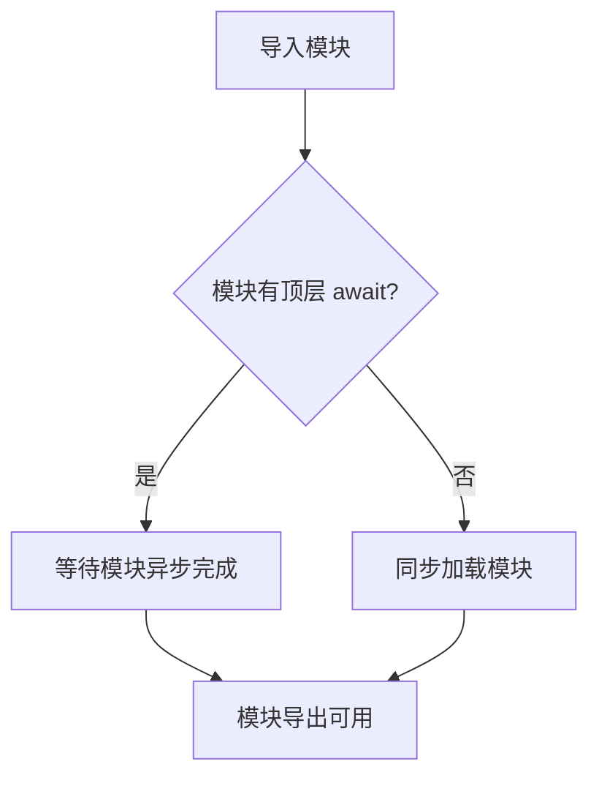
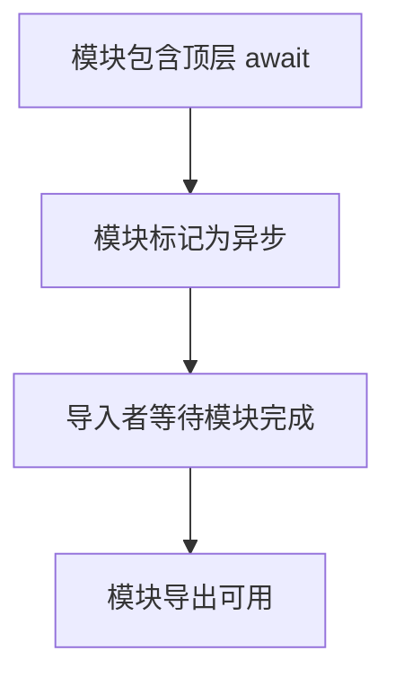

# 顶层 await（Top-Level Await）

> **形式化定义**：顶层 await（Top-Level Await）是 ECMAScript 2022（ES13）引入的特性，允许在 ES 模块的顶层作用域直接使用 `await` 关键字，无需包裹在 async 函数中。该特性通过将模块隐式转换为 async 模块实现，模块的 `import` 会等待顶层 await 完成后再继续。ECMA-262 §16.2.1.4 定义了异步模块的求值语义。
>
> 对齐版本：ECMAScript 2025 (ES16) §16.2.1.4 | TypeScript 5.8–6.0

---

## 1. 概念定义 (Concept Definition)

### 1.1 形式化定义

ECMA-262 §16.2.1.4 定义了异步模块：

> *"An async module is a module that contains a top-level await expression."*

顶层 await 的语义：

```
模块包含顶层 await → 模块变为异步模块
导入该模块的代码隐式等待模块完成
```

---

## 2. 属性与特征 (Properties & Characteristics)

### 2.1 顶层 await 属性矩阵

| 特性 | 模块内 | 脚本内 | CJS |
|------|--------|--------|-----|
| 支持 | ✅ ES2022+ | ❌ | ❌ |
| 使用方式 | 直接 await | 不可用 | 不可用 |
| 导入影响 | 隐式等待 | — | — |
| TypeScript | ✅ | ❌ | ❌ |

---

## 3. 关系分析 (Relationship Analysis)

### 3.1 顶层 await 与模块加载



---

## 4. 机制解释 (Mechanism Explanation)

### 4.1 顶层 await 的执行流程



---

## 5. 论证与分析 (Argumentation & Analysis)

### 5.1 顶层 await 的优缺点

| 优点 | 缺点 |
|------|------|
| 简化模块初始化 | 阻塞模块导入链 |
| 无需 IIFE | 可能影响启动性能 |
| 清晰表达依赖 | 循环依赖检测更复杂 |

---

## 6. 实例与示例 (Examples)

### 6.1 正例：模块初始化

```javascript
// config.js
const response = await fetch("/api/config");
export const config = await response.json();

// app.js
import { config } from "./config.js";
// config 已可用，无需 async 函数
console.log(config.apiUrl);
```

---

## 7. 权威参考与国际化对齐 (References)

- **ECMA-262 §16.2.1.4** — Async Modules
- **MDN: Top-level await** — <https://developer.mozilla.org/en-US/docs/Web/JavaScript/Guide/Modules#top_level_await>

---

## 8. 思维表征总结 (Cognitive Representations)

### 8.1 顶层 await 使用场景

| 场景 | 推荐 | 说明 |
|------|------|------|
| 模块初始化 | ✅ | 获取配置、建立连接 |
| 动态导入 | ✅ | `const mod = await import("./mod.js")` |
| 频繁调用的模块 | ❌ | 影响性能 |

---

## 9. 公理化表述与形式证明 (Axiomatization & Formal Proof)

### 9.1 公理化基础

**公理 1（异步模块的等待性）**：
> 导入包含顶层 await 的模块时，导入语句隐式等待模块初始化完成。

### 9.2 定理与证明

**定理 1（顶层 await 的模块级阻塞）**：
> 顶层 await 阻塞当前模块的导出，但不阻塞其他模块的并行加载。

*证明*：
> ECMA-262 §16.2.1.4 规定模块求值在遇到顶层 await 时暂停，但模块图中的其他独立分支仍可并行求值。
> ∎

---

## 10. 推理链与演绎分析 (Deductive Reasoning Chain)

### 10.1 演绎推理



### 10.2 反事实推理

> **反设**：没有顶层 await。
> **推演结果**：模块初始化需包裹在 async IIFE 中，代码冗余。
> **结论**：顶层 await 简化了模块的异步初始化。

---

**参考规范**：ECMA-262 §16.2.1.4 | MDN: Top-level await
